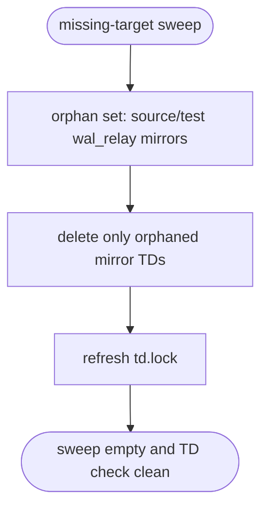
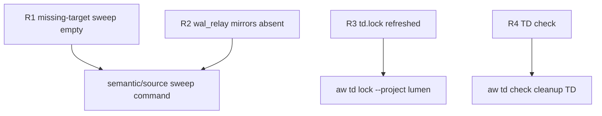

# TD: Orphaned semantic mirror snapshots for deleted wal_relay files

## Logic
<!-- type: logic lang: mermaid -->


## Unit Test
<!-- type: unit-test lang: mermaid -->



## Changes
<!-- type: changes lang: yaml -->

```yaml
changes:
  - path: projects/lumen/tech-design/semantic/source/projects-lumen-src-wal_relay-rs.md
    action: delete
    section: logic
    impl_mode: hand-written
    description: "Remove source semantic mirror for deleted projects/lumen/src/wal_relay.rs."
  - path: projects/lumen/tech-design/semantic/source/projects-lumen-tests-wal_relay-rs.md
    action: delete
    section: logic
    impl_mode: hand-written
    description: "Remove test semantic mirror for deleted projects/lumen/tests/wal_relay.rs found by the same sweep."
  - path: projects/lumen/tech-design/td.lock
    action: modify
    section: changes
    impl_mode: hand-written
    description: "Refresh TD lock after deleting orphaned semantic mirror specs."
```
