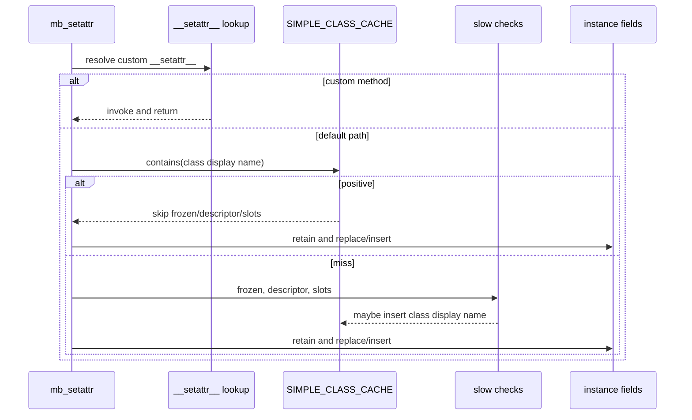

# Class attribute-assignment policy topology

Issue: #3024
Parent inventory: #2968
Source revision: `135c686def1aad53d80421ea20f5c7a867ac5250`

This Stage 1 DDD slice classifies `SIMPLE_CLASS_CACHE`, the positive
attribute-assignment fast path in `mb_setattr_default`. The current cache is an
OS-thread-local set of textual class names. A positive entry lets every later
attribute assignment for that class name bypass frozen-class, data-descriptor,
and slot-layout checks.

The entry is derived from an incomplete, own-class-only scan after one member
has already passed the slow path. It is therefore broader than the evidence
that created it. It also carries no execution-context identity, class identity,
definition version, MRO version, member identity, or definition lease.

The target deletes this cache. Attribute-assignment behavior is an immutable
`InstanceAttributeAssignmentPolicy` inside the existing versioned
`ClassDefinition::ClassLayoutPolicy`. The policy is derived from a complete,
stable MRO and is published atomically with the class definition, descriptor
surface, slots, instance-dict policy, and frozen-dataclass state. No `src/**`
change occurs in this inventory slice.

## Bounded context

```text
ExecutionContext
└── ClassDomain
    ├── ClassDefinitionRegistry
    │   └── definitions[ClassRuntimeKey] -> Arc<ClassDefinition>
    │       ├── version: ClassDefinitionVersion
    │       ├── mro: StableMro
    │       ├── members: OwnedMemberSurface
    │       ├── dataclass: DataclassPolicy
    │       └── layout: ClassLayoutPolicy
    │           └── assignment: InstanceAttributeAssignmentPolicy
    └── ClassPublicationCoordinator
        └── visibility: ClassVisibilityGeneration

Instance
└── fields: object-local field store
```

`ClassDefinitionRegistry` is the sole owner of class assignment policy.
`ClassPublicationCoordinator` owns the atomic visibility boundary, not a
second copy of layout state. The instance field store owns installed Python
values; the class definition only decides which assignment protocol applies.

`SIMPLE_CLASS_CACHE` has no target owner. It is removed rather than migrated.

## Scope

This slice covers:

- the declaration, reads, writes, invalidation, reset, and omission from
  snapshot state of `SIMPLE_CLASS_CACHE`;
- the custom `__setattr__` dispatch boundary;
- frozen dataclass, built-in immutability, full-MRO descriptor, slots, and
  instance-dict checks used by instance assignment;
- derivation and publication of immutable assignment policy;
- the Python ownership order of direct instance-field replacement;
- same-context sharing, independent-context isolation, and retirement;
- the focused implementation and test paths needed by the later source slice.

It does not cover:

- migration or redesign of `METHOD_CACHE`;
- general member lookup caching;
- all `ClassDefinitionRegistry` migration mechanics;
- class callable invocation;
- mapping, module, weak-proxy, or native-object attribute assignment;
- `__delattr__`;
- performance thresholds beyond removal of the unsafe speculative cache.

## Aggregate and domain values

| Value | Role | Lifetime |
|---|---|---|
| `ContextHandle` | operation authority | validated at ABI entry |
| `ContextId` | context isolation identity | one per execution context |
| `ClassRuntimeKey` | exact class identity | unique within one context |
| `ClassDefinitionVersion` | immutable class version | one per successful definition publication |
| `ClassVisibilityGeneration` | aggregate read-view identity | advances on successful visibility commit |
| `StableMro` | complete immutable MRO | owned by one definition version |
| `ClassLayoutPolicy` | immutable instance layout | owned by one definition version |
| `InstanceAttributeAssignmentPolicy` | assignment decision | embedded in layout policy |
| `DataclassPolicy` | frozen and dataclass behavior | owned by one definition version |
| `Arc<ClassDefinition>` | operation lease | keeps a detached definition usable |
| `OwnedInstanceField` | installed Python ownership claim | owned by one instance field entry |

Candidate policy:

```rust
enum InstanceAttributeAssignmentPolicy {
    DirectInstanceField,
    Guarded,
}
```

`DirectInstanceField` means the complete published definition proves that
ordinary instance-dict mutation is sufficient. It is not a cache hit and is
not inferred from a previous assignment. `Guarded` is the fail-closed default.

The policy contains no raw `MbValue`, lock guard, weak class-name reference, or
separate generation counter.

## Frozen inventory

The admitted production identity is:

`projects/mamba/src/runtime/class/mod.rs::SIMPLE_CLASS_CACHE`

The exact selector is:

```bash
rg -n \
  'static SIMPLE_CLASS_CACHE|SIMPLE_CLASS_CACHE\.with' \
  projects/mamba/src/runtime/class/mod.rs
```

The sorted newline-terminated selector output has SHA-256:

`3020b6bc21702f855e0f89aa6f4d2502d8632f525e480059d8e7e3e202eecc5a`

The selector emits five production rows and zero test rows. The frozen test
module begins at line `22077`.

### Production ledger

| Line | Operation | Owner | Current effect |
|---:|---|---|---|
| `192` | declaration | module `thread_local!` | creates `RefCell<HashSet<String>>` |
| `1230` | invalidation clear | `invalidate_method_cache` | best-effort broad clear |
| `11403` | membership read | `mb_setattr_default` | bypasses guarded assignment |
| `11525` | positive insert | `mb_setattr_default` | promotes one slow result to class-wide proof |
| `21977` | reset clear | `reset_class_lookup_caches` | best-effort thread-local clear |

The partition is:

- declarations: 1;
- invalidation clears: 1;
- assignment reads: 1;
- assignment inserts: 1;
- reset clears: 1;
- snapshot fields: 0;
- test rows: 0.

These categories are disjoint and set-equal to the five-row denominator.

### Frozen design inputs

This topology refines:

- `projects/mamba/tech-design/concurrency/execution-context.md`;
- `projects/mamba/tech-design/concurrency/state-topology/class-definition-registry.md`;
- `projects/mamba/tech-design/concurrency/state-topology/class-layout-policy.md`;
- `projects/mamba/tech-design/concurrency/state-topology/class-method-lookup-cache.md`.

The class definition remains the sole policy owner. The class method cache is
a separate non-authoritative projection and is not changed by this slice.

## Current storage and meaning

```rust
thread_local! {
    static SIMPLE_CLASS_CACHE:
        RefCell<HashSet<String>> = RefCell::new(HashSet::new());
}
```

The set owns only Rust strings. It owns no Python value, class definition, MRO,
descriptor, context handle, or callable lifetime.

A positive entry currently means:

> On this OS thread, one assignment for this textual class name completed the
> slow checks and an own-class scan did not find a reason to avoid the fast
> path at that moment.

It does not prove:

- that this is the same execution context;
- that the textual name still denotes the same class;
- that the class definition or MRO is unchanged;
- that base classes contain no data descriptor;
- that a different member is descriptor-free;
- that later slot registration has not changed layout;
- that later dataclass decoration has not made the class frozen;
- that a definition lease keeps the observed metadata alive.

TLS gives different OS threads different sets. Therefore workers in the same
execution context do not share the optimization. Independent contexts run
sequentially on one OS thread reuse the same ambient set until a broad reset
happens. Neither behavior matches execution-context ownership.

## Current assignment sequence

`mb_setattr` first resolves a custom `__setattr__`. When one exists, it invokes
that method and returns. Otherwise it enters `mb_setattr_default`.

For a user instance, the default path first handles namedtuple,
`SimpleNamespace`, weak-proxy, and special immutable cases. It then reads
`SIMPLE_CLASS_CACHE` before the general frozen, descriptor, and slot checks.



The positive read is class-wide. It occurs before:

- `is_frozen_dataclass`;
- the special immutable inspect-class check;
- full-MRO `lookup_method` and data-descriptor dispatch;
- effective slot and `DICT_SUPPRESSED` enforcement.

## Current slow derivation

On a cache miss, `mb_setattr_default`:

1. materializes the attribute name;
2. rejects a frozen dataclass;
3. rejects the hard-coded immutable inspect classes;
4. resolves the exact member through `lookup_method` across the current MRO;
5. invokes a data descriptor when found;
6. checks whether the class has an own `SLOTS_REGISTRY` entry;
7. enforces `DICT_SUPPRESSED` and effective slot membership;
8. considers the class eligible for the positive cache;
9. retains and installs the instance field.

Eligibility is narrower than the slow protocol:

```text
no own SLOTS_REGISTRY entry
and no data descriptor in current class_attrs
and no data descriptor in current methods
and not currently a frozen dataclass
```

The descriptor eligibility scan reads only the current class record. It does
not scan all base definitions. The slot eligibility test checks own
registration presence rather than a complete immutable layout policy.

The current member was full-MRO checked before insertion. That proves only that
one member did not dispatch a descriptor during that operation. The inserted
key contains no member name, so a later assignment to a different inherited
data descriptor can bypass the protocol.

This is a source-representable stale/bypass state. The inventory does not claim
that a particular user-visible exception or corruption has already been
observed.

## Current field ownership and reentrancy

The fast existing-field replacement performs:

1. `retain_if_ptr(value)`;
2. acquire the instance `fields` write guard;
3. copy the displaced raw `MbValue`;
4. install the incoming value;
5. call `release_if_ptr(old)`;
6. drop the write guard on scope exit.

The displaced value can reach Python destruction and runtime reentry while the
same object-field write guard remains live. A reentrant destructor that touches
that instance can deadlock or observe an unsupported lock boundary.

The fallback insert expression acquires and drops its temporary guard before
releasing the optional displaced value. The two fast branches therefore have
different ownership/guard ordering.

The slow final insertion similarly drops the temporary guard at the end of the
insert statement before releasing the displaced value. The unsafe boundary is
the explicit `get_mut` fast replacement scope.

No Python retain, release, descriptor call, or destructor may occur while an
instance-field, class-definition, layout, or member guard is held.

## Current invalidation reachability

`invalidate_method_cache` best-effort clears `SIMPLE_CLASS_CACHE` through
`try_borrow_mut`. It is reached by nine caller families:

1. class registration;
2. bases update;
3. namespace synchronization;
4. class-attribute mutation;
5. metaclass reassignment;
6. class-attribute deletion;
7. method replacement;
8. thread-state replacement;
9. runtime cleanup.

The invalidation helper also mutates method-cache state. This shared helper
does not imply that the two caches have the same target owner.

A failed `try_borrow_mut` silently skips the clear. Such a skipped clear is
representable. This inventory does not fabricate a proved live borrow-conflict
event.

Broad invalidation is not a target publication protocol. A successful class
mutation must publish a complete new definition and visibility generation.
Failure to publish authoritative state is a correctness failure. Failure to
prune a non-authoritative cache would only be a performance event, but this
specific cache is deleted.

## Missing direct invalidation seams

`mb_register_slots` writes:

- `DICT_SUPPRESSED`;
- `OWN_SLOTS_REGISTRY`;
- `SLOTS_REGISTRY`.

It does not directly invalidate `SIMPLE_CLASS_CACHE`. A class can therefore
remain positive after a later slots registration. The three current layout
writes are also sequential rather than one definition publication.

`dataclasses_mod::decorate_class` may publish defaults, `__match_args__`,
slots, and class attributes before finally inserting `DcClass { opts }` into
`DC_REGISTRY`. The final registry write is not itself an atomic class
publication and does not directly invalidate the simple-class set.

These paths make stale state representable. They are not evidence that a
specific failing schedule has already been observed.

## Current snapshot, replace, cleanup, and exit

`snapshot_thread_class_state` omits `SIMPLE_CLASS_CACHE`. A snapshot therefore
cannot describe or transfer the fast-path decisions used by the source thread.

`replace_thread_class_state` and `cleanup_all_classes` call
`reset_class_lookup_caches`, which best-effort clears the set. OS-thread exit
drops that thread's set.

The resulting lifecycle is neither copy nor explicit exclusion:

- snapshot omits the state;
- replace resets the destination's ambient state;
- same-context workers start with unrelated sets;
- independent contexts on one thread can observe ambient carryover until
  reset;
- teardown correctness depends on broad reset reachability.

The target snapshot contains no assignment cache because the cache no longer
exists. Context-owned immutable definitions are shared by lease, not copied
through thread-state snapshots.

## Target policy derivation

`Guarded` is the default. `DirectInstanceField` may be derived only from one
complete proposed class definition whose dependencies are stable for the
publication transaction.

The derivation must prove all of:

1. the full MRO is complete and stable;
2. no own or inherited custom `__setattr__` applies;
3. no own or inherited data descriptor exists;
4. instance `__dict__` is enabled;
5. no own or inherited slot restriction requires per-member enforcement;
6. the class is not a frozen dataclass;
7. no built-in immutability policy applies;
8. every compatibility/legacy policy needed by assignment is resolved.

Unknown, partially migrated, dynamically supplied, or inconsistent metadata
derives `Guarded`.

```rust
fn derive_assignment_policy(
    proposed: &ProposedClassDefinition,
    stable_bases: &[Arc<ClassDefinition>],
) -> Result<InstanceAttributeAssignmentPolicy, PublicationError> {
    if proposed.complete_mro(stable_bases)
        && proposed.has_default_setattr(stable_bases)
        && proposed.has_no_data_descriptors(stable_bases)
        && proposed.layout.instance_dict_enabled()
        && proposed.layout.needs_no_guarded_slot_check()
        && !proposed.dataclass.is_frozen()
        && !proposed.is_immutable_builtin()
        && proposed.compatibility_policy.is_resolved()
    {
        Ok(InstanceAttributeAssignmentPolicy::DirectInstanceField)
    } else {
        Ok(InstanceAttributeAssignmentPolicy::Guarded)
    }
}
```

This function is illustrative. It names the decision inputs; it does not
require those exact implementation method names.

## Target publication protocol

Class registration, bases/MRO replacement, descriptor mutation, slots
registration, dataclass decoration, and frozen-policy change all use one
definition publication protocol:

1. validate the `ContextHandle`;
2. resolve exact `ClassRuntimeKey`;
3. acquire stable leases for the current definition and all base definitions;
4. construct proposed members, MRO, layout, dataclass policy, and assignment
   policy off-lock;
5. retain/build every incoming owned Python value before publication;
6. acquire the narrow class publication guard;
7. verify expected definition versions and visibility generation;
8. install one new `Arc<ClassDefinition>` and advance visibility exactly once;
9. release the guard;
10. release displaced owned Python values and old registry ownership outside
    all guards.

Failure before step 8 publishes nothing. A conflict retries or returns an
explicit error. It must not expose a definition whose slots and frozen policy
belong to different versions.

An operation that already holds `Arc<ClassDefinition>` continues using that
immutable version. New lookups see the new version after the visibility
commit.

## Target assignment protocol

`mb_setattr`:

1. validates the active `ContextHandle`;
2. resolves the instance's exact `ClassRuntimeKey`;
3. acquires `Arc<ClassDefinition>`;
4. applies custom `__setattr__` according to that leased definition;
5. otherwise dispatches by its immutable assignment policy.

For `Guarded`, the runtime evaluates the leased definition's frozen,
descriptor, effective slots, instance-dict, and compatibility policies. Any
descriptor target is converted to an owned callable/member alias before the
definition/member guard ends. Descriptor `__set__` runs with no internal
class, layout, member, or instance-field guard held.

For `DirectInstanceField`, field replacement follows:

```text
retain/build incoming value
acquire instance field guard
swap or insert; take displaced owned value
drop instance field guard
release displaced value
```

The `Arc<ClassDefinition>` is the operation lease. Because the policy is an
immutable field of that leased aggregate, it needs no nested `Arc`, weak
pointer, registry lookup, or sibling lifetime mechanism.

## Context lifecycle

Threads attached to one `ExecutionContext` share the same
`ClassDefinitionRegistry` and immutable definition versions. Independent
contexts own distinct `ClassRuntimeKey` spaces even when Python-visible display
names match.

Context quiescence:

1. rejects new operation admission;
2. waits for aggregate-owned children;
3. detaches definitions from new lookup;
4. drains registry ownership outside internal guards;
5. reaches `Retired`.

Detaching a definition does not make an existing `Arc<ClassDefinition>`
dangle. An admitted operation lease remains valid until its last holder
finishes. Retirement frees assignment policy together with the definition
after the final lease drops.

Thread snapshot/replace carries only the scoped context attachment required by
the execution-context design. It carries no class assignment cache or copied
class definition payload.

## Failure semantics

| Failure | Required result |
|---|---|
| missing or retired context | reject operation; do not consult ambient class state |
| class key absent | explicit class-resolution failure or conservative legacy path |
| incomplete MRO or base lease conflict | do not publish; retry or return error |
| unknown descriptor/layout/frozen state | publish `Guarded`, never `DirectInstanceField` |
| retain/build failure | publish nothing |
| expected-version conflict | publish nothing; retry from new stable view |
| descriptor invocation error | propagate Python error after all internal guards drop |
| instance-field lock poisoning/failure | no displaced value is released under the guard |
| context retirement after admission | admitted definition lease remains valid to operation end |

## Invariants

1. `SIMPLE_CLASS_CACHE` has zero runtime references.
2. No new TLS set, global map, fast-path registry, or assignment-only
   generation counter replaces it.
3. `InstanceAttributeAssignmentPolicy` is immutable and embedded directly in
   `ClassLayoutPolicy`.
4. Every published `ClassDefinition` has exactly one assignment policy.
5. `Guarded` is the default for incomplete or unresolved metadata.
6. `DirectInstanceField` requires a complete stable MRO.
7. `DirectInstanceField` requires default `__setattr__` across the full MRO.
8. `DirectInstanceField` requires zero data descriptors across the full MRO.
9. `DirectInstanceField` requires enabled instance `__dict__`.
10. `DirectInstanceField` requires no guarded effective-slot restriction.
11. `DirectInstanceField` requires non-frozen, non-immutable behavior.
12. A successful layout, descriptor, MRO, bases, or frozen-policy change
    produces a new `ClassDefinitionVersion`.
13. One successful authoritative publication advances visibility exactly once.
14. Failed or no-op publication does not expose partial policy.
15. `mb_setattr` validates the execution context before definition lookup.
16. `mb_setattr` holds one `Arc<ClassDefinition>` operation lease.
17. The assignment policy needs no nested lease because its owning definition
    is already leased.
18. Incoming Python values are retained/built before the instance-field guard.
19. The displaced field value is taken under the instance-field guard.
20. The instance-field guard drops before the displaced value is released.
21. No instance-field guard spans Python deallocation or destructor reentry.
22. No class, layout, or member guard spans descriptor `__set__`.
23. Guarded descriptor lookup uses the leased complete MRO.
24. Guarded slot enforcement uses one immutable effective layout.
25. Slots publication and assignment-policy publication are atomic.
26. Dataclass frozen publication and assignment-policy publication are atomic.
27. Same-context threads share definition versions and policies.
28. Independent contexts isolate same-display-name classes.
29. Thread snapshots contain no assignment-cache state.
30. Retirement rejects new lookup, detaches definitions, and preserves
    admitted leases until their final drop.

## Forbidden changes

1. Do not replace `SIMPLE_CLASS_CACHE` with another class-name cache.
2. Do not infer class-wide eligibility from one successful member assignment.
3. Do not derive descriptor safety from the own class record alone.
4. Do not use `String` display names as runtime class identity.
5. Do not split slots, descriptors, frozen state, and assignment policy across
   independently visible publications.
6. Do not release a displaced `MbValue` while holding the instance-field guard.
7. Do not invoke descriptor code while holding internal class/object guards.
8. Do not mutate slot or dataclass registries without a new definition
   publication.
9. Do not copy class policy through thread snapshot state.
10. Do not combine `METHOD_CACHE` implementation changes with this slice.

## Planned implementation paths

- `projects/mamba/src/runtime/execution_context.rs`
- `projects/mamba/src/runtime/class/mod.rs`
- `projects/mamba/src/runtime/stdlib/dataclasses_mod.rs`
- `projects/mamba/src/runtime/mod.rs`
- focused Rust unit tests in `projects/mamba/src/runtime/class/mod.rs`
- focused Rust unit tests in
  `projects/mamba/src/runtime/stdlib/dataclasses_mod.rs`

No other source path is implied by this inventory. If implementation proves a
new path necessary, the implementation ticket must name and justify it before
write permission expands.

## Verification map

| Test | Contract |
|---|---|
| plain class direct policy | complete simple class derives `DirectInstanceField` |
| own custom `__setattr__` | own override derives `Guarded` |
| inherited custom `__setattr__` | base override derives `Guarded` |
| own data descriptor | own descriptor derives `Guarded` |
| inherited different-member descriptor | base descriptor prevents class-wide bypass |
| own slots without dict | effective restriction derives `Guarded` |
| inherited effective slots | complete layout, not own-key presence, controls policy |
| frozen dataclass | frozen policy derives `Guarded` and rejects mutation |
| immutable built-in compatibility | special immutability remains guarded |
| later slots publication | new version changes policy; old lease remains immutable |
| later descriptor publication | new version changes policy; old lease remains immutable |
| later frozen decoration | frozen state and policy become visible atomically |
| same display name, different runtime keys | definitions do not alias |
| same-context worker sharing | worker threads observe the same definition policy |
| independent-context isolation | cleanup/publication in one context cannot affect another |
| snapshot omission | thread-state snapshot contains no assignment cache |
| conservative unresolved fallback | incomplete metadata never derives direct policy |
| replacement release ordering | displaced value release occurs after guard drop |
| reentrant destructor | destructor can touch the instance without deadlock |
| descriptor callback guard probe | `__set__` runs with no internal guards held |
| structural cache-removal gate | source tree contains zero `SIMPLE_CLASS_CACHE` references |

The later implementation ticket must map every row to an exact runnable test or
structural command. A numeric test count is only a floor; it does not replace
any enumerated seam.

## Acceptance gates for the later source slice

Minimum gates:

```bash
rg -n 'SIMPLE_CLASS_CACHE' projects/mamba/src
cargo test -p mamba runtime::class
cargo test -p mamba runtime::stdlib::dataclasses_mod
```

The structural search passes only when it returns no matches. The exact Cargo
test selectors may be narrowed or corrected by the implementation ticket after
confirming the live test module names, but every verification-map seam remains
mandatory.

Broader Tier 1 integration gates remain owned by the parent implementation
plan. Passing this isolated slice does not by itself prove free-threaded Mamba
or complete Tier 1 delivery.
