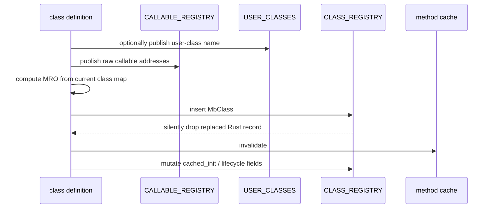
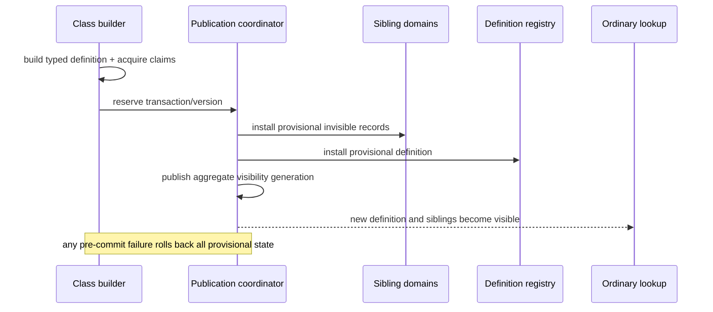
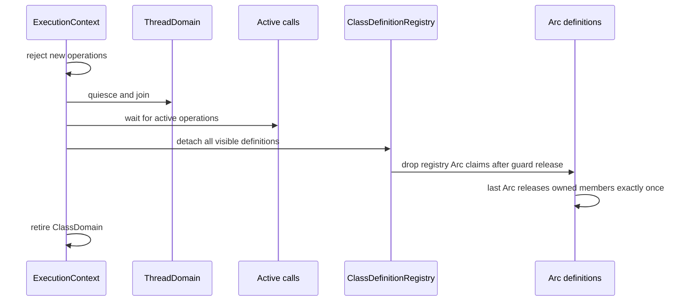

# Class definition registry topology

Issue: #3012
Parent inventory: #2968
Source revision: `02930f251f5e2782423262b13879cc24e192c4f5`

This Stage 1 DDD slice classifies only the runtime class-definition registry.
The current registry is an OS-thread-local map of mutable `MbClass` records.
Its entries mix Rust metadata, raw Python values, lifecycle flags, and a raw
callable address. Snapshot transfer fieldwise-clones those values without
creating Python ownership claims, while replacement and cleanup perform no
complete ownership drain.

The target makes class identity, definition versions, owned members,
publication, lookup leases, cache generation, and retirement one
execution-context domain. Sibling class TLS registries, aliases, slots,
classcell staging, method caches, ABC/protocol state, and test statics remain
separate Stage 1 slices. No `src/**` change occurs in this slice.

## Bounded context

```text
ExecutionContext
├── ClassDomain
│   ├── ClassDefinitionRegistry
│   │   └── definitions[ClassRuntimeKey] -> Arc<ClassDefinition>
│   ├── ClassPublicationCoordinator
│   │   └── aggregate visibility generation
│   └── ClassLookupGeneration
├── CallableDomain
│   └── CallableHandle -> CodeLifetimeAuthority
└── ThreadDomain
    └── same-context children share ClassDomain

OS-thread compatibility binding
└── ContextHandle
```

`ClassDefinitionRegistry` is context-owned. Children attached to the same
context resolve the same typed class identity, definition version, members,
and cache generation. An independent context owns separate definitions and
retirement state even when it publishes the same display name.

TLS is only an attachment mechanism for the active `ContextHandle`. It owns no
class-definition payload and provides no snapshot/replace handoff.

## Aggregate and values

| Type | Kind | Identity / ownership |
|---|---|---|
| `ClassDefinitionRegistry` | context aggregate | one registry per `ExecutionContext` |
| `ClassPublicationCoordinator` | context transaction boundary | one aggregate visibility generation |
| `ClassRuntimeKey` | typed value | opaque identity scoped to one context |
| `ClassDisplayName` | immutable publication metadata | Python-visible name, not identity |
| `ClassDefinitionVersion` | monotonic value | one immutable publication version |
| `Arc<ClassDefinition>` | lookup/execution lease | keeps a detached definition alive |
| `OwnedMemberValue` | owned Python value | exactly one installed RC claim |
| `OwnedMemberAlias` | caller-owned Python value | one explicit retained claim |
| `CallableHandle` | typed callable identity | function/code identity plus lifetime authority |
| `CodeLifetimeAuthority` | code-lifetime value | `ProcessImage` or `ModuleLease` |

Registry visibility and definition lifetime are separate. Replacing or
removing a registry entry makes new lookup observe the new state, but an
already acquired `Arc<ClassDefinition>` remains valid until its last lease
drops.

Within one published definition version, class identity, names, bases, MRO,
and metaclass identity are immutable. `metaclass_finalized` and
`creation_hooks_pending` change semantically during class construction. The
target expresses each such transition by publishing a new definition version,
not by mutating an immutable record in place.

## Frozen inventory

The one admitted production state identity is:

`projects/mamba/src/runtime/class/mod.rs::CLASS_REGISTRY`

There are zero test-only identities. Test-module occurrences refer to the same
production registry. The sorted newline-terminated identity SHA-256 is:

`19ebbb6dc44b6a6a17327941e08405afd2214a5b690ec8e9ead2e8d2adc5905a`

The selector emits 129 physical rows and 129 symbol occurrences. The
`#[cfg(test)]` module begins at frozen line 22077:

- 112 rows occur in the production module;
- 17 rows occur in the test module.

### Exact production ledger

`124`, `248`, `285`, `380`, `449`, `538`, `590`, `638`, `657`, `688`,
`745`, `1184`, `1338`, `1379`, `1413`, `1432`, `1446`, `1459`, `1571`,
`1609`, `1620`, `1637`, `1656`, `1667`, `1680`, `1744`, `1989`, `2005`,
`2012`, `2107`, `2144`, `2152`, `2161`, `2172`, `2310`, `2418`, `2470`,
`2526`, `2617`, `2630`, `2638`, `2662`, `2748`, `2809`, `2887`, `3392`,
`3431`, `3509`, `3518`, `3627`, `3643`, `3803`, `4078`, `4297`, `4698`,
`6582`, `6690`, `6696`, `7656`, `7663`, `7932`, `8047`, `8691`, `8909`,
`8918`, `8962`, `8972`, `9001`, `9103`, `10215`, `10832`, `11138`,
`11213`, `11511`, `11573`, `11577`, `11580`, `11649`, `11742`, `11744`,
`11929`, `12225`, `12257`, `12284`, `12312`, `12380`, `12417`, `12442`,
`12506`, `12520`, `13148`, `13197`, `13633`, `13643`, `13692`, `13700`,
`13831`, `13887`, `13918`, `13988`, `14009`, `14012`, `14026`, `14090`,
`14107`, `14387`, `14942`, `21131`, `21320`, `21997`, `22017`, `22043`.

### Exact test ledger

`22540`, `22751`, `23075`, `23315`, `23329`, `23349`, `23608`, `24818`,
`24870`, `24979`, `25001`, `25014`, `25023`, `25026`, `25439`, `25448`,
`26616`.

### Production operation partition

| Operation | Count | Frozen rows |
|---|---:|---|
| declaration | 1 | `124` |
| comment-only | 13 | `638`, `745`, `2144`, `3627`, `6690`, `7656`, `7932`, `8047`, `8691`, `8909`, `10832`, `13643`, `14009` |
| insert/register | 1 | `1571` |
| mutate in place | 18 | `1609`, `1637`, `1744`, `1989`, `2005`, `2107`, `2152`, `2470`, `2526`, `2638`, `2662`, `2748`, `2809`, `2887`, `4698`, `11580`, `12225`, `13633` |
| remove | 1 | `11744` |
| snapshot | 1 | `21997` |
| replace | 1 | `22017` |
| cleanup | 1 | `22043` |
| read | 75 | every remaining production row |

The 75 read rows are:

`248`, `285`, `380`, `449`, `538`, `590`, `657`, `688`, `1184`, `1338`,
`1379`, `1413`, `1432`, `1446`, `1459`, `1620`, `1656`, `1667`, `1680`,
`2012`, `2161`, `2172`, `2310`, `2418`, `2617`, `2630`, `3392`, `3431`,
`3509`, `3518`, `3643`, `3803`, `4078`, `4297`, `6582`, `6696`, `7663`,
`8918`, `8962`, `8972`, `9001`, `9103`, `10215`, `11138`, `11213`,
`11511`, `11573`, `11577`, `11649`, `11742`, `11929`, `12257`, `12284`,
`12312`, `12380`, `12417`, `12442`, `12506`, `12520`, `13148`, `13197`,
`13692`, `13700`, `13831`, `13887`, `13918`, `13988`, `14012`, `14026`,
`14090`, `14107`, `14387`, `14942`, `21131`, `21320`.

These nine disjoint categories are set-equal to the 112 production rows.

## Current aggregate

```rust
thread_local! {
    static CLASS_REGISTRY:
        RefCell<HashMap<String, MbClass>> = RefCell::new(HashMap::new());
}
```

The key is a Rust string that acts as both runtime identity and display-facing
name. The record has 11 fields:

| Field | Rust type | Current contract |
|---|---|---|
| `name` | `String` | Rust-owned runtime name |
| `display_name` | `String` | Rust-owned user-visible name |
| `bases` | `Vec<String>` | Rust-owned base names |
| `mro` | `Vec<String>` | Rust-owned linearized names |
| `methods` | `HashMap<String, MbValue>` | raw value bits; producer-specific RC transfer |
| `class_attrs` | `HashMap<String, MbValue>` | raw value bits; producer-specific RC transfer |
| `metaclass` | `Option<String>` | Rust-owned metaclass name |
| `metaclass_finalized` | `bool` | mutable construction lifecycle state |
| `metaclass_result` | `Option<MbValue>` | raw optional Python value |
| `creation_hooks_pending` | `bool` | mutable PEP 487 lifecycle state |
| `cached_init` | `Option<(u64, bool)>` | raw address plus registry-membership bit |

`MbClass: Clone` performs a fieldwise Rust clone. It copies every raw
`MbValue` bit without retaining the Python value and copies `cached_init`
without acquiring function/code/module lifetime authority.

OS-thread TLS prevents simultaneous access to the same map instance from two
threads only because each thread has a different map. It does not provide
execution-context ownership, same-context child sharing, cross-thread
synchronization, or independent-context isolation.

## Current registration and replacement



Sibling registration, definition insertion, cache invalidation, and lifecycle
updates do not share one visibility transaction. A reader can observe a
partial publication boundary. A same-name insertion at frozen line 1571
replaces the old `MbClass`, but dropping the Rust maps does not execute
field-by-field Python releases.

`mb_class_define` and the multi-value definition path retain each method
before registration. Those claims transfer into the installed record. If the
record is later replaced, claims reachable only from that old record leak.

`cached_init` stores an extracted callable address and whether that address was
present in a sibling registry at one moment. This pair is dispatch metadata,
not a callable lease. A function address identifies where code was observed;
it does not keep its function object, JIT allocation, process image, or
dynamically unloadable module alive.

## Current member ownership and mutation

A plain Rust map owns its key strings and stored bits. It does not itself
implement Python retain/release. Individual paths establish inconsistent
claims:

| Path | Incoming ownership | Replacement/removal | Guard boundary |
|---|---|---|---|
| class definition | retains methods before registration | old record is not drained | insertion under mutable registry borrow |
| `sync_class_namespace_from_dict` | retains each incoming value | releases replaced/removed value | release occurs while mutable registry borrow is live |
| `mb_class_set_class_attr` | retains incoming before borrow | releases replaced/removed or unmatched retain | release occurs while borrow is live; `__set_name__` call is later |
| `class_replace_method` | retains incoming before insert | releases replaced value; `None` removal does not release removed method | release occurs while borrow is live |
| `finalize_class_definition` | retains metaclass result before borrow | releases prior result | release occurs while borrow is live |
| namedtuple base metadata | newly allocated tuple claim | replacement return is ignored | displaced claim leaks |
| typed-dict metadata synthesis | mixed retained created values and raw/immediate values | no single uniform contract | mutation occurs under borrow |

A Python release can destroy an object and reenter runtime code. Therefore
`release_if_ptr` under a live mutable `CLASS_REGISTRY` borrow is a
reentrancy boundary even though no direct user callback appears in the
enclosing line.

The target moves every release and deallocation after the registry/member
guard drops.

## Current reads and callback boundaries

Helpers such as `class_members`, `class_attr_entries`, `lookup_method`,
`class_own_members`, and `mro_lookup_class_attr` copy raw value bits out of a
narrow registry borrow. The copy is not a caller-owned alias unless that
specific caller later retains it.

| Path | Value selected under borrow | Work after borrow |
|---|---|---|
| `dispatch_type_new_creation_hooks` | updates pending flag; copies attribute names and values; clones bases | invokes `call_set_name_if_present` and `mb_call_spread_kwargs` |
| `mb_class_set_class_attr` | installs/removes member; may release old value under borrow | invokes `call_set_name_if_present` |
| `mb_isinstance` | copies metaclass method or nominal metadata | invokes selected method after closure returns |
| `mb_issubclass` | copies metaclass method or nominal metadata | invokes selected method after closure returns |
| lookup helpers | copy member bits or clone Rust metadata | later callers may invoke or inspect them |

No proved current path holds a `CLASS_REGISTRY` `RefCell` borrow directly
across user bytecode or callback invocation. That narrow guard scope is not
lifetime safety: copied members have no `Arc` definition lease or owned-member
alias, and several mutation paths release Python values while the mutable
borrow remains live.

## Current snapshot, cleanup, and exit

`snapshot_thread_class_state` clones the entire class map:

```rust
class_registry: CLASS_REGISTRY.with(|c| c.borrow().clone())
```

The clone retains no nested Python values. It is not an owned cross-thread
snapshot. Current safety relies on other owners or intentional leaks keeping
copied bits usable.

`replace_thread_class_state` first takes another unowned snapshot, then
overwrites the current TLS map. Neither operation performs a complete
field-by-field ownership transfer or release. This is OS-thread state
choreography, not execution-context publication.

`cleanup_all_classes` uses:

```rust
let _ = CLASS_REGISTRY.with(
    |c| c.try_borrow_mut().map(|mut m| m.clear())
);
```

`try_borrow_mut` returns
`Result<RefMut<HashMap<String, MbClass>>, BorrowMutError>`. An active borrow
produces `Err`, and the ignored result silently skips cleanup. A successful
`clear()` drops Rust records without releasing nested Python claims. Process
exit relies on address-space reclamation rather than ordered class-domain
retirement.

## Target definition and lookup

```rust
struct ClassDefinition {
    key: ClassRuntimeKey,
    version: ClassDefinitionVersion,
    name: ClassName,
    display_name: ClassDisplayName,
    bases: Vec<ClassRuntimeKey>,
    mro: Vec<ClassRuntimeKey>,
    metaclass: Option<ClassRuntimeKey>,
    metaclass_finalized: bool,
    creation_hooks_pending: bool,
    methods: MemberMap<OwnedMemberValue>,
    class_attrs: MemberMap<OwnedMemberValue>,
    metaclass_result: Option<OwnedMemberValue>,
    cached_init: Option<CallableHandle>,
}
```

Lookup:

1. resolves and validates the active `ContextHandle`;
2. resolves typed `ClassRuntimeKey`;
3. clones `Arc<ClassDefinition>` under a narrow registry guard;
4. clones an `OwnedMemberAlias` under the member-version boundary when a
   Python value is returned;
5. drops every guard;
6. only then invokes user code, releases/deallocates values, or drops leases.

An Arc keeps immutable/versioned Rust definition state alive. It is not a
substitute for the explicit Python ownership claim held by each
`OwnedMemberValue` or returned `OwnedMemberAlias`.

## Target versioned mutation

Every member or lifecycle mutation is a publication of a new version:

1. retain/build all new owned values before any registry/member guard;
2. clone the current definition through an Arc lease;
3. construct a complete next `ClassDefinitionVersion`;
4. swap the registry-visible Arc under the per-record version boundary;
5. update the class lookup generation deterministically;
6. release the guard;
7. release replaced values and retire the prior version only after its Arc
   leases drain.

This removes non-versioned in-place mutation. Readers observe either the prior
complete version or the next complete version, never a partially modified
record.

## Target publication transaction

Class publication spans definition, identity aliases, user/native
classification, callable records, and lookup-cache generation. No single map
insert atomically covers all those stores.



The aggregate coordinator/version flip is the observable commit point:

1. stage typed identity, complete definition, and every owned claim;
2. install provisional sibling records invisible to ordinary lookup;
3. install the provisional class definition;
4. publish one aggregate visibility generation;
5. on any pre-commit failure, remove provisional state and release every
   staged claim with no registry/member guard;
6. after commit, detach the prior definition from new lookup and retire it only
   after active Arc leases drain.

A repeated compatible publication is idempotent. A conflicting publication
fails closed and preserves the prior visible generation.

## Callable lifetime authority

`cached_init` becomes a typed `CallableHandle`. The handle resolves a live
function/code record and carries one of:

- `CodeLifetimeAuthority::ProcessImage` for code proven mapped for the process
  lifetime;
- `CodeLifetimeAuthority::ModuleLease` for dynamically unloadable code.

There is no authority-free variant. A raw address, function pointer, JIT
entrypoint, or sibling-registry membership bit supplies callable identity but
does not keep code mapped or the owning function record alive.

## Target retirement



Retirement failure is explicit. There is no best-effort `try_borrow_mut`
clear. Detaching registry visibility and destroying definition values remain
separate phases. All Python releases, callable-lease drops, and deallocation
occur with no registry/member guard live.

## Target invariants

1. Only `ExecutionContext::ClassDomain::ClassDefinitionRegistry` owns class
   definitions.
2. TLS holds only the active `ContextHandle`.
3. No class registry payload or snapshot/replace handoff remains in TLS.
4. `ClassRuntimeKey` is typed and scoped to one context.
5. Display name is metadata and cannot authorize class identity.
6. Same-context children share class identity, definitions, members, and
   cache generation.
7. Independent contexts isolate identity, definitions, members, versions, and
   retirement.
8. Identity, names, bases, MRO, and metaclass identity are immutable within one
   published definition version.
9. Lifecycle-state transitions publish a new definition version.
10. Each installed Python member or metaclass result owns exactly one explicit
    RC claim.
11. A Rust map or Arc container does not implicitly create Python ownership.
12. Returned class definitions use `Arc<ClassDefinition>` leases.
13. Returned Python members use explicit `OwnedMemberAlias` claims.
14. Lookup clones leases under a narrow guard and drops the guard before use.
15. Member and lifecycle updates change the definition version
    deterministically.
16. Every visible version change advances the lookup-cache generation.
17. New owned values are retained or constructed before any guard.
18. Replaced values are released only after every registry/member guard drops.
19. No callback, user code, Python release, deallocation, or callable-lease
    drop runs under a registry/member guard.
20. Publication stages a complete typed definition and all claims before
    commit.
21. Provisional sibling and class records are invisible to ordinary lookup.
22. One aggregate coordinator generation is the visibility commit point.
23. Pre-commit failure rolls back every provisional record and owned claim.
24. Conflicting publication fails closed and preserves the prior generation.
25. Registry visibility and definition lifetime are separate.
26. Removing or replacing a registry entry does not invalidate an active Arc
    lease.
27. The last Arc drop releases one definition's owned values exactly once.
28. `cached_init` uses typed callable identity plus mandatory code-lifetime
    authority.
29. Raw callable addresses or membership bits never authorize code lifetime.
30. Context retirement rejects new operations before quiescing.
31. Retirement waits for child and active-call quiescence.
32. Retirement detaches records before dropping registry Arc claims.
33. Retirement releases values and callable authorities outside all guards.
34. Retirement failure is explicit and cannot be ignored.
35. Retiring one context cannot change another context's class domain.
36. A later context cannot observe prior mutable class state or leaked
    registry visibility.

## Source implementation slice

Prerequisites:

1. finish and close Stage 1 parent #2968;
2. land Stage 2 context shell #2839;
3. establish Stage 3 output/exception context isolation;
4. migrate the sibling class-domain identities required by one coordinated
   class publication transaction;
5. then dispatch this bounded class-definition registry migration.

Exact planned paths:

- `projects/mamba/src/runtime/execution_context.rs`
  - supply `ClassDomain`, typed keys, operation leases, publication
    coordinator, and quiescent retirement.
- `projects/mamba/src/runtime/class/mod.rs`
  - replace `CLASS_REGISTRY`, snapshot/replace, raw member aliases,
    in-place lifecycle mutation, and best-effort cleanup.
- `projects/mamba/src/runtime/rc.rs`
  - supply explicit owned member and returned-alias wrappers with balanced
    transfer/drop semantics.
- `projects/mamba/src/runtime/mod.rs`
  - order context rejection, child/call quiescence, class-domain detach, and
    value retirement.

Forbidden changes:

- renaming the current TLS/global class payload without changing ownership;
- storing class definitions or snapshots in execution-child/TLS state;
- sharing class definitions between independent contexts;
- using display text as typed identity;
- returning raw unowned member aliases;
- treating `Arc` container lifetime as Python RC ownership;
- keeping raw callable addresses without function/code/module lifetime
  authority;
- releasing Python values or invoking callbacks under a registry/member
  guard;
- retaining non-versioned in-place mutation of published definitions;
- publishing sibling state without one aggregate visibility commit point;
- treating registry removal as immediate Arc destruction;
- using fieldwise clone as an owned Python snapshot;
- silently skipping cleanup on a borrow conflict;
- dropping installed value bits without explicit Python release;
- relying on process-exit address-space reclamation as normal retirement.

## Focused implementation tests

1. `test_same_context_child_class_sharing`
   - two child tasks share the same typed class identity and definition.
2. `test_independent_context_class_isolation`
   - concurrent contexts isolate identical display-name classes.
3. `test_class_registration_transaction_rollback`
   - failed and repeated publication leave no partial sibling visibility and
     balance all staged claims.
4. `test_replacement_active_lease_safety`
   - old lookup leases remain valid after the registry publishes a replacement.
5. `test_returned_alias_refcount_balance`
   - member aliases remain valid and balanced across concurrent mutation.
6. `test_callback_guard_free_execution`
   - callbacks, releases, and deallocation run with no class/member guard.
7. `test_versioned_mutation_cache_invalidation`
   - every mutation advances version and invalidates cache generation exactly
     once.
8. `test_context_retirement_borrow_safety`
   - no active borrow can silently skip deterministic retirement.
9. `test_cached_callable_lifetime_authority`
   - active cached callable use holds valid function/code and code-mapping
     authority.
10. `test_quiescent_context_teardown_isolation`
    - retiring one context drains each definition exactly once without changing
      another context.

These tests are planned. They were not executed by the Stage 1 measurement.
