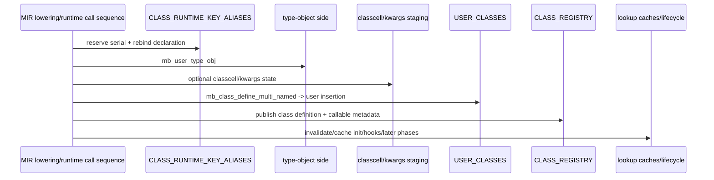
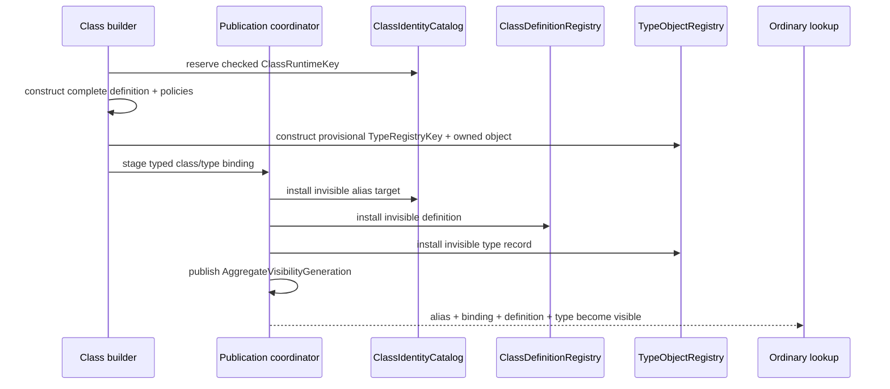
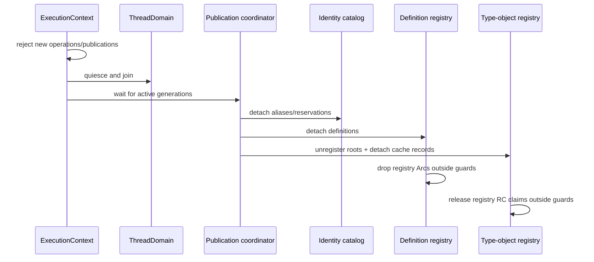

# Class identity and origin catalog topology

Issue: #3013
Parent inventory: #2968
Source revision: `fd478a27d89ae69c6bb90ee2f6cf635bb0e05f96`

This Stage 1 DDD slice classifies the runtime-key allocator, compiled
declaration alias map, and Python-created class classification set. The current
implementation uses one process atomic plus two OS-thread-local collections.
Class publication updates the alias, type-object side, classification,
definition, callable metadata, and lookup caches at different times, so
failure can leave visible records that do not describe one complete class.

The target introduces a context-owned `ClassIdentityCatalog`, retains
`ClassDefinitionRegistry` and `TypeObjectRegistry` as separate sole owners,
and coordinates their visibility through `ClassPublicationCoordinator`.
Origin and behavior are typed, versioned class-definition metadata rather than
a name in an ambient boolean set. Slots, classcell/metaclass staging, callable
metadata, caches, protocols, ABC state, class docs, exception residues, and
test statics remain separate Stage 1 slices. No `src/**` change occurs here.

## Bounded context

```text
ExecutionContext
├── ClassDomain
│   ├── ClassIdentityCatalog
│   │   ├── allocator: CheckedClassKeyAllocator
│   │   └── aliases[ClassDeclarationKey] -> ClassRuntimeKey
│   ├── ClassDefinitionRegistry
│   │   └── definitions[ClassRuntimeKey] -> Arc<ClassDefinition>
│   └── ClassPublicationCoordinator
│       └── AggregateVisibilityGeneration
├── ObjectDomain
│   └── TypeObjectRegistry
│       └── by_key[TypeRegistryKey] -> OwnedTypeObject
└── ThreadDomain
    └── same-context children share ClassDomain + ObjectDomain

Class publication binding
└── ClassRuntimeKey <-> TypeRegistryKey

OS-thread compatibility binding
└── ContextHandle
```

Each aggregate has one semantic owner:

- `ClassIdentityCatalog` owns class-key allocation and the current compiled
  declaration alias index;
- `ClassDefinitionRegistry` owns versioned class definitions and their origin /
  behavior metadata;
- `TypeObjectRegistry` owns its cache claim for every type object;
- `ClassPublicationCoordinator` owns only the cross-aggregate transaction
  protocol and observable generation.

The coordinator does not become a second storage owner. It stages typed
references to provisional records owned by their final aggregates.

## Aggregate and values

| Type | Kind | Identity / ownership |
|---|---|---|
| `ClassIdentityCatalog` | context aggregate | allocator and current declaration aliases |
| `CheckedClassKeyAllocator` | context value service | checked monotonic serial reservation |
| `ContextId` | typed authority | execution-context identity |
| `ClassDeclarationKey` | typed value | stable compiled declaration token |
| `ClassRuntimeKey` | typed value | `ContextId + checked serial`; runtime identity |
| `ClassDisplayName` | metadata | Python-visible text; never identity authority |
| `ClassOrigin` | definition metadata | `PythonHeap` or `NativeRuntime` |
| `ClassBehaviorPolicy` | definition metadata | exact semantic policies for call sites |
| `TypeRegistryKey` | object-domain identity | type-object registry key |
| `AggregateVisibilityGeneration` | coordinator value | complete publication generation |
| `Arc<ClassDefinition>` | definition lease | old definition remains alive after rebinding |
| caller-owned type alias | Python RC claim | explicit retain independent of registry claim |

Numeric serials may repeat across independent contexts only because
`ContextId` participates in `ClassRuntimeKey` authority. A serial may never be
reused while live within one context.

Declaration key, runtime key, type-registry key, and display name are distinct
types. No implicit Rust-string conversion performs identity resolution.

## Frozen inventory

The three admitted production identities are:

- `projects/mamba/src/runtime/class/mod.rs::CLASS_RUNTIME_KEY_ALIASES`
- `projects/mamba/src/runtime/class/mod.rs::NEXT_CLASS_RUNTIME_KEY`
- `projects/mamba/src/runtime/class/mod.rs::USER_CLASSES`

There are zero test-only identities. The sorted newline-terminated identity
SHA-256 is:

`620b3ca806ae4d2518b8a0c68d02e645220177a08889bcb99acc9e0f6360f9f6`

The selector emits 21 physical rows and 21 occurrences:

`126`, `135`, `217`, `1342`, `1352`, `1358`, `1370`, `1409`, `1515`,
`1530`, `7952`, `8924`, `11124`, `11158`, `16014`, `21998`, `21999`,
`22018`, `22019`, `22044`, `22045`.

### Exact operation partition

| Operation | Count | Frozen rows |
|---|---:|---|
| declaration | 3 | `126`, `135`, `217` |
| comment-only | 1 | `1358` |
| allocator reservation | 1 | `1352` |
| alias read | 1 | `1342` |
| alias insert/rebind | 1 | `1370` |
| classification read | 6 | `1409`, `7952`, `8924`, `11124`, `11158`, `16014` |
| classification insert | 2 | `1515`, `1530` |
| snapshot | 2 | `21998`, `21999` |
| replace | 2 | `22018`, `22019` |
| cleanup | 2 | `22044`, `22045` |

The ten disjoint categories are set-equal to the 21-row selector denominator.

## Current identity allocation

```rust
static NEXT_CLASS_RUNTIME_KEY: AtomicU64 = AtomicU64::new(1);

fn fresh_class_runtime_key(identity: &str) -> String {
    let serial = NEXT_CLASS_RUNTIME_KEY.fetch_add(1, Ordering::Relaxed);
    format!("{identity}@{serial}")
}
```

The process-global atomic supplies one unique returned serial at a time until
wrap. Relaxed ordering does not publish any surrounding alias, definition, or
type-object state.

There is no checked overflow:

1. one allocation emits `u64::MAX`;
2. the counter wraps and the next allocation emits `0`;
3. a later allocation emits `1` again;
4. if the original identity with serial `1` remains live, the formatted key
   can collide and replace or resolve the wrong state.

The allocator is absent from `ThreadClassState`. Snapshot transfer, class
cleanup, and runtime cleanup never reset it. It therefore remains process-wide
while the collections it feeds are cloned, replaced, or cleared per OS thread.

This mismatch prevents a snapshot from representing one complete identity
domain. It also does not create context authority merely because keys happen
to be process-unique before wrap.

## Current declaration aliases

```rust
thread_local! {
    static CLASS_RUNTIME_KEY_ALIASES:
        RefCell<HashMap<String, String>> = RefCell::new(HashMap::new());
}
```

`resolve_class_runtime_key` returns the current mapped runtime-key string or
passes the input string through unchanged. A declaration token, display name,
and already-materialized runtime key all use the same `String` type, so callers
receive no type-level protection against resolving the wrong category.

`mb_class_runtime_key`:

1. extracts the declaration string;
2. reserves a new process serial;
3. formats a new runtime-key string;
4. inserts it into the TLS alias map, replacing the prior current mapping;
5. returns a newly allocated Python string carrying the runtime key.

Re-executing a compiled class declaration immediately redirects future
resolution of its declaration token. It does not remove the prior class
definition, release its type-object cache claim, or invalidate values already
carrying the old runtime key.

Old state remains reachable only through its actual definition, type-object,
or caller ownership. Alias rebinding itself supplies no old-state lease and no
retirement edge.

### Dynamic identities

`fresh_dynamic_class_runtime_key` prefixes
`__mamba_dynamic_class__:{display_name}` and reserves a serial. It
intentionally creates no declaration alias.

Two calls to `type("C", ...)` therefore receive distinct runtime-key strings
even though both display as `C`. Installing `C` in the alias map would collapse
their identities and is forbidden.

## Current classification

```rust
thread_local! {
    static USER_CLASSES:
        RefCell<HashSet<String>> = RefCell::new(HashSet::new());
}
```

Both `mb_class_register_user_named` and
`mb_class_register_user_named_reusing_staged` insert the runtime-key string
before delegating to `mb_class_register_named_impl`.

The set owns Rust strings only. It owns no Python RC claim. Its separate
membership can diverge from `CLASS_REGISTRY`: failure after insertion leaves a
name classified as user-created without a complete class definition.

The set is not one coherent semantic property. Its direct and transitive
consumers use membership to make nine distinct decisions:

| Current seam | Current behavior selected |
|---|---|
| `class_is_user_defined` | ambient origin query |
| type-object method access | retained direct Python callable versus native unbound adapter |
| missing instance attribute | strict `AttributeError` only when the full MRO is user-defined |
| `__class__` receiver | user heap instance may enter reassignment path |
| `__class__` target | target must be treated as user heap type |
| `mb_context_enter` | user surface missing `__exit__` raises instead of using native compatibility |
| weakref proxy decision | user instance requires the proxy-wrapper path |
| weakref class-object recognition | resolved object counts as a user class object |
| `mb_call_spread_impl` | user class takes the real constructor path even without explicit `__init__` |

The three production callers of `class_is_user_defined` outside
`class/mod.rs` are:

- `runtime/stdlib/weakref_mod.rs::referent_needs_proxy_wrapper`;
- `runtime/stdlib/weakref_mod.rs::user_class_object_name`;
- `runtime/builtins/mod.rs::mb_call_spread_impl`.

A single name-set boolean cannot state layout compatibility, MRO-wide
attribute policy, method binding, weakref behavior, context-manager strictness,
or constructor dispatch precisely.

## Current publication order

The compiled-class lowering emits a multi-boundary sequence:



Important failure cuts:

| Failure boundary | Visible residue |
|---|---|
| after alias rebind | current alias points at an unmaterialized runtime key |
| after type-object creation | alias plus orphaned type-object side state |
| after kwargs/classcell staging | additional pending state without definition |
| after user classification | ghost `USER_CLASSES` membership |
| after definition insert | definition may exist before all cache/lifecycle/doc phases |

No current map or atomic is the transaction coordinator. The process atomic
orders only serial reservation; TLS `RefCell` access is same-OS-thread access
only. Neither supplies same-context child sharing or cross-store visibility.

## Current snapshot, cleanup, and exit

`snapshot_thread_class_state` independently clones the alias map and
classification set. `replace_thread_class_state` independently overwrites
them, then resets lookup caches. It does not transfer allocator state and does
not coordinate the alias/classification replacement with the class-definition
or type-object registries.

Cleanup calls `try_borrow_mut().map(clear)` for both collections and ignores
the returned `Err`. An active borrow silently leaves the collection unchanged.
Successful clearing drops Rust strings but performs no identity-domain
retirement.

The process allocator persists. Process exit reclaims Rust allocations and
address space; it is not ordered class-definition or type-object retirement.

## Target identity catalog

```rust
struct ClassIdentityCatalog {
    context_id: ContextId,
    allocator: CheckedClassKeyAllocator,
    aliases: DeclarationAliasIndex,
}

struct ClassRuntimeKey {
    context_id: ContextId,
    serial: NonZeroU64,
}
```

The exact serial representation may change during implementation, but it must:

- check exhaustion before returning a key;
- reject a key already live or provisionally reserved in the context;
- never overwrite a live key;
- preserve the reservation through transaction completion or rollback;
- make a tombstoned failed serial non-authoritative;
- require `ContextId` for lookup.

`ClassDeclarationKey` is compiler-produced identity, not source display text.
Dynamic class publication supplies no declaration key and therefore cannot
enter `DeclarationAliasIndex`.

## Target behavior metadata

`ClassDefinition` owns immutable per-version typed metadata:

| Seam | Typed target |
|---|---|
| origin query | `ClassOrigin::{PythonHeap, NativeRuntime}` |
| type-object method binding | `MethodBindingPolicy::{DirectPythonCallable, NativeUnboundAdapter}` |
| missing attribute | `AttributeMissPolicy::{StrictAttributeError, NativeCompatibilityNone}` |
| `__class__` reassignment | typed receiver and target layout compatibility |
| missing context-manager exit | `ContextManagerPolicy::{StrictProtocolSurface, NativeFallbackStub}` |
| weakref proxy | `WeakrefPolicy::{RequiresProxyWrapper, DirectReferenceAllowed}` |
| weakref class-object recognition | `ClassObjectRecognitionPolicy::{PythonClassObject, NativeOrNonClass}` |
| construction | `ConstructorDispatchPolicy::{PythonDefinition, NativeStub}` |

Full-MRO policy evaluation resolves all definition versions from one stable
`AggregateVisibilityGeneration`. It cannot read each base from unrelated
generations.

`ClassOrigin` is useful input but is not the universal branch condition.
Consumers ask for their exact policy. This prevents a new side boolean from
merely renaming `USER_CLASSES`.

## Target cross-aggregate transaction

The transaction preserves sole aggregate ownership and provides
all-or-nothing observable visibility. It does not claim one machine-level
atomic instruction across maps.



The six phases are:

1. reserve a checked context-local `ClassRuntimeKey`;
2. construct the complete definition, origin/policies, `TypeRegistryKey`,
   owned type object, typed class/type binding, and sibling records;
3. install records provisionally and invisibly under each sole owner;
4. publish one coordinator visibility generation that includes declaration
   alias rebinding, typed binding, definition, type object, sibling metadata,
   and lookup-cache generation;
5. on any pre-commit failure, remove every provisional record and release
   claims after all guards drop;
6. after commit, detach prior-generation records from new lookup and retire
   them through their real owners.

Alias rebinding is part of phase 4. It cannot happen before type/definition
publication or as an uncoordinated post-commit update.

`TypeObjectRegistry` continues to own exactly one cache RC claim per installed
object. Active consumers hold explicit caller-owned retained aliases. When a
prior type record retires, registry/root ordering follows the type-object DDD;
caller-owned aliases remain valid through their independent balanced claims.

## Target rebinding and old lifetime

Re-executing one declaration stages a new complete generation. At commit:

- future `ClassDeclarationKey` resolution selects the new `ClassRuntimeKey`;
- new type/definition lookups observe the new generation;
- the previous alias target leaves current resolution;
- existing typed handles remain tied to their old runtime key;
- active `Arc<ClassDefinition>` leases keep the prior definition alive;
- caller-owned type-object aliases keep their object alive independently of the
  registry cache claim.

Alias rebinding neither mutates the old definition nor destroys the old type
object. Retirement belongs to the owning registries after quiescence and lease
drain.

## Target retirement



Failure is explicit. Retirement never uses ignored `try_borrow_mut`. Detaching
visibility, dropping definition Arcs, unregistering roots, and releasing
type-object cache claims remain distinct ordered operations.

## Target invariants

1. `ClassIdentityCatalog` alone owns allocation and declaration aliases.
2. `ClassDefinitionRegistry` alone owns definition records.
3. `TypeObjectRegistry` alone owns type-object cache claims.
4. The publication coordinator owns protocol state, not duplicate records.
5. TLS holds only the active `ContextHandle`.
6. No alias, origin, definition, or allocator payload remains in TLS.
7. `ContextId`, `ClassDeclarationKey`, `ClassRuntimeKey`,
   `TypeRegistryKey`, and display name are non-interchangeable.
8. Every runtime-key lookup validates its context.
9. Same-context children share one current declaration alias index.
10. Independent contexts isolate identical declaration keys and serials.
11. Allocation checks exhaustion and live/provisional collisions.
12. No live runtime key is reused or overwritten.
13. Overflow/collision fails before visible publication.
14. Dynamic classes allocate runtime keys without declaration aliases.
15. Display text cannot authorize dynamic or compiled identity.
16. Rebinding affects only future declaration-token resolution.
17. Existing typed handles remain bound to the prior runtime key.
18. Active definition Arc leases survive alias rebinding.
19. Caller-owned type-object aliases survive registry rebinding through their
    own RC claims.
20. Origin and behavior policies publish with one definition version.
21. No ambient origin/classification side set can diverge from a definition.
22. Consumers query exact typed policies, not one generic origin boolean.
23. Full-MRO policy evaluation uses one stable visibility generation.
24. Provisional alias, binding, definition, type, and sibling records are
    invisible to ordinary lookup.
25. Declaration alias rebinding participates in the generation commit.
26. One coordinator generation is the aggregate visibility commit point.
27. No claim is made that multiple stores share one machine atomic operation.
28. Pre-commit failure removes every provisional record.
29. Rollback releases every acquired claim exactly once after guards drop.
30. No callback, Python release, deallocation, or rollback destruction occurs
    under an aggregate guard.
31. Registry visibility and old record lifetime are separate.
32. Snapshot/replace identity transfer is absent.
33. Retirement rejects new operations before quiescence.
34. Retirement waits for children, calls, and active publication generations.
35. Aliases detach before definition/type ownership drains.
36. Type roots unregister before the registry cache claim releases.
37. Definition Arcs and type-object RC claims release outside all guards.
38. Retirement failure is explicit and cannot be ignored.
39. Retiring one context cannot change another context's aliases or records.
40. A later context cannot observe prior identity/classification state.

## Source implementation slice

Prerequisites:

1. finish and close Stage 1 parent #2968;
2. land Stage 2 context shell #2839;
3. establish Stage 3 output/exception context isolation;
4. finish the sibling class-domain inventories required by coordinated class
   publication;
5. migrate identity, definition, and typed type-object binding through one
   source-ticket transaction boundary.

Exact planned paths:

- `projects/mamba/src/runtime/execution_context.rs`
  - add context-owned identity catalog, checked allocator, operation leases,
    publication coordinator, and retirement ordering.
- `projects/mamba/src/runtime/class/mod.rs`
  - replace alias/classification TLS, process allocator, snapshot/replace,
    ambient behavior branches, and best-effort cleanup.
- `projects/mamba/src/runtime/builtins/type_objects.rs`
  - accept typed class/type binding and preserve type-registry sole ownership,
    root ordering, and caller alias contracts.
- `projects/mamba/src/runtime/mod.rs`
  - order context rejection, quiescence, alias detach, definition detach,
    type-root unregister, and ownership drain.

Forbidden changes:

- duplicating definitions inside `ClassIdentityCatalog`;
- duplicating type-object ownership in the publication coordinator;
- renaming TLS/global state without changing ownership;
- using raw strings as context or class identity authority;
- retaining one process-global class-key allocator;
- unchecked serial wrap, reuse, or live-key replacement;
- installing display-name aliases for dynamic classes;
- retaining `USER_CLASSES` or replacing it with another side boolean set;
- using generic `ClassOrigin` equality at every behavior call site;
- evaluating one MRO across mixed publication generations;
- exposing any provisional multi-store state;
- calling cross-store publication a machine-level atomic operation;
- rebinding the alias before or after the coordinated visibility commit;
- treating alias rebinding as old definition/type destruction;
- transferring identity state through TLS snapshot/replace;
- silently swallowing cleanup/retirement conflicts;
- dropping definition/type ownership under aggregate guards;
- treating process exit as normal identity retirement.

## Focused implementation tests

1. `test_same_context_children_share_current_class_alias`
   - two workers in one context resolve one declaration key to the same current
     runtime key.
2. `test_independent_context_class_identity_isolation`
   - identical declaration keys and numeric serials cannot cross context
     authority.
3. `test_declaration_rebind_preserves_old_leases`
   - future resolution selects the new key while old definition Arc and
     retained type-object aliases remain valid.
4. `test_dynamic_same_name_has_distinct_unaliased_keys`
   - repeated `type("C", ...)` publishes distinct identities and no alias.
5. `test_class_publication_rollback_has_no_residue`
   - failure at alias, type-object, origin/policy, definition, or cache staging
     leaves no visible record or leaked claim.
6. `test_class_behavior_policy_seams`
   - all nine current origin-driven seams use their exact typed policy.
7. `test_class_type_binding_generation_consistency`
   - `ClassRuntimeKey <-> TypeRegistryKey`, definition, alias, and type object
     resolve from one generation.
8. `test_checked_class_key_exhaustion_and_collision`
   - overflow and live/provisional collision fail before visibility.
9. `test_identity_snapshot_transfer_absent`
   - thread attachment shares only `ContextHandle`; no class identity snapshot
     is copied or replaced.
10. `test_class_identity_retirement_isolation`
    - quiescent retirement drains one context in order without changing
      another.

These tests are planned. They were not executed by the Stage 1 measurement.
