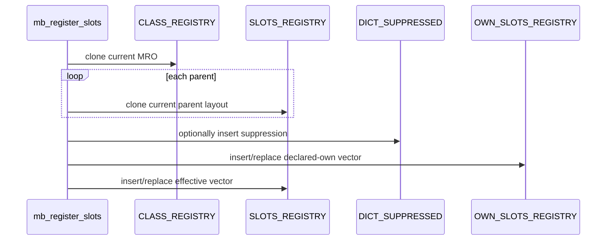
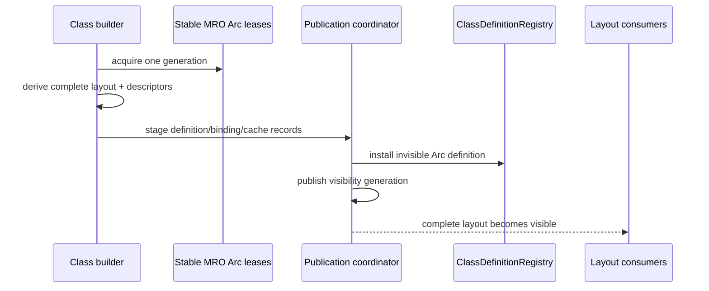
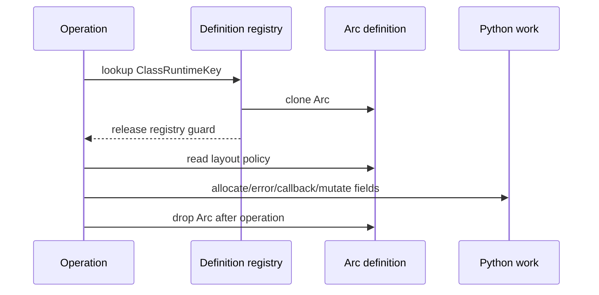

# Class layout policy topology

Issue: #3014
Parent inventory: #2968
Source revision: `769765a2d49a3d37307e0020c6e56d73d9b2a608`

This Stage 1 DDD slice classifies the three TLS collections that describe
class `__slots__` layout and instance-`__dict__` availability. The current
representation separates declared-own slots, effective inherited slots, and
dict suppression into independently mutable collections. Registration writes
them sequentially, snapshot/replace can transfer inconsistent combinations,
and a later declaration that enables `__dict__` leaves prior suppression
behind.

The target introduces no second layout aggregate. Immutable, versioned
`ClassLayoutPolicy` belongs to the existing
`ClassDefinitionRegistry::ClassDefinition`. The accepted class publication
coordinator makes definition, layout, descriptor surface, type binding,
behavior policy, and cache generation visible through one transactional
generation. No `src/**` change occurs in this slice.

## Bounded context

```text
ExecutionContext
├── ClassDomain
│   ├── ClassIdentityCatalog
│   │   └── ClassRuntimeKey
│   ├── ClassDefinitionRegistry
│   │   └── definitions[ClassRuntimeKey] -> Arc<ClassDefinition>
│   │       └── layout: ClassLayoutPolicy
│   └── ClassPublicationCoordinator
│       └── AggregateVisibilityGeneration
└── ThreadDomain
    └── same-context children share ClassDefinitionRegistry

OS-thread compatibility binding
└── ContextHandle
```

`ClassDefinitionRegistry` is the sole layout owner. The publication
coordinator owns only the cross-aggregate protocol. Member descriptors are a
derived class surface; they do not own another mutable layout copy.

## Aggregate and values

| Type | Kind | Meaning |
|---|---|---|
| `ClassLayoutPolicy` | immutable definition value | one complete layout for one definition version |
| `SlotDeclaration` | tagged value | distinguishes no declaration from a present declaration |
| `SlotName` | validated value | one Python slot identifier |
| `DeclaredOwnSlots` | ordered value | exact source-visible order, including duplicates |
| `EffectiveSlotLayout` | ordered-unique value | canonical allowed member names across stable MRO |
| `InstanceDictPolicy` | policy value | `Suppressed` or `Enabled` |
| `ClassDefinitionVersion` | owner version | layout version authority |
| `Arc<ClassDefinition>` | operation lease | keeps one layout version alive |

Declared surface and effective enforcement serve different contracts:

- `cls.__slots__` exposes `DeclaredOwnSlots` exactly as declared;
- attribute enforcement and member-descriptor lookup use
  `EffectiveSlotLayout`;
- declaration presence, not vector non-emptiness, distinguishes
  `__slots__ = ()` from no declaration.

## Frozen inventory

The three admitted production identities are:

- `projects/mamba/src/runtime/class/mod.rs::DICT_SUPPRESSED`
- `projects/mamba/src/runtime/class/mod.rs::OWN_SLOTS_REGISTRY`
- `projects/mamba/src/runtime/class/mod.rs::SLOTS_REGISTRY`

There are zero test-only identities. Test-module occurrences refer to these
production statics. The sorted newline-terminated identity SHA-256 is:

`98da5d91e073627bfee317fb4efdd57bf079ade06f062a6f998e637020e3921e`

The selector emits 48 physical rows and 48 occurrences. The `#[cfg(test)]`
boundary is frozen line 22077.

### Production ledger

The 23 production rows are:

`144`, `146`, `152`, `155`, `8740`, `11480`, `11483`, `11485`, `11659`,
`11675`, `11682`, `11686`, `12349`, `12356`, `22001`, `22002`, `22003`,
`22021`, `22022`, `22023`, `22047`, `22048`, `22049`.

| Operation | Count | Frozen rows |
|---|---:|---|
| comment-only | 1 | `144` |
| declaration | 3 | `146`, `152`, `155` |
| enforcement read | 4 | `8740`, `11480`, `11483`, `11485` |
| registration dependency/read | 1 | `11659` |
| registration publication/write | 3 | `11675`, `11682`, `11686` |
| class-surface helper read | 2 | `12349`, `12356` |
| snapshot | 3 | `22001`, `22002`, `22003` |
| replace | 3 | `22021`, `22022`, `22023` |
| cleanup | 3 | `22047`, `22048`, `22049` |

These nine disjoint categories are set-equal to the 23-row production
denominator.

### Test ledger

The 25 test rows are:

`23095`, `23492`, `23513`, `25042`, `25045`, `25506`, `25571`, `25608`,
`25658`, `25668`, `25694`, `25703`, `25709`, `25964`, `25965`, `25968`,
`25972`, `26100`, `26168`, `26232`, `26240`, `26243`, `26249`, `26252`,
`26728`.

| Frozen rows | Enclosing test |
|---|---|
| `23095` | `test_register_slots` |
| `23492` | `test_slots_restricts_attrs` |
| `23513` | `test_slots_empty_allows_nothing` |
| `25042`, `25045` | `test_cleanup_all_classes_clears_slots_registry` |
| `25506` | `test_s7_slots_inheritance_merge` |
| `25571` | `test_s8_slots_suppresses_dict` |
| `25608` | `test_s9_slots_with_dict_in_slots` |
| `25658`, `25668` | `test_s10_empty_slots_allows_nothing` |
| `25694`, `25703`, `25709` | `test_s11_register_slots_populates_registry` |
| `25964`, `25965`, `25968`, `25972` | `test_s12_child_without_slots_inherits_and_gets_dict` |
| `26100` | `test_r13_slots_merge_three_level_inheritance` |
| `26168` | `test_r13_slots_no_duplicate_in_merge` |
| `26232`, `26240`, `26243`, `26249`, `26252` | `test_r13_dict_suppressed_cleared_on_cleanup` |
| `26728` | `test_slots_inheritance_merges_parent_slots` |

Rows `25045`, `25694`, `25709`, `25964`, `25968`, `26232`, `26243`, and
`26252` occur in comments or assertion strings and perform no state operation.

## Current storage

```rust
thread_local! {
    static SLOTS_REGISTRY:
        RefCell<HashMap<String, Vec<String>>>;
    static OWN_SLOTS_REGISTRY:
        RefCell<HashMap<String, Vec<String>>>;
    static DICT_SUPPRESSED:
        RefCell<HashSet<String>>;
}
```

All three collections own Rust strings and containers only. They own no Python
RC claim.

`SLOTS_REGISTRY` conflates:

- map-key presence: this class called `mb_register_slots`, so it has an own
  `__slots__` declaration;
- map value: the effective own-plus-inherited allowed names.

Therefore:

| Current state | Map representation | Instance dict |
|---|---|---|
| no own declaration | effective/own keys absent | enabled |
| declared empty | both keys present with empty vectors | suppressed |
| declared own names | own vector preserves declaration | determined by `__dict__` member |
| inherited effective names | merged into effective vector | does not by itself suppress a child dict |

A child that declares no slots gets an instance dict even when its parent is
slotted. That distinction depends on key presence and cannot be reconstructed
from `class_slot_names`, which returns an empty vector for both absent and
present-empty.

## Current registration

`mb_register_slots`:

1. extracts string elements into `own_slot_names`;
2. clones them into `effective_slots`;
3. clones the current class MRO from `CLASS_REGISTRY`;
4. reads each parent's current effective vector;
5. appends parent names that are not already present;
6. tests whether declared-own names contain `"__dict__"`;
7. inserts suppression only when `"__dict__"` is absent;
8. publishes declared-own vector;
9. publishes effective vector.



The three writes are sequential and have no visibility commit or rollback.
Each TLS collection may temporarily or permanently describe a different
registration.

## Current duplicate and replacement behavior

| Boundary | Current result |
|---|---|
| exact repeated registration | silently replaces both vectors; suppression insertion is idempotent |
| conflicting declaration | silently replaces both vectors |
| duplicate declared-own name | preserved in own vector |
| parent merge duplicate | parent name is skipped if already present |
| suppressed to explicit `"__dict__"` | old suppression is not removed |
| parent layout replacement | already materialized child layout is not recomputed |
| class re-execution | mutates side collections independently of definition version |

The stale-suppression case is concrete: when a prior registration inserted the
class into `DICT_SUPPRESSED`, a later declaration containing `"__dict__"`
only skips a new insert. It never removes the old set entry.

Declared duplicates remain visible in `cls.__slots__`. Effective membership
uses vector membership, so duplicate entries do not grant different names but
do remain stored when they originated in the same declared-own vector.

## Current enforcement

`mb_getattr_impl` checks `DICT_SUPPRESSED` for instance `__dict__` access. Its
TLS borrow ends before error construction.

`mb_setattr`:

1. checks `SLOTS_REGISTRY.contains_key` to detect own declaration;
2. checks `DICT_SUPPRESSED`;
3. checks the effective vector for the assigned name;
4. raises when suppressed and the name is absent;
5. otherwise mutates instance fields.

Each TLS borrow is a separate narrow statement and ends before Python error
construction or instance-field mutation. The narrow scope avoids a direct
borrow-across-callback path, but the independent reads can still observe
different layout publications.

## Current class surface

The helpers and their real production callers are:

| Helper | Caller | Surface |
|---|---|---|
| `class_slots_value` | `class_members` | declared `__slots__` tuple |
| `class_slot_names` | `class_members` | effective member descriptors |
| both | `mb_getattr_impl`, type-object branch | class value and member descriptors |
| both | `mb_getattr_impl`, class-name-string branch | class value and member descriptors |
| `class_slots_value` | `mb_hasattr` | declared-presence answer |
| both | `class_own_members` | declared value and effective descriptors |

`class_slot_names` clones and returns a Rust-owned `Vec<String>`.

`class_slots_value` clones declared Rust names, allocates one Python string for
each, constructs a Python tuple, and returns the tuple's initial owned claim.
The tuple owns the newly created string claims. The TLS registry owns none of
them.

## Current snapshot, cleanup, and exit

`snapshot_thread_class_state` calls ordinary `borrow()` separately for each
collection. A conflicting mutable borrow panics. It may have already cloned
earlier sibling fields before the panic.

`replace_thread_class_state` first snapshots the prior state, then performs
sequential `borrow_mut()` assignments. A conflict may panic after earlier
collections were replaced, leaving a partial state.

Cleanup performs three independent
`try_borrow_mut().map(|mut m| m.clear())` operations and ignores every result.
Any subset may remain uncleared.

TLS provides same-OS-thread access only. It does not provide execution-context
ownership, same-context child sharing, cross-thread synchronization, or
independent-context isolation. TLS/process exit drops Rust storage but is not
class-definition retirement.

## Target layout policy

```rust
struct ClassLayoutPolicy {
    declaration: SlotDeclaration,
    effective_slots: EffectiveSlotLayout,
    dict_policy: InstanceDictPolicy,
}

enum SlotDeclaration {
    Absent,
    Present {
        declared_own: Vec<SlotName>,
    },
}

enum InstanceDictPolicy {
    Suppressed,
    Enabled,
}
```

`SlotName` is a validated domain value. `ClassDefinitionVersion` supplies the
version authority; `ClassLayoutPolicy` does not add another raw counter.

`DeclaredOwnSlots` preserves exact order and duplicates for the visible
`cls.__slots__` tuple.

`EffectiveSlotLayout` is a typed, canonical ordered-unique layout for
enforcement and member-descriptor derivation. Its concrete data structure and
complexity are deferred to implementation.

## Target derivation

Layout derivation:

1. resolves all base definitions through one stable
   `AggregateVisibilityGeneration`;
2. acquires `Arc<ClassDefinition>` leases for that MRO;
3. validates declared slot names;
4. preserves the declared-own sequence;
5. constructs canonical effective membership;
6. derives dict policy from declaration presence and `"__dict__"`;
7. constructs complete descriptor metadata;
8. stages the new definition/layout as one immutable version.

A child without an own declaration receives
`SlotDeclaration::Absent` and `InstanceDictPolicy::Enabled`; ancestor effective
slots do not change that dict policy.

## Target publication

Publication is transactional at its observable protocol boundary. It does not
claim one machine-level atomic operation across stores.



The commit generation includes layout, definition, descriptors, typed
class/type binding, origin/behavior metadata, and cache generation.
Pre-commit failure removes every provisional record and releases claims after
all guards drop.

An exact repeated provisional record for the same key and definition version
is idempotent. A conflicting same-version record fails closed and preserves
the prior visible generation. Class-statement re-execution is a new typed
definition version, not an in-place conflict.

## Target lookup and operation lease



The registry guard and Arc lifetime are separate:

1. clone `Arc<ClassDefinition>` under a narrow registry guard;
2. drop the registry guard;
3. retain the Arc through enforcement, surface construction, Python
   allocation/error construction, descriptor callbacks, and instance-field
   mutation;
4. drop the Arc after the operation and outside every aggregate guard.

## Target retirement

Context retirement rejects new operations and publications, quiesces children
and active calls, waits for publication generations, detaches definitions,
then drops registry Arcs outside guards. Active operation Arcs keep prior
layout versions alive until their real operations finish.

Retirement failure is explicit. No `try_borrow_mut` cleanup or TLS
snapshot/replace handoff remains.

## Target invariants

1. `ClassDefinitionRegistry` is the sole layout owner.
2. The coordinator owns protocol state, not a second layout copy.
3. TLS holds only the active `ContextHandle`.
4. No layout snapshot/replace payload remains in TLS.
5. `SlotName` is typed and validated.
6. No-declaration and declared-empty are distinct.
7. Declared-own and effective layouts are distinct.
8. Declared-own order and duplicates are preserved for `cls.__slots__`.
9. Effective layout is canonical and ordered-unique.
10. A child without an own declaration has an enabled dict even with a slotted
    parent.
11. Dict policy belongs to the complete layout policy, not a side set.
12. Effective layout derives from one stable MRO definition generation.
13. Full-MRO definition leases remain valid throughout derivation.
14. Exact same-version provisional repeats are idempotent.
15. Same-version conflicts fail closed and preserve prior visibility.
16. Publication stages one complete layout before visibility.
17. Layout, definition, descriptors, binding, policies, and cache generation
    share one aggregate visibility commit.
18. Pre-commit failure exposes no partial layout.
19. Rollback removes every provisional record and claim outside guards.
20. Re-execution publishes a new immutable definition/layout version.
21. Suppressed-to-enabled transition cannot retain stale state.
22. Active old definition Arcs remain valid after republish.
23. Same-context children share one layout generation.
24. Independent contexts isolate layouts and retirement.
25. Lookup clones Arc under the registry guard.
26. The registry guard drops before Python work.
27. The Arc stays alive through the whole layout operation.
28. No callback, allocation, Python error, release/deallocation, descriptor
    execution, or instance mutation occurs under the registry guard.
29. Class surface and enforcement read the same definition/layout generation.
30. Retirement rejects new operations before quiescence.
31. Retirement waits for children, calls, and active publications.
32. Definitions detach before registry Arcs drop.
33. Arc drops occur outside aggregate guards.
34. Retirement failure is explicit.
35. Retiring one context cannot affect another.

## Source implementation slice

Prerequisites:

1. finish and close Stage 1 parent #2968;
2. land Stage 2 context shell #2839;
3. establish Stage 3 output/exception context isolation;
4. finish sibling class publication inventories;
5. migrate layout with the coordinated class-definition source slice.

Exact planned paths:

- `projects/mamba/src/runtime/execution_context.rs`
  - expose context operation leases, definition owner, publication generation,
    and retirement.
- `projects/mamba/src/runtime/class/mod.rs`
  - replace the three TLS collections, registration, enforcement helpers,
    snapshot/replace, and cleanup.
- `projects/mamba/src/runtime/class/descriptors.rs`
  - derive member descriptors from one typed effective layout generation.
- `projects/mamba/src/runtime/mod.rs`
  - order context rejection, quiescence, definition detach, and Arc drain.

Forbidden changes:

- inventing a second layout owner or side registry;
- retaining TLS/global layout collections;
- using raw strings as slot authority;
- collapsing absent with declared-empty;
- collapsing declared-own with effective inherited layout;
- deduplicating the Python-visible declared-own tuple;
- retaining dict suppression as an independent boolean/set;
- deriving effective layout from mixed MRO generations;
- relying on schedule-dependent duplicate/conflict behavior;
- overwriting a conflicting live same-version definition;
- exposing partial publication state;
- calling cross-store publication machine-level atomic;
- mutating a published layout in place;
- treating alias rebind as old Arc destruction;
- dropping the Arc before the operation finishes;
- holding registry guards across Python work;
- retaining TLS snapshot/replace layout transfer;
- ignoring cleanup/retirement failure;
- treating process exit as normal retirement.

## Focused implementation tests

1. `test_layout_same_context_child_sharing`
2. `test_layout_cross_context_isolation`
3. `test_layout_absent_vs_empty_slots`
4. `test_layout_declared_own_vs_effective`
5. `test_layout_child_without_slots_has_dict`
6. `test_layout_reexecution_suppressed_to_enabled_active_lease`
7. `test_layout_generation_consistency`
8. `test_layout_duplicate_conflict_determinism`
9. `test_layout_staging_failure_injection_rollback`
10. `test_layout_enforcement_guard_free_live_arc`
11. `test_layout_class_surface_consistency`
12. `test_layout_snapshot_replace_absent_isolated_retirement`

The focused suite proves same/cross-context behavior, absent versus empty,
surface versus enforcement, inheritance, re-execution with active old leases,
stable-generation derivation, deterministic duplicates/conflicts, staged
rollback, guard-free Python work with a live Arc, every helper consumer, and
quiescent retirement. These tests are planned and were not executed by the
Stage 1 measurement.
