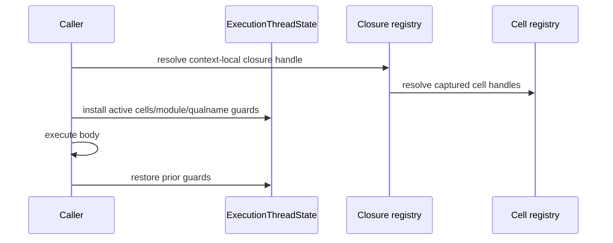
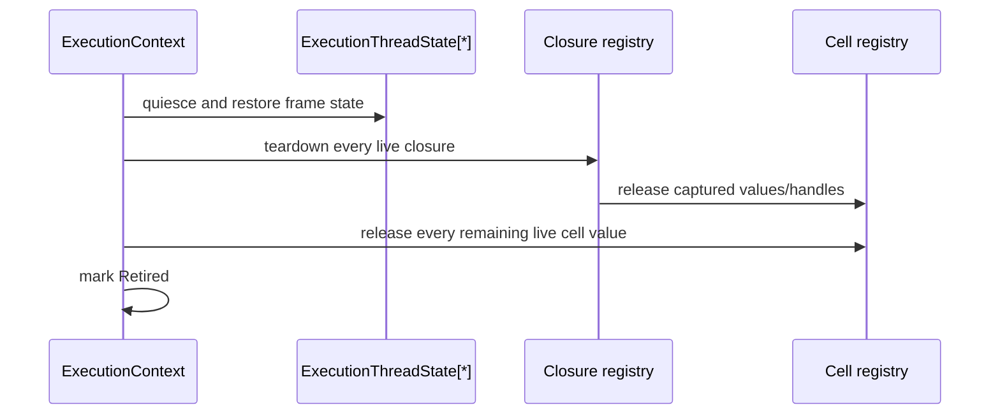

# Closure environment and cell state topology

Issue: #2970
Parent inventory: #2968
Source revision: `59b70b366770b9fcb5e54db52b8255e671d8e30b`

This Stage 1 DDD slice classifies the closure environment and cell state in
`runtime/closure.rs`. It complements
`state-topology/output-and-exception.md`; neither document authorizes registry
migration before #2839 creates the Stage 2 context shell.

## Bounded context and aggregate

`ExecutionContext` is the aggregate root. Persistent closure/cell registries
belong to the context. Dynamically installed symbol and naming stacks belong to
the current `ExecutionThreadState` child.

```text
ExecutionContext
├── RuntimeRegistrySet
│   ├── closures
│   └── cells
└── ExecutionThreadState[*]
    ├── active cell bindings
    ├── active module stack
    └── active qualname stack
```

An integer handle identifies a registry slot only inside its owning context.
It is not a process-global identity and cannot be resolved without the scoped
context binding.

## Frozen inventory

The admitted set contains exactly five newline-terminated, byte-sorted
identities. Its SHA-256 is
`bcac9b127c8f90f54b03e82c13074e10f539445071f139f9938f4c027f0189af`.

| Current symbol | Identity | DDD ownership | Destination |
|---|---|---|---|
| `CLOSURES` | `CLOSURE_HANDLE_BASE + slot_index` | context-owned | `RuntimeRegistrySet.closures` |
| `CELLS` | `CELL_ID_BASE + slot_index` | context-owned | `RuntimeRegistrySet.cells` |
| `ACTIVE_CELLS` | `(module_name, symbol_id) -> cell_handle` | child-owned | `ExecutionThreadState.active_cells` |
| `ACTIVE_MODULE_NAMES` | nested module-name stack | child-owned | `ExecutionThreadState.module_stack` |
| `ACTIVE_QUALNAME_CONTEXTS` | nested `QualnameContext` stack | child-owned | `ExecutionThreadState.qualname_stack` |

Closure handles, cell handles, and `ScopedSymbolKey` values are distinct
identity domains. No migration may reinterpret one as another.

## Aggregate invariants

1. A closure or cell handle resolves only against the registry set of its
   owning `ExecutionContext`.
2. `ACTIVE_CELLS` contains scalar cell-handle associations; inserting or
   removing an association does not itself retain or release a Python heap
   object.
3. `CELLS` owns the retained `MbValue` stored in each live slot. Replacement,
   clear, and context retirement release that value exactly once.
4. `CLOSURES` owns every retained `wrapped`, `captures`, and `defaults` value
   in a live `MbClosure`. Context retirement applies `teardown_closure` exactly
   once to every live slot.
5. Module, qualname, and active-cell frame state is installed and restored
   through scoped guards on success, error, and panic.
6. Retiring one execution child restores or drops only that child's frame
   stacks; it cannot clear the context's persistent closure/cell registries.
7. Quiescing the context first joins all children, then drains closures and
   cells in an order that cannot leave a live closure pointing at a retired
   cell.
8. Compatibility TLS carries only `(context_id, execution_thread_id)` and
   never owns closure, cell, or frame payload.

## Current-state lifetime defects

`cleanup_all_closures()` intentionally clears state without releasing because
the current mixed JIT/interpreter refcount paths make release unsafe.

- `CLOSURES.clear()` bypasses `teardown_closure`, leaking retained wrapped
  values, captures, and defaults.
- `CELLS.clear()` bypasses `release_if_ptr` for live cell contents.
- `ACTIVE_CELLS.clear()` drops scalar associations only; it is not itself a
  Python refcount leak.
- Clearing `ACTIVE_MODULE_NAMES` and `ACTIVE_QUALNAME_CONTEXTS` drops Rust-owned
  values normally. Their risk is an abnormal semantic reset of nested frame
  state, not a Python heap leak.

The Stage 4 migration must replace clear-only cleanup with owned retirement.
Adding releases to the ambient TLS cleanup before ownership is normalized is
forbidden because it can turn the known leak into double-free or use-after-free.

## Transaction boundaries

### Scoped closure call



### Context retirement



## Dependency and source order

1. Finish the remaining #2968 Stage 1 inventory slices.
2. Implement #2839 Stage 2 context shell and scoped restoring binding.
3. Migrate closure/cell registries in one Stage 4 ticket only after the
   directly observable Stage 3 output/exception slice establishes the
   two-context handoff.
4. Migrate frame stacks with explicit `ExecutionThreadState` guards and panic
   restoration.
5. Add context-local teardown only after retain/release ownership is proven by
   focused leak and double-release canaries.

Forbidden changes include process-global handle lookup, copying TLS payload
into a singleton context, clearing live registries without ownership proof, or
migrating the function/global/module metadata registries in the same ticket.

## Verification surface

- Inventory count: 5.
- Inventory digest:
  `bcac9b127c8f90f54b03e82c13074e10f539445071f139f9938f4c027f0189af`.
- Exact source: `projects/mamba/src/runtime/closure.rs`.
- Snapshot rule: #2970 permits no repository changes from AGY and no
  `projects/mamba/src/**` changes from the controller.
