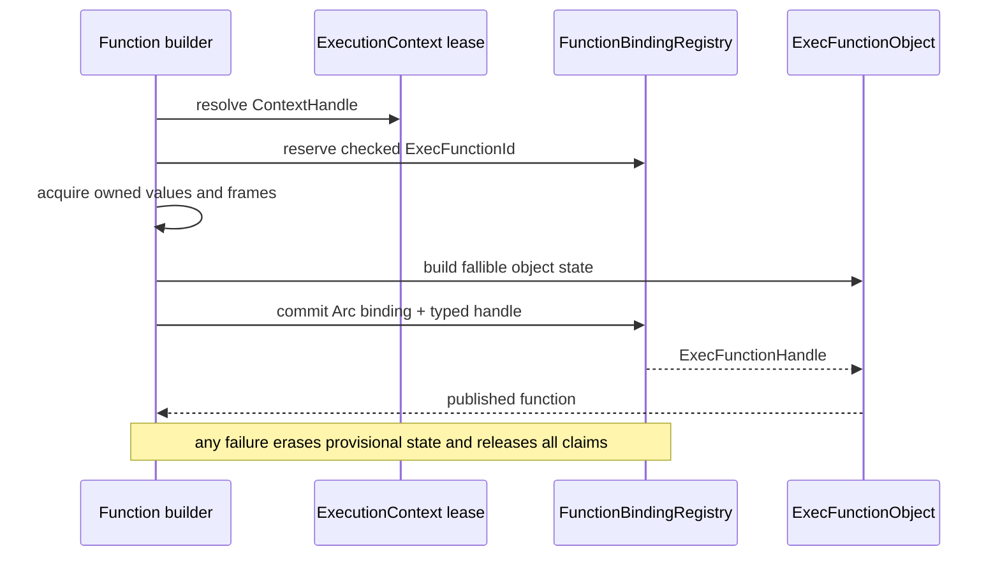
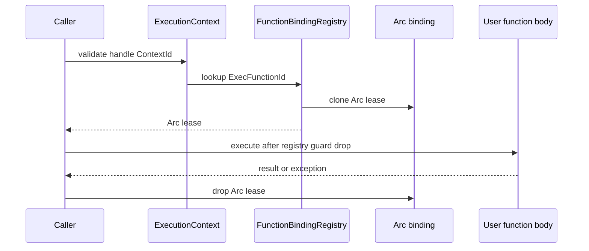
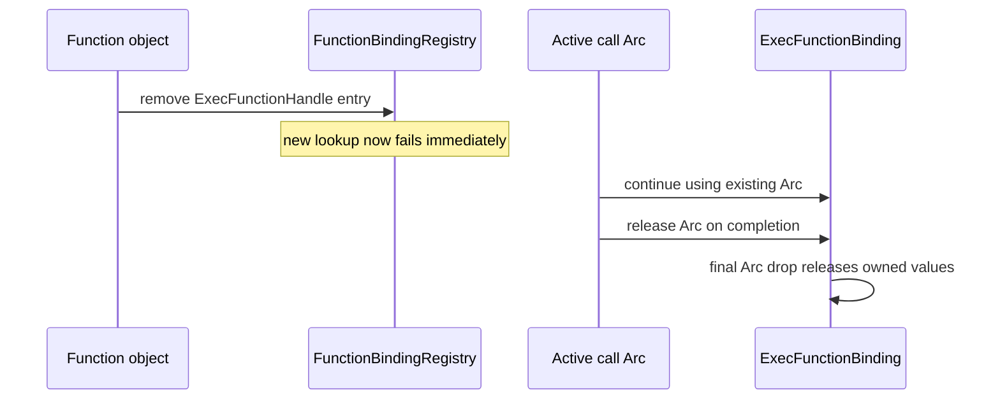

# Exec function binding domain topology

Issue: #3010
Parent inventory: #2968
Source revision: `b0a59dfbc61df75fa55992315a94f6309ad0b58e`

This Stage 1 DDD slice classifies the interpreter's process-global exec-function
binding registry and ID allocator. The current registry gives an interpreted
function a process integer and relies on permanently retained entries to keep
fieldwise-cloned raw Python values usable. The target makes function identity,
publication, execution leases, and retirement one context-owned domain. No
`src/**` change occurs in this slice.

## Bounded context

```text
ExecutionContext
├── EvalFunctionDomain
│   └── FunctionBindingRegistry
│       ├── next_id: ExecFunctionId
│       └── bindings[ExecFunctionId] -> Arc<ExecFunctionBinding>
├── ObjectDomain
│   └── ExecFunctionObject -> ExecFunctionHandle
└── ThreadDomain
    └── same-context children resolve through ContextHandle

ExecFunctionHandle
└── ContextId + ExecFunctionId
```

`FunctionBindingRegistry` is context-owned. A function handle has authority
only in the context named by its `ContextId`. Children attached to that
context may call the function. An unrelated context cannot resolve the same
numeric `ExecFunctionId`, even if its local allocator has emitted that value.

## Aggregate and values

| Type | Kind | Identity / ownership |
|---|---|---|
| `FunctionBindingRegistry` | context-owned aggregate | one registry per `ExecutionContext` |
| `ExecFunctionId` | checked value | monotonic within one context; no live reuse |
| `ExecFunctionHandle` | typed value | `ContextId + ExecFunctionId` |
| `Arc<ExecFunctionBinding>` | execution lease | Rust binding lifetime, independent of Python RC claims |
| `OwnedValue` | owned Python value | one balanced retain/release claim |
| `OwnedExecFrame` | owned captured frame | container lifetime plus explicit value ownership |
| `ExecFunction` | Rust-owned value | parameters, defaults, and AST body |

The registry entry and the binding's `Arc` lifetime are separate concepts.
Removing an entry makes new lookup fail immediately. It does not invalidate an
`Arc` already acquired by an active call.

Captured-frame container lifetime and Python value ownership are also separate
ledgers. Cloning an `Arc<RwLock<HashMap<String, MbValue>>>` keeps the Rust map
allocated; it does not retain the raw Python values stored in the map.

## Frozen inventory

The two production state identities are:

- `projects/mamba/src/runtime/builtins/eval_exec.rs::EXEC_FUNCTIONS`
- `projects/mamba/src/runtime/builtins/eval_exec.rs::NEXT_EXEC_FUNCTION_ID`

There are zero test-only state identities. The sorted newline-terminated
identity SHA-256 is
`980faa939bf2e8d0051cf0db67d8a47e5ed6c51048405d39d5ff73b75baef6dd`.

The frozen selector emits 18 distinct physical rows and 19 symbol
occurrences:

| Family | Occurrences |
|---|---:|
| `EXEC_FUNCTIONS` | 4 |
| `NEXT_EXEC_FUNCTION_ID` | 2 |
| `ExecFunctionBinding` | 3 |
| `make_exec_function_body_value` | 5 |
| `exec_capture_frames` | 2 |
| `mb_exec_function_call` | 2 |
| `mb_exec_function_call_with_kwargs` | 1 |

The 18 rows are:

1. line 517: `ExecFunctionBinding` definition;
2. line 573: `EXEC_FUNCTIONS` definition with `ExecFunctionBinding`;
3. line 575: `NEXT_EXEC_FUNCTION_ID` definition;
4. line 1680: lambda body-value construction;
5. line 1873: `exec_capture_frames` definition;
6. line 1877: `make_exec_function_body_value` definition;
7. line 1903: `exec_capture_frames` call;
8. line 1905: `NEXT_EXEC_FUNCTION_ID.fetch_add`;
9. line 1906: `EXEC_FUNCTIONS` insertion;
10. line 1908: `ExecFunctionBinding` construction;
11. line 2086: positional call entry;
12. line 2090: positional `EXEC_FUNCTIONS` lookup;
13. line 2143: keyword call entry;
14. line 2150: delegation to positional call;
15. line 2155: keyword `EXEC_FUNCTIONS` lookup;
16. line 2915: lambda body-value construction;
17. line 3595: synchronous function body-value construction;
18. line 3697: asynchronous function body-value construction.

## Current aggregate

```rust
static EXEC_FUNCTIONS:
    LazyLock<RwLock<FxHashMap<u64, ExecFunctionBinding>>>;
static NEXT_EXEC_FUNCTION_ID: AtomicU64 = AtomicU64::new(1);
```

`ExecFunctionBinding` contains:

- Rust-owned `name`, `is_async`, capture scopes, annotation-name sets,
  parameters, and AST body;
- raw Python `MbValue` fields for `globals`, `locals`, and non-None defaults;
- cloned `Arc` captured-frame containers whose maps hold raw `MbValue` bits.

Both registry and allocator are process-global. They are not scoped by a
runtime execution, child thread, or function-object lifetime.

## Current ownership ledger

### Binding construction

`make_exec_function_body_value` explicitly retains each of these once before
registry insertion:

- `globals`, when present;
- `locals`, when present;
- every non-None default.

Those claims transfer into the process registry entry. The plain Rust map does
not add another Python retain. There is no removal path that releases them.

`exec_capture_frames` clones the vector of frame `Arc`s. Each clone owns a Rust
container lease only. Current frame insertion, replacement, and drop store raw
Python values without an owned-value wrapper, so no balanced frame-value
retain/release conclusion follows from the `Arc`.

### Function object fields

The `__exec_function__` instance stores:

- newly allocated `__name__` and optional `__doc__` objects whose initial
  claims transfer into the object field map;
- immediate `__is_async__` and scalar `__function_id__` values;
- an optional `__return__` field used by the constant-return fallback.

The object holds only the numeric ID. It owns no typed link that deregisters
the binding.

### Call clone

Both call entry points:

1. read the numeric ID from the function object;
2. acquire the process registry read guard;
3. fieldwise-clone `ExecFunctionBinding`;
4. release the read guard;
5. execute using the clone.

Fieldwise clone copies raw `globals`, `locals`, and default bits and clones
frame `Arc`s. It is not an independently retained Python-value snapshot.
Present safety depends on the registry entry and its leaked claims never being
retired.

## Current publication and lifecycle

| Boundary | Current result |
|---|---|
| ID reservation | relaxed `fetch_add` supplies atomic uniqueness only until wrap |
| publication ordering | registry write lock publishes the entry; relaxed ordering does not |
| overflow/reuse | unchecked; wrap may replace a live ID |
| value claims | globals, locals, and defaults retained before insertion |
| registry insertion | occurs before the function object and ID field exist |
| failure before insertion | burns an ID and can leak acquired claims |
| poison before insertion | `write().unwrap()` panics; no recovery or rollback |
| failure after insertion | can leave an unreachable orphan entry |
| successful call lookup | fieldwise clone under read guard, then guard drop |
| poison on lookup | `read().unwrap()` panics; no recovery policy |
| missing binding, no positional args | falls through and can return `__return__` or `None` |
| missing binding, positional args | reports a misleading zero-argument error |
| missing binding, keyword args | reports the same zero-argument class of error |
| function-object destruction | has no registry deregistration edge |
| active call | survives only because process entry and claims remain forever |
| runtime cleanup | neither drains `EXEC_FUNCTIONS` nor resets the allocator |
| process exit | address-space reclamation ends state; no explicit Python drain |

Lock poisoning is process-wide because every function shares the same
`std::sync::RwLock`. `unwrap` is not a recovery policy.

The missing-binding path is not a valid interpreted-function behavior. It
masks an identity/lifecycle failure by reclassifying the object as a
zero-argument constant-return function.

## Target registration transaction

Registration is transactional, not a claim that Rust object construction and
map insertion are one machine-level atomic operation.



All fallible state and ownership acquisition occurs before commit where
possible. If implementation requires a provisional entry, it remains
unobservable and is erased on every failed boundary. Commit makes a usable
typed handle and its registry entry visible together.

The observable invariant is:

> No visible ID or registry entry exists without a usable function handle.

ID overflow fails closed without insertion, replacement, or reuse. A failed
reservation or registration may leave a tombstoned monotonic number, but it
must not leave an ownerless binding or owned Python claim.

## Target lookup and call lease



A lookup clones only the `Arc<ExecFunctionBinding>` while the registry guard
is live. It never fieldwise-clones the binding. User code, callbacks,
allocation, Python release, deallocation, and binding destruction occur after
the guard is released.

A missing entry or context mismatch returns a typed internal execution error.
It never enters the constant-return fallback.

## Target finalization and retirement



Registry visibility and binding lifetime remain separate:

1. final function-object destruction removes the handle entry immediately
   after any already-active lookup has obtained its `Arc`;
2. new lookup then fails;
3. each active call keeps the detached binding alive;
4. the last `Arc` drop destroys the binding and releases its owned claims;
5. active-call completion does not perform or delay registry removal.

Context retirement first rejects new operations, quiesces child contexts and
active calls, detaches remaining entries, then releases their `Arc`s with no
registry guard live. Each owned Python claim drains exactly once.

## Target invariants

1. Function-binding registry ownership is context-local.
2. TLS stores only the scoped `ContextHandle`.
3. Identity is the typed pair `ContextId + ExecFunctionId`.
4. Same-context children may resolve a handle.
5. Cross-context resolution always fails closed.
6. IDs are checked and monotonic within one context.
7. No live ID is reused or overwritten.
8. Overflow fails before publication.
9. No visible entry exists without a usable function handle.
10. Publication rollback erases all provisional state.
11. Publication rollback releases every acquired Python claim exactly once.
12. Registry entries are `Arc<ExecFunctionBinding>`.
13. Lookup clones only an Arc under the registry guard.
14. Fieldwise binding clone is removed from the call path.
15. Globals, locals, and defaults have explicit owned-value wrappers.
16. Captured frames distinguish Rust container lifetime from Python value
    ownership.
17. Frame insertion, replacement, and drain balance every value claim.
18. No registry guard is held across user code or callbacks.
19. No registry guard is held across allocation, Python release,
    deallocation, binding destruction, or context retirement.
20. Function-object finalization removes registry visibility immediately.
21. Active call leases remain valid after registry removal.
22. Active-call completion cannot delay or perform registry removal.
23. Final Arc destruction releases one binding's owned claims exactly once.
24. Missing binding never enters the constant-return fallback.
25. A poisoned context-local registry cannot poison another context.
26. Context retirement waits for child and call quiescence.
27. Retirement prevents new lookup before detaching entries.
28. Runtime cleanup leaves no binding visible to a later context.

## Source implementation slice

Prerequisites:

1. finish and close Stage 1 parent #2968;
2. land Stage 2 context shell #2839;
3. establish the Stage 3 context isolation needed by function calls;
4. then dispatch the bounded exec-function binding migration.

Exact planned paths:

- `projects/mamba/src/runtime/execution_context.rs`
  - add `EvalFunctionDomain`, typed IDs and handles, operation leases, and
    ordered retirement.
- `projects/mamba/src/runtime/builtins/eval_exec.rs`
  - remove both process statics, register transactionally, resolve typed
    handles, clone Arc leases, and fail closed on lookup errors.
- `projects/mamba/src/runtime/rc.rs`
  - provide owned value/frame wrappers with balanced transfer and drain.
- `projects/mamba/src/runtime/mod.rs`
  - route cleanup through quiescent context retirement instead of ambient
    process state.

Forbidden changes:

- retaining either process-global exec-function static under a new name;
- moving bindings or the allocator into payload-owning TLS;
- using an unscoped integer as cross-context authority;
- reusing an ID while a handle or binding is live;
- treating relaxed atomic ordering as registry publication;
- publishing an entry before a usable function handle without rollback;
- calling multi-step object construction and registry insertion atomic;
- treating captured-frame Arc cloning as Python value retention;
- treating `ExecFunctionBinding::clone` as an owned Python snapshot;
- holding a registry guard across user code, callbacks, allocation, release,
  deallocation, or drop;
- delaying registry removal until active calls finish;
- invalidating an active Arc when the function object is finalized;
- keeping the constant-return fallback for missing or mismatched bindings;
- treating `RwLock::unwrap` as poison recovery;
- claiming ambient cleanup or process exit performs a Python ownership drain.

## Verification gates

- Exact-set gate: two identities, zero test-only identities, 18 rows, and
  `4/2/3/5/2/2/1` occurrence subtotals reconcile.
- Same-context gate: two children of one context resolve and call one typed
  handle successfully.
- Cross-context gate: a concurrent second context cannot resolve the first
  context's handle, even when its local numeric ID matches.
- Transaction gate: an injected failure at each reservation, claim,
  construction, provisional insertion, commit, and field-install boundary
  leaves no visible entry and no leaked claim.
- Overflow gate: checked ID exhaustion fails without reuse or replacement.
- Lookup gate: missing ID and mismatched context produce typed internal errors,
  never a constant return or zero-argument error.
- Guard-scope gate: recursive/user calls prove no registry guard remains live.
- Finalization gate: object finalization makes a new lookup fail immediately
  while a call with a pre-existing Arc completes.
- Arc-lifetime gate: the binding drains only after the final active Arc drops.
- Ownership gate: globals, locals, defaults, and frame values return to their
  expected RC baseline after normal drop and every rollback boundary.
- Quiescence gate: context retirement rejects new lookup, waits for children
  and calls, then drains remaining entries exactly once.
- Poison-isolation gate: a poisoned registry in context A cannot affect
  context B.
- Cleanup gate: a later context observes neither bindings nor allocator state
  from the retired context.
- AGY's measure-only run executed none of these planned gates.

## Dependency and dispatcher result

- #3010 is a Stage 1 classification slice under #2968.
- It produces a later source migration after #2839 and Stage 3.
- AGY's first report reconciled the current inventory and ownership findings
  but conflated registry removal with final-Arc destruction and called a
  multi-step publication path atomic.
- Its revision separated registry visibility from binding lifetime and
  specified rollback at every publication boundary.
- The accepted run made no repository change; Codex independently verified the
  snapshot, protected artifacts, frozen selector, and source negative control.
- The run required one revision, so the dispatcher ramp remains one ticket.
