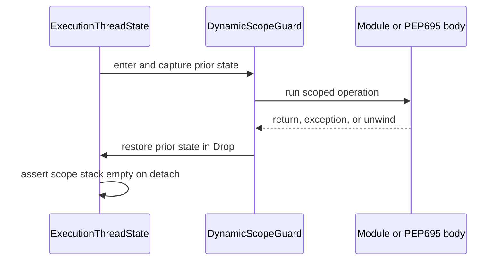

# Execution-control state topology

Issue: #2977
Parent inventory: #2968
Source revision: `0408d2966ef548114fd83bbb86a2f5feadff4e02`

This Stage 1 DDD slice classifies two transient TLS controls: the active-module
SymbolId frame stack and the temporary missing-global lookup policy. They are
child-owned execution state, not global-value registry data.

## Aggregate boundary

```text
ExecutionContext
└── ExecutionThreadState
    └── dynamic_scopes
        ├── active_module_symbol_frames[]
        └── missing_global_policy
```

`ExecutionThreadState` is a child entity whose lifetime is bounded by one
attached execution thread/task and its parent `ExecutionContext`.

## Frozen inventory

The admitted set contains exactly two newline-terminated, byte-sorted
identities. Its SHA-256 is
`00af56531d3aa98f1e58e6990b9e05a473b5770e2559e131f1fd85f2b9d22164`.

| Current symbol | Stored value | Ownership | DDD destination |
|---|---|---|---|
| `ACTIVE_MODULE_SYM_IDS` | `Vec<HashSet<i64>>` | child-owned | `ExecutionThreadState.dynamic_scopes.active_module_symbol_frames` |
| `MISSING_GLOBAL_RAISES_NAME_ERROR` | `bool` | child-owned | `ExecutionThreadState.dynamic_scopes.missing_global_policy` |

## Active module symbol frames

The source comment describes an intended collision-avoidance role: the top
frame identifies raw SymbolIds owned by the currently executing module, so
nested-module leftovers do not overwrite an outer module's numerically
colliding slot.

The current implementation does not enforce that intent:

- module execution pushes a frame before the JIT-result closure;
- it pops the frame after that closure returns;
- cleanup clears the stack;
- no current source reads or peeks at a frame;
- `merge_global_id_namespace` does not consult the stack.

This is write-only/dead enforcement state. A future migration cannot copy it
into `ExecutionThreadState` merely to preserve shape. Its Stage 4 ticket must
either connect it to a tested collision rule or remove it and prove the
module-qualified key design makes it unnecessary.

The manual push/pop pair is also not unwind safe. Early `?` returns inside the
inner closure still reach the outer pop, and encoded Python exceptions return
through Rust normally, but a Rust panic between push and pop leaves an orphaned
frame.

## Missing-global policy

`MISSING_GLOBAL_RAISES_NAME_ERROR` is a dynamically scoped lookup policy:

- the default is false;
- `instance_lazy_attr_hook` replaces it with true while evaluating a PEP 695
  lazy thunk;
- the previous value is restored after `mb_call0`;
- global reads consult it to decide whether a miss raises `NameError`;
- cleanup resets it to false.

An encoded Python exception still returns from `mb_call0`, so restoration runs
before exception inspection. A Rust panic unwinds past the manual restore and
leaves the policy stuck at true.

A single boolean is sufficient only because current users are strictly nested
and manually preserve the previous value. The DDD representation is a scoped
policy binding, not an ambient context-wide feature flag.

## Invariants

1. Dynamic execution controls belong to one `ExecutionThreadState`.
2. Entering a scope records the prior state and returns a guard.
3. Dropping the guard restores the exact prior state on normal return, encoded
   Python exception, early return, and Rust unwind.
4. Nested scopes restore in LIFO order.
5. One child cannot observe or mutate another child's module frames or lookup
   policy.
6. Attaching the same logical context to a different worker creates or
   restores an explicit child state; it does not inherit arbitrary OS-thread
   TLS.
7. Child teardown asserts no dynamic-scope guard remains live.
8. Context retirement waits for every child to detach before destroying
   execution-control state.
9. Dead state is removed rather than migrated unless a runnable consumer and
   oracle prove its invariant.
10. Missing-global policy is not stored in `RuntimeRegistrySet.global_values`
    and does not change registry ownership.

## Current-state risks

- A Rust panic leaves either an orphaned module frame or a stuck lookup policy.
- `ACTIVE_MODULE_SYM_IDS` suggests collision protection that does not currently
  exist, making comments stronger than behavior.
- TLS binds controls to OS threads rather than logical execution children.
- Broad cleanup hides unbalanced scopes instead of detecting them.
- A stuck true lookup policy changes unrelated later missing-global behavior on
  the reused thread.

## Lifecycle



## Dependency and source order

1. Finish the remaining #2968 Stage 1 inventory.
2. Implement #2839 Stage 2 aggregate shell, child state, and scoped restoring
   context binding without migrating these controls.
3. Establish Stage 3 output/exception isolation.
4. In Stage 4, introduce generic unwind-safe dynamic-scope guards.
5. Migrate the missing-global policy.
6. Resolve `ACTIVE_MODULE_SYM_IDS` through a separate connect-or-remove ticket
   with a nested-module collision oracle.

Forbidden changes include copying write-only TLS into the aggregate, treating
manual restoration as panic safe, making the policy process-global, sharing
one child stack across workers, masking imbalance through broad cleanup, or
migrating before #2839.

## Verification surface

- Inventory count: 2.
- Inventory digest:
  `00af56531d3aa98f1e58e6990b9e05a473b5770e2559e131f1fd85f2b9d22164`.
- Exact declaration denominator: 24 static/TLS candidates in
  `runtime/closure.rs`, 2 admitted and 22 discarded.
- Cross-owner evidence:
  `runtime/module.rs` and `runtime/pep695.rs`.
- Negative selector: no read/peek of `ACTIVE_MODULE_SYM_IDS` beyond push, pop,
  and cleanup.
- Snapshot rule: #2977 permits no repository changes from AGY and no
  `projects/mamba/src/**` changes from the controller.
