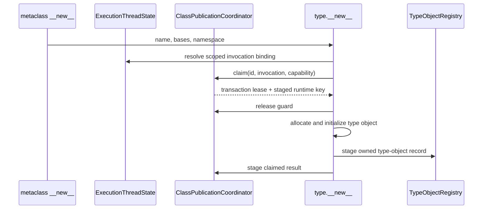

# Metaclass invocation transaction topology

Issue: #3017
Parent inventory: #2968
Source revision: `fd64478230a912b5aa7cebfec5fb5c094979be2d`

This Stage 1 DDD slice classifies the TLS stack that lets a custom metaclass's
first matching `type.__new__` reuse a pre-staged class identity. The current
protocol uses display-name equality, stack position, one mutable bit, and
manual push/pop restoration.

The target folds claim state into the accepted `ClassDefinitionTransaction`.
`ClassPublicationCoordinator` remains the transaction owner, while
`ExecutionThreadState` owns only a scoped invocation binding/lease.
`ClassDefinitionRegistry` and `TypeObjectRegistry` retain sole ownership of
published records.

No `projects/mamba/src/**` change occurs in this slice.

## Bounded context

```text
ExecutionContext
├── ClassDomain
│   ├── ClassPublicationCoordinator
│   │   └── transactions[ClassTransactionId]
│   │       └── type_new_claim: TypeNewClaimState
│   ├── ClassDefinitionRegistry
│   └── TypeObjectRegistry
└── ExecutionThreadState[*]
    └── invocation_bindings
        └── MetaclassInvocationBinding(ClassTransactionLease)

OS-thread compatibility binding
└── ContextHandle
```

The coordinator owns transaction state. The execution child owns only the
dynamic binding that says which transaction the current metaclass invocation
may act on. The binding is scoped and non-transferable.

## Domain values

| Type | Kind | Meaning |
|---|---|---|
| `ClassTransactionId` | typed identity | context, definition, generation |
| `ClassTransactionLease` | operation lease | keeps a transaction alive |
| `MetaclassInvocationId` | typed invocation identity | one Python `__new__` invocation |
| `InvocationCapability` | opaque capability | authorizes the intended call |
| `NamespaceCapability` | opaque capability | binds the intended namespace flow |
| `MetaclassInvocationBinding` | child-owned scoped value | active invocation and lease |
| `MetaclassInvocationGuard` | RAII guard | restores prior binding/depth |
| `TypeNewClaimState` | transaction state | unclaimed, claimed, committed, aborted |
| `ClassDisplayName` | metadata value | Python-visible name only |

Display names, runtime keys, transaction ids, invocation ids, namespace
capabilities, and stack positions are distinct domains.

## Frozen inventory

The admitted identity is:

`projects/mamba/src/runtime/class/mod.rs::METACLASS_DEFINITION_STACK`

The SHA-256 over the newline-terminated identity is:

`4791e3aca4849fc62363f46fa8a3f72408289ce5b48132dea28582f8a6dd2de8`

The exact selector emits four physical rows and four occurrences. All are
production; the `class/mod.rs` test boundary is frozen line 22077.

| Frozen row | Operation | Enclosing owner |
|---:|---|---|
| `175` | TLS declaration | `thread_local!` block |
| `1395` | top claim/read-mutate | `claim_staged_type_new_target` |
| `2581` | push | `run_metaclass_definition_hooks` |
| `2589` | blind pop | `run_metaclass_definition_hooks` |

There are zero test-only identities.

## Current record

```rust
struct MetaclassDefinitionContext {
    staged_class: String,
    display_name: String,
    type_new_claimed: bool,
}
```

| Field | Producer | Consumer | Terminal edge |
|---|---|---|---|
| `staged_class` | current execution-unique class runtime-key string | returned by a successful claim | Rust drop on pop/TLS exit |
| `display_name` | `class_display_name(class_name)` | equality check during claim | Rust drop on pop/TLS exit |
| `type_new_claimed` | initialized `false` at push | checked and flipped on first match | Rust drop on pop/TLS exit |

The stack contains Rust strings and a boolean. It owns no Python reference
claim.

## Current push, claim, and pop

```mermaid
sequenceDiagram
    participant Finalize as finalize_class_definition
    participant Hooks as run_metaclass_definition_hooks
    participant Stack as TLS stack
    participant Meta as metaclass __new__
    participant TypeNew as type_new_unbound

    Finalize->>Hooks: custom metaclass
    Hooks->>Stack: push(staged key, display name, false)
    Hooks->>Meta: call __new__
    Meta->>TypeNew: optional type.__new__
    TypeNew->>Stack: claim top by display name
    alt top matches and unclaimed
        Stack-->>TypeNew: staged runtime key; bit=true
    else empty, mismatch, or already claimed
        Stack-->>TypeNew: none
        TypeNew->>TypeNew: allocate fresh dynamic key
    end
    Meta-->>Hooks: result or Python exception state
    Hooks->>Stack: blind pop
```

`claim_staged_type_new_target` examines only `last_mut()`. It does not search
below the top entry. A nested different-display-name invocation therefore
shields an outer entry until the nested entry pops.

On a matching top entry, the function flips `type_new_claimed` and clones
`staged_class` while the TLS `RefMut` is live. The borrow ends before
type-object allocation and class registration.

The first matching `type.__new__` reuses the staged runtime key. A later call
in the same invocation sees `type_new_claimed=true` and receives a new dynamic
runtime key.

## Current authority defect

Claim authority is the conjunction of:

- being the top TLS entry;
- having an equal display-name string;
- having `type_new_claimed=false`.

No typed transaction or invocation capability is presented. An unrelated
nested `type()` call with the same display name can consume the staged identity
before the intended delegation.

The pop ignores the returned record. It validates neither transaction
identity, expected depth, display name, nor claim state.

## Current unwind and lifetime

The stack borrow ends before calling metaclass Python code. No TLS stack guard
is held across `__new__`, `type.__new__`, allocation, registration, hooks, or
`__init__`.

A Python exception is stored in runtime exception state; the call returns and
the source path still executes the manual pop before checking that state.
Python error does not by itself skip the current pop.

A Rust panic or unwind between push and pop bypasses the manual pop. The stale
record then remains at the bottom of later balanced invocations and can affect
a later claim once it becomes top again.

`METACLASS_DEFINITION_STACK` is absent from:

- `ThreadClassState`;
- `snapshot_thread_class_state`;
- `replace_thread_class_state`;
- `cleanup_all_classes`.

It is not copied to workers, and compatibility cleanup cannot remove a stale
entry. OS-thread exit drops its Rust fields, but is not transaction or context
retirement. A same-context execution child on another OS thread cannot see the
parent TLS invocation.

## Existing behavior-test owners

| Test | Proven seam |
|---|---|
| `driver/mod.rs::user_metaclass_identity_survives_same_name_rebinding` | same-named metaclass identity |
| `driver/mod.rs::metaclass_definition_hooks_receive_visible_class_name` | visible name and hook order |
| `driver/mod.rs::metaclass_non_type_result_flows_through_decorator_and_binding` | canonical non-type result |
| `driver/mod.rs::nondelegating_metaclass_does_not_prefill_classcell` | required-cell unset failure |
| `driver/mod.rs::metaclass_may_remove_classcell_after_type_new` | post-consumption namespace removal |
| `driver/mod.rs::metaclass_initializes_through_the_result_type` | `__init__` via `type(result)` |
| `driver/mod.rs::type_new_rejects_a_non_cell_classcell` | non-cell rejection |
| `runtime/class/mod.rs::metaclass_non_type_result_is_canonical_and_skips_init` | non-type result skips init |
| `runtime/class/mod.rs::metaclass_type_new_reuses_staged_identity_and_initializes_result` | first claim reuses staged identity |

No current focused test proves Rust-unwind restoration, nested same-display
isolation, unrelated nested `type()` rejection, second-claim identity,
wrong-child behavior, or context retirement.

## Target transaction claim

The claim state belongs inside `ClassDefinitionTransaction`:

```rust
enum TypeNewClaimState {
    Unclaimed {
        invocation: MetaclassInvocationId,
        capability: InvocationCapability,
        namespace: NamespaceCapability,
    },
    Claimed {
        invocation: MetaclassInvocationId,
        type_object: TemporaryTypeLease,
    },
    Committed,
    Aborted,
}
```

The exact state representation may combine this with the classcell transaction
state, but it may not add a second transaction owner.

A claim must present:

- the active `ClassTransactionLease`;
- the matching `MetaclassInvocationId`;
- an opaque invocation/namespace capability issued for the intended
  class-definition call.

Display-name equality, base equality, raw namespace/object address,
process-global current state, and top-of-stack position are insufficient
individually or together.

## Target scoped binding

`ExecutionThreadState` installs a `MetaclassInvocationBinding` before Python
`__new__`. `MetaclassInvocationGuard` records the exact prior binding state and
expected depth.

Guard drop:

1. verifies the exact `ClassTransactionId` and invocation id;
2. restores the prior binding/depth;
3. marks a mismatch as an explicit invariant failure;
4. runs on success, Python exception, early return, and Rust unwind.

Active invocation bindings are scoped frames. They are omitted from
`ThreadClassState` snapshot/replace and are never inherited by a worker. A
same-context child reaches the shared coordinator only with its own explicit
typed lease/capability.

## Target `type.__new__` flow



The intended first exact capability-matched claim reuses the staged identity.
An unrelated nested call has no capability and receives an independent dynamic
identity. A second call after a completed claim also receives an independent
dynamic identity unless it is the exact compatible retry of an interrupted
pre-publication operation. Compatible retries and conflicts are typed,
explicit, and fail closed.

No coordinator or thread-state guard remains live across type allocation,
class registration, Python callbacks, descriptor hooks, `__init_subclass__`,
error construction, or release/deallocation.

## Target publication and rollback

Publication is transactional at the observable protocol boundary, not one
machine-level atomic operation.

At commit, the coordinator activates already-staged definition and type-object
records in `ClassDefinitionRegistry` and `TypeObjectRegistry`. The invocation
binding and transaction do not become second published owners.

Rollback:

1. rejects further claims;
2. removes provisional definition/type records;
3. restores the child binding through RAII;
4. releases temporary claims after all guards drop;
5. records an explicit aborted terminal state.

A class with no classcell requirement may canonically receive a non-type
metaclass result. A class requiring a cell whose metaclass skips
`type.__new__` fails unset validation. A successful `type.__new__` followed by
an incompatible returned result is validated separately.

## Target cleanup and retirement

Compatibility cleanup may retire a quiescent default context or fail
explicitly. It must not clear a live binding behind its RAII guard.

Context retirement:

1. rejects new transactions and invocation bindings;
2. quiesces execution children and active Python calls;
3. lets child invocation guards restore their bindings;
4. waits for invocation and transaction leases;
5. aborts remaining uncommitted transactions;
6. detaches staged definition/type records;
7. releases temporary claims outside guards;
8. retires sole-owner registries under their accepted contracts.

## Target invariants

1. `ClassPublicationCoordinator` is the sole class-transaction owner.
2. `ClassDefinitionRegistry` remains the sole published-definition owner.
3. `TypeObjectRegistry` remains the sole published-type-object owner.
4. Invocation bindings are child-owned scoped values.
5. Compatibility TLS holds only `ContextHandle`.
6. Transaction and invocation identities are typed.
7. Display name is Python metadata, not authority.
8. Raw namespace address is not authority.
9. Stack position is not authority.
10. The intended claim requires a transaction lease and opaque capability.
11. One transaction exposes at most one staged-identity claim.
12. The first exact intended claim reuses the staged identity.
13. An unrelated nested call cannot steal that identity.
14. Nested same-display invocations remain isolated.
15. A later independent `type.__new__` receives a fresh dynamic identity.
16. Compatible retry and conflict are explicitly distinct.
17. Conflicts fail closed without altering prior state.
18. Invocation guard installation records exact prior state/depth.
19. Guard drop validates exact transaction and invocation ids.
20. Guard drop restores on success and Python error.
21. Guard drop restores on early return and Rust unwind.
22. No active invocation frame appears in thread snapshots.
23. Workers do not inherit active invocation bindings.
24. Same-context children require their own typed capability.
25. Independent contexts isolate invocation state.
26. No guard spans Python work, allocation, or callbacks.
27. No guard spans release/deallocation.
28. Definition/type records stage before visibility.
29. Aggregate commit activates records in their sole registries.
30. Publication is not called machine-level atomic.
31. Rollback removes provisional records before releasing claims.
32. Non-type result behavior is conditional on classcell/type-new flow.
33. Compatibility cleanup cannot invalidate an active guard.
34. Retirement rejects new work before quiescence.
35. Retirement drains child, invocation, transaction, and call leases.
36. Retirement failure is explicit and context-isolated.

## Source implementation slice

Prerequisites:

1. finish and close Stage 1 parent #2968;
2. land Stage 2 context shell #2839;
3. establish accepted class coordinator/definition/type registries;
4. migrate classcell transaction state;
5. migrate this invocation binding with the coordinated class publication
   source slice.

Exact planned paths:

- `projects/mamba/src/runtime/execution_context.rs`
- `projects/mamba/src/runtime/class/mod.rs`
- `projects/mamba/src/runtime/builtins/type_objects.rs`
- `projects/mamba/src/runtime/mod.rs`

Forbidden changes:

- creating a second staging or published owner;
- using display name, bases, raw namespace address, or stack position as claim
  authority;
- retaining the ambient TLS vector;
- using manual push/pop without RAII restoration;
- copying active invocation frames through `ThreadClassState`;
- letting compatibility cleanup clear a live binding;
- allowing nested unrelated calls to claim an outer identity;
- holding guards across Python work, allocation, hooks, or release;
- publishing target records into current TLS `CLASS_REGISTRY`;
- calling cross-store publication machine-level atomic;
- treating OS-thread exit as context retirement;
- merging callable, kwargs, slots, cache, ABC/protocol, or classcell-map
  migration into this slice.

## Focused implementation tests

1. `test_metaclass_invocation_raii_success_restore`
2. `test_metaclass_invocation_raii_python_error_restore`
3. `test_metaclass_invocation_raii_rust_unwind_restore`
4. `test_metaclass_nested_different_name_isolation`
5. `test_metaclass_nested_same_name_isolation`
6. `test_metaclass_unrelated_type_cannot_steal_identity`
7. `test_metaclass_first_intended_type_new_reuses_identity`
8. `test_metaclass_second_type_new_gets_dynamic_identity`
9. `test_metaclass_compatible_retry_vs_conflict`
10. `test_metaclass_non_type_without_classcell_is_canonical`
11. `test_metaclass_required_classcell_nondelegating_fails`
12. `test_metaclass_visible_name_is_metadata_only`
13. `test_metaclass_same_context_child_requires_capability`
14. `test_metaclass_independent_context_isolation`
15. `test_metaclass_invocation_absent_from_thread_snapshot`
16. `test_metaclass_retirement_with_active_invocation_lease`
17. `test_metaclass_guard_free_allocation_and_release`

These tests are planned and were not executed by the Stage 1 measurement.
