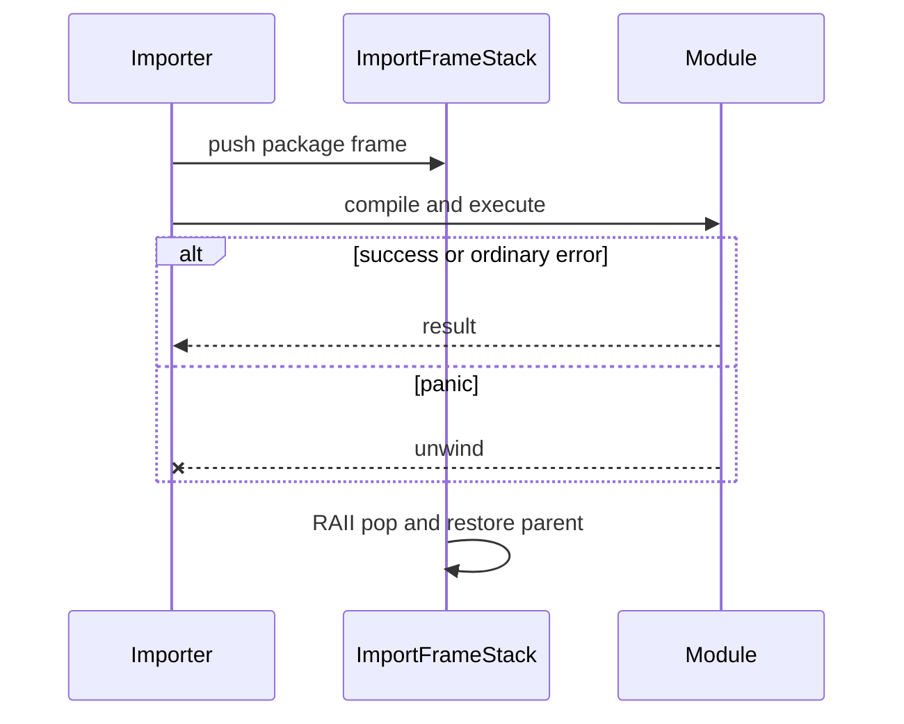
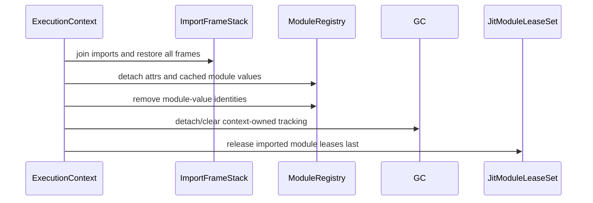

# Module and import aggregate state topology

Issue: #2980
Parent inventory: #2968
Source revision: `892980b82f`

This Stage 1 DDD slice classifies the module graph, import search policy,
current import frame, module-value identity index, and imported JIT leases.

## Aggregate boundary

```text
ExecutionContext
└── ImportState
    ├── ModuleRegistry
    │   ├── modules[name] -> MbModule
    │   └── module_value_identities
    ├── ImportSearchPolicy
    │   ├── script_dir
    │   └── search_paths
    ├── ImportFrameStack
    │   └── current_package
    └── JitModuleLeaseSet
        └── imported module backends
```

All four owners are context-owned. OS-thread TLS is the current storage
mechanism, not the lifetime boundary.

## Frozen inventory

The six newline-terminated, byte-sorted admitted identities have SHA-256
`5407bf9e0438d08237c4908067a6d3c491215f7d52a433bc708d0da93717176a`.

| Symbol | Current role | Destination |
|---|---|---|
| `MODULES` | module graph and cached module values | `ModuleRegistry.modules` |
| `MODULE_VALUE_PTRS` | raw-address module-dict identity index | `ModuleRegistry.module_value_identities` |
| `SEARCH_PATHS` | configured import paths | `ImportSearchPolicy.search_paths` |
| `SCRIPT_DIR` | entry-script search root | `ImportSearchPolicy.script_dir` |
| `CURRENT_MODULE_PACKAGE` | dynamic relative-import anchor | `ImportFrameStack.current_package` |
| `MODULE_JIT_BACKENDS` | imported-module backend lifetime holders | `JitModuleLeaseSet` |

The exact `runtime/module.rs` denominator is 15 TLS declarations. The other
nine are callable-dispatch metadata and remain a separate owner:
`NATIVE_FUNC_ADDRS`, `NATIVE_TYPE_NAMES`, `NATIVE_TYPE_NAME_COLLISIONS`,
the variadic symbol/address pair, kwargs symbol/address pair, and boxed-return
symbol/address pair.

## Module registry ownership

`MODULES` maps a module name to Rust-owned names/paths plus `MbValue` attrs and
an optional cached module dictionary. Those values have mixed runtime
ownership. Current cleanup replaces the map with an empty map using
`mem::take`, then intentionally `mem::forget`s the old map. It is not normal
Rust drop and does not release the old Python values.

`MODULE_VALUE_PTRS` records raw dictionary addresses when module objects are
materialized. `is_module_value` later uses membership as a type marker. Current
source has insert and read paths but no clear, removal, or cleanup path. A
freed address reused by a later ordinary dict can therefore match stale module
identity.

The target identity index must be coupled to the lifetime of the module value:

- insertion occurs only after the context owns a live module dictionary;
- removal occurs before or with final release of that dictionary;
- context retirement empties the index;
- address reuse after retirement cannot inherit module identity;
- cleanup is idempotent and affects one context only.

## Import search policy

The current lookup layers are script directory, published `sys.path`, then the
Rust `SEARCH_PATHS` vector. Add/insert operations update both the Rust vector
and an already-registered `sys.path` list.

Current cleanup resets only the Rust vector to `"."` and detaches the module
registry. It does not mutate a previously published `sys.path` list. The target
uses one `ImportSearchPolicy` as the source of truth and projects `sys.path`
from it; two mutable stores must not drift independently.

`SCRIPT_DIR` is part of the same policy because it changes lookup precedence
for one program. It resets to `None` at context retirement.

## Nested import frame

`CURRENT_MODULE_PACKAGE` is manually saved, overwritten, and restored around
file-module execution. Closure-local `ok()?` failures return to the outer
restore path, but a panic from JIT execution unwinds past the manual restore.

The target is a restoring stack:



Every nested import receives an `ImportFrame`; dropping its guard restores the
parent on success, error, timeout, and panic. Cleanup may empty the whole stack
only during owning-context retirement.

## JIT module lease

`MODULE_JIT_BACKENDS` is currently a vector of boxed backends, despite a stale
comment describing a name-keyed map. A successful file import pushes its
backend so published function addresses remain callable.

Central cleanup currently:

1. detaches/forgets module state;
2. clears other registries and GC tracking;
3. clears imported backend handles last.

Clearing the vector drops backend handles, but `CraneliftJitBackend::drop`
intentionally does not reclaim Cranelift executable pages and does not free
the pointees behind compile-time raw pointers. Handle retirement, address
detachment, object ownership, and executable-page reclamation are separate
concepts.

The target `JitModuleLeaseSet` is keyed by stable `ModuleId`, not vector
position. Its lease outlives module attrs, cached module dictionaries,
introspection metadata, and every active callable invocation.

## Retirement sequence



## Invariants

1. Two contexts have independent module names, search paths, script dirs,
   current packages, module identities, and JIT leases.
2. Module-value identity cannot survive the value or its context.
3. Retirement clears the identity index even after partial setup or failure.
4. `sys.path` is a projection of one context-owned search policy, not a second
   independently reset store.
5. Nested imports restore their parent frame through RAII on every exit.
6. Partially initialized modules remain local to their context.
7. A callable address is published only under a live module lease.
8. Module attrs, cached values, and address metadata detach before lease
   release.
9. Dropping a backend handle is not claimed as executable-page reclamation.
10. Context cleanup never relies on `mem::forget` as the target ownership
    model.

## Current risks

- `MODULE_VALUE_PTRS` accumulates stale raw addresses across resets.
- `MODULES` cleanup leaks the entire prior map to avoid unresolved mixed
  ownership.
- `CURRENT_MODULE_PACKAGE` remains corrupted after panic.
- Rust search paths and the published `sys.path` list can diverge at reset.
- A vector of unnamed backend leases cannot prove which module/address each
  lease protects.
- Broad runtime cleanup is ambient and can erase another execution's import
  state.

## Dependency and source order

1. Finish #2968, including the callable-dispatch owner.
2. Implement #2839 context shell and restoring context binding.
3. Add context-owned `ImportState` and `ImportFrameStack` types without moving
   the full registry.
4. Migrate search policy/current frames, then module registry and identity
   index, each with two-context isolation and panic restoration tests.
5. Couple module publication to typed `ModuleId` JIT leases.
6. Remove ambient module cleanup only after every producer/consumer resolves
   through the current context.

Forbidden fixes include clearing another context's TLS, retaining
`MODULE_VALUE_PTRS` as a never-cleared process set, replacing `MODULES` with a
new global singleton, keeping manual current-package restoration, treating
`mem::forget` as valid target teardown, or dropping a JIT lease before address
detachment.

## Verification surface

- Inventory: 6 admitted plus 9 discarded.
- Digest:
  `5407bf9e0438d08237c4908067a6d3c491215f7d52a433bc708d0da93717176a`.
- Two-context duplicate-module-name and divergent-search-path canary.
- Address-reuse negative control for retired module dictionaries.
- Nested import success/error/panic restoration.
- `sys.path` projection/reset consistency.
- Partially initialized module cleanup.
- Callable-address lifetime test keyed to `ModuleId`.
- Snapshot rule: #2980 permits no AGY repository writes and no controller
  `projects/mamba/src/**` changes.
