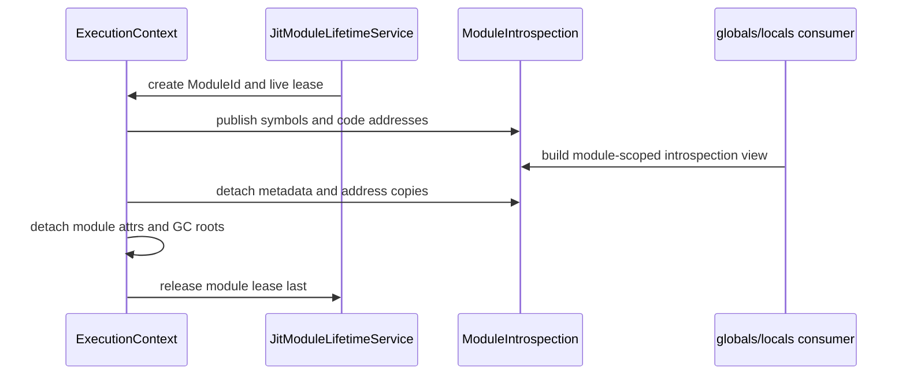

# Module introspection registry state topology

Issue: #2978
Parent inventory: #2968
Source revision: `5a55328d7a`

This Stage 1 DDD slice classifies the symbol/type and callable-address metadata
used to build `globals()` and `locals()`. The registries are context-owned
metadata, while executable memory has a separate lifetime owner.

## Aggregate boundary

```text
ExecutionContext
└── RuntimeRegistrySet
    └── module_introspection[ModuleId]
        ├── symbols[SymbolId] -> (name, SymTy)
        └── functions[name] -> CodeAddress

JitModuleLifetimeService
└── module_lease[ModuleId] -> executable backend
```

The metadata registry depends on a live `JitModuleLease`; it does not own or
retain executable memory by storing an address.

## Frozen inventory

The admitted set contains exactly two newline-terminated, byte-sorted
identities. Its SHA-256 is
`9f50198199943a2e7be6b952088569d65df09419d70155181554877f9e150209`.

| Current symbol | Stored value | DDD destination |
|---|---|---|
| `MODULE_FUNC_INFO` | name to `TAG_FUNC` code-address `MbValue` | `ModuleIntrospection.functions` |
| `MODULE_SYM_INFO` | raw SymbolId to Rust `(String, SymTy)` | `ModuleIntrospection.symbols` |

Raw SymbolIds are compilation-local. The current TLS maps represent only the
currently installed module view; the future registry keys complete records by
`ModuleId` rather than replacing ambient current-module maps.

## Value and lifetime boundaries

### Symbol metadata

`MODULE_SYM_INFO` is ordinary Rust-owned metadata:

- map keys and `SymTy` values are copied primitives;
- symbol names own Rust `String` allocations;
- clone duplicates strings;
- replacement, clear, and drop release Rust allocations normally;
- no Python refcount or executable-memory ownership is involved.

### Callable metadata

`MODULE_FUNC_INFO` contains code addresses:

- `MbValue::from_func` uses `TAG_FUNC`;
- `MbValue::is_ptr()` recognizes only `TAG_PTR`;
- runtime retain/release helpers therefore do not refcount `TAG_FUNC`;
- map clone and dictionary publication copy the 64-bit tagged address;
- copying or storing that address does not keep JIT code alive.

The registry is an index into executable memory owned elsewhere. A code address
is valid only while its matching JIT module lease is live.

## Current save, restore, and cleanup

- Both setters replace the complete current TLS map.
- Save-and-clear clones both maps, then clears the originals.
- Symbol-map clone owns independent Rust strings.
- Function-map clone copies code-address bits without acquiring a lifetime
  lease.
- Restore moves the saved maps into TLS and drops any current maps.
- Broad closure cleanup clears both metadata maps.

Driver `run`/`run_source` executes the JIT entry, calls
`cleanup_all_runtime_state()`, and thereby clears introspection metadata before
the local backend drops when the driver function exits.

Imported modules move their backends into `MODULE_JIT_BACKENDS`. Central
runtime cleanup first clears closure metadata and module attrs, then clears GC
state, and only in the final phase drops module JIT backends. That order is the
current executable-lifetime proof.

## Invariants

1. Every introspection record belongs to one `ExecutionContext` and one
   `ModuleId`.
2. Raw `SymbolId` is resolved only inside its module record.
3. Function names and symbol names from different modules cannot collide
   through ambient replacement.
4. A callable address is publishable only while a matching
   `JitModuleLease` is live.
5. The lease outlives every metadata map, globals dictionary, module attr, or
   other reachable code-address copy.
6. Clearing metadata does not attempt Python refcount operations on
   `TAG_FUNC`.
7. Dropping executable memory requires prior detachment of every reachable
   code-address value.
8. Save/restore of a current module view moves a typed module binding or lease;
   it does not clone bare code addresses as lifetime ownership.
9. Context retirement clears introspection/module attrs and performs required
   GC detachment before releasing JIT module leases.
10. Driver-local and imported-module execution use the same ordering contract
    even if their concrete lease storage differs.
11. Metadata readers resolve through the current context binding; OS-thread
    TLS is not the owner.

## Current-state risks

- Bare `TAG_FUNC` copies can outlive executable memory if cleanup ordering or
  an alternate producer path diverges.
- Ambient TLS replacement represents only one current module and relies on
  manual save/restore.
- Function names are unqualified within the current map.
- A new producer can populate `MODULE_FUNC_INFO` without registering a backend
  lifetime owner because the type system does not couple them.
- Broad cleanup does not assert that all published code-address copies have
  been detached.

## Lifecycle



## Dependency and source order

1. Finish the remaining #2968 Stage 1 inventory beyond `runtime/closure.rs`.
2. Implement #2839 Stage 2 aggregate shell and scoped restoring binding.
3. Establish Stage 3 output/exception isolation.
4. Introduce a typed module identity and JIT module lease boundary.
5. Migrate introspection records as one bounded Stage 4 owner ticket.
6. Verify driver-local and imported-module teardown ordering with stale-address
   negative controls.

Forbidden changes include treating `TAG_FUNC` as Python-refcounted ownership,
copying code addresses as a JIT lease, dropping backends before detaching
metadata, sharing one ambient module map across contexts, adding a broad lock,
or migrating before #2839.

## Verification surface

- Inventory count: 2.
- Inventory digest:
  `9f50198199943a2e7be6b952088569d65df09419d70155181554877f9e150209`.
- Exact declaration denominator: 24 static/TLS candidates in
  `runtime/closure.rs`, 2 admitted and 22 discarded.
- Producer evidence:
  `driver/mod.rs`, `runtime/module.rs`, and `conformance/**`.
- Consumer evidence:
  `runtime/closure.rs::build_globals_dict` and globals/locals builtins.
- Lifetime evidence:
  `runtime/value.rs`, `runtime/dict_ops.rs`,
  `runtime/mod.rs::cleanup_all_runtime_state`, and
  `runtime/module.rs::MODULE_JIT_BACKENDS`.
- Snapshot rule: #2978 permits no repository changes from AGY and no
  `projects/mamba/src/**` changes from the controller.
