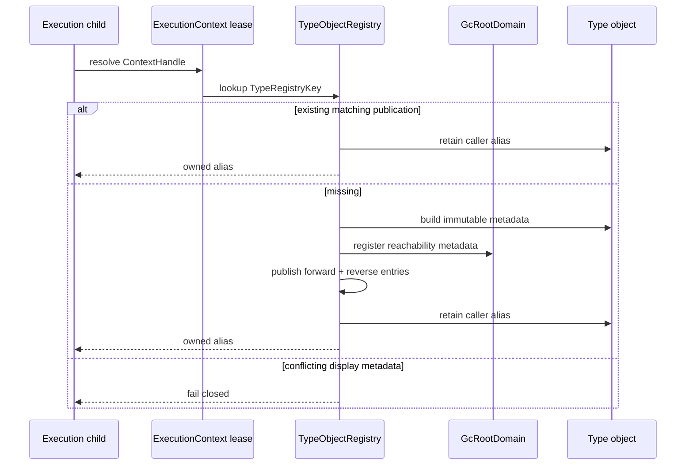
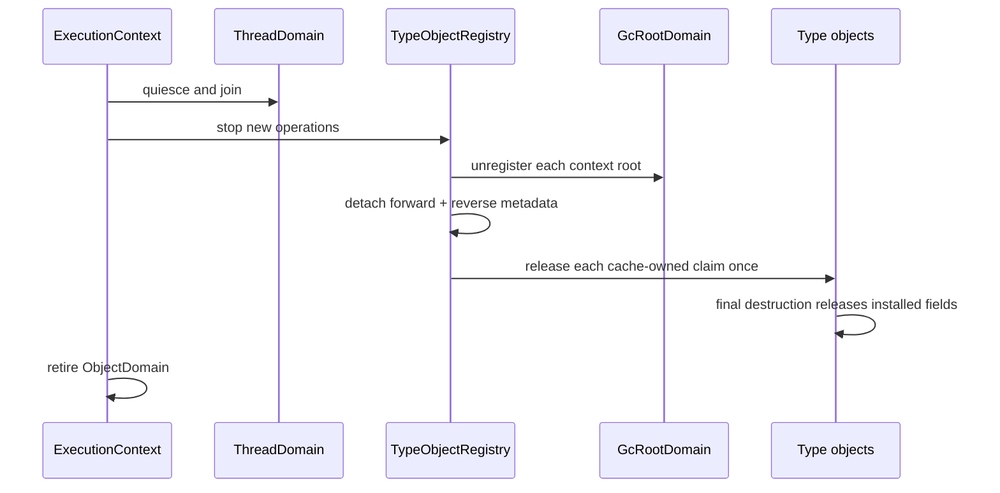

# Type-object registry topology

Issue: #3009
Parent inventory: #2968
Source revision: `e58558dded`

This Stage 1 slice classifies the process-global bidirectional registry that
materializes Python type objects. The current map shares mutable heap objects
across all executions and survives runtime cleanup. The target makes identity,
attributes, roots, and retirement part of one execution context while
preserving pointer identity across that context's worker children. No
`src/**` change occurs in this slice.

## Bounded context

```text
ExecutionContext
├── ObjectDomain
│   ├── TypeObjectRegistry
│   │   ├── by_key[TypeRegistryKey] -> OwnedTypeObject
│   │   └── by_object[ObjectId] -> TypeRegistryKey
│   └── GcRootDomain
│       └── TypeObjectRoot[ObjectId]
└── ThreadDomain
    └── children share ObjectDomain

OS-thread compatibility binding
└── ContextHandle
```

`TypeObjectRegistry` is context-owned. It defines the identity boundary for
builtin and user type objects created during one execution context.

Workers attached to the same context resolve the same type object for one
`TypeRegistryKey`. A second context owns a different registry, object identity,
attribute table, root set, and retirement lifecycle even when it uses the same
key string.

## Aggregate and values

| Type | Kind | Identity / value |
|---|---|---|
| `TypeObjectRegistry` | context-owned aggregate | one registry per context |
| `TypeRegistryKey` | value | opaque runtime type identity, not display text |
| `ObjectId` | value | typed object-domain identity, bounded by object lifetime |
| `OwnedTypeObject` | owned value | exactly one registry RC claim |
| `TypeDisplayName` | immutable publication value | Python-visible name |
| `TypeObjectRoot` | GC reachability metadata | no independent RC claim |
| returned `MbValue` | caller-owned alias | one explicit retain |

Registry key and display name are separate values. The forward and reverse maps
form one aggregate invariant; raw `MbValue::to_bits()` is not authority outside
the owning context and object lifetime.

## Frozen inventory

The one production state identity is:

`projects/mamba/src/runtime/builtins/type_objects.rs::TYPE_OBJECT_STATE`

There are zero test-only state identities. The sorted newline-terminated
identity SHA-256 is
`d97cff8c838ca48a6ee1d99d44e7d87f67d196821d6a816d9734c53d067fc954`.

The selector emits 23 distinct physical rows and 24 symbol occurrences:

| Family | Occurrences |
|---|---:|
| `TYPE_OBJECT_STATE` | 4 |
| `TypeObjectState` | 3 |
| `make_type_object_with_display_name` | 4 |
| `type_object_registry_key` | 2 |
| `set_type_object_string_field` | 3 |
| `set_type_object_attr` | 1 |
| `gc_add_root` | 1 |
| `retain_if_ptr` | 4 |
| `release_if_ptr` | 2 |

The four `TYPE_OBJECT_STATE` occurrences are at lines 133, 151, 163, and 272
of the frozen source. Line 133 also contains one `TypeObjectState`; line 134
contains one `TypeObjectState` but no `TYPE_OBJECT_STATE`.

## Current state and lock paths

`TypeObjectState` contains:

```rust
cache: FxHashMap<String, MbValue>
registry_keys: FxHashMap<u64, String>
```

Both maps are behind one process-global `parking_lot::RwLock`.

| Path | Registry guard | Nested/next work |
|---|---|---|
| fast cache hit | read guard remains live | optional object-field write, then caller retain |
| write recheck hit | write guard remains live | optional object-field write, then caller retain |
| first publication miss | write guard remains live | allocate fields/object, append TLS root, insert both maps, caller retain |
| reverse-map hit/cache scan | read guard remains live | clone Rust key and return |
| reverse miss display fallback | read guard explicitly dropped | inspect object field under its read lock |
| `set_type_object_attr` | make helper finishes first | object-field write, value retain, old-value release |

Current cache-hit display updates acquire an object field write lock while a
registry read or write guard is still live. The locks prevent simultaneous
memory mutation, but two different display names for one registry key remain
semantically last-writer-wins.

The target does not call this lock-free. Object fields still require their
object lock; registry-guard-free means only that no registry guard remains live
when a field is read, mutated, replaced, released, or deallocated.

## Current ownership ledger

### First publication

1. `__name__`, `__module__`, and `__doc__` are newly allocated strings with
   RC=1.
2. Each initial string claim transfers into the new object's field map. Plain
   Rust map insertion does not retain it.
3. The type object is constructed with RC=1.
4. That initial object claim transfers into `cache`. Plain
   `FxHashMap<String, MbValue>` insertion does not retain it.
5. `gc_add_root(val)` appends value bits to the creator OS thread's TLS GC
   roots. It performs no RC increment.
6. `registry_keys` stores raw bits and Rust strings only; it owns no Python RC
   claim.
7. The return path retains the type object once for the caller.

The cache claim and root metadata are distinct. Removing a root does not
release the cache claim.

### Cache hit and returned aliases

Fast and write-recheck hits call `retain_if_ptr(val)` exactly once before
return. The registry continues to own its original claim; the caller owns a
separate alias and must release it normally.

### Display-name replacement

`set_type_object_string_field` creates a new string with RC=1 and transfers
that claim into `fields`. Insertion returns the old installed value, which is
released once.

Current code permits this replacement while a registry guard is live. The
target instead freezes the `(TypeRegistryKey, TypeDisplayName)` publication
pair. A later conflicting name is an invariant violation handled fail-closed,
not a concurrent rename.

### Attribute replacement and leak

`set_type_object_attr`:

1. calls `make_type_object`, acquiring one retained temporary type-object
   alias;
2. retains the incoming attribute for field ownership;
3. inserts it under the object field lock;
4. releases the replaced field value, if any;
5. returns without releasing the temporary type-object alias.

The current helper therefore leaks exactly one type-object RC claim per call.
The target releases that temporary alias on success and every early/error path.

## Current identity lookup

`type_object_registry_key` first clones a key from `registry_keys`, then scans
`cache` as a redundant reverse lookup. If neither finds the value, it drops the
registry read guard and reads `__name__` from any object whose class name is
`"type"`.

That fallback conflates display text with registered identity. In the target:

- registry identity lookup returns only a registered `TypeRegistryKey`;
- display lookup remains `type_object_display_name`;
- an unregistered type-like object cannot authorize class/type identity merely
  through `__name__`.

## Current lifecycle

| Boundary | Current result |
|---|---|
| second worker in same process | reads the same process cache and pointer |
| unrelated execution/context | also reads the same cache and mutable fields |
| `cleanup_all_runtime_state` | does not drain `TYPE_OBJECT_STATE` |
| `gc_clear_all_state` | clears only current-thread GC metadata; no RC release |
| next run | cached objects and mutated attributes remain visible |
| creator OS-thread exit | drops its TLS roots; process cache claim remains |
| process exit | address-space reclamation ends state without explicit Python ownership drain |

Rust process statics are not assumed to run a destructor at exit. There is no
observed path that releases the cache claim, unregisters every root from its
owning domain, or cascades field retirement.

The current cross-thread test proves only that one process-global pointer is
visible after manual class-state transfer. The target redefines the proof:
children of one installed context share identity, while independent contexts
must not.

## Target publication



Publication must avoid duplicate objects without holding a registry guard
across object-field mutation, callbacks, or releases. A reservation/entry
protocol may coordinate first creation, but its exact implementation is
deferred to the source ticket.

## Target retirement



Root unregistration changes reachability metadata and performs no RC
decrement. The cache-owned claim is released separately and exactly once.
Releases occur with no registry guard live so object destruction cannot
reenter a locked aggregate.

## Target invariants

1. Type-object registry ownership is context-local.
2. TLS stores only the scoped `ContextHandle`.
3. One key maps to at most one live type object within one context.
4. One registered object maps back to exactly one typed registry key.
5. Raw object bits never authorize identity outside object/context lifetime.
6. Children of one context share type-object identity and mutable fields.
7. Separate contexts isolate pointers, attributes, roots, and retirement.
8. Registry key and display name remain distinct values.
9. Publication freezes display metadata; conflicting republish fails closed.
10. Reverse identity lookup returns registered keys only.
11. The registry owns exactly one RC claim per cached type object.
12. Each returned alias owns one additional retain.
13. Each installed field owns exactly one value claim.
14. Field replacement retains/transfers the new value and releases the old
    value exactly once.
15. `set_type_object_attr` releases its temporary type-object alias on every
    path.
16. Root registration/unregistration changes no RC count.
17. Object-field access retains its object lock but has no registry guard live.
18. No callback, release, deallocation, or context teardown runs under a
    registry guard.
19. Context retirement waits for child quiescence.
20. Retirement unregisters roots before releasing cache ownership.
21. Forward/reverse metadata detaches before cached object release.
22. Cache release occurs exactly once; final object destruction retires
    installed fields.
23. Retiring one context cannot change another context's registry or objects.
24. Runtime cleanup cannot leave a new context observing a prior context's
    mutable type-object fields.

## Source implementation slice

Prerequisites:

1. finish and close Stage 1 parent #2968;
2. land Stage 2 context shell #2839;
3. establish Stage 3 output/exception context isolation;
4. then dispatch the bounded type-object registry migration.

Exact planned paths:

- `projects/mamba/src/runtime/execution_context.rs`
  - supply `ObjectDomain`, context operation lease, and typed registry owner.
- `projects/mamba/src/runtime/builtins/type_objects.rs`
  - replace `TYPE_OBJECT_STATE`, split identity/display lookup, balance aliases,
    and add publication/retirement operations.
- `projects/mamba/src/runtime/gc.rs`
  - move type roots into the context GC domain and expose root unregister
    without RC side effects.
- `projects/mamba/src/runtime/mod.rs`
  - order quiescent context retirement and remove ambient cleanup dependence.

Forbidden changes:

- retaining a renamed process-global type-object singleton;
- moving the registry or roots into execution-child/TLS state;
- sharing type objects between independent contexts;
- using raw pointer bits as cross-context identity authority;
- treating display text as a registered identity key;
- silently mutating display metadata after publication;
- holding a registry guard across object-field locking, callbacks, releases, or
  deallocation;
- calling field mutation lock-free when the object lock remains required;
- calling root clearing a Python RC drain;
- releasing cache claims before root unregistration or child quiescence;
- dropping Rust `MbValue` bits without the explicit Python release;
- retaining the temporary alias leak in `set_type_object_attr`;
- claiming process-exit address-space reclamation is normal owner retirement.

## Verification gates

- Exact-set gate: one identity, zero test-only identities, 23 rows, and
  `4/3/4/2/3/1/1/4/2` occurrence subtotals reconcile.
- Same-context gate: two child workers under one installed context obtain the
  same type object pointer.
- Cross-context gate: two concurrent contexts obtain distinct pointers and
  attribute tables for the same key.
- Independent-retirement gate: retiring context A cannot change context B's
  live singleton, attributes, root, or lookup.
- Publication gate: barrier-controlled same-key first use produces one object
  within a context.
- Display-conflict gate: different names for one published key fail closed
  without field mutation.
- Identity gate: unregistered type-like display text cannot act as a registry
  key.
- Alias gate: repeated attribute updates leave the type-object RC unchanged
  after temporary calls return.
- Field gate: replacement and final destruction balance every installed value.
- Root gate: register/unregister changes reachability metadata without an RC
  delta.
- Lock-order gate: no registry guard is live during field mutation, callback,
  release, or final destruction.
- Quiescence gate: retirement refuses/fails closed while a child operation can
  still access the registry.
- AGY's measure-only run executed none of these planned gates.

## Dependency and dispatcher result

- #3009 is a Stage 1 classification slice under #2968.
- It produces a later Stage 4 source migration after #2839 and Stage 3.
- AGY's first report misstated one row's token multiplicity, omitted initial
  field/root retirement details, assumed static destruction at process exit,
  and omitted complete invariants/forbidden changes.
- Its first revision corrected the summary but left stale row labels in the
  appendix and collapsed write-recheck hit with first publication.
- The final report reconciled all rows, four lock paths, ownership/lifecycle
  matrices, and concurrent isolation tests.
- Snapshot/protected-artifact verification passed throughout.
- This required two revisions and is not a one-pass ramp sample.
