## Logic

```mermaid
---
id: mamba-weakref-callback-retain-and-icf-guard-fix
entry: discovery
nodes:
  discovery: { kind: start, label: "#1985 investigation (2026-07-19) audits weakref_mod.rs and confirms two latent defects, neither the cause of #1985's own crash (#1989)" }
  sibling_compare: { kind: process, label: "dispatch_ref (weakref_mod.rs:728-729) begins with crate::icf_guard!(); its sibling dispatch_proxy (weakref_mod.rs:737) has no such call" }
  icf_risk: { kind: process, label: "Without the guard, dispatch_proxy's compiled body can become byte-for-byte identical to another zero-arg-forwarding trampoline after optimization; identical-code-folding (ICF) is then free to merge the two symbols, corrupting type-name-keyed dispatch that depends on dispatch_proxy keeping its own distinct function-pointer identity" }
  icf_fix: { kind: process, label: "FIX: add crate::icf_guard!(); as dispatch_proxy's first statement, mirroring dispatch_ref exactly (weakref_mod.rs:737)" }
  ownership_contract: { kind: decision, label: "mb_weakref_ref/mb_weakref_proxy's fields map follows the file's borrow-in / retain-per-extra-slot contract, same family as #1978/#1979: ONE incoming callback MbValue reference is transferred in by the caller; every ADDITIONAL map slot that stores that SAME pointer needs its own retain_if_ptr, because rc.rs::release_contained_values walks every ObjData::Instance field and calls release_if_ptr on each value independently when the instance is torn down" }
  ref_double_store: { kind: process, label: "mb_weakref_ref (weakref_mod.rs:1362-1365) inserts the SAME callback MbValue under two keys, __callback__ then _callback, with no retain between them" }
  proxy_double_store: { kind: process, label: "mb_weakref_proxy's wrapper-creation branch (weakref_mod.rs:1435-1436) repeats the identical two-key insert with no retain between them" }
  masked_today: { kind: process, label: "Every existing fixture passes callback=None, an immortal/no-op MbValue for retain_if_ptr/release_if_ptr, so the missing retain is currently invisible: two owning map slots, one retained reference, but retain/release are both no-ops on None" }
  bug: { kind: terminal, label: "BUG: the first REAL (heap-allocated) callback passed to weakref.ref or weakref.proxy ends up with two owning slots (__callback__ and _callback) backed by only one retained unit; when the ReferenceType/ProxyType instance is torn down, release_contained_values calls release_if_ptr on BOTH slots -- one release too many -- double release / use-after-free on the callback object (#1989)" }
  fix_retain: { kind: process, label: "FIX: insert unsafe { super::super::rc::retain_if_ptr(callback); } between the two fields.insert calls in BOTH mb_weakref_ref and mb_weakref_proxy, mirroring the file's existing retain_if_ptr(existing) convention already at weakref_mod.rs:1341" }
  fix_verified: { kind: terminal, label: "Rust unit tests assert the callback's rc is exactly 2 immediately after either constructor call (one per stored slot) and exactly back to the caller's original 1 after the produced instance is fully released -- no under- or over-release." }
edges:
  - { from: discovery, to: sibling_compare }
  - { from: sibling_compare, to: icf_risk }
  - { from: icf_risk, to: icf_fix }
  - { from: discovery, to: ownership_contract }
  - { from: ownership_contract, to: ref_double_store, label: "weakref.ref path" }
  - { from: ownership_contract, to: proxy_double_store, label: "weakref.proxy path" }
  - { from: ref_double_store, to: masked_today }
  - { from: proxy_double_store, to: masked_today }
  - { from: masked_today, to: bug }
  - { from: bug, to: fix_retain }
  - { from: fix_retain, to: fix_verified }
  - { from: icf_fix, to: fix_verified, label: "joins the same verification pass" }
---
flowchart TD
    A["#1985 investigation (2026-07-19) audits weakref_mod.rs\nand confirms two latent defects, neither the cause\nof #1985's own crash (#1989)"] --> B["dispatch_ref (weakref_mod.rs:728-729) begins with\ncrate::icf_guard!(); sibling dispatch_proxy\n(weakref_mod.rs:737) has no such call"]
    B --> C["Without the guard, dispatch_proxy's compiled body can\nbecome byte-identical to another zero-arg trampoline;\nidentical-code-folding (ICF) can then merge the two\nsymbols, corrupting type-name-keyed dispatch"]
    C --> D["FIX: add crate::icf_guard!(); as dispatch_proxy's\nfirst statement, mirroring dispatch_ref (weakref_mod.rs:737)"]
    A --> E{"mb_weakref_ref / mb_weakref_proxy fields-map contract\n(same family as #1978/#1979): ONE incoming callback ref\nin, every EXTRA map slot storing it needs its own retain,\nbecause release_contained_values releases every field\nindependently on teardown (rc.rs)"}
    E -- "weakref.ref" --> F["mb_weakref_ref (weakref_mod.rs:1362-1365) inserts the\nSAME callback under two keys, __callback__ then _callback,\nwith NO retain between them"]
    E -- "weakref.proxy" --> G["mb_weakref_proxy's wrapper branch (weakref_mod.rs:1435-1436)\nrepeats the identical two-key insert with no retain between them"]
    F --> H["Every existing fixture passes callback=None (immortal,\nretain/release are no-ops), so the missing retain is\ncurrently invisible: two owning slots, one retained ref"]
    G --> H
    H --> I["BUG: the first REAL heap-allocated callback ends up with\ntwo owning slots backed by only one retained unit; tearing\ndown the ReferenceType/ProxyType instance calls\nrelease_if_ptr on BOTH slots -- one release too many --\ndouble release / use-after-free on the callback (#1989)"]
    I --> J["FIX: insert unsafe { super::super::rc::retain_if_ptr(callback); }\nbetween the two fields.insert calls in BOTH mb_weakref_ref\nand mb_weakref_proxy, mirroring the existing\nretain_if_ptr(existing) convention at weakref_mod.rs:1341"]
    D --> K["Rust unit tests assert callback rc == 2 right after\nconstruction (one per stored slot) and rc == 1 again\n(caller's original unit) after the produced instance is\nfully released"]
    J --> K
```

<!-- type: logic lang: mermaid -->


## Changes
<!-- type: changes lang: yaml -->

```yaml
changes:
  - path: projects/mamba/src/runtime/stdlib/weakref_mod.rs
    action: modify
    section: logic
    impl_mode: hand-written
    anchor: register
  - path: projects/mamba/src/runtime/stdlib/weakref_mod.rs
    action: modify
    section: logic
    impl_mode: hand-written
    anchor: mb_weakref_ref
  - path: projects/mamba/src/runtime/stdlib/weakref_mod.rs
    action: modify
    section: logic
    impl_mode: hand-written
    anchor: mb_weakref_proxy
```
## Unit Test

```mermaid
---
id: mamba-weakref-callback-retain-and-icf-guard-fix-verification
requirements:
  icf_guard_parity:
    id: R1
    text: "dispatch_proxy calls crate::icf_guard!() as its first statement, matching dispatch_ref, so the two extern \"C\" trampolines cannot be identical-code-folded into one symbol."
    kind: regression
    risk: medium
    verify: cargo test -p mamba --release weakref_mod::tests::test_dispatch_proxy_invokes_icf_guard_and_matches_direct_call
  proxy_double_store_retain:
    id: R3
    text: "mb_weakref_proxy's wrapper-creation branch retains callback once between the __callback__ and _callback field inserts, so a ProxyType/CallableProxyType instance holding a real heap-allocated callback has rc==2 right after construction and rc==1 again after the instance is fully released (no double-release/use-after-free)."
    kind: regression
    risk: high
    verify: cargo test -p mamba --release weakref_mod::tests::test_proxy_real_callback_retained_for_each_stored_slot
  ref_double_store_retain:
    id: R2
    text: "mb_weakref_ref retains callback once between the __callback__ and _callback field inserts, so a ReferenceType instance holding a real heap-allocated callback has rc==2 right after construction and rc==1 again after the instance is fully released (no double-release/use-after-free)."
    kind: regression
    risk: high
    verify: cargo test -p mamba --release weakref_mod::tests::test_ref_real_callback_retained_for_each_stored_slot
---
flowchart TD
    r1[R1 icf guard parity] --> cargo_test_p_mamba_release_weakref_mod_tests_test_dispatch_proxy_invokes_icf_guard_and_matches_direct_call[cargo test -p mamba --release weakref_mod::tests::test_dispatch_proxy_invokes_icf_guard_and_matches_direct_call]
    r2[R2 ref double store retain] --> cargo_test_p_mamba_release_weakref_mod_tests_test_ref_real_callback_retained_for_each_stored_slot[cargo test -p mamba --release weakref_mod::tests::test_ref_real_callback_retained_for_each_stored_slot]
    r3[R3 proxy double store retain] --> cargo_test_p_mamba_release_weakref_mod_tests_test_proxy_real_callback_retained_for_each_stored_slot[cargo test -p mamba --release weakref_mod::tests::test_proxy_real_callback_retained_for_each_stored_slot]
```

<!-- type: unit-test lang: mermaid -->


