## Logic

```mermaid
---
id: mamba-force-typed-contract-completion
entry: accepted_contract
nodes:
  accepted_contract: { kind: start, label: "Accepted EC + WI #2011 define the only valid completion shape: inference failure stays a compile-time wall, explicit Any is the only authored dynamic ingress, and proof is external plus fail-closed" }
  collect_sources: { kind: process, label: "Load authoritative source sets before any implementation proof: the 23-row t1_forcetyped_completeness legacy denominator, the 7 implicit_any_ingress fixtures, the 7 explicit_any_acceptance fixtures, compile_diagnostic_probes, positive_runtime_baseline, concurrency probes, and performance applicability inputs" }
  pair_fixtures: { kind: process, label: "Pair each ingress family (local/global/class binding, parameter, return, comprehension, expression_join) by pair_id plus paired_template_sha256; the explicit fixture may differ only by the authored Any token" }
  compiler_wall: { kind: decision, label: "Does the public Mamba compile surface reject every implicit ingress with stable binding identity, inference-path classification, source span, and diagnostic class instead of silently synthesizing Any?" }
  wall_fail: { kind: terminal, label: "FAIL: an implicit ingress still widens to Any, lacks stable diagnostics, or the 7-row negative matrix drifts" }
  explicit_path: { kind: process, label: "Route the 7 explicit-Any counterparts through the same public compile plus run path; compile succeeds only because the annotation is authored, and runtime behavior still matches the pinned CPython 3.12 oracle" }
  inventory_rollup: { kind: process, label: "Reconcile legacy_negative_input, implicit_any_ingress_matrix, explicit_any_acceptance_matrix, compile_diagnostic_probes, positive_runtime_baseline, concurrency_parallel_progress_probe, concurrency_barrier_stability_probe, and performance_applicability into one manifest-backed rollup inventory plus evidence locks" }
  exact_accounting: { kind: decision, label: "Does every authoritative source identity appear exactly once in the rollup and exactly one channel among compile, behavior, concurrency, and performance?" }
  inventory_fail: { kind: terminal, label: "FAIL: omission, duplication, stale carry-over, self-oracle rows, or a cases.jsonl file inventing its own denominator" }
  concurrency_gate: { kind: decision, label: "Do the public-path concurrency probes prove both no global serialization (parallel progress) and deadlock-free stability (barrier soak)?" }
  concurrency_fail: { kind: terminal, label: "FAIL: the fix repairs type walls by serializing work, weakens barrier stability, or leaves multicore evidence ambiguous" }
  perf_gate: { kind: decision, label: "Does the independent baseline_sha/current_sha diff classify this change as performance-applicable?" }
  perf_verify: { kind: process, label: "If applicable, run the named perf pin against one baseline row identity shared by committed JSONL plus imported SQLite evidence; otherwise record machine-verifiable non-applicability from the same anchored diff" }
  perf_fail: { kind: terminal, label: "FAIL: unanchored baseline provenance, missing graded perf trial, host drift, or unexplained CPU or RSS regression blocks completion" }
  ec_pass: { kind: terminal, label: "PASS: Force Typed completion is exact and fail-closed: implicit Any is gone, explicit Any remains intentional, channels are fully accounted, concurrency stays multicore, and perf status is provenance-bound" }
edges:
  - { from: accepted_contract, to: collect_sources }
  - { from: collect_sources, to: pair_fixtures }
  - { from: pair_fixtures, to: compiler_wall }
  - { from: compiler_wall, to: wall_fail, label: "no" }
  - { from: compiler_wall, to: explicit_path, label: "yes" }
  - { from: explicit_path, to: inventory_rollup }
  - { from: inventory_rollup, to: exact_accounting }
  - { from: exact_accounting, to: inventory_fail, label: "no" }
  - { from: exact_accounting, to: concurrency_gate, label: "yes" }
  - { from: concurrency_gate, to: concurrency_fail, label: "no" }
  - { from: concurrency_gate, to: perf_gate, label: "yes" }
  - { from: perf_gate, to: perf_verify, label: "yes" }
  - { from: perf_gate, to: ec_pass, label: "no, record non-applicable from anchored diff" }
  - { from: perf_verify, to: perf_fail, label: "graded evidence missing or red" }
  - { from: perf_verify, to: ec_pass, label: "graded evidence green" }
---
flowchart TD
    A["Accepted EC + WI #2011 define the only valid completion shape:\ninference failure stays a compile-time wall, explicit Any is the\nonly authored dynamic ingress, and proof is external plus fail-closed"] --> B["Load authoritative source sets before any implementation proof:\n23-row t1_forcetyped_completeness legacy denominator,\n7 implicit_any_ingress fixtures, 7 explicit_any_acceptance fixtures,\ncompile_diagnostic_probes, positive_runtime_baseline,\nconcurrency probes, and performance applicability inputs"]
    B --> C["Pair each ingress family by pair_id plus paired_template_sha256:\nlocal_binding, global_binding, class_attribute, parameter,\nreturn, comprehension, expression_join. The explicit fixture\nmay differ only by the authored Any token"]
    C --> D{"Does the public Mamba compile surface reject every implicit\ningress with stable binding identity, inference-path classification,\nsource span, and diagnostic class instead of silently synthesizing Any?"}
    D -- "no" --> E["FAIL: an implicit ingress still widens to Any, lacks stable\ndiagnostics, or the 7-row negative matrix drifts"]
    D -- "yes" --> F["Route the 7 explicit-Any counterparts through the same public\ncompile plus run path; compile succeeds only because the annotation\nis authored, and runtime behavior still matches the pinned\nCPython 3.12 oracle"]
    F --> G["Reconcile legacy_negative_input, implicit_any_ingress_matrix,\nexplicit_any_acceptance_matrix, compile_diagnostic_probes,\npositive_runtime_baseline, concurrency_parallel_progress_probe,\nconcurrency_barrier_stability_probe, and performance_applicability\ninto one manifest-backed rollup inventory plus evidence locks"]
    G --> H{"Does every authoritative source identity appear exactly once\nin the rollup and exactly one channel among compile, behavior,\nconcurrency, and performance?"}
    H -- "no" --> I["FAIL: omission, duplication, stale carry-over, self-oracle rows,\nor a cases.jsonl file inventing its own denominator"]
    H -- "yes" --> J{"Do the public-path concurrency probes prove both no global\nserialization (parallel progress) and deadlock-free stability\n(barrier soak)?"}
    J -- "no" --> K["FAIL: the fix repairs type walls by serializing work, weakens\nbarrier stability, or leaves multicore evidence ambiguous"]
    J -- "yes" --> L{"Does the independent baseline_sha/current_sha diff classify\nthis change as performance-applicable?"}
    L -- "no, record anchored non-applicability" --> M["PASS: Force Typed completion is exact and fail-closed:\nimplicit Any is gone, explicit Any remains intentional,\nchannels are fully accounted, concurrency stays multicore,\nand perf status is provenance-bound"]
    L -- "yes" --> N["Run the named perf pin against one baseline row identity\nshared by committed JSONL plus imported SQLite evidence;\notherwise fail if provenance, host, grading, or CPU/RSS\nreconciliation is incomplete"]
    N -- "graded evidence missing or red" --> O["FAIL: unanchored baseline provenance, missing graded perf trial,\nhost drift, or unexplained CPU or RSS regression blocks completion"]
    N -- "graded evidence green" --> M
```

<!-- type: logic lang: mermaid -->


## Changes
<!-- type: changes lang: yaml -->

```yaml
changes:
  - path: projects/mamba/src/lower/ast_to_hir.rs
    action: modify
    section: logic
    impl_mode: hand-written
    anchor: annotation_repr_opt
  - path: projects/mamba/src/types/check_expr.rs
    action: modify
    section: logic
    impl_mode: hand-written
    anchor: check_structured_stdlib_call
  - path: projects/mamba/tests/harness/cpython/tools/strict_type_accounting.py
    action: modify
    section: unit-test
    impl_mode: hand-written
  - path: projects/mamba/tests/governance/schema_gates/strict_type_accounting_gate_704.rs
    action: modify
    section: unit-test
    impl_mode: hand-written
    anchor: strict_type_accounting_requires_authoritative_contract_inventory
  - path: projects/mamba/tests/external_contracts/ec_mamba_t1_force_typed_contract_completion.rs
    action: modify
    section: unit-test
    impl_mode: hand-written
    anchor: mamba_t1_force_typed_contract_completion
  - path: projects/mamba/tests/governance/gates/t1_implicit_any_ingress_matrix/cases.jsonl
    action: create
    section: unit-test
    impl_mode: hand-written
  - path: projects/mamba/tests/governance/gates/t1_explicit_any_acceptance_matrix/cases.jsonl
    action: create
    section: unit-test
    impl_mode: hand-written
  - path: projects/mamba/tests/governance/gates/t1_forcetyped_contract_completion_inventory/cases.jsonl
    action: create
    section: unit-test
    impl_mode: hand-written
  - path: projects/mamba/tests/cpython/concurrency/primitives/threading/force_typed_contract_completion_parallel_compile_progress.py
    action: create
    section: unit-test
    impl_mode: hand-written
  - path: projects/mamba/tests/harness/cpython/config/perf/pins/force_typed_contract_completion_2011.toml
    action: create
    section: unit-test
    impl_mode: hand-written
```
## Unit Test
<!-- type: unit-test lang: mermaid -->

```mermaid
---
id: mamba-force-typed-contract-completion-verification
requirements:
  AC1:
    id: AC1
    text: "All seven implicit-Any ingress families compile-reject from the public Mamba surface with stable binding identity, inference-path classification, source span, and diagnostic class; no inference-failure path silently synthesizes Any."
    kind: functional
    risk: high
    verify: mamba_t1_force_typed_contract_completion (cargo test -p mamba --release --test mamba_core_semantics_ec -- force_typed_contract_completion --exact)
  AC2:
    id: AC2
    text: "The seven explicit-Any counterparts compile only because the authored Any annotation is present and still preserve the pinned CPython 3.12 runtime behavior."
    kind: functional
    risk: high
    verify: mamba_t1_force_typed_contract_completion (cargo test -p mamba --release --test mamba_core_semantics_ec -- force_typed_contract_completion --exact)
  AC3:
    id: AC3
    text: "The rollup inventory, both seven-row matrices, the 23-row legacy denominator reconciliation, pair_id or paired_template_sha256 metadata, and every evidence lock reconcile fail-closed with exact once-only accounting across compile, behavior, concurrency, and performance channels."
    kind: regression
    risk: high
    verify: mamba_t1_force_typed_contract_completion (cargo test -p mamba --release --test mamba_core_semantics_ec -- force_typed_contract_completion --exact)
  AC4:
    id: AC4
    text: "Thread-safety evidence proves the fix does not introduce a GIL or global serialization point: the parallel-progress probe shows multicore overlap and the barrier soak remains deadlock-free."
    kind: regression
    risk: high
    verify: force_typed_contract_completion_parallel_compile_progress.py plus barrier_rounds_complete_without_deadlock.py
  AC5:
    id: AC5
    text: "When changed-path classification marks the work performance-applicable, the named perf pin is graded against anchored baseline provenance; otherwise the verifier records a machine-verifiable non-applicable outcome from the same baseline_sha to current_sha diff."
    kind: performance
    risk: medium
    verify: run_pin::force_typed_contract_completion_2011.toml (MAMBA_REQUIRE_CPYTHON_PERF_BASELINE=1 cargo test -p mamba --release --test perf_pin -- run_pin::force_typed_contract_completion_2011.toml)
  AC6:
    id: AC6
    text: "Focused EC verification, the authoritative strict-type inventory schema gate, and the owning dynamic-ingress driver regressions stay green from one clean committed revision."
    kind: regression
    risk: high
    verify: strict_type_accounting_gate_704 plus strict_type_dynamic_ingress plus aw td code-check
  R1:
    id: R1
    text: "Lowering and signature capture preserve the distinction between an omitted annotation and an authored Any annotation so only explicit Any opens the dynamic ingress path."
    kind: functional
    risk: high
    verify: strict_type_dynamic_ingress (cargo test -p mamba strict_type_dynamic_ingress)
  R2:
    id: R2
    text: "The checker emits stable compile-time rejection evidence for local_binding, global_binding, class_attribute, parameter, return, comprehension, and expression_join implicit-Any ingress families, and each family pairs byte-for-byte with its explicit-Any twin except for the authored Any token."
    kind: functional
    risk: high
    verify: mamba_t1_force_typed_contract_completion (cargo test -p mamba --release --test mamba_core_semantics_ec -- force_typed_contract_completion --exact)
  R3:
    id: R3
    text: "The strict-type accounting tool and schema gate authoritatively emit the two seven-row matrices, the reconciled rollup inventory, and the required evidence locks without allowing cases.jsonl to invent its own denominator or hide stale rows."
    kind: regression
    risk: high
    verify: strict_type_accounting_gate_704 (cargo test -p mamba strict_type_accounting_gate_704)
  R4:
    id: R4
    text: "The no-global-serialization oracle proves one-worker versus four-worker parallel compile progress across the seven paired ingress families from the public path, and barrier stability cannot substitute for this proof."
    kind: regression
    risk: medium
    verify: python3.12 projects/mamba/tests/cpython/concurrency/primitives/threading/force_typed_contract_completion_parallel_compile_progress.py
  R5:
    id: R5
    text: "The barrier stability probe preserves its exact authored worker, round, timeout, and no-alive-thread thresholds across repeated execution, proving the fix does not trade type-wall correctness for deadlock risk."
    kind: regression
    risk: medium
    verify: python3.12 projects/mamba/tests/harness/cpython/tools/stress_suites.py concurrency --repeat 3 --timeout 20 --json
  R6:
    id: R6
    text: "The perf witness remains provenance-bound: baseline row identity, baseline_row_sha256, host fingerprint, CPython executable identity, and selected-trial CPU or RSS grading all agree before the WI can close."
    kind: performance
    risk: medium
    verify: run_pin::force_typed_contract_completion_2011.toml (MAMBA_REQUIRE_CPYTHON_PERF_BASELINE=1 cargo test -p mamba --release --test perf_pin -- run_pin::force_typed_contract_completion_2011.toml)
---
flowchart TD
    ac1[AC1 AC1] --> mamba_t1_force_typed_contract_completion_cargo_test_p_mamba_release_test_mamba_core_semantics_ec_force_typed_contract_completion_exact[mamba_t1_force_typed_contract_completion (cargo test -p mamba --release --test mamba_core_semantics_ec -- force_typed_contract_completion --exact)]
    ac2[AC2 AC2] --> mamba_t1_force_typed_contract_completion_cargo_test_p_mamba_release_test_mamba_core_semantics_ec_force_typed_contract_completion_exact
    r2[R2 R2] --> mamba_t1_force_typed_contract_completion_cargo_test_p_mamba_release_test_mamba_core_semantics_ec_force_typed_contract_completion_exact
    ac3[AC3 AC3] --> mamba_t1_force_typed_contract_completion_cargo_test_p_mamba_release_test_mamba_core_semantics_ec_force_typed_contract_completion_exact
    r1[R1 R1] --> strict_type_dynamic_ingress_cargo_test_p_mamba_strict_type_dynamic_ingress[strict_type_dynamic_ingress (cargo test -p mamba strict_type_dynamic_ingress)]
    r3[R3 R3] --> strict_type_accounting_gate_704_cargo_test_p_mamba_strict_type_accounting_gate_704[strict_type_accounting_gate_704 (cargo test -p mamba strict_type_accounting_gate_704)]
    ac4[AC4 AC4] --> force_typed_contract_completion_parallel_compile_progress_py_plus_barrier_rounds_complete_without_deadlock_py[force_typed_contract_completion_parallel_compile_progress.py plus barrier_rounds_complete_without_deadlock.py]
    r4[R4 R4] --> python3_12_projects_mamba_tests_cpython_concurrency_primitives_threading_force_typed_contract_completion_parallel_compile_progress_py[python3.12 projects/mamba/tests/cpython/concurrency/primitives/threading/force_typed_contract_completion_parallel_compile_progress.py]
    ac5[AC5 AC5] --> run_pin_force_typed_contract_completion_2011_toml_mamba_require_cpython_perf_baseline_1_cargo_test_p_mamba_release_test_perf_pin_run_pin_force_typed_contract_completion_2011_toml[run_pin::force_typed_contract_completion_2011.toml (MAMBA_REQUIRE_CPYTHON_PERF_BASELINE=1 cargo test -p mamba --release --test perf_pin -- run_pin::force_typed_contract_completion_2011.toml)]
    r6[R6 R6] --> run_pin_force_typed_contract_completion_2011_toml_mamba_require_cpython_perf_baseline_1_cargo_test_p_mamba_release_test_perf_pin_run_pin_force_typed_contract_completion_2011_toml
    r5[R5 R5] --> python3_12_projects_mamba_tests_harness_cpython_tools_stress_suites_py_concurrency_repeat_3_timeout_20_json[python3.12 projects/mamba/tests/harness/cpython/tools/stress_suites.py concurrency --repeat 3 --timeout 20 --json]
    ac6[AC6 AC6] --> strict_type_accounting_gate_704_plus_strict_type_dynamic_ingress_plus_aw_td_code_check[strict_type_accounting_gate_704 plus strict_type_dynamic_ingress plus aw td code-check]
```
