## Logic

```mermaid
---
id: mamba-build-globals-dict-key-leak-fix
entry: repro_context
nodes:
  repro_context: { kind: start, label: "#1978 crash investigation flags to_dict_key/build_globals_dict Str keys as a same-allocator-size-class red herring; side-finding confirms a genuine LEAK, unrelated to that crash (#1979)" }
  every_call_fresh: { kind: process, label: "build_globals_dict() builds a brand-new dict from scratch on EVERY call -- globals(), inspect.currentframe/stack, module-global pickling, enum body, and class body execution all re-invoke it (closure.rs:2200-2250; eval_exec.rs:210,5311,5329; enum_mod.rs:424; inspect_mod.rs:1339; pickle_mod.rs:1641; class/mod.rs:10751)" }
  alloc_key: { kind: process, label: "For every exposed global name (id_ns loop, closure.rs:2207-2239) AND every exposed function name (func_info loop, closure.rs:2241-2248): MbObject::new_str(name.clone()) allocates a FRESH heap Str object, rc=1, no interning (rc.rs new_str:537-546)" }
  setitem_call: { kind: process, label: "dict_ops::mb_dict_setitem(dict, key, value) inserts it (closure.rs:2238, 2247)" }
  to_dict_key_dispatch: { kind: decision, label: "mb_dict_setitem converts key via to_dict_key(key) (dict_ops.rs:1805-1824)" }
  ptr_identity_arms: { kind: process, label: "Tuple/FrozenSet/BigInt/Instance arms call retain_if_ptr(val) -- an ADDITIONAL, independent reference for the dict's own stored ptr, needed because those DictKey variants keep a live ptr for later __eq__ tie-break (dict_ops.rs:1090,1101,1113,1128). The caller's ORIGINAL reference is untouched -- a borrow-only contract" }
  str_arm_copy: { kind: process, label: "ObjData::Str arm deep-copies s.clone() into an independent DictKey::Str(String) -- correctly NO retain, since the dict now owns its own copy of the bytes and never dereferences the original pointer again (dict_ops.rs:1076-1084); Bytes/StrCodepoints/Other arms are symmetric (dict_ops.rs:1085, 1081, 1140)" }
  audit_finding: { kind: decision, label: "WI-scoped sibling-arm audit: is to_dict_key's Str arm itself imbalanced, as the issue title suggests?" }
  to_dict_key_balanced: { kind: terminal, label: "NO -- to_dict_key releases nothing for ANY variant (only mb_dict_setitem's VALUE param is retained/released via store_owned/release_owned, dict_ops.rs:1841,1844,1849). Every match arm is internally consistent under ONE borrow-only contract. Adding a retain to the Str arm would be the WRONG fix -- DictKey::Str stores no ptr for a later Drop to release, so an extra retain there just strands a second permanent reference" }
  true_defect: { kind: process, label: "The unreleased reference is the CALLER's: build_globals_dict is the sole owner of each MbObject::new_str(...) key it fabricates purely to satisfy mb_dict_setitem's MbValue parameter, and never calls release_if_ptr on it afterward, in EITHER loop" }
  leak_symptom: { kind: terminal, label: "BUG: one permanently-leaked (rc pinned at 1, never freed) heap Str allocation per exposed global name AND per exposed function name, on EVERY build_globals_dict() call -- long-running programs, REPL sessions, and repeated globals() calls accumulate without bound (#1979)" }
  fix_release: { kind: process, label: "FIX: add unsafe { super::rc::release_if_ptr(key); } immediately after each dict_ops::mb_dict_setitem(dict, key, ...) call in BOTH of build_globals_dict's loops (closure.rs:2238, 2247) -- safe because to_dict_key's Str arm already copied every byte it needs; nothing depends on the original pointer surviving past the setitem call" }
  fix_verified: { kind: terminal, label: "Repeated build_globals_dict() calls (globals() in a loop) plateau in RSS/leak-count instead of growing; dict/module lib filters stay green and the conformance tail stays at-or-below baseline (#1979 AC1/AC2)" }
edges:
  - { from: repro_context, to: every_call_fresh }
  - { from: every_call_fresh, to: alloc_key }
  - { from: alloc_key, to: setitem_call }
  - { from: setitem_call, to: to_dict_key_dispatch }
  - { from: to_dict_key_dispatch, to: ptr_identity_arms, label: "Tuple/FrozenSet/BigInt/Instance (pointer-identity keys)" }
  - { from: to_dict_key_dispatch, to: str_arm_copy, label: "Str/Bytes/StrCodepoints/Other (value-copy keys)" }
  - { from: str_arm_copy, to: audit_finding }
  - { from: audit_finding, to: to_dict_key_balanced }
  - { from: to_dict_key_balanced, to: true_defect }
  - { from: ptr_identity_arms, to: true_defect, label: "same borrow-only contract, shown for contrast" }
  - { from: true_defect, to: leak_symptom }
  - { from: leak_symptom, to: fix_release }
  - { from: fix_release, to: fix_verified }
---
flowchart TD
    A["#1978 crash investigation flags to_dict_key/build_globals_dict\nStr keys as a same-allocator-size-class red herring;\nside-finding confirms a genuine LEAK, unrelated to that crash (#1979)"] --> B["build_globals_dict() builds a brand-new dict from scratch\non EVERY call -- globals(), inspect.currentframe/stack,\nmodule-global pickling, enum body, class body execution\n(closure.rs:2200-2250; eval_exec.rs:210,5311,5329;\nenum_mod.rs:424; inspect_mod.rs:1339; pickle_mod.rs:1641;\nclass/mod.rs:10751)"]
    B --> C["Two loops each fabricate a key purely to call setitem:\nid_ns loop (closure.rs:2207-2239, one MbObject::new_str\nper exposed global) and func_info loop (closure.rs:2241-2248,\none per exposed function). MbObject::new_str allocates FRESH\nheap storage every time, rc=1, no interning (rc.rs:537-546)"]
    C --> D["dict_ops::mb_dict_setitem(dict, key, value)\n(closure.rs:2238, 2247)"]
    D --> E{"mb_dict_setitem converts key via to_dict_key(key)\n(dict_ops.rs:1805-1824)"}
    E -- "Tuple / FrozenSet / BigInt / Instance" --> F["retain_if_ptr(val) adds an INDEPENDENT extra reference\nfor the dict's own stored ptr -- needed because these\nDictKey variants keep a live ptr for later __eq__\ntie-break (dict_ops.rs:1090,1101,1113,1128). The caller's\nORIGINAL reference is untouched -- borrow-only contract"]
    E -- "Str / Bytes / StrCodepoints / Other" --> G["ObjData::Str arm deep-copies s.clone() into an\nindependent DictKey::Str(String) -- correctly NO retain,\nsince the dict now owns its own copy of the bytes and\nnever dereferences the original pointer again\n(dict_ops.rs:1076-1084; Bytes/StrCodepoints/Other symmetric\nat 1085,1081,1140)"]
    G --> H{"WI-scoped sibling-arm audit: is to_dict_key's Str arm\nitself imbalanced, as the issue title suggests?"}
    H -- "checked every heap-pointer arm" --> I["NO -- to_dict_key releases NOTHING for ANY variant\n(only mb_dict_setitem's VALUE param is retained/released\nvia store_owned/release_owned, dict_ops.rs:1841,1844,1849).\nEvery arm is internally consistent under ONE borrow-only\ncontract. Adding a retain to the Str arm would be the WRONG\nfix: DictKey::Str stores no ptr for a later Drop to\nrelease, so an extra retain there stays a second permanent leak"]
    F --> J["Same borrow-only contract applies to the pointer-identity\narms: to_dict_key never touches the CALLER's original\nreference either way -- it only decides whether the DICT\nneeds its own new one"]
    I --> K["TRUE DEFECT: build_globals_dict is the sole owner of each\nMbObject::new_str(...) key it fabricates purely to satisfy\nmb_dict_setitem's MbValue parameter, and never calls\nrelease_if_ptr on it afterward -- in EITHER loop"]
    J --> K
    K --> L["BUG: one permanently-leaked (rc pinned at 1, never freed)\nheap Str allocation per exposed global name AND per exposed\nfunction name, on EVERY build_globals_dict() call --\nlong-running programs, REPL sessions, and repeated globals()\ncalls accumulate without bound (#1979)"]
    L --> M["FIX: add unsafe { super::rc::release_if_ptr(key); }\nimmediately after each dict_ops::mb_dict_setitem(dict, key, ...)\ncall in BOTH of build_globals_dict's loops (closure.rs:2238,\n2247) -- safe because to_dict_key's Str arm already copied\nevery byte it needs; nothing depends on the original pointer\nsurviving past the setitem call"]
    M --> N["Repeated build_globals_dict() calls (globals() in a loop)\nplateau in RSS/leak-count instead of growing; dict/module\nlib filters stay green and the conformance tail stays\nat-or-below baseline (#1979 AC1/AC2)"]
```

<!-- type: logic lang: mermaid -->



## Changes
<!-- type: changes lang: yaml -->

```yaml
changes:
  - path: projects/mamba/src/runtime/closure.rs
    action: modify
    section: logic
    impl_mode: hand-written
    anchor: build_globals_dict
  - path: projects/mamba/src/runtime/dict_ops.rs
    action: modify
    section: logic
    impl_mode: hand-written
    anchor: to_dict_key
  - path: projects/mamba/tests/external_contracts/mamba_core_semantics_ec.rs
    action: modify
    section: unit-test
    impl_mode: hand-written
    anchor: to_thread_gather_stability
```
