## Logic

```mermaid
---
id: mamba-t1-type-wall-conformance-determinism
entry: accepted_ec
nodes:
  accepted_ec: { kind: start, label: "Accepted EC + WI #1942 define the oracle: determinism is proven only against the exact Tier 1 type-wall denominator, not by internal runtime explanations or equal-count heuristics" }
  load_manifest: { kind: process, label: "Read projects/mamba/tests/governance/gates/t1_type_wall_denominator/{manifest.toml,denominator.txt}; assert row_count=7407 and denominator_sha256=eb45a673ca92c766c1df6596592aa226fae56ab81f8f27fea47e1168743eae28 before any run" }
  load_baseline: { kind: process, label: "Read projects/mamba/external-contracts/evidence/mamba-t1-type-wall-conformance-determinism-baseline.json; require revision, manifest path, manifest digest, row_count, exact command, capture timestamp, baseline failure count, and full normalized allowed-failing set" }
  spawn_run: { kind: process, label: "Spawn three fresh isolated subprocesses of exactly cargo test -p mamba --release --test conformance -- --nocapture, each with its own temp/output capture, timeout, and zero shared prior-run in-memory state" }
  parse_output: { kind: process, label: "Parse terminal fixture rows from each run into normalized denominator records keyed by fixture path + final outcome; reject truncation, missing summary, duplicate rows, unparseable rows, skipped/filtered rows, or any denominator cardinality other than exactly 7407 unique terminal results" }
  compare_runs: { kind: decision, label: "Do all three normalized failing-path sets and total failure counts match exactly?" }
  baseline_subset: { kind: decision, label: "Is every post-fix failing path a member of the baseline allowed-failing set, and is post-fix failure_count <= baseline failure_count?" }
  mutation_canaries: { kind: process, label: "Before trusting the real captures, self-test the verifier by removing one denominator row and flipping one outcome in captured data; both synthetic mutations must fail closed" }
  ec_pass: { kind: terminal, label: "PASS: the exact 7,407-row type-wall denominator is complete, deterministic across three isolated release runs, and bounded by the pinned baseline subset" }
  ec_fail: { kind: terminal, label: "FAIL: manifest drift, baseline drift, timeout/crash, parse gap, duplicate/omitted row, run-to-run set/count divergence, or equal-count replacement attempt blocks WI #1942 completion" }
edges:
  - { from: accepted_ec, to: load_manifest }
  - { from: load_manifest, to: load_baseline }
  - { from: load_baseline, to: spawn_run }
  - { from: spawn_run, to: parse_output }
  - { from: parse_output, to: compare_runs }
  - { from: compare_runs, to: ec_fail, label: "no" }
  - { from: compare_runs, to: baseline_subset, label: "yes" }
  - { from: baseline_subset, to: ec_fail, label: "no" }
  - { from: baseline_subset, to: mutation_canaries, label: "yes" }
  - { from: mutation_canaries, to: ec_fail, label: "either canary passes unexpectedly" }
  - { from: mutation_canaries, to: ec_pass, label: "both canaries fail closed" }
---
flowchart TD
    A["Accepted EC + WI #1942 define the oracle:\ndeterminism is proven only against the exact Tier 1\ntype-wall denominator, NOT by internal runtime explanations\nor equal-count heuristics"] --> B["Load projects/mamba/tests/governance/gates/\nt1_type_wall_denominator/{manifest.toml, denominator.txt}\nand assert the pinned row_count=7407 plus\ndenominator_sha256=eb45a673ca92c766c1df6596592aa226fae56ab81f8f27fea47e1168743eae28\nbefore any evidence run"]
    B --> C["Load projects/mamba/external-contracts/evidence/\nmamba-t1-type-wall-conformance-determinism-baseline.json\nand require revision, manifest path, manifest digest,\nrow_count, exact command, capture timestamp, baseline\nfailure_count, and the full normalized allowed-failing set"]
    C --> D["Spawn THREE fresh isolated subprocesses of exactly\ncargo test -p mamba --release --test conformance -- --nocapture,\neach with its own temp/output capture, timeout,\nand zero shared prior-run in-memory state"]
    D --> E["Parse each run's terminal fixture rows into normalized\ndenominator records keyed by fixture path + final outcome;\nreject truncation, missing summary, duplicate rows,\nunparseable rows, skipped/filtered rows, or any denominator\ncardinality other than EXACTLY 7407 unique terminal results"]
    E --> F{"Do all three normalized failing-path sets\nand total failure counts match exactly?"}
    F -- "no" --> G["FAIL: run-to-run nondeterminism remains --\nset/count mismatch means the conformance signal\nis not stable enough for regression detection"]
    F -- "yes" --> H{"Is every post-fix failing path inside the\nbaseline allowed-failing subset, and is\npost-fix failure_count <= baseline failure_count?"}
    H -- "no" --> I["FAIL: equal-count replacement, new failing path,\nor stable count increase escaped the verifier"]
    H -- "yes" --> J["Mutate captured data before trusting it:\n(1) remove one denominator row\n(2) flip one final outcome\nBoth synthetic mutations MUST fail closed"]
    J -- "either mutation slips through" --> K["FAIL: verifier has a false-green hole;\nomission/outcome-flip canaries prove the parser or set logic\ncan be fooled by incomplete or rewritten evidence"]
    J -- "both mutations rejected" --> L["PASS: the exact 7,407-row type-wall denominator\nis complete, deterministic across three isolated release runs,\nand bounded by the pinned baseline subset"]
```

<!-- type: logic lang: mermaid -->


## Changes
<!-- type: changes lang: yaml -->

```yaml
changes:
  - path: projects/mamba/tests/external_contracts/mamba_core_semantics_ec.rs
    action: modify
    section: logic
    impl_mode: hand-written
    anchor: to_thread_gather_efficiency
  - path: projects/mamba/tests/external_contracts/ec_mamba_t1_type_wall_conformance_determinism.rs
    action: modify
    section: unit-test
    impl_mode: codegen
  - path: projects/mamba/external-contracts/evidence/mamba-t1-type-wall-conformance-determinism-baseline.json
    action: create
    section: unit-test
    impl_mode: hand-written
```
## Unit Test
<!-- type: unit-test lang: mermaid -->

```mermaid
---
id: 1942-verification
requirements:
  AC1:
    id: AC1
    text: "Repeating cargo test -p mamba --release --test conformance -- --nocapture on unchanged code produces an identical failed-count and identical failing-test set across at least three consecutive isolated runs."
    kind: regression
    risk: high
    verify: type_wall_conformance_determinism (three isolated release conformance runs with exact failing-set and failure-count equality)
  AC2:
    id: AC2
    text: "The stable post-fix failure count does not exceed the pinned baseline count, and every remaining failing path is already listed in the committed baseline allowed-failing subset."
    kind: regression
    risk: high
    verify: type_wall_conformance_determinism (baseline subset containment plus failure_count <= baseline failure_count)
  EC1:
    id: EC1
    text: "The verifier fail-closes on denominator drift by asserting projects/mamba/tests/governance/gates/t1_type_wall_denominator/manifest.toml still reports row_count = 7407 and denominator_sha256 = eb45a673ca92c766c1df6596592aa226fae56ab81f8f27fea47e1168743eae28, and that denominator.txt still matches both."
    kind: regression
    risk: high
    verify: cargo test -p mamba t1_type_wall_denominator_gate
  EC2:
    id: EC2
    text: "Each evidence run yields exactly 7407 unique terminal denominator results with zero skipped, filtered, duplicate, missing, or unparseable rows and a complete terminal summary."
    kind: regression
    risk: high
    verify: type_wall_conformance_determinism (normalized denominator parser over release conformance output)
  EC3:
    id: EC3
    text: "The verifier rejects a missing-row mutation and an outcome-flip mutation before any real evidence can pass."
    kind: regression
    risk: high
    verify: type_wall_conformance_determinism (omission and outcome-flip canaries over captured output)
  EC4:
    id: EC4
    text: "Missing baseline evidence, missing required baseline fields, timeout, crash or signal termination, output truncation, revision drift, manifest drift, or parse errors are all hard failures."
    kind: regression
    risk: high
    verify: type_wall_conformance_determinism (baseline + process-state fail-closed assertions)
  R1:
    id: R1
    text: "The conformance verifier roots determinism in observable release-test output for the exact Tier 1 type-wall denominator instead of internal runtime explanations or equal-count heuristics."
    kind: functional
    risk: medium
    verify: type_wall_conformance_determinism (external-contract evidence path only)
  R2:
    id: R2
    text: "The post-fix type-wall decision surface is deterministic enough to serve as a regression signal for the drain campaign: the same unchanged revision reproduces the same normalized failing set and count three times in a row."
    kind: regression
    risk: high
    verify: type_wall_conformance_determinism (three-run determinism gate)
---
flowchart TD
    ac1[AC1 AC1] --> type_wall_conformance_determinism_three_isolated_release_conformance_runs_with_exact_failing_set_and_failure_count_equality[type_wall_conformance_determinism (three isolated release conformance runs with exact failing-set and failure-count equality)]
    ec1[EC1 EC1] --> cargo_test_p_mamba_t1_type_wall_denominator_gate[cargo test -p mamba t1_type_wall_denominator_gate]
    r1[R1 R1] --> type_wall_conformance_determinism_external_contract_evidence_path_only[type_wall_conformance_determinism (external-contract evidence path only)]
    ac2[AC2 AC2] --> type_wall_conformance_determinism_baseline_subset_containment_plus_failure_count_baseline_failure_count[type_wall_conformance_determinism (baseline subset containment plus failure_count <= baseline failure_count)]
    ec2[EC2 EC2] --> type_wall_conformance_determinism_normalized_denominator_parser_over_release_conformance_output[type_wall_conformance_determinism (normalized denominator parser over release conformance output)]
    r2[R2 R2] --> type_wall_conformance_determinism_three_run_determinism_gate[type_wall_conformance_determinism (three-run determinism gate)]
    ec3[EC3 EC3] --> type_wall_conformance_determinism_omission_and_outcome_flip_canaries_over_captured_output[type_wall_conformance_determinism (omission and outcome-flip canaries over captured output)]
    ec4[EC4 EC4] --> type_wall_conformance_determinism_baseline_process_state_fail_closed_assertions[type_wall_conformance_determinism (baseline + process-state fail-closed assertions)]
```
