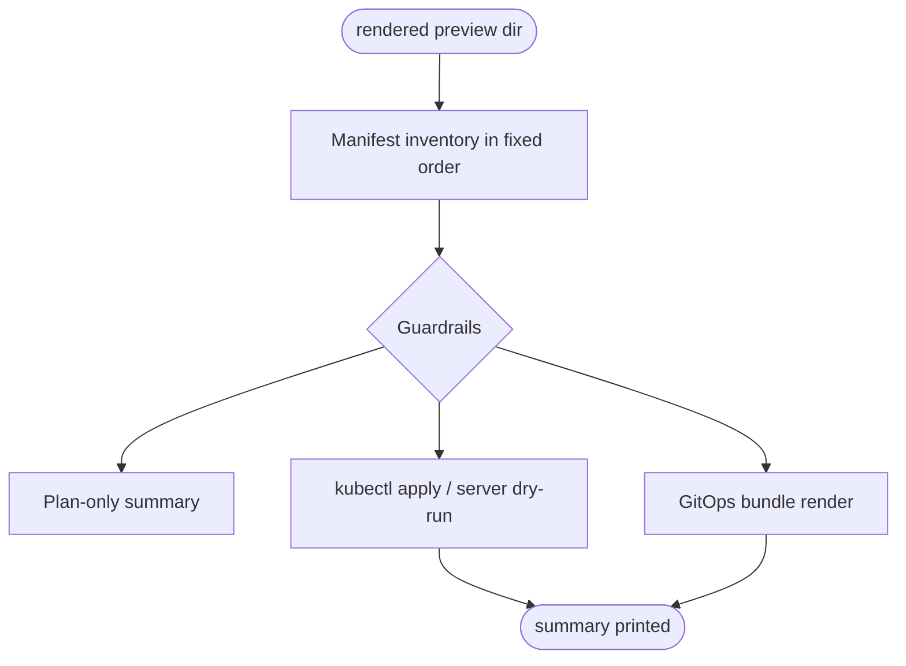
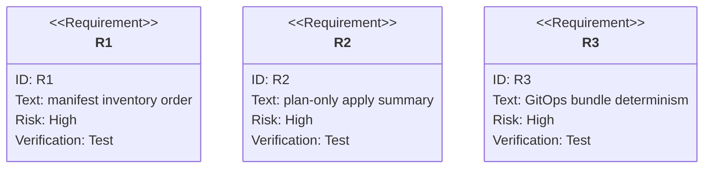

# TD: Preview Local Apply And GitOps Execution

## Logic
<!-- type: logic lang: mermaid -->



## Schema
<!-- type: schema lang: yaml -->

```yaml
types:
  ManifestInventory:
    fields:
      schemaVersion: u8
      namespace: string
      routeTarget: string
      entries: list<ManifestInventoryEntry>
  ManifestInventoryEntry:
    fields:
      order: usize
      path: string
      apiVersion: string
      kind: string
      namespace: string?
      name: string
  ApplyOptions:
    fields:
      dir: path
      context: string?
      dryRun: bool
      allowNonKind: bool
      planOnly: bool
order:
  - k8s/namespace.yaml
  - k8s/service-account.yaml
  - k8s/resource-quota.yaml
  - k8s/limit-range.yaml
  - k8s/workload-role.yaml
  - k8s/workload-role-binding.yaml
  - k8s/deployment.yaml
  - k8s/service.yaml
  - router/route-binding.yaml
guardrails:
  - "manifest paths must be relative and bounded"
  - "Namespace objects cannot target protected namespace names"
  - "actual apply refuses non-kind contexts unless --allow-non-kind is explicit"
```

## CLI
<!-- type: cli lang: yaml -->

```yaml
commands:
  - name: preview apply
    args:
      --dir: "rendered preview directory"
      --context: "optional kubectl context"
      --dry-run: "use kubectl apply --dry-run=server"
      --allow-non-kind: "explicit override for non-kind contexts"
      --plan-only: "print ordered summary without contacting a cluster"
    behavior:
      - reads the deterministic inventory from rendered manifests
      - prints MR-comment-friendly object order and target namespace
      - applies objects using kubectl only after guardrail checks
  - name: preview gitops render
    args:
      --dir: "rendered preview directory"
      --out: "GitOps bundle output directory"
    behavior:
      - writes manifests/00-*.yaml through manifests/08-*.yaml
      - writes manifest-inventory.json and kustomization.yaml
      - never records local absolute source paths
```

## Unit Test
<!-- type: unit-test lang: mermaid -->



## E2E Test
<!-- type: e2e-test lang: yaml -->

```yaml
e2e_tests:
  - id: preview-kind-local-apply
    command: "PREVIEW_KIND_E2E=1 cargo test -p preview --test kind_lifecycle -- --nocapture"
    assertions:
      - "`preview apply` creates the preview namespace and workload objects in kind."
      - "`preview apply --dry-run` performs server-side dry-run after namespace creation."
      - "`preview apply` can re-apply the same rendered directory idempotently."
      - "rollout, endpoint, port-forward, RBAC, quota, and cleanup checks still pass."
```

## Changes
<!-- type: changes lang: yaml -->

```yaml
changes:
  - path: "projects/preview/src/apply.rs"
    action: add
    section: logic
    description: "Implement manifest inventory, guardrails, kubectl apply, summary output, and GitOps bundle rendering."
    impl_mode: hand-written
    replaces:
      - "<handwrite-tracker:projects-preview-src-apply-rs>"
  - path: "projects/preview/src/render.rs"
    action: modify
    section: schema
    description: "Render plans/manifest-inventory.json and expose render_single_manifest for shared inventory generation."
    impl_mode: hand-written
  - path: "projects/preview/src/main.rs"
    action: modify
    section: cli
    description: "Add preview apply and preview gitops render CLI surfaces."
    impl_mode: hand-written
  - path: "projects/preview/src/lib.rs"
    action: modify
    section: schema
    description: "Export apply and GitOps helper types."
    impl_mode: hand-written
  - path: "projects/preview/tests/local_cicd_contract.rs"
    action: modify
    section: unit-test
    description: "Cover ordered inventory, apply plan-only summary, and deterministic GitOps bundle output."
    impl_mode: hand-written
  - path: "projects/preview/tests/render_contract.rs"
    action: modify
    section: unit-test
    description: "Cover rendered manifest inventory presence and ordering."
    impl_mode: hand-written
  - path: "projects/preview/tests/kind_lifecycle.rs"
    action: modify
    section: e2e-test
    description: "Use preview apply for direct apply, server dry-run, and idempotent re-apply in kind."
    impl_mode: hand-written
```
