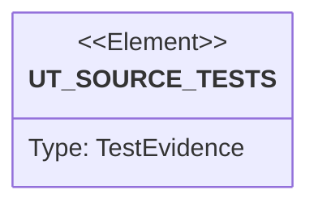

# Semantic TD: preview/tests

## Schema
<!-- type: schema lang: yaml -->

```yaml
semantic_domain:
  key: "preview/tests"
  source_group: "projects/preview/tests"
  coverage_kind: semantic
  evidence:
    source_units:
      - path: "projects/preview/tests/router_contract.rs"
        language: "rust"
        ownership_state: "handwrite"
        generator_primitives: ["service_method", "test_case"]
        symbols:
          - name: "bindings"
            kind: "function"
            public: false
          - name: "cookie_target_resolves_to_route_binding"
            kind: "function"
            public: false
          - name: "header_target_overrides_cookie_target"
            kind: "function"
            public: false
          - name: "unknown_target_does_not_guess_namespace"
            kind: "function"
            public: false
        source_evidence_node:
          layer: "backend"
          ecosystem: "rust"
          role: "test"
          section_type: "unit-test"
          domain: "projects/preview/tests"
      - path: "projects/preview/tests/render_contract.rs"
        language: "rust"
        ownership_state: "handwrite"
        generator_primitives: ["service_method", "test_case"]
        symbols:
          - name: "input"
            kind: "function"
            public: false
          - name: "render_creates_gke_contract_files"
            kind: "function"
            public: false
          - name: "route_binding_uses_target_not_namespace_cookie"
            kind: "function"
            public: false
          - name: "cleanup_plan_marks_closed_mr_for_namespace_delete"
            kind: "function"
            public: false
        source_evidence_node:
          layer: "backend"
          ecosystem: "rust"
          role: "test"
          section_type: "unit-test"
          domain: "projects/preview/tests"
      - path: "projects/preview/tests/k8s_object_contract.rs"
        language: "rust"
        ownership_state: "handwrite"
        generator_primitives: ["service_method", "test_case"]
        symbols:
          - name: "input"
            kind: "function"
            public: false
          - name: "object"
            kind: "function"
            public: false
          - name: "rendered_kubernetes_objects_parse_with_expected_kinds"
            kind: "function"
            public: false
          - name: "service_selector_matches_deployment_pod_labels"
            kind: "function"
            public: false
          - name: "deployment_has_sre_required_probes_and_identity"
            kind: "function"
            public: false
          - name: "route_binding_points_to_service_not_raw_namespace_cookie"
            kind: "function"
            public: false
        source_evidence_node:
          layer: "backend"
          ecosystem: "rust"
          role: "test"
          section_type: "unit-test"
          domain: "projects/preview/tests"
      - path: "projects/preview/tests/kind_lifecycle.rs"
        language: "rust"
        ownership_state: "handwrite"
        generator_primitives: ["service_method", "test_case"]
        symbols:
          - name: "input"
            kind: "function"
            public: false
          - name: "kind_server_side_dry_run_accepts_rendered_lifecycle_objects"
            kind: "function"
            public: false
          - name: "kubectl_server_side_dry_run"
            kind: "function"
            public: false
          - name: "output"
            kind: "function"
            public: false
        source_evidence_node:
          layer: "backend"
          ecosystem: "rust"
          role: "test"
          section_type: "unit-test"
          domain: "projects/preview/tests"
```

## Unit Test
<!-- type: unit-test lang: mermaid -->



## Changes
<!-- type: changes lang: yaml -->

```yaml
coverage_kind: semantic
changes:
  - path: "projects/preview/tests/router_contract.rs"
    action: modify
    section: schema
    description: |
      Existing source behavior is covered by this feature/domain semantic TD.
    impl_mode: hand-written
    replaces:
      - "<handwrite-tracker:projects-preview-tests-router-contract-rs>"
  - path: "projects/preview/tests/render_contract.rs"
    action: modify
    section: schema
    description: |
      Existing source behavior is covered by this feature/domain semantic TD.
    impl_mode: hand-written
    replaces:
      - "<handwrite-tracker:projects-preview-tests-render-contract-rs>"
  - path: "projects/preview/tests/k8s_object_contract.rs"
    action: modify
    section: schema
    description: |
      Existing source behavior is covered by this feature/domain semantic TD.
    impl_mode: hand-written
    replaces:
      - "<handwrite-tracker:projects-preview-tests-k8s-object-contract-rs>"
  - path: "projects/preview/tests/kind_lifecycle.rs"
    action: modify
    section: schema
    description: |
      Existing source behavior is covered by this feature/domain semantic TD.
    impl_mode: hand-written
    replaces:
      - "<handwrite-tracker:projects-preview-tests-kind-lifecycle-rs>"
```
