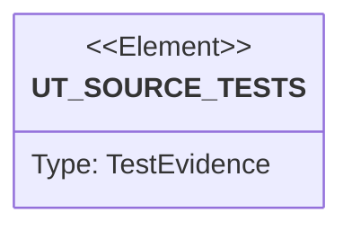

# Semantic TD: preview/tests

## Schema
<!-- type: schema lang: yaml -->

```yaml
semantic_domain:
  key: "preview/tests"
  source_group: "projects/preview/tests"
  coverage_kind: semantic
  evidence:
    source_units:
      - path: "projects/preview/tests/router_contract.rs"
        language: "rust"
        ownership_state: "handwrite"
        generator_primitives: ["service_method", "test_case"]
        symbols:
          - name: "bindings"
            kind: "function"
            public: false
          - name: "base"
            kind: "function"
            public: false
          - name: "render_input"
            kind: "function"
            public: false
          - name: "cookie_target_resolves_to_route_binding"
            kind: "function"
            public: false
          - name: "no_target_uses_base_route"
            kind: "function"
            public: false
          - name: "header_target_overrides_cookie_target"
            kind: "function"
            public: false
          - name: "unknown_target_does_not_guess_namespace"
            kind: "function"
            public: false
          - name: "host_mismatch_fails_closed_instead_of_falling_back_to_base"
            kind: "function"
            public: false
          - name: "rendered_route_binding_file_loads_adapter_route_table"
            kind: "function"
            public: false
        source_evidence_node:
          layer: "backend"
          ecosystem: "rust"
          role: "test"
          section_type: "unit-test"
          domain: "projects/preview/tests"
      - path: "projects/preview/tests/render_contract.rs"
        language: "rust"
        ownership_state: "handwrite"
        generator_primitives: ["service_method", "test_case"]
        symbols:
          - name: "input"
            kind: "function"
            public: false
          - name: "render_creates_gke_contract_files"
            kind: "function"
            public: false
          - name: "route_binding_uses_target_not_namespace_cookie"
            kind: "function"
            public: false
          - name: "cleanup_plan_marks_closed_mr_for_namespace_delete"
            kind: "function"
            public: false
          - name: "janitor_plans_keep_drain_delete_orphan_and_guardrail_decisions"
            kind: "function"
            public: false
          - name: "janitor_input"
            kind: "function"
            public: false
        source_evidence_node:
          layer: "backend"
          ecosystem: "rust"
          role: "test"
          section_type: "unit-test"
          domain: "projects/preview/tests"
      - path: "projects/preview/tests/base_discovery_contract.rs"
        language: "rust"
        ownership_state: "handwrite"
        generator_primitives: ["service_method", "test_case"]
        symbols:
          - name: "deployment"
            kind: "function"
            public: false
          - name: "service"
            kind: "function"
            public: false
          - name: "normalizes_base_deployment_and_service_without_runtime_identity"
            kind: "function"
            public: false
          - name: "render_clone_plan_can_embed_discovered_base_contract"
            kind: "function"
            public: false
          - name: "refuses_ambiguous_deployment_containers_without_matching_app_name"
            kind: "function"
            public: false
        source_evidence_node:
          layer: "backend"
          ecosystem: "rust"
          role: "test"
          section_type: "unit-test"
          domain: "projects/preview/tests"
      - path: "projects/preview/tests/local_cicd_contract.rs"
        language: "rust"
        ownership_state: "handwrite"
        generator_primitives: ["service_method", "test_case"]
        symbols:
          - name: "preview_bin"
            kind: "function"
            public: false
          - name: "local_ci_open_update_comment_and_close_lifecycle_is_deterministic"
            kind: "function"
            public: false
          - name: "local_apply_plan_and_gitops_bundle_are_deterministic"
            kind: "function"
            public: false
          - name: "local_router_resolve_proves_base_preview_and_fail_closed"
            kind: "function"
            public: false
          - name: "local_cleanup_janitor_plan_reports_guarded_actions"
            kind: "function"
            public: false
          - name: "local_data_plan_fake_provider_and_secret_rewrite_are_deterministic"
            kind: "function"
            public: false
          - name: "ci_templates_document_required_variables_and_command_order"
            kind: "function"
            public: false
          - name: "assert_command_order"
            kind: "function"
            public: false
          - name: "local_ci_render_consumes_discovered_base_contract_file"
            kind: "function"
            public: false
          - name: "preview_render"
            kind: "function"
            public: false
          - name: "command_stdout"
            kind: "function"
            public: false
        source_evidence_node:
          layer: "backend"
          ecosystem: "rust"
          role: "test"
          section_type: "unit-test"
          domain: "projects/preview/tests"
      - path: "projects/preview/tests/k8s_object_contract.rs"
        language: "rust"
        ownership_state: "handwrite"
        generator_primitives: ["service_method", "test_case"]
        symbols:
          - name: "input"
            kind: "function"
            public: false
          - name: "object"
            kind: "function"
            public: false
          - name: "rendered_kubernetes_objects_parse_with_expected_kinds"
            kind: "function"
            public: false
          - name: "service_selector_matches_deployment_pod_labels"
            kind: "function"
            public: false
          - name: "deployment_has_sre_required_probes_and_identity"
            kind: "function"
            public: false
          - name: "route_binding_points_to_service_not_raw_namespace_cookie"
            kind: "function"
            public: false
        source_evidence_node:
          layer: "backend"
          ecosystem: "rust"
          role: "test"
          section_type: "unit-test"
          domain: "projects/preview/tests"
      - path: "projects/preview/tests/kind_lifecycle.rs"
        language: "rust"
        ownership_state: "handwrite"
        generator_primitives: ["service_method", "test_case"]
        symbols:
          - name: "input"
            kind: "function"
            public: false
          - name: "kind_applies_rolls_out_routes_and_cleans_rendered_lifecycle_objects"
            kind: "function"
            public: false
          - name: "preview_apply_rendered_lifecycle"
            kind: "function"
            public: false
          - name: "preview_cleanup_rendered_lifecycle"
            kind: "function"
            public: false
          - name: "assert_kind_route_binding_adapter_loads_configmap"
            kind: "function"
            public: false
          - name: "assert_namespace_absent"
            kind: "function"
            public: false
          - name: "assert_route_binding_absent"
            kind: "function"
            public: false
          - name: "kubectl_server_side_dry_run"
            kind: "function"
            public: false
        source_evidence_node:
          layer: "backend"
          ecosystem: "rust"
          role: "test"
          section_type: "unit-test"
          domain: "projects/preview/tests"
```

## Unit Test
<!-- type: unit-test lang: mermaid -->



## Changes
<!-- type: changes lang: yaml -->

```yaml
coverage_kind: semantic
changes:
  - path: "projects/preview/tests/router_contract.rs"
    action: modify
    section: schema
    description: |
      Test source inventory and symbol evidence are covered by this semantic TD.
    impl_mode: hand-written
  - path: "projects/preview/tests/render_contract.rs"
    action: modify
    section: schema
    description: |
      Test source inventory and symbol evidence are covered by this semantic TD.
    impl_mode: hand-written
  - path: "projects/preview/tests/base_discovery_contract.rs"
    action: add
    section: schema
    description: |
      Base discovery fixture normalization and failure tests are covered by this semantic TD.
    impl_mode: hand-written
  - path: "projects/preview/tests/local_cicd_contract.rs"
    action: modify
    section: schema
    description: |
      Local CI/CD command lifecycle smoke evidence is covered by this semantic TD.
    impl_mode: hand-written
  - path: "projects/preview/tests/k8s_object_contract.rs"
    action: modify
    section: schema
    description: |
      Test source inventory and symbol evidence are covered by this semantic TD.
    impl_mode: hand-written
  - path: "projects/preview/tests/kind_lifecycle.rs"
    action: modify
    section: schema
    description: |
      Test source inventory and symbol evidence are covered by this semantic TD.
    impl_mode: hand-written
  - path: "projects/preview/tests/router_contract.rs"
    action: modify
    section: unit-test
    description: |
      Existing source behavior is covered by this feature/domain semantic TD.
    impl_mode: hand-written
    replaces:
      - "<handwrite-tracker:projects-preview-tests-router-contract-rs>"
  - path: "projects/preview/tests/render_contract.rs"
    action: modify
    section: unit-test
    description: |
      Existing source behavior is covered by this feature/domain semantic TD.
    impl_mode: hand-written
    replaces:
      - "<handwrite-tracker:projects-preview-tests-render-contract-rs>"
  - path: "projects/preview/tests/base_discovery_contract.rs"
    action: add
    section: unit-test
    description: |
      Base workload discovery normalization and render integration tests are covered by this feature/domain semantic TD.
    impl_mode: hand-written
    replaces:
      - "<handwrite-tracker:projects-preview-tests-base-discovery-contract-rs>"
  - path: "projects/preview/tests/local_cicd_contract.rs"
    action: modify
    section: unit-test
    description: |
      Local CI/CD open/update/comment/close command behavior and fake-GCP data lifecycle evidence are covered by this feature/domain semantic TD.
    impl_mode: hand-written
    replaces:
      - "<handwrite-tracker:projects-preview-tests-local-cicd-contract-rs>"
  - path: "projects/preview/tests/k8s_object_contract.rs"
    action: modify
    section: unit-test
    description: |
      Existing source behavior is covered by this feature/domain semantic TD.
    impl_mode: hand-written
    replaces:
      - "<handwrite-tracker:projects-preview-tests-k8s-object-contract-rs>"
  - path: "projects/preview/tests/kind_lifecycle.rs"
    action: modify
    section: unit-test
    description: |
      Existing source behavior is covered by this feature/domain semantic TD.
    impl_mode: hand-written
    replaces:
      - "<handwrite-tracker:projects-preview-tests-kind-lifecycle-rs>"
```
