## Logic

```mermaid
---
id: relay-backup-tls-spec-cli-flow
entry: main
nodes:
  main:
    kind: start
    label: "Single relay bin gains the deploy-CLI tail: Command::Spec + Command::Backup arms beside serve/llm/upgrade/issue/k8s/dockerfile. main still installs the rustls crypto provider FIRST — now unconditionally via service_tls::install_default_crypto_provider (service-tls links rustls in every build, so the private rustls-provider feature indirection collapses; src/tls.rs delegates)"
  verb:
    kind: decision
    label: "Which verb? spec | spec gen | backup. spec/spec gen are OFFLINE (no server, no network, stdout/--out only); backup needs a RUNNING node (HTTP fetch) and the `backup` build feature"
  spec:
    kind: process
    label: "relay spec [--format openapi|openapi-yaml|json-schema]: the offline twin of GET /openapi.json. openapi = crate::openapi::api_doc_json() (pretty JSON, same utoipa document the served route renders); openapi-yaml = serde_yaml::to_string(&openapi()) (new openapi::openapi_yaml accessor, keep's pattern); json-schema = just the component schemas as {components: ...} (new openapi::json_schema_json — relay's utoipa doc registers no named schemas today, so components serializes empty; emitted honestly, never faked). keep's --shapes/--fields flags are OMITTED: relay has no request-shape cookbook or value-type catalog equivalent — deliberate contract difference, not a gap"
  gen:
    kind: process
    label: "relay spec gen --lang ts|py|rust --out <dir> [--http fetch|axios]: cclab_openapi_codegen::generate(&openapi::api_doc_json(), &GenOptions { lang, client_name createClient, emit_types + emit_client, emit_hooks only for Ts }) — keep spec_gen verbatim. create_dir_all(--out) then write each GeneratedFile.rel_path; prints one `generated <path>` line per file. One shared codegen path, no external tool"
  backup:
    kind: process
    label: "relay backup --url <base> --dest <uri> [--token (env RELAY_BACKUP_TOKEN)] [--retention-secs N] (feature `backup` = dep:reqwest + service-backup/s3, lumen #808 layout; without the feature the arm bails with the rebuild hint): src/backup.rs fetch_snapshot_bytes GETs {url}/admin/backup (Bearer token when set; non-2xx bails with status + body), then run_backup hands the EXACT response bytes to service_backup::run_backup_once against sink_from_destination(BackupDestination::from_uri(dest)) + RetentionPolicy — file:// always works, s3:// via the lib's s3 feature, gs:// parses but the lib's sink fails loudly. Prints the BackupRunResult as pretty JSON"
  endpoint:
    kind: process
    label: "Server side: GET /admin/backup joins the data-plane router INSIDE the shared service-auth middleware (probes stay tokenless; this route does not). Handler authorizes Role::Admin on resource '*' (lumen's guard: a cluster-wide admin op) then returns application/json bytes from raft::snapshot_bytes(&relay, applied) where applied = raft-attached ? RelayRaft::applied_index() : 0 (single-node has no raft floor). Registered in the utoipa ApiDoc so /openapi.json and relay spec both list it"
  fmt:
    kind: process
    label: "ONE snapshot format (never a second serialization): raft.rs makes EngineSnapshot pub ({ up_to: Index, subjects: Vec<SubjectLive> }) and factors RelayStateMachine::snapshot into pub fn snapshot_bytes(relay, up_to) — serde_json of dump_live() (live un-acked backlog per (subject, shard) at/above the committed watermark) + the applied index — and restore into pub fn load_snapshot_bytes(relay, bytes) -> Index (parse + load_live, returning up_to). The state machine, the /admin/backup endpoint, and the backup artifact all carry these bytes"
  restore:
    kind: process
    label: "Restore semantics (documented, exercised library-side; no HTTP restore endpoint this slice): feed the artifact's bytes to load_snapshot_bytes on a fresh node — load_live re-publishes every entry through the normal engine path, idempotent per message_id, preserving not_before/priority/appended_at. It is a MERGE, not a wipe: entries the target already holds dedupe; entries it holds that the snapshot lacks stay and redeliver — at-least-once, exactly the raft InstallSnapshot semantics. Leases/acks are NOT in the snapshot (node-local by design, #544): restored work is un-leased and redelivers"
  tls:
    kind: process
    label: "src/peer_tls.rs (new, always compiled): thin adapter over libs/service-tls — pub PeerTlsConfig { cert, key, ca, required } + From conversions, from_env() = service_tls::PeerTlsConfig::from_env(RELAY_PEER) deriving RELAY_PEER_TLS_CERT / RELAY_PEER_TLS_KEY / RELAY_PEER_TLS_CA / RELAY_PEER_MTLS=on|off (lumen's env contract byte-for-byte with the RELAY prefix), plus rustls_server_config()/rustls_client_config() passthroughs. Ok(None) when nothing is set; partial config or a mis-pointed path is an Err naming the variable/path (fail fast, never a silent fallback)"
  tlswire:
    kind: decision
    label: "serve_main, replica/HA mode only: peer_tls::PeerTlsConfig::from_env()? BEFORE the raft group spawns — a misconfigured deployment exits nonzero at startup. None => plain h2c peer transport (today's behavior, logged at info). Some => material validated + rustls builders proven constructible; log identity. required=true => WARN: mTLS termination on the raft peer port is NOT YET APPLIED"
  gap:
    kind: terminal
    label: "FILED SEAM GAP (mirrors lumen, which also ships config-surface-only): raft-host's peer transport is h2c prior-knowledge (raft_host router merged onto the cleartext serve port; peers dialed via reqwest http://) with no TLS acceptor/connector seam. Wiring real mTLS needs raft-host to accept a rustls ServerConfig/ClientConfig pair (or a dedicated TLS peer listener) — a libs/raft-host change benefiting keep/lumen/relay alike. This slice deliberately does NOT hack a parallel TLS stack into h2c; the adapter + startup validation + env contract land now so material can be mounted and verified before the seam exists"
  crd:
    kind: process
    label: "Operator/CRD (feature operator): RelaySpec gains backup: Option<RelayBackupSpec> { schedule (CronJob cron), destination (FLAT URI STRING — file:///path | s3://bucket/prefix | gs://bucket/prefix; keep #776 trap: k8s structural schemas cannot represent the shared tagged-union BackupDestination), retention_secs: Option<u64>, admin_token_secret: Option<String> (Secret whose token key holds a bearer with admin on '*', injected as RELAY_BACKUP_TOKEN — needed when auth: required) }"
  cron:
    kind: terminal
    label: "render(): when spec.backup is Some, append backup_cron_job via the SHARED operator::render::cron_job helper (manifest-only; lumen #808 pattern) — name {name}-backup, component backup, schedule from spec, same relay image, command [relay], args [backup, --url, http://{name}.{ns}.svc.cluster.local:7000, --dest, <destination>, (--retention-secs N)], env RELAY_BACKUP_TOKEN from secretKeyRef when admin_token_secret set, serviceAccountName {name}, 100m/128Mi, history limits 3/3. None => no CronJob; /admin/backup stays reachable for ad hoc use. llm operations topic documents spec/spec gen, backup (CLI + endpoint + CronJob), and the peer-TLS env contract + gap"
edges:
  - { from: main, to: verb }
  - { from: verb, to: spec, label: "spec" }
  - { from: verb, to: gen, label: "spec gen" }
  - { from: verb, to: backup, label: "backup" }
  - { from: backup, to: endpoint, label: "GET /admin/backup" }
  - { from: endpoint, to: fmt, label: "bytes from" }
  - { from: fmt, to: restore, label: "round-trip" }
  - { from: main, to: tls, label: "serve path" }
  - { from: tls, to: tlswire }
  - { from: tlswire, to: gap, label: "required=on" }
  - { from: backup, to: crd, label: "operator schedules" }
  - { from: crd, to: cron }
  - { from: spec, to: gen, label: "same document" }
---
flowchart TD
    main([relay bin: Spec + Backup arms; rustls provider install now unconditional via service-tls]) --> verb{verb?}
    verb -->|spec| spec[offline OpenAPI: json pretty / yaml / components-only json-schema; no --shapes/--fields — relay has no catalogs]
    verb -->|spec gen| gen[cclab_openapi_codegen::generate on relay's own document — ts/py/rust clients into --out]
    verb -->|backup| backup[feature backup: fetch snapshot bytes over HTTP, ship to service-backup sink, print BackupRunResult]
    backup -->|GET /admin/backup| endpoint[admin-guarded route inside the auth middleware: Role::Admin on *]
    endpoint -->|bytes from| fmt[ONE format: pub EngineSnapshot + raft snapshot_bytes / load_snapshot_bytes shared by state machine, endpoint, artifact]
    fmt -->|round-trip| restore[restore = load_live MERGE on a fresh node: idempotent per message_id, leases not replicated, at-least-once]
    main -->|serve path| tls[src/peer_tls.rs: service_tls PeerTlsConfig from_env RELAY_PEER — cert/key/ca + RELAY_PEER_MTLS=on]
    tls --> tlswire{replica mode: material set?}
    tlswire -->|None| plain[plain h2c peers — today's behavior]
    tlswire -->|Some| valid[validate + prove rustls builders; fail fast on partial/mis-pointed config]
    valid -->|required=on| gap([filed gap: raft-host/h2c has no TLS seam — no parallel stack hacked in])
    backup -->|operator schedules| crd[RelaySpec.backup: flat URI destination string + schedule + retentionSecs + adminTokenSecret]
    crd --> cron([shared render cron_job: name-backup CronJob invoking relay backup; RELAY_BACKUP_TOKEN secretKeyRef])
    spec -->|same document| gen
```

<!-- type: logic lang: mermaid -->



## Unit Test
<!-- type: unit-test lang: mermaid -->

```mermaid
---
id: relay-backup-tls-spec-cli-verification
requirements:
  admin_backup_endpoint:
    id: R2
    text: "GET /admin/backup on a live node returns the exact EngineSnapshot bytes RelayStateMachine::snapshot produces (dump_live + applied index): parseable, carrying the published un-acked message."
    kind: functional
    risk: medium
    verify: tests/backup.rs::admin_backup_returns_the_state_machine_snapshot_bytes
  backup_cli_verb:
    id: R2
    text: "relay backup --url <live node> --dest file:///<tmp> (feature backup) fetches the snapshot over HTTP and writes a BackupRunResult-described artifact through the service-backup local sink; retention prunes aged objects."
    kind: functional
    risk: medium
    verify: tests/backup.rs::run_backup_ships_snapshot_to_local_sink (cfg feature backup)
  backup_endpoint_admin_guarded:
    id: R2
    text: "With auth required, GET /admin/backup rejects a missing token (401) and a non-admin token (403), and serves an admin-on-* token (200); probes stay tokenless."
    kind: functional
    risk: high
    verify: tests/backup.rs::admin_backup_requires_admin_when_auth_required
  backup_round_trip_restore:
    id: R2
    text: "A backup artifact written to a file:// destination round-trips: load_snapshot_bytes (load_live merge) on a FRESH engine re-publishes the un-acked message, which a consumer leases back with the original payload; the merge is idempotent per message_id."
    kind: functional
    risk: high
    verify: tests/backup.rs::backup_artifact_round_trips_through_load_live_on_a_fresh_engine
  cli_surface_parses:
    id: R1
    text: "The new Spec/Backup clap arms parse (spec, spec --format openapi-yaml|json-schema, spec gen --lang --out, backup --url --dest --retention-secs) alongside the existing verbs; a backup-less build answers relay backup with the rebuild hint."
    kind: regression
    risk: low
    verify: src/bin/relay.rs::tests::spec_and_backup_verbs_parse
  crd_backup_cron_render:
    id: R4
    text: "RelaySpec.backup (flat URI string destination) renders a <name>-backup CronJob via the shared operator::render::cron_job — schedule, relay backup args (--url cluster-DNS, --dest, --retention-secs), RELAY_BACKUP_TOKEN secretKeyRef when adminTokenSecret set; absent backup renders NO CronJob and the CRD stays structural-schema safe."
    kind: functional
    risk: medium
    verify: tests/operator.rs::backup_cron_job_renders_only_when_policy_set (cfg feature operator)
  llm_operations_topic:
    id: R5
    text: "relay llm operations documents the spec/spec gen verbs, the backup verb + /admin/backup endpoint + CronJob wiring, and the RELAY_PEER_TLS_* / RELAY_PEER_MTLS contract with the seam gap stated honestly."
    kind: functional
    risk: low
    verify: tests/spec_cli.rs::llm_operations_topic_documents_the_new_surfaces
  peer_tls_env_contract:
    id: R3
    text: "peer_tls::PeerTlsConfig::from_env derives RELAY_PEER_TLS_CERT/KEY/CA + RELAY_PEER_MTLS=on: None when nothing set, Some with required=true when all set + on, an error naming the vars on partial config, and a clear path-naming error on a mis-pointed cert path (fail fast)."
    kind: functional
    risk: medium
    verify: src/peer_tls.rs::tests::{from_env_returns_none_when_nothing_set,from_env_loads_when_all_set,from_env_errors_on_partial_config,mis_pointed_cert_path_fails_fast_naming_the_path}
  peer_tls_rustls_builders:
    id: R3
    text: "Scratch PEM material (the service-tls fixture cert/key) builds both rustls server and client configs through the adapter passthroughs — the material is proven usable even though the raft-host/h2c seam cannot terminate mTLS yet (filed gap)."
    kind: functional
    risk: low
    verify: src/peer_tls.rs::tests::builds_rustls_peer_configs_from_pem_material
  spec_gen_clients:
    id: R1
    text: "relay spec gen --lang ts|py|rust --out <dir> writes a non-empty typed client per language via the shared cclab-openapi-codegen; the ts client carries the well-known entry files (types.ts, client.ts, index.ts)."
    kind: functional
    risk: medium
    verify: tests/spec_cli.rs::spec_gen_writes_a_client_for_every_language
  spec_offline_formats:
    id: R1
    text: "relay spec emits parseable OpenAPI as pretty JSON (default), YAML (--format openapi-yaml), and a components-only json-schema view — the same utoipa document /openapi.json serves, offline, listing the /v1 data-plane paths and the new /admin/backup."
    kind: functional
    risk: low
    verify: tests/spec_cli.rs::spec_prints_parseable_openapi_in_every_format
---
flowchart TD
    r1[R1 cli surface parses] --> src_bin_relay_rs_tests_spec_and_backup_verbs_parse[src/bin/relay.rs::tests::spec_and_backup_verbs_parse]
    r1[R1 spec gen clients] --> tests_spec_cli_rs_spec_gen_writes_a_client_for_every_language[tests/spec_cli.rs::spec_gen_writes_a_client_for_every_language]
    r1[R1 spec offline formats] --> tests_spec_cli_rs_spec_prints_parseable_openapi_in_every_format[tests/spec_cli.rs::spec_prints_parseable_openapi_in_every_format]
    r2[R2 admin backup endpoint] --> tests_backup_rs_admin_backup_returns_the_state_machine_snapshot_bytes[tests/backup.rs::admin_backup_returns_the_state_machine_snapshot_bytes]
    r2[R2 backup cli verb] --> tests_backup_rs_run_backup_ships_snapshot_to_local_sink_cfg_feature_backup[tests/backup.rs::run_backup_ships_snapshot_to_local_sink (cfg feature backup)]
    r2[R2 backup endpoint admin guarded] --> tests_backup_rs_admin_backup_requires_admin_when_auth_required[tests/backup.rs::admin_backup_requires_admin_when_auth_required]
    r2[R2 backup round trip restore] --> tests_backup_rs_backup_artifact_round_trips_through_load_live_on_a_fresh_engine[tests/backup.rs::backup_artifact_round_trips_through_load_live_on_a_fresh_engine]
    r3[R3 peer tls env contract] --> src_peer_tls_rs_tests_from_env_returns_none_when_nothing_set_from_env_loads_when_all_set_from_env_errors_on_partial_config_mis_pointed_cert_path_fails_fast_naming_the_path[src/peer_tls.rs::tests::{from_env_returns_none_when_nothing_set,from_env_loads_when_all_set,from_env_errors_on_partial_config,mis_pointed_cert_path_fails_fast_naming_the_path}]
    r3[R3 peer tls rustls builders] --> src_peer_tls_rs_tests_builds_rustls_peer_configs_from_pem_material[src/peer_tls.rs::tests::builds_rustls_peer_configs_from_pem_material]
    r4[R4 crd backup cron render] --> tests_operator_rs_backup_cron_job_renders_only_when_policy_set_cfg_feature_operator[tests/operator.rs::backup_cron_job_renders_only_when_policy_set (cfg feature operator)]
    r5[R5 llm operations topic] --> tests_spec_cli_rs_llm_operations_topic_documents_the_new_surfaces[tests/spec_cli.rs::llm_operations_topic_documents_the_new_surfaces]
```
