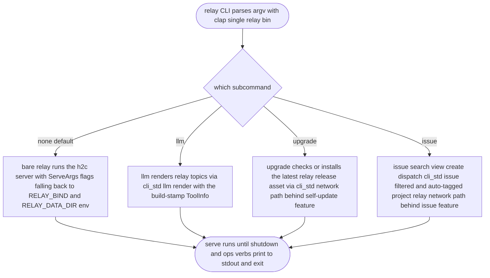
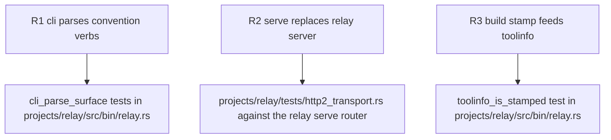

## Logic
<!-- type: logic lang: mermaid -->


## Unit Test
<!-- type: unit-test lang: mermaid -->



## Changes
<!-- type: changes lang: yaml -->

```yaml
changes:
  - path: projects/relay/Cargo.toml
    action: modify
    section: logic
    impl_mode: hand-written
    description: "Replace [[bin]] relay-server with [[bin]] relay (src/bin/relay.rs); add clap + cli-std (default-features = false) deps and the build-stamp build-dependency; add self-update/issue features mapping to cli-std/online (keep's feature layout, with the report-issue alias omitted)."
  - path: projects/relay/src/bin/relay.rs
    action: create
    section: logic
    impl_mode: hand-written
    description: "Single relay CLI bin (clap): bare relay (no subcommand) runs the h2c server with ServeArgs flags falling back to RELAY_BIND/RELAY_DATA_DIR env (the relay_server.rs behavior verbatim); Command::Llm/Upgrade/Issue dispatch to cli_std::{llm,upgrade,issue} with relay's ToolInfo; mirrors projects/keep/src/bin/keep.rs."
  - path: projects/relay/src/bin/relay_server.rs
    action: delete
    section: logic
    impl_mode: hand-written
    description: "Removed: bare relay serve replaces the relay-server entrypoint."
  - path: projects/relay/build.rs
    action: create
    section: logic
    impl_mode: hand-written
    description: "Delegate to build_stamp::stamp(\"RELAY\") so RELAY_GIT_SHA/RELAY_BUILT_AT/RELAY_TARGET feed ToolInfo — no hand-rolled git/timestamp logic."
  - path: projects/relay/src/llm.rs
    action: create
    section: logic
    impl_mode: hand-written
    description: "relay's cli_std::llm::Topic list (outline, http-api, operations) + the stamped ToolInfo constructor shared by llm/upgrade/issue."
  - path: projects/relay/Dockerfile
    action: modify
    section: logic
    impl_mode: hand-written
    description: "Build/copy the relay bin instead of relay-server (relay-raft line untouched)."
  - path: projects/relay/src/bin/relay.rs
    action: modify
    section: unit-test
    impl_mode: hand-written
    description: "#[cfg(test)] mod: clap parse tests for llm/upgrade/issue verbs + bare-serve default (cli_parse_surface), and toolinfo_is_stamped asserting the build-stamp envs populate ToolInfo."
```
