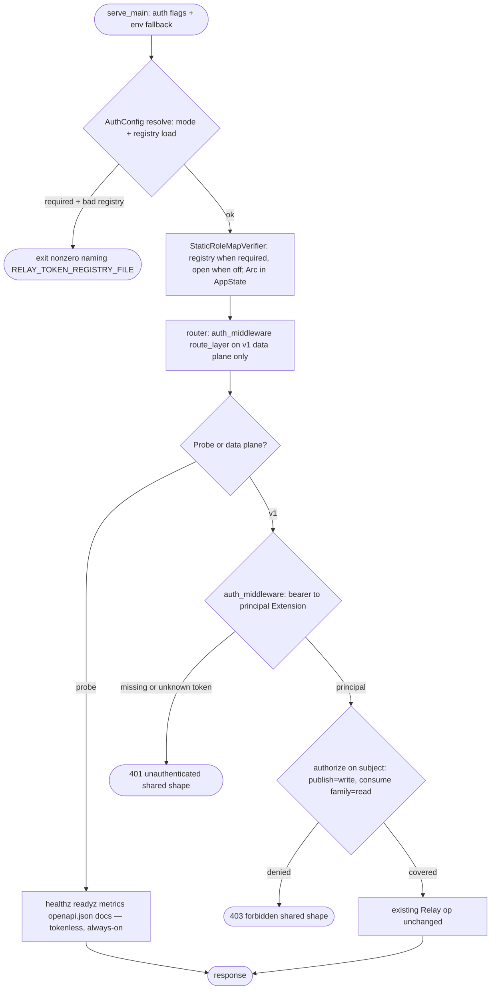

## Logic
<!-- type: logic lang: mermaid -->


## Unit Test

```mermaid
---
id: relay-service-auth-role-map-verification
requirements:
  blanket_middleware_401:
    id: R1
    text: "The blanket service_auth::auth_middleware is layered on the /v1 data-plane router: under RELAY_AUTH=required a request with no token or an unknown token is rejected 401 before any handler runs, while a registry token with a matching write grant publishes 200."
    kind: functional
    risk: high
    verify: tests/auth.rs::publish_requires_write_grant_on_subject
  off_mode_regression:
    id: R2
    text: "RELAY_AUTH=off (the default, StaticRoleMapVerifier::open) keeps today's tokenless behavior: tokenless publish and lease answer 200 through the same layered router, and the full pre-existing test suite stays green unchanged."
    kind: regression
    risk: medium
    verify: tests/auth.rs::off_mode_keeps_tokenless_behavior
  probes_auth_exempt:
    id: R6
    text: "With RELAY_AUTH=required, the probe surface (/healthz /readyz /metrics /openapi.json /docs) answers 200 WITHOUT a token — the auth layer is attached to the data-plane router only, never the standard_probe_routes router."
    kind: functional
    risk: medium
    verify: tests/auth.rs::probes_stay_tokenless_under_required_auth
  read_role_mapping:
    id: R3
    text: "The consume-side handler group (lease/ack/lease-batch/ack-batch/heartbeat/len) requires a read grant on the {subject} path param: a read token on the subject passes, a token scoped to a different subject is 403, a write grant covers read, and a wildcard * admin grant covers every subject (Role::covers hierarchy)."
    kind: functional
    risk: high
    verify: tests/auth.rs::consume_side_requires_read_grant_on_subject
  serve_flags:
    id: R5
    text: "The relay CLI gains --auth (env RELAY_AUTH, default off) and --token-registry-file (env RELAY_TOKEN_REGISTRY_FILE) as serve flags with env fallback; existing bare-serve flags keep parsing and the llm operations topic documents the knobs."
    kind: functional
    risk: low
    verify: src/bin/relay.rs::tests::cli_parse_surface
  shared_error_shape:
    id: R4
    text: "Auth rejections render the shared service-auth JSON shape consistent with the ApiErr envelope family: 401 body {\"error\":\"unauthenticated\",...} and 403 body {\"error\":\"forbidden\",\"message\":\"subject ... lacks ... on ...\"}."
    kind: functional
    risk: medium
    verify: tests/auth.rs::error_bodies_use_shared_service_auth_shape
  streaming_consume_guard:
    id: R3
    text: "The streaming POST /v1/{subject}/consume path enforces the same contract: no token under required auth is 401 from the middleware; a valid token whose grants do not cover read on the subject is 403 before the Subscribe handshake is read."
    kind: functional
    risk: medium
    verify: tests/auth.rs::streaming_consume_enforces_read_grant
  verifier_fail_fast:
    id: R2
    text: "AuthConfig::resolve builds StaticRoleMapVerifier from the registry file when required and fails fast (startup error naming RELAY_TOKEN_REGISTRY_FILE) when the file is missing, unparseable, or the resolved registry is empty; an unknown RELAY_AUTH mode is also rejected."
    kind: functional
    risk: medium
    verify: tests/auth.rs::resolve_fails_fast_on_missing_or_bad_registry
---
flowchart TD
    r1[R1 blanket middleware 401] --> tests_auth_rs_publish_requires_write_grant_on_subject[tests/auth.rs::publish_requires_write_grant_on_subject]
    r2[R2 off mode regression] --> tests_auth_rs_off_mode_keeps_tokenless_behavior[tests/auth.rs::off_mode_keeps_tokenless_behavior]
    r2[R2 verifier fail fast] --> tests_auth_rs_resolve_fails_fast_on_missing_or_bad_registry[tests/auth.rs::resolve_fails_fast_on_missing_or_bad_registry]
    r3[R3 read role mapping] --> tests_auth_rs_consume_side_requires_read_grant_on_subject[tests/auth.rs::consume_side_requires_read_grant_on_subject]
    r3[R3 streaming consume guard] --> tests_auth_rs_streaming_consume_enforces_read_grant[tests/auth.rs::streaming_consume_enforces_read_grant]
    r4[R4 shared error shape] --> tests_auth_rs_error_bodies_use_shared_service_auth_shape[tests/auth.rs::error_bodies_use_shared_service_auth_shape]
    r5[R5 serve flags] --> src_bin_relay_rs_tests_cli_parse_surface[src/bin/relay.rs::tests::cli_parse_surface]
    r6[R6 probes auth exempt] --> tests_auth_rs_probes_stay_tokenless_under_required_auth[tests/auth.rs::probes_stay_tokenless_under_required_auth]
```

<!-- type: unit-test lang: mermaid -->



## Changes
<!-- type: changes lang: yaml -->

```yaml
changes:
  - path: projects/relay/Cargo.toml
    action: modify
    section: logic
    impl_mode: hand-written
    description: "Add the service-auth path dependency (shared bearer middleware, role_map StaticRoleMapVerifier, registry loader, shared 401/403 error shape)."
  - path: projects/relay/src/auth.rs
    action: create
    section: logic
    impl_mode: hand-written
    description: "relay's service-auth adapter: AuthConfig (RELAY_AUTH off|disabled|required mode parse + token-registry load via service_auth::load_registry with startup fail-fast naming RELAY_TOKEN_REGISTRY_FILE), StaticRoleMapVerifier construction (registry when required, open() when off), and the per-handler-group authorize(principal, subject, needed) helper mapping RoleMapDenied to the shared 403 forbidden shape."
  - path: projects/relay/src/lib.rs
    action: modify
    section: logic
    impl_mode: hand-written
    description: "Register pub mod auth in the crate root module wiring."
  - path: projects/relay/src/server.rs
    action: modify
    section: logic
    impl_mode: hand-written
    description: "AppState carries Arc<StaticRoleMapVerifier> (AppState::new stays open for tokenless dev/tests; AppState::with_auth takes the resolved AuthConfig); router() route_layers service_auth::auth_middleware on the /v1 data-plane router ONLY (probes stay exempt; metrics::track stays outermost so auth rejections are still counted); every data-plane handler gains the Extension<RoleMapPrincipal> and enforces write (publish/publish-batch) or read (lease/ack/lease-batch/ack-batch/heartbeat/len) on the {subject} path param via auth::authorize."
  - path: projects/relay/src/consume.rs
    action: modify
    section: logic
    impl_mode: hand-written
    description: "The streaming consume handler takes the Extension<RoleMapPrincipal> and enforces a read grant on its subject before reading the Subscribe handshake."
  - path: projects/relay/src/bin/relay.rs
    action: modify
    section: logic
    impl_mode: hand-written
    description: "ServeArgs gains --auth (env RELAY_AUTH, off|required, default off) and --token-registry-file (env RELAY_TOKEN_REGISTRY_FILE) with env fallback like --bind; serve_main resolves AuthConfig (fail fast: nonzero exit on a bad/missing registry under required) and builds AppState::with_auth; cli_parse_surface covers the new flags."
  - path: projects/relay/src/llm.rs
    action: modify
    section: logic
    impl_mode: hand-written
    description: "The operations topic documents RELAY_AUTH / RELAY_TOKEN_REGISTRY_FILE, the registry JSON shape + role model (publish=write, consume=read, wildcard *, admin>=write>=read), the tokenless probe surface, and the client RELAY_URL + RELAY_TOKEN bearer contract."
  - path: projects/relay/tests/auth.rs
    action: create
    section: unit-test
    impl_mode: hand-written
    description: "Integration tests over a real ephemeral server with a temp registry JSON file: publish 200/401/403 (write grant), consume-side lease/ack/len 200/403 with role hierarchy + wildcard grants, streaming consume 401/403, shared error bodies, tokenless probes under required auth, off-mode tokenless regression, and AuthConfig::resolve fail-fast (missing/unparseable/empty registry, unknown mode)."
```
