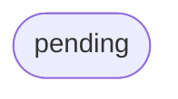

# relay HTTP/2 + OpenAPI transport, client-side sharding, streaming subscribe

## Logic
<!-- type: logic lang: mermaid -->

```mermaid
---
id: relay-http2-transport-flow
entry: client
nodes:
  client:
    kind: start
    label: "Client picks a shard with crc32(key) % shards and resolves the per-shard headless DNS name (no L4 LB)"
  h2c:
    kind: process
    label: "Open an HTTP/2 cleartext (h2c) connection to that shard's relay server"
  route:
    kind: decision
    label: "Which endpoint?"
  publish:
    kind: process
    label: "POST publish: decode body, Relay.publish(subject, message_id, payload) -> AppendOutcome"
  lease:
    kind: process
    label: "POST lease (length-prefixed CBOR fast path): Relay.lease(subject, consumer) -> Lease or empty"
  ack:
    kind: process
    label: "POST ack (CBOR fast path): Relay.ack(subject, lease_id) -> committed offset"
  subscribe_open:
    kind: process
    label: "GET subscribe?subject&from_seq: register a broadcast subscriber and open an HTTP/2 chunked CBOR stream"
  tail:
    kind: process
    label: "Loop: Relay.poll(subject, subscriber) -> write each LogEntry as a length-prefixed CBOR frame; flush"
  more:
    kind: decision
    label: "Connection still open and producer appended new entries?"
  done:
    kind: terminal
    label: "Encode the response (CBOR fast path or JSON/OpenAPI) and return over the same h2c stream"
edges:
  - { from: client, to: h2c, label: "shard resolved" }
  - { from: h2c, to: route, label: "request received" }
  - { from: route, to: publish, label: "POST /v1/{subject}/publish" }
  - { from: route, to: lease, label: "POST /v1/{subject}/lease" }
  - { from: route, to: ack, label: "POST /v1/{subject}/ack" }
  - { from: route, to: subscribe_open, label: "GET /v1/{subject}/subscribe" }
  - { from: publish, to: done }
  - { from: lease, to: done }
  - { from: ack, to: done }
  - { from: subscribe_open, to: tail, label: "stream opened" }
  - { from: tail, to: more, label: "frames flushed" }
  - { from: more, to: tail, label: "yes: deliver newly appended entries" }
  - { from: more, to: done, label: "no: client closed / stream ended" }
---
flowchart TD
    client([crc32(key) % shards -> per-shard DNS]) --> h2c[Open h2c HTTP/2 connection]
    h2c --> route{Endpoint?}
    route -->|publish| publish[Relay.publish -> AppendOutcome]
    route -->|lease| lease[CBOR: Relay.lease -> Lease]
    route -->|ack| ack[CBOR: Relay.ack -> committed]
    route -->|subscribe| subscribe_open[Open chunked CBOR stream from_seq]
    publish --> done([encode + return])
    lease --> done
    ack --> done
    subscribe_open --> tail[poll -> length-prefixed CBOR frames]
    tail --> more{more entries / open?}
    more -->|yes| tail
    more -->|no| done
```
## Schema
<!-- type: schema lang: yaml -->

```yaml
$schema: "https://json-schema.org/draft/2020-12/schema"
$id: relay-http2-transport#schema
title: Relay HTTP/2 Transport Wire Types
description: >
  Request/response DTOs for the HTTP/2 transport over the relay core, plus the
  client-side sharding key. JSON shapes are the OpenAPI contract; the hot
  lease/ack path additionally uses length-prefixed CBOR of the same shapes.
  Core domain types (LogEntry, Lease, AppendOutcome, CommittedOffset) are reused
  from the relay crate unchanged.

definitions:
  PublishRequest:
    type: object
    $id: PublishRequest
    x-rust-derive: ["Debug", "Clone", "Serialize", "Deserialize"]
    required: [message_id, payload]
    description: "Publish one message to the path's subject."
    properties:
      message_id:
        type: string
        description: "Caller-supplied idempotency key (dedupe is on this id)."
      payload:
        description: "Opaque message body (any JSON value); stored verbatim."
      headers:
        type: object
        additionalProperties: { type: string }

  PublishResponse:
    type: object
    $id: PublishResponse
    x-rust-type: "relay::AppendOutcome"
    description: "Reused core AppendOutcome { seq, deduped }."

  LeaseRequest:
    type: object
    $id: LeaseRequest
    x-rust-derive: ["Debug", "Clone", "Serialize", "Deserialize"]
    required: [consumer_id]
    properties:
      consumer_id: { type: string }

  LeaseResponse:
    type: object
    $id: LeaseResponse
    x-rust-derive: ["Debug", "Clone", "Serialize", "Deserialize"]
    description: "A granted lease, or null when nothing is available."
    properties:
      lease:
        oneOf:
          - { type: "null" }
          - { x-rust-type: "relay::Lease" }

  AckRequest:
    type: object
    $id: AckRequest
    x-rust-derive: ["Debug", "Clone", "Serialize", "Deserialize"]
    required: [lease_id]
    properties:
      lease_id: { type: string }

  AckResponse:
    type: object
    $id: AckResponse
    x-rust-derive: ["Debug", "Clone", "Serialize", "Deserialize"]
    required: [acked]
    description: "Whether the lease was known, plus the resulting committed offset."
    properties:
      acked: { type: boolean }
      committed_seq:
        oneOf:
          - { type: "null" }
          - { type: integer, minimum: 0 }

  SubscribeQuery:
    type: object
    $id: SubscribeQuery
    x-rust-derive: ["Debug", "Clone", "Serialize", "Deserialize"]
    required: [from_seq]
    description: "Broadcast tail query; delivery starts at from_seq."
    properties:
      from_seq: { type: integer, minimum: 0 }
      subscriber_id:
        oneOf:
          - { type: "null" }
          - { type: string }

  StreamFrame:
    type: object
    $id: StreamFrame
    x-rust-type: "relay::LogEntry"
    description: "One broadcast stream item: a reused core LogEntry, emitted as a length-prefixed CBOR frame (or SSE data line)."

  ShardKey:
    type: object
    $id: ShardKey
    x-rust-derive: ["Debug", "Clone", "Copy", "Serialize", "Deserialize"]
    required: [shards]
    description: "Client-side sharding: target shard = crc32(key) % shards; the client resolves the per-shard headless DNS name. No L4 load balancer."
    properties:
      shards:
        type: integer
        minimum: 1
        description: "Total shard count for the subject space."
```
## Rest Api
<!-- type: rest-api lang: yaml -->

```yaml
(fill)
```

## Config
<!-- type: config lang: yaml -->

```yaml
(fill)
```

## Unit Test
<!-- type: unit-test lang: mermaid -->



## Changes
<!-- type: changes lang: yaml -->

```yaml
(fill)
```
