# relay HTTP/2 + OpenAPI transport, client-side sharding, streaming subscribe

## Logic
<!-- type: logic lang: mermaid -->

```mermaid
---
id: relay-http2-transport-flow
entry: client
nodes:
  client:
    kind: start
    label: "Client picks a shard with crc32(key) % shards and resolves the per-shard headless DNS name (no L4 LB)"
  h2c:
    kind: process
    label: "Open an HTTP/2 cleartext (h2c) connection to that shard's relay server"
  route:
    kind: decision
    label: "Which endpoint?"
  publish:
    kind: process
    label: "POST publish: decode body, Relay.publish(subject, message_id, payload) -> AppendOutcome"
  lease:
    kind: process
    label: "POST lease (length-prefixed CBOR fast path): Relay.lease(subject, consumer) -> Lease or empty"
  ack:
    kind: process
    label: "POST ack (CBOR fast path): Relay.ack(subject, lease_id) -> committed offset"
  subscribe_open:
    kind: process
    label: "GET subscribe?subject&from_seq: register a broadcast subscriber and open an HTTP/2 chunked CBOR stream"
  tail:
    kind: process
    label: "Loop: Relay.poll(subject, subscriber) -> write each LogEntry as a length-prefixed CBOR frame; flush"
  more:
    kind: decision
    label: "Connection still open and producer appended new entries?"
  done:
    kind: terminal
    label: "Encode the response (CBOR fast path or JSON/OpenAPI) and return over the same h2c stream"
edges:
  - { from: client, to: h2c, label: "shard resolved" }
  - { from: h2c, to: route, label: "request received" }
  - { from: route, to: publish, label: "POST /v1/{subject}/publish" }
  - { from: route, to: lease, label: "POST /v1/{subject}/lease" }
  - { from: route, to: ack, label: "POST /v1/{subject}/ack" }
  - { from: route, to: subscribe_open, label: "GET /v1/{subject}/subscribe" }
  - { from: publish, to: done }
  - { from: lease, to: done }
  - { from: ack, to: done }
  - { from: subscribe_open, to: tail, label: "stream opened" }
  - { from: tail, to: more, label: "frames flushed" }
  - { from: more, to: tail, label: "yes: deliver newly appended entries" }
  - { from: more, to: done, label: "no: client closed / stream ended" }
---
flowchart TD
    client([crc32(key) % shards -> per-shard DNS]) --> h2c[Open h2c HTTP/2 connection]
    h2c --> route{Endpoint?}
    route -->|publish| publish[Relay.publish -> AppendOutcome]
    route -->|lease| lease[CBOR: Relay.lease -> Lease]
    route -->|ack| ack[CBOR: Relay.ack -> committed]
    route -->|subscribe| subscribe_open[Open chunked CBOR stream from_seq]
    publish --> done([encode + return])
    lease --> done
    ack --> done
    subscribe_open --> tail[poll -> length-prefixed CBOR frames]
    tail --> more{more entries / open?}
    more -->|yes| tail
    more -->|no| done
```
## Schema
<!-- type: schema lang: yaml -->

```yaml
$schema: "https://json-schema.org/draft/2020-12/schema"
$id: relay-http2-transport#schema
title: Relay HTTP/2 Transport Wire Types
description: >
  Request/response DTOs for the HTTP/2 transport over the relay core, plus the
  client-side sharding key. JSON shapes are the OpenAPI contract; the hot
  lease/ack path additionally uses length-prefixed CBOR of the same shapes.
  Core domain types (LogEntry, Lease, AppendOutcome, CommittedOffset) are reused
  from the relay crate unchanged.

definitions:
  PublishRequest:
    type: object
    $id: PublishRequest
    x-rust-derive: ["Debug", "Clone", "Serialize", "Deserialize"]
    required: [message_id, payload]
    description: "Publish one message to the path's subject."
    properties:
      message_id:
        type: string
        description: "Caller-supplied idempotency key (dedupe is on this id)."
      payload:
        description: "Opaque message body (any JSON value); stored verbatim."
      headers:
        type: object
        additionalProperties: { type: string }

  PublishResponse:
    type: object
    $id: PublishResponse
    x-rust-type: "relay::AppendOutcome"
    description: "Reused core AppendOutcome { seq, deduped }."

  LeaseRequest:
    type: object
    $id: LeaseRequest
    x-rust-derive: ["Debug", "Clone", "Serialize", "Deserialize"]
    required: [consumer_id]
    properties:
      consumer_id: { type: string }

  LeaseResponse:
    type: object
    $id: LeaseResponse
    x-rust-derive: ["Debug", "Clone", "Serialize", "Deserialize"]
    description: "A granted lease, or null when nothing is available."
    properties:
      lease:
        oneOf:
          - { type: "null" }
          - { x-rust-type: "relay::Lease" }

  AckRequest:
    type: object
    $id: AckRequest
    x-rust-derive: ["Debug", "Clone", "Serialize", "Deserialize"]
    required: [lease_id]
    properties:
      lease_id: { type: string }

  AckResponse:
    type: object
    $id: AckResponse
    x-rust-derive: ["Debug", "Clone", "Serialize", "Deserialize"]
    required: [acked]
    description: "Whether the lease was known, plus the resulting committed offset."
    properties:
      acked: { type: boolean }
      committed_seq:
        oneOf:
          - { type: "null" }
          - { type: integer, minimum: 0 }

  SubscribeQuery:
    type: object
    $id: SubscribeQuery
    x-rust-derive: ["Debug", "Clone", "Serialize", "Deserialize"]
    required: [from_seq]
    description: "Broadcast tail query; delivery starts at from_seq."
    properties:
      from_seq: { type: integer, minimum: 0 }
      subscriber_id:
        oneOf:
          - { type: "null" }
          - { type: string }

  StreamFrame:
    type: object
    $id: StreamFrame
    x-rust-type: "relay::LogEntry"
    description: "One broadcast stream item: a reused core LogEntry, emitted as a length-prefixed CBOR frame (or SSE data line)."

  ShardKey:
    type: object
    $id: ShardKey
    x-rust-derive: ["Debug", "Clone", "Copy", "Serialize", "Deserialize"]
    required: [shards]
    description: "Client-side sharding: target shard = crc32(key) % shards; the client resolves the per-shard headless DNS name. No L4 load balancer."
    properties:
      shards:
        type: integer
        minimum: 1
        description: "Total shard count for the subject space."
```
## Rest Api
<!-- type: rest-api lang: yaml -->

```yaml
openapi: 3.1.0
info:
  title: relay HTTP/2 transport
  version: 0.1.0
  description: >
    All protocols over HTTP/2 (h2c), no gRPC. JSON is the OpenAPI contract; the
    hot lease/ack path also accepts/returns length-prefixed CBOR of the same
    shapes (Content-Type application/cbor). Clients shard with crc32(key) %
    shards and connect to the per-shard headless DNS name.
servers:
  - url: http://{shard}/
    variables:
      shard:
        default: relay-0.relay.svc.cluster.local
paths:
  /v1/{subject}/publish:
    post:
      operationId: publish
      summary: Append a message to the subject's durable log (idempotent on message_id).
      parameters:
        - { name: subject, in: path, required: true, schema: { type: string } }
      requestBody:
        required: true
        content:
          application/json:
            schema: { $ref: "#/components/schemas/PublishRequest" }
      responses:
        "200":
          description: Append outcome.
          content:
            application/json:
              schema: { $ref: "#/components/schemas/PublishResponse" }
  /v1/{subject}/lease:
    post:
      operationId: lease
      summary: Lease the next eligible entry to a competing consumer (CBOR fast path).
      parameters:
        - { name: subject, in: path, required: true, schema: { type: string } }
      requestBody:
        required: true
        content:
          application/json:
            schema: { $ref: "#/components/schemas/LeaseRequest" }
          application/cbor:
            schema: { $ref: "#/components/schemas/LeaseRequest" }
      responses:
        "200":
          description: A lease, or null when nothing is available.
          content:
            application/json:
              schema: { $ref: "#/components/schemas/LeaseResponse" }
            application/cbor:
              schema: { $ref: "#/components/schemas/LeaseResponse" }
  /v1/{subject}/ack:
    post:
      operationId: ack
      summary: Acknowledge a lease (CBOR fast path); advances the committed offset.
      parameters:
        - { name: subject, in: path, required: true, schema: { type: string } }
      requestBody:
        required: true
        content:
          application/json:
            schema: { $ref: "#/components/schemas/AckRequest" }
          application/cbor:
            schema: { $ref: "#/components/schemas/AckRequest" }
      responses:
        "200":
          description: Ack result.
          content:
            application/json:
              schema: { $ref: "#/components/schemas/AckResponse" }
            application/cbor:
              schema: { $ref: "#/components/schemas/AckResponse" }
  /v1/{subject}/subscribe:
    get:
      operationId: subscribe
      summary: Tail the broadcast stream from a seq (HTTP/2 chunked CBOR frames).
      parameters:
        - { name: subject, in: path, required: true, schema: { type: string } }
        - { name: from_seq, in: query, required: true, schema: { type: integer, minimum: 0 } }
        - { name: subscriber_id, in: query, required: false, schema: { type: string } }
      responses:
        "200":
          description: >
            An open stream of length-prefixed CBOR StreamFrame items, one per log
            entry, starting at from_seq and continuing as new entries arrive.
          content:
            application/cbor-seq:
              schema: { $ref: "#/components/schemas/StreamFrame" }
  /healthz:
    get:
      operationId: healthz
      summary: Liveness probe.
      responses:
        "200": { description: OK }
components:
  schemas:
    PublishRequest:
      type: object
      required: [message_id, payload]
      properties:
        message_id: { type: string }
        payload: {}
        headers: { type: object, additionalProperties: { type: string } }
    PublishResponse:
      type: object
      required: [seq, deduped]
      properties:
        seq: { type: integer, minimum: 0 }
        deduped: { type: boolean }
    LeaseRequest:
      type: object
      required: [consumer_id]
      properties:
        consumer_id: { type: string }
    LeaseResponse:
      type: object
      properties:
        lease:
          oneOf:
            - { type: "null" }
            - { $ref: "#/components/schemas/Lease" }
    Lease:
      type: object
      required: [lease_id, seq, subject, shard, consumer_id, granted_at, expires_at, attempt]
      properties:
        lease_id: { type: string }
        seq: { type: integer, minimum: 0 }
        subject: { type: string }
        shard: { type: integer, minimum: 0 }
        consumer_id: { type: string }
        granted_at: { type: string, format: date-time }
        expires_at: { type: string, format: date-time }
        attempt: { type: integer, minimum: 1 }
    AckRequest:
      type: object
      required: [lease_id]
      properties:
        lease_id: { type: string }
    AckResponse:
      type: object
      required: [acked]
      properties:
        acked: { type: boolean }
        committed_seq:
          oneOf:
            - { type: "null" }
            - { type: integer, minimum: 0 }
    StreamFrame:
      type: object
      required: [seq, message_id, subject, shard, payload, appended_at]
      properties:
        seq: { type: integer, minimum: 0 }
        message_id: { type: string }
        subject: { type: string }
        shard: { type: integer, minimum: 0 }
        payload: {}
        headers: { type: object, additionalProperties: { type: string } }
        appended_at: { type: string, format: date-time }
```
## Config
<!-- type: config lang: yaml -->

```yaml
# RelayServerConfig — HTTP/2 transport in front of the relay core.
# The core engine settings (durability, dedupe, lease, retention) are the
# RelayCoreConfig from #122, embedded under `core`.

bind: "0.0.0.0:7000"     # h2c listen address for this shard
h2c: true                # HTTP/2 cleartext (no TLS at this layer; mesh/proxy terminates)

# Client-side sharding (advertised so clients can compute crc32(key) % shards).
shards: 1                # total shards in the subject space
shard_index: 0           # which shard this server instance serves

# Wire defaults.
default_content_type: "application/json"   # lease/ack also accept application/cbor
stream_content_type: "application/cbor-seq" # broadcast subscribe frame stream

# Embedded relay core config (see #122 RelayCoreConfig).
core:
  data_dir: "./relay-data"
  fsync: "interval"
  work_queue:
    lease_ttl_ms: 30000
    max_attempts: 5
```
## Unit Test

```mermaid
---
id: relay-http2-unit-test-plan
entry: suite
nodes:
  suite:
    kind: start
    label: "relay HTTP/2 transport test suite (in-process h2c server over a relay core)"
  t_publish:
    kind: process
    label: "POST publish over h2c, then again with the same message_id"
  a_publish:
    kind: terminal
    label: "assert seq=0 then deduped=true,seq=0 (idempotent over the wire)"
  t_lease_ack:
    kind: process
    label: "ACCEPTANCE: worker POST lease then POST ack over h2c (CBOR fast path)"
  a_lease_ack:
    kind: terminal
    label: "assert a Lease is returned, ack acked=true, committed_seq advances"
  t_lease_empty:
    kind: process
    label: "lease when nothing is available"
  a_lease_empty:
    kind: terminal
    label: "assert LeaseResponse.lease is null"
  t_subscribe:
    kind: process
    label: "ACCEPTANCE: publish 3, GET subscribe?from_seq=0 and read the stream"
  a_subscribe:
    kind: terminal
    label: "assert 3 length-prefixed CBOR StreamFrames decode in seq order 0,1,2"
  t_replay:
    kind: process
    label: "subscribe?from_seq=1 after 3 entries exist"
  a_replay:
    kind: terminal
    label: "assert stream tails from seq 1 (frames 1,2)"
  t_cbor:
    kind: process
    label: "lease/ack with Content-Type application/cbor"
  a_cbor:
    kind: terminal
    label: "assert CBOR request/response round-trips to the same values as JSON"
  t_shard:
    kind: process
    label: "client shard helper crc32(key) % shards over many keys"
  a_shard:
    kind: terminal
    label: "assert every result < shards and the same key is stable"
  t_openapi:
    kind: process
    label: "GET /openapi.json"
  a_openapi:
    kind: terminal
    label: "assert the four endpoints are present in the served OpenAPI document"
edges:
  - { from: suite, to: t_publish, label: "case: publish/dedupe" }
  - { from: t_publish, to: a_publish }
  - { from: suite, to: t_lease_ack, label: "case: lease/ack acceptance" }
  - { from: t_lease_ack, to: a_lease_ack }
  - { from: suite, to: t_lease_empty, label: "case: empty lease" }
  - { from: t_lease_empty, to: a_lease_empty }
  - { from: suite, to: t_subscribe, label: "case: subscribe acceptance" }
  - { from: t_subscribe, to: a_subscribe }
  - { from: suite, to: t_replay, label: "case: replay from seq" }
  - { from: t_replay, to: a_replay }
  - { from: suite, to: t_cbor, label: "case: cbor fast path" }
  - { from: t_cbor, to: a_cbor }
  - { from: suite, to: t_shard, label: "case: sharding" }
  - { from: t_shard, to: a_shard }
  - { from: suite, to: t_openapi, label: "case: openapi" }
  - { from: t_openapi, to: a_openapi }
---
flowchart TD
    suite([HTTP/2 transport suite]) --> t_publish[publish twice, same id]
    t_publish --> a_publish([seq=0 then deduped])
    suite --> t_lease_ack[lease then ack over h2c]
    t_lease_ack --> a_lease_ack([lease granted, committed advances])
    suite --> t_lease_empty[lease with nothing available]
    t_lease_empty --> a_lease_empty([lease = null])
    suite --> t_subscribe[publish 3, subscribe from_seq=0]
    t_subscribe --> a_subscribe([3 CBOR frames in order])
    suite --> t_replay[subscribe from_seq=1]
    t_replay --> a_replay([tails from seq 1])
    suite --> t_cbor[lease/ack as application/cbor]
    t_cbor --> a_cbor([round-trips == JSON])
    suite --> t_shard[crc32 key % shards]
    t_shard --> a_shard([in range, stable])
    suite --> t_openapi[GET /openapi.json]
    t_openapi --> a_openapi([four endpoints present])
```

<!-- type: unit-test lang: mermaid -->


## Changes
<!-- type: changes lang: yaml -->

```yaml
changes:
  - path: projects/relay/Cargo.toml
    action: modify
    section: config
    impl_mode: hand-written
    reason: "Add axum/tokio/utoipa/ciborium/crc32fast/tower-http deps and the relay-server binary target."
  - path: projects/relay/src/lib.rs
    action: modify
    section: logic
    impl_mode: hand-written
    reason: "Wire in the new transport modules (wire, shard, server, server_config, openapi) and re-export them."
  - path: projects/relay/src/wire.rs
    action: create
    section: schema
    impl_mode: hand-written
    reason: "Transport DTOs (PublishRequest/Response, LeaseRequest/Response, AckRequest/Response, SubscribeQuery, StreamFrame) and length-prefixed CBOR framing for the fast path and the broadcast stream."
  - path: projects/relay/src/shard.rs
    action: create
    section: logic
    impl_mode: hand-written
    reason: "Client-side sharding helper: shard_for(key, shards) = crc32(key) % shards."
  - path: projects/relay/src/server_config.rs
    action: create
    section: config
    impl_mode: hand-written
    reason: "RelayServerConfig per the Config contract (bind, h2c, shards, embedded RelayCoreConfig)."
  - path: projects/relay/src/server.rs
    action: create
    section: logic
    impl_mode: hand-written
    reason: "axum h2c app: shared AppState over the relay core, publish/lease/ack handlers (JSON + CBOR), and the streaming broadcast subscribe handler."
  - path: projects/relay/src/openapi.rs
    action: create
    section: rest-api
    impl_mode: hand-written
    reason: "utoipa OpenAPI document for the public endpoints, served at /openapi.json."
  - path: projects/relay/src/bin/relay_server.rs
    action: create
    section: logic
    impl_mode: hand-written
    reason: "relay-server binary entrypoint: load config, build the app, serve h2c."
  - path: projects/relay/tests/http2_transport.rs
    action: create
    section: unit-test
    impl_mode: hand-written
    reason: "In-process h2c integration tests for the unit-test plan: lease/ack acceptance, broadcast tail-from-seq acceptance, CBOR fast path, sharding, OpenAPI."
```
