# relay HTTP/2 + OpenAPI transport, client-side sharding, work-queue consume

## Logic
<!-- type: logic lang: mermaid -->

```mermaid
---
id: relay-http2-transport-flow
entry: client
nodes:
  client:
    kind: start
    label: "Client picks a shard with crc32(key) % shards and resolves the per-shard headless DNS name (no L4 LB)"
  h2c:
    kind: process
    label: "Open an HTTP/2 cleartext (h2c) connection to that shard's relay server"
  route:
    kind: decision
    label: "Which endpoint?"
  publish:
    kind: process
    label: "POST publish / publish-batch: decode body, Relay.publish(_at/_batch)(subject, message_id, payload) -> AppendOutcome(s)"
  consume_open:
    kind: process
    label: "POST consume: open a bidi h2 stream; consumer's first up-frame is Subscribe{prefetch}"
  push:
    kind: process
    label: "Loop: lease up to the prefetch credit window, push each as a length-prefixed JSON LeasedEntry frame"
  updown:
    kind: decision
    label: "Up-frame arrives (Ack/Nack) or a publish/release wakes this subject?"
  legacy:
    kind: process
    label: "POST lease / ack / lease-batch / ack-batch / heartbeat (DEPRECATED, retained): CBOR fast path over the same Relay primitives"
  done:
    kind: terminal
    label: "Encode the response (CBOR fast path or JSON/OpenAPI) and return over the same h2c connection"
edges:
  - { from: client, to: h2c, label: "shard resolved" }
  - { from: h2c, to: route, label: "request received" }
  - { from: route, to: publish, label: "POST /v1/{subject}/publish(-batch)" }
  - { from: route, to: consume_open, label: "POST /v1/{subject}/consume" }
  - { from: route, to: legacy, label: "POST /v1/{subject}/lease|ack|lease-batch|ack-batch|heartbeat" }
  - { from: publish, to: done }
  - { from: legacy, to: done }
  - { from: consume_open, to: push, label: "Subscribe received" }
  - { from: push, to: updown, label: "credit window filled or queue empty" }
  - { from: updown, to: push, label: "Ack/Nack freed a credit, or woken" }
  - { from: updown, to: done, label: "consumer disconnected" }
---
flowchart TD
    client([crc32(key) % shards -> per-shard DNS]) --> h2c[Open h2c HTTP/2 connection]
    h2c --> route{Endpoint?}
    route -->|publish| publish[Relay.publish(_batch) -> AppendOutcome]
    route -->|consume| consume_open[bidi stream: consumer sends Subscribe]
    route -->|legacy lease/ack/heartbeat| legacy[CBOR fast path over Relay primitives]
    publish --> done([encode + return])
    legacy --> done
    consume_open --> push[lease within prefetch credit, push frames]
    push --> updown{Ack/Nack or wake?}
    updown -->|credit freed / woken| push
    updown -->|disconnect| done
```
## Schema
<!-- type: schema lang: yaml -->

```yaml
$schema: "https://json-schema.org/draft/2020-12/schema"
$id: relay-http2-transport#schema
title: Relay HTTP/2 Transport Wire Types
description: >
  Request/response DTOs for the HTTP/2 transport over the relay core, plus the
  client-side sharding key. JSON shapes are the OpenAPI contract; the
  deprecated-but-retained lease/ack/heartbeat path additionally accepts/returns
  the same shapes as `application/cbor`. Core domain types (LogEntry, Lease,
  AppendOutcome) are reused from the relay crate unchanged. The `/consume`
  stream uses its own up/down frame types (`ConsumeUp`, `LeasedEntry`),
  length-prefixed JSON, not these CBOR DTOs; `wire.rs` additionally exposes a
  general length-prefixed CBOR framing utility (`encode_frame`/`decode_frames`)
  for any future streaming need.

definitions:
  PublishRequest:
    type: object
    $id: PublishRequest
    x-rust-derive: ["Debug", "Clone", "Serialize", "Deserialize"]
    required: [message_id, payload]
    description: "Publish one message to the path's subject."
    properties:
      message_id:
        type: string
        description: "Caller-supplied idempotency key (dedupe is on this id)."
      payload:
        description: "Opaque message body (any JSON value); stored verbatim."
      headers:
        type: object
        additionalProperties: { type: string }
      not_before:
        type: ["string", "null"]
        format: date-time
        description: "Optional work-queue visibility gate: not leasable until this absolute time (delayed / ETA delivery)."
      delay_ms:
        type: ["integer", "null"]
        description: "Convenience countdown: deliver delay_ms from now (resolved server-side to now + delay_ms). If both set, not_before wins."
      priority:
        type: integer
        minimum: 0
        maximum: 255
        default: 10
        description: "Work-queue priority (0 = lowest, 255 = highest; higher leases first)."

  PublishResponse:
    type: object
    $id: PublishResponse
    x-rust-type: "relay::AppendOutcome"
    description: "Reused core AppendOutcome { seq, deduped }."

  PublishBatchRequest:
    type: object
    $id: PublishBatchRequest
    x-rust-derive: ["Debug", "Clone", "Serialize", "Deserialize"]
    required: [messages]
    description: "Publish many messages in one durable, group-committed call."
    properties:
      messages:
        type: array
        items: { $ref: "#/definitions/PublishBatchItem" }

  PublishBatchItem:
    type: object
    $id: PublishBatchItem
    x-rust-derive: ["Debug", "Clone", "Serialize", "Deserialize"]
    required: [message_id, payload]
    properties:
      message_id: { type: string }
      payload: {}
      headers:
        type: object
        additionalProperties: { type: string }
      priority:
        type: integer
        minimum: 0
        maximum: 255
        default: 10
        description: "Work-queue priority (0 = lowest, 255 = highest; higher leases first)."

  PublishBatchResponse:
    type: object
    $id: PublishBatchResponse
    x-rust-derive: ["Debug", "Clone", "Serialize", "Deserialize"]
    required: [outcomes]
    description: "One AppendOutcome per input message, in order."

  ConsumeUp:
    type: object
    $id: ConsumeUp
    x-rust-derive: ["Debug", "Deserialize"]
    description: "One up-frame the consumer sends on the /consume stream, tagged by `type`."
    oneOf:
      - { required: [type, prefetch], properties: { type: { const: subscribe }, prefetch: { type: integer, minimum: 1 } } }
      - { required: [type, lease_id, epoch], properties: { type: { const: ack }, lease_id: { type: string }, epoch: { type: integer } } }
      - { required: [type, lease_id], properties: { type: { const: nack }, lease_id: { type: string } } }

  LeasedEntry:
    type: object
    $id: LeasedEntry
    x-rust-derive: ["Debug", "Serialize"]
    required: [lease_id, epoch, message_id, payload]
    description: "One down-frame on the /consume stream: a leased entry pushed within the prefetch credit window."
    properties:
      lease_id: { type: string }
      epoch: { type: integer }
      message_id: { type: string }
      payload: {}

  LeaseRequest:
    type: object
    $id: LeaseRequest
    x-rust-derive: ["Debug", "Clone", "Serialize", "Deserialize"]
    required: [consumer_id]
    description: "DEPRECATED (use /consume): lease the next eligible entry."
    properties:
      consumer_id: { type: string }

  LeaseResponse:
    type: object
    $id: LeaseResponse
    x-rust-derive: ["Debug", "Clone", "Serialize", "Deserialize"]
    description: "A granted lease (plus its stored body, #166), or null when nothing is available."
    properties:
      lease:
        oneOf:
          - { type: "null" }
          - { x-rust-type: "relay::Lease" }
      entry:
        oneOf:
          - { type: "null" }
          - { x-rust-type: "relay::LogEntry" }

  AckRequest:
    type: object
    $id: AckRequest
    x-rust-derive: ["Debug", "Clone", "Serialize", "Deserialize"]
    required: [lease_id]
    description: "DEPRECATED (use /consume): acknowledge a lease. Optional epoch fences a stale worker."
    properties:
      lease_id: { type: string }
      epoch:
        oneOf:
          - { type: "null" }
          - { type: integer }

  AckResponse:
    type: object
    $id: AckResponse
    x-rust-derive: ["Debug", "Clone", "Serialize", "Deserialize"]
    required: [acked]
    description: "Whether the lease was known, plus the resulting committed offset."
    properties:
      acked: { type: boolean }
      committed_seq:
        oneOf:
          - { type: "null" }
          - { type: integer, minimum: 0 }

  HeartbeatRequest:
    type: object
    $id: HeartbeatRequest
    x-rust-derive: ["Debug", "Clone", "Serialize", "Deserialize"]
    required: [lease_id, epoch]
    description: "DEPRECATED (use /consume): extend a held lease; proves the worker is alive (#113)."
    properties:
      lease_id: { type: string }
      epoch: { type: integer }

  HeartbeatResponse:
    type: object
    $id: HeartbeatResponse
    x-rust-derive: ["Debug", "Clone", "Serialize", "Deserialize"]
    required: [extended]
    properties:
      extended: { type: boolean }
      expires_at:
        oneOf:
          - { type: "null" }
          - { type: string, format: date-time }

  LeaseBatchRequest:
    type: object
    $id: LeaseBatchRequest
    x-rust-derive: ["Debug", "Clone", "Serialize", "Deserialize"]
    required: [consumer_id, max]
    description: "DEPRECATED (use /consume): lease up to max entries in one call (#128)."
    properties:
      consumer_id: { type: string }
      max: { type: integer, minimum: 1 }

  LeaseBatchResponse:
    type: object
    $id: LeaseBatchResponse
    x-rust-derive: ["Debug", "Clone", "Serialize", "Deserialize"]
    required: [leases]
    properties:
      leases:
        type: array
        items: { x-rust-type: "relay::Lease" }

  AckOne:
    type: object
    $id: AckOne
    x-rust-derive: ["Debug", "Clone", "Serialize", "Deserialize"]
    required: [lease_id]
    properties:
      lease_id: { type: string }
      epoch:
        oneOf:
          - { type: "null" }
          - { type: integer }

  AckBatchRequest:
    type: object
    $id: AckBatchRequest
    x-rust-derive: ["Debug", "Clone", "Serialize", "Deserialize"]
    required: [acks]
    description: "DEPRECATED (use /consume): acknowledge many leases in one call (#128)."
    properties:
      acks:
        type: array
        items: { $ref: "#/definitions/AckOne" }

  AckBatchResponse:
    type: object
    $id: AckBatchResponse
    x-rust-derive: ["Debug", "Clone", "Serialize", "Deserialize"]
    required: [acked]
    properties:
      acked: { type: integer, minimum: 0 }
      committed_seq:
        oneOf:
          - { type: "null" }
          - { type: integer, minimum: 0 }

  ShardKey:
    type: object
    $id: ShardKey
    x-rust-derive: ["Debug", "Clone", "Copy", "Serialize", "Deserialize"]
    required: [shards]
    description: "Client-side sharding: target shard = crc32(key) % shards; the client resolves the per-shard headless DNS name. No L4 load balancer."
    properties:
      shards:
        type: integer
        minimum: 1
        description: "Total shard count for the subject space."
```
## Rest Api
<!-- type: rest-api lang: yaml -->

```yaml
openapi: 3.1.0
info:
  title: relay HTTP/2 transport
  version: 0.1.0
  description: >
    Single-cast work-queue broker over HTTP/2 (h2c), no gRPC. JSON is the
    OpenAPI contract with an application/cbor fast path for the
    deprecated-but-retained lease/ack routes and a length-prefixed frame
    stream for consume. Clients shard with crc32(key) % shards and connect to
    the per-shard headless DNS name.
servers:
  - url: http://{shard}/
    variables:
      shard:
        default: relay-0.relay.svc.cluster.local
paths:
  /v1/{subject}/publish:
    post:
      operationId: publish
      summary: Append a message to the subject's durable log (idempotent on message_id).
      parameters:
        - { name: subject, in: path, required: true, schema: { type: string } }
      requestBody:
        required: true
        content:
          application/json:
            schema: { $ref: "#/components/schemas/PublishRequest" }
      responses:
        "200":
          description: Append outcome.
          content:
            application/json:
              schema: { $ref: "#/components/schemas/PublishResponse" }
  /v1/{subject}/publish-batch:
    post:
      operationId: publish_batch
      summary: Append many messages in one durable, group-committed call (#129).
      parameters:
        - { name: subject, in: path, required: true, schema: { type: string } }
      requestBody:
        required: true
        content:
          application/json:
            schema: { $ref: "#/components/schemas/PublishBatchRequest" }
      responses:
        "200":
          description: One append outcome per message, in order.
          content:
            application/json:
              schema: { $ref: "#/components/schemas/PublishBatchResponse" }
  /v1/{subject}/consume:
    post:
      operationId: consume
      summary: Bidi streaming work-queue consume (primary path; supersedes the polling lease/ack/heartbeat dance).
      parameters:
        - { name: subject, in: path, required: true, schema: { type: string } }
      requestBody:
        required: true
        description: A length-prefixed JSON frame stream of ConsumeUp (Subscribe first, then Ack/Nack).
        content:
          application/octet-stream: {}
      responses:
        "200":
          description: A length-prefixed JSON frame stream of LeasedEntry, bounded by the Subscribe prefetch credit window.
          content:
            application/octet-stream: {}
  /v1/{subject}/lease:
    post:
      operationId: lease
      deprecated: true
      summary: "DEPRECATED (use /consume): lease the next eligible entry to a competing consumer (CBOR fast path)."
      parameters:
        - { name: subject, in: path, required: true, schema: { type: string } }
      requestBody:
        required: true
        content:
          application/json:
            schema: { $ref: "#/components/schemas/LeaseRequest" }
          application/cbor:
            schema: { $ref: "#/components/schemas/LeaseRequest" }
      responses:
        "200":
          description: A lease, or null when nothing is available.
          content:
            application/json:
              schema: { $ref: "#/components/schemas/LeaseResponse" }
            application/cbor:
              schema: { $ref: "#/components/schemas/LeaseResponse" }
  /v1/{subject}/ack:
    post:
      operationId: ack
      deprecated: true
      summary: "DEPRECATED (use /consume): acknowledge a lease (CBOR fast path); advances the committed offset."
      parameters:
        - { name: subject, in: path, required: true, schema: { type: string } }
      requestBody:
        required: true
        content:
          application/json:
            schema: { $ref: "#/components/schemas/AckRequest" }
          application/cbor:
            schema: { $ref: "#/components/schemas/AckRequest" }
      responses:
        "200":
          description: Ack result.
          content:
            application/json:
              schema: { $ref: "#/components/schemas/AckResponse" }
            application/cbor:
              schema: { $ref: "#/components/schemas/AckResponse" }
  /v1/{subject}/lease-batch:
    post:
      operationId: lease_batch
      deprecated: true
      summary: "DEPRECATED (use /consume): lease up to max entries in one call (#128)."
      parameters:
        - { name: subject, in: path, required: true, schema: { type: string } }
      requestBody:
        required: true
        content:
          application/json:
            schema: { $ref: "#/components/schemas/LeaseBatchRequest" }
          application/cbor:
            schema: { $ref: "#/components/schemas/LeaseBatchRequest" }
      responses:
        "200":
          description: Up to max leases in seq order.
          content:
            application/json:
              schema: { $ref: "#/components/schemas/LeaseBatchResponse" }
            application/cbor:
              schema: { $ref: "#/components/schemas/LeaseBatchResponse" }
  /v1/{subject}/ack-batch:
    post:
      operationId: ack_batch
      deprecated: true
      summary: "DEPRECATED (use /consume): acknowledge many leases in one call (#128)."
      parameters:
        - { name: subject, in: path, required: true, schema: { type: string } }
      requestBody:
        required: true
        content:
          application/json:
            schema: { $ref: "#/components/schemas/AckBatchRequest" }
          application/cbor:
            schema: { $ref: "#/components/schemas/AckBatchRequest" }
      responses:
        "200":
          description: Count accepted, plus the resulting committed offset.
          content:
            application/json:
              schema: { $ref: "#/components/schemas/AckBatchResponse" }
            application/cbor:
              schema: { $ref: "#/components/schemas/AckBatchResponse" }
  /v1/{subject}/heartbeat:
    post:
      operationId: heartbeat
      deprecated: true
      summary: "DEPRECATED (use /consume): extend a held lease; proves the worker is alive (#113)."
      parameters:
        - { name: subject, in: path, required: true, schema: { type: string } }
      requestBody:
        required: true
        content:
          application/json:
            schema: { $ref: "#/components/schemas/HeartbeatRequest" }
          application/cbor:
            schema: { $ref: "#/components/schemas/HeartbeatRequest" }
      responses:
        "200":
          description: Heartbeat result.
          content:
            application/json:
              schema: { $ref: "#/components/schemas/HeartbeatResponse" }
            application/cbor:
              schema: { $ref: "#/components/schemas/HeartbeatResponse" }
  /v1/{subject}/len:
    get:
      operationId: log_len
      summary: Current append count for the subject log.
      parameters:
        - { name: subject, in: path, required: true, schema: { type: string } }
      responses:
        "200":
          description: Current log length.
  /healthz:
    get:
      operationId: healthz
      summary: Liveness probe.
      responses:
        "200": { description: OK }
components:
  schemas:
    PublishRequest:
      type: object
      required: [message_id, payload]
      properties:
        message_id: { type: string }
        payload: {}
        headers: { type: object, additionalProperties: { type: string } }
        not_before: { type: ["string", "null"], format: date-time }
        delay_ms: { type: ["integer", "null"] }
        priority: { type: integer }
    PublishResponse:
      type: object
      required: [seq, deduped]
      properties:
        seq: { type: integer, minimum: 0 }
        deduped: { type: boolean }
    PublishBatchRequest:
      type: object
      required: [messages]
      properties:
        messages: { type: array, items: { $ref: "#/components/schemas/PublishRequest" } }
    PublishBatchResponse:
      type: object
      required: [outcomes]
      properties:
        outcomes: { type: array, items: { $ref: "#/components/schemas/PublishResponse" } }
    LeaseRequest:
      type: object
      required: [consumer_id]
      properties:
        consumer_id: { type: string }
    LeaseResponse:
      type: object
      properties:
        lease:
          oneOf:
            - { type: "null" }
            - { $ref: "#/components/schemas/Lease" }
        entry:
          oneOf:
            - { type: "null" }
            - { $ref: "#/components/schemas/LogEntry" }
    Lease:
      type: object
      required: [lease_id, seq, subject, shard, consumer_id, granted_at, expires_at, attempt]
      properties:
        lease_id: { type: string }
        seq: { type: integer, minimum: 0 }
        subject: { type: string }
        shard: { type: integer, minimum: 0 }
        consumer_id: { type: string }
        granted_at: { type: string, format: date-time }
        expires_at: { type: string, format: date-time }
        attempt: { type: integer, minimum: 1 }
    LogEntry:
      type: object
      required: [seq, message_id, subject, shard, payload, appended_at]
      properties:
        seq: { type: integer, minimum: 0 }
        message_id: { type: string }
        subject: { type: string }
        shard: { type: integer, minimum: 0 }
        payload: {}
        headers: { type: object, additionalProperties: { type: string } }
        appended_at: { type: string, format: date-time }
    AckRequest:
      type: object
      required: [lease_id]
      properties:
        lease_id: { type: string }
        epoch:
          oneOf:
            - { type: "null" }
            - { type: integer }
    AckResponse:
      type: object
      required: [acked]
      properties:
        acked: { type: boolean }
        committed_seq:
          oneOf:
            - { type: "null" }
            - { type: integer, minimum: 0 }
    LeaseBatchRequest:
      type: object
      required: [consumer_id, max]
      properties:
        consumer_id: { type: string }
        max: { type: integer, minimum: 1 }
    LeaseBatchResponse:
      type: object
      required: [leases]
      properties:
        leases: { type: array, items: { $ref: "#/components/schemas/Lease" } }
    AckOne:
      type: object
      required: [lease_id]
      properties:
        lease_id: { type: string }
        epoch:
          oneOf:
            - { type: "null" }
            - { type: integer }
    AckBatchRequest:
      type: object
      required: [acks]
      properties:
        acks: { type: array, items: { $ref: "#/components/schemas/AckOne" } }
    AckBatchResponse:
      type: object
      required: [acked]
      properties:
        acked: { type: integer, minimum: 0 }
        committed_seq:
          oneOf:
            - { type: "null" }
            - { type: integer, minimum: 0 }
    HeartbeatRequest:
      type: object
      required: [lease_id, epoch]
      properties:
        lease_id: { type: string }
        epoch: { type: integer }
    HeartbeatResponse:
      type: object
      required: [extended]
      properties:
        extended: { type: boolean }
        expires_at:
          oneOf:
            - { type: "null" }
            - { type: string, format: date-time }
```
## Config
<!-- type: config lang: yaml -->

```yaml
# RelayServerConfig — HTTP/2 transport in front of the relay core.
# The core engine settings (durability, dedupe, lease, retention) are the
# RelayCoreConfig from #122, embedded under `core`.

bind: "0.0.0.0:7000"     # h2c listen address for this shard
h2c: true                # HTTP/2 cleartext (no TLS at this layer; mesh/proxy terminates)

# Client-side sharding (advertised so clients can compute crc32(key) % shards).
shards: 1                # total shards in the subject space
shard_index: 0           # which shard this server instance serves

# Background reconciler cadence (lease TTL reclaim + delayed-entry promotion).
reconcile_interval_ms: 1000

# Embedded relay core config (see #122 RelayCoreConfig).
core:
  data_dir: "./relay-data"
  fsync: "always"
  work_queue:
    lease_ttl_ms: 30000
    max_attempts: 5
```
## Unit Test

```mermaid
---
id: relay-http2-unit-test-plan
entry: suite
nodes:
  suite:
    kind: start
    label: "relay HTTP/2 transport test suite (in-process h2c server over a relay core)"
  t_publish:
    kind: process
    label: "POST publish over h2c, then again with the same message_id"
  a_publish:
    kind: terminal
    label: "assert seq=0 then deduped=true,seq=0 (idempotent over the wire)"
  t_publish_cbor:
    kind: process
    label: "POST publish with Content-Type/Accept application/cbor"
  a_publish_cbor:
    kind: terminal
    label: "assert the CBOR-decoded AppendOutcome has seq=0, deduped=false"
  t_lease_ack:
    kind: process
    label: "ACCEPTANCE (#115): worker POST lease then POST ack over h2c (legacy JSON path)"
  a_lease_ack:
    kind: terminal
    label: "assert a Lease is returned (attempt=1), ack acked=true, committed_seq=0"
  t_lease_empty:
    kind: process
    label: "lease when nothing is available"
  a_lease_empty:
    kind: terminal
    label: "assert LeaseResponse.lease is null"
  t_lease_cbor:
    kind: process
    label: "lease with Content-Type application/cbor"
  a_lease_cbor:
    kind: terminal
    label: "assert the CBOR-decoded LeaseResponse carries the granted lease"
  t_shard:
    kind: process
    label: "client shard helper crc32(key) % shards over many keys"
  a_shard:
    kind: terminal
    label: "assert every result < shards and the same key is stable"
  t_openapi:
    kind: process
    label: "render the OpenAPI document"
  a_openapi:
    kind: terminal
    label: "assert publish, consume, lease, ack, and len are present in the served OpenAPI document"
edges:
  - { from: suite, to: t_publish, label: "case: publish/dedupe" }
  - { from: t_publish, to: a_publish }
  - { from: suite, to: t_publish_cbor, label: "case: publish cbor fast path" }
  - { from: t_publish_cbor, to: a_publish_cbor }
  - { from: suite, to: t_lease_ack, label: "case: lease/ack acceptance" }
  - { from: t_lease_ack, to: a_lease_ack }
  - { from: suite, to: t_lease_empty, label: "case: empty lease" }
  - { from: t_lease_empty, to: a_lease_empty }
  - { from: suite, to: t_lease_cbor, label: "case: lease cbor fast path" }
  - { from: t_lease_cbor, to: a_lease_cbor }
  - { from: suite, to: t_shard, label: "case: sharding" }
  - { from: t_shard, to: a_shard }
  - { from: suite, to: t_openapi, label: "case: openapi" }
  - { from: t_openapi, to: a_openapi }
---
flowchart TD
    suite([HTTP/2 transport suite]) --> t_publish[publish twice, same id]
    t_publish --> a_publish([seq=0 then deduped])
    suite --> t_publish_cbor[publish as application/cbor]
    t_publish_cbor --> a_publish_cbor([CBOR outcome decodes])
    suite --> t_lease_ack[lease then ack over h2c]
    t_lease_ack --> a_lease_ack([lease granted, committed advances])
    suite --> t_lease_empty[lease with nothing available]
    t_lease_empty --> a_lease_empty([lease = null])
    suite --> t_lease_cbor[lease as application/cbor]
    t_lease_cbor --> a_lease_cbor([CBOR lease decodes])
    suite --> t_shard[crc32 key % shards]
    t_shard --> a_shard([in range, stable])
    suite --> t_openapi[render OpenAPI doc]
    t_openapi --> a_openapi([endpoints present])
```

<!-- type: unit-test lang: mermaid -->


## Changes
<!-- type: changes lang: yaml -->

```yaml
changes:
  - path: projects/relay/Cargo.toml
    action: modify
    section: config
    impl_mode: hand-written
    reason: "Add axum/tokio/utoipa/ciborium/crc32fast/tower-http deps and the relay-server binary target."
  - path: projects/relay/src/lib.rs
    action: modify
    section: logic
    impl_mode: hand-written
    reason: "Wire in the transport modules (wire, shard, server, server_config, openapi, consume) and re-export them."
  - path: projects/relay/src/wire.rs
    action: create
    section: schema
    impl_mode: hand-written
    reason: "Transport DTOs (PublishRequest/Response, PublishBatchRequest/Response, LeaseRequest/Response, AckRequest/Response, Heartbeat/LeaseBatch/AckBatch DTOs) plus application/cbor encode/decode and a general length-prefixed CBOR framing utility."
  - path: projects/relay/src/consume.rs
    action: create
    section: logic
    impl_mode: hand-written
    reason: "The primary streaming work-queue consume path: one bidi h2 stream, ConsumeUp (Subscribe/Ack/Nack) up-frames and LeasedEntry down-frames, length-prefixed JSON, bounded by the Subscribe prefetch credit window; wakes on publish/release instead of polling (#465)."
  - path: projects/relay/src/shard.rs
    action: create
    section: logic
    impl_mode: hand-written
    reason: "Client-side sharding helper: shard_for(key, shards) = crc32(key) % shards."
  - path: projects/relay/src/server_config.rs
    action: create
    section: config
    impl_mode: hand-written
    reason: "RelayServerConfig per the Config contract (bind, h2c, shards, reconcile_interval_ms, embedded RelayCoreConfig)."
  - path: projects/relay/src/server.rs
    action: create
    section: logic
    impl_mode: hand-written
    reason: "axum h2c app: shared AppState over the relay core; publish/publish-batch and the deprecated-but-retained lease/ack/lease-batch/ack-batch/heartbeat handlers (JSON + CBOR); routes /consume to consume.rs."
  - path: projects/relay/src/openapi.rs
    action: create
    section: rest-api
    impl_mode: hand-written
    reason: "utoipa OpenAPI document for the public endpoints, served at /openapi.json."
  - path: projects/relay/src/bin/relay_server.rs
    action: create
    section: logic
    impl_mode: hand-written
    reason: "relay-server binary entrypoint: load config, build the app, serve h2c."
  - path: projects/relay/tests/http2_transport.rs
    action: create
    section: unit-test
    impl_mode: hand-written
    reason: "In-process h2c integration tests for the unit-test plan: publish idempotency, publish/lease CBOR fast paths, lease/ack acceptance, empty lease, and client-side sharding."
```

# Reviews

### Review 1
**Verdict:** approved

- [logic] Transport flow is consistent and self-contained: client-side crc32 shard selection → h2c → route → core call → encode; /consume opens a bidi stream and pushes leased entries within a prefetch credit window, freeing credit on Ack/Nack and waking on publish/release instead of polling. Legacy lease/ack/heartbeat remain as a deprecated-but-retained CBOR fast path over the same core primitives. Matches the current single-cast work-queue broker (no broadcast/replay).
- [schema] Wire DTOs are minimal and correct; core domain types (AppendOutcome/Lease/LogEntry) are reused via x-rust-type rather than redefined. ConsumeUp/LeasedEntry document the /consume stream's own framing, distinct from the CBOR DTOs. ShardKey encodes crc32(key)%shards. Codegen-ready.
- [rest-api] Valid OpenAPI 3.1; JSON is the documented contract with application/cbor on the legacy lease/ack/lease-batch/ack-batch/heartbeat fast path; /consume documented as an octet-stream frame exchange; deprecated routes marked `deprecated: true`.
- [config] RelayServerConfig scopes only transport concerns (bind/h2c/shards/reconcile_interval_ms) and embeds RelayCoreConfig; defaults are sane (h2c, 30s lease, always-fsync).
- [unit-test] Maps 1:1 to the actual test file: publish idempotency, CBOR fast paths for publish and lease, lease/ack acceptance, empty lease, sharding stability, and OpenAPI endpoint presence.
- [changes] Bounded module set (wire/shard/server/server_config/openapi/consume/bin + tests) over the existing relay crate; Cargo.toml gains only external crates (axum/tokio/utoipa/ciborium/crc32fast), keeping relay standalone.
