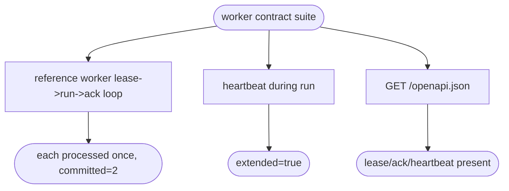

# relay + keep — worker-facing OpenAPI contract (polyglot worker integration)

The worker is **out of scope**: any language integrates over HTTP/2 + OpenAPI.
This deliverable is the contract, not a worker — a hand-written contract
document (`docs/worker-protocol.md`) plus a test-only reference worker that
drives the loop over h2c. relay's machine-readable contract is the OpenAPI
served at `/openapi.json` (lease / ack / heartbeat, from #113 / #115); keep's
get-input / put-result is a cross-project contract owned by the keep epic.

## Unit Test
<!-- type: unit-test lang: mermaid -->


## Changes
<!-- type: changes lang: yaml -->

```yaml
changes:
  - path: projects/relay/tests/worker_loop.rs
    action: create
    section: unit-test
    impl_mode: hand-written
    reason: "Throwaway reference worker (test-only): drives the lease / heartbeat / ack loop over h2c against an in-process relay, validating the worker-facing contract and the served OpenAPI (lease/ack/heartbeat)."
```

# Reviews

### Review 1
**Verdict:** approved

- [unit-test] A reference worker drives lease -> run -> heartbeat -> ack over h2c and asserts each entry is processed exactly once, plus the served OpenAPI lists lease/ack/heartbeat. Validates the worker-facing contract end-to-end. Applicable.
- [changes] One test-only reference worker; the machine contract is the already-served OpenAPI and the human contract is the TD intro / docs. No worker shipped in the lib. Applicable.
