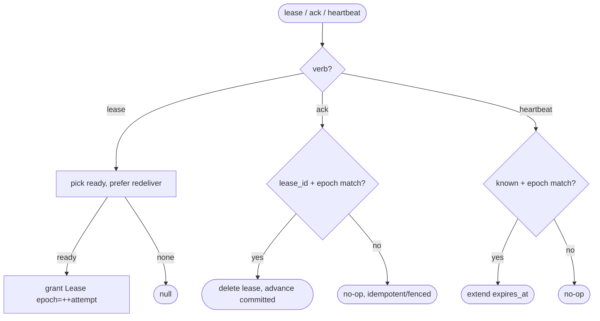
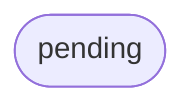

# relay work-queue API — lease / ack / heartbeat (epoch-fenced)

## Logic
<!-- type: logic lang: mermaid -->


## Schema
<!-- type: schema lang: yaml -->

```yaml
$schema: "https://json-schema.org/draft/2020-12/schema"
$id: relay-work-queue-api#schema
title: Relay Work-Queue API Types
description: >
  Epoch-fencing and heartbeat additions to the work-queue face. The lease grant
  reuses the core Lease (now carrying an epoch); ack and heartbeat carry the
  epoch so a fenced/old worker's late call is a no-op.

definitions:
  Epoch:
    type: integer
    $id: Epoch
    minimum: 1
    description: "Monotonic fencing token for a (subject, shard, seq): bumped on each (re)lease. ack/heartbeat with a stale epoch are no-ops."

  HeartbeatRequest:
    type: object
    $id: HeartbeatRequest
    x-rust-derive: ["Debug", "Clone", "Serialize", "Deserialize"]
    required: [lease_id, epoch]
    description: "Extend a held lease; proves the worker is alive."
    properties:
      lease_id: { type: string }
      epoch: { $ref: "#/definitions/Epoch" }

  HeartbeatResponse:
    type: object
    $id: HeartbeatResponse
    x-rust-derive: ["Debug", "Clone", "Serialize", "Deserialize"]
    required: [extended]
    description: "Whether the lease was extended (false when unknown / fenced)."
    properties:
      extended: { type: boolean }
      expires_at:
        oneOf:
          - { type: "null" }
          - { type: string, format: date-time }

  AckEpoch:
    type: object
    $id: AckEpoch
    description: "ack carries an optional epoch; when present it must match the live lease or the ack is a no-op (fenced). Absent epoch falls back to lease_id-only fencing."
    properties:
      lease_id: { type: string }
      epoch:
        oneOf:
          - { type: "null" }
          - { $ref: "#/definitions/Epoch" }
```
## Rest Api
<!-- type: rest-api lang: yaml -->

```yaml
(fill)
```

## Unit Test
<!-- type: unit-test lang: mermaid -->



## Changes
<!-- type: changes lang: yaml -->

```yaml
(fill)
```
