# relay work-queue API — lease / ack / heartbeat (epoch-fenced)

## Logic
<!-- type: logic lang: mermaid -->


## Schema
<!-- type: schema lang: yaml -->

```yaml
$schema: "https://json-schema.org/draft/2020-12/schema"
$id: relay-work-queue-api#schema
title: Relay Work-Queue API Types
description: >
  Epoch-fencing and heartbeat additions to the work-queue face. The lease grant
  reuses the core Lease (now carrying an epoch); ack and heartbeat carry the
  epoch so a fenced/old worker's late call is a no-op.

definitions:
  Epoch:
    type: integer
    $id: Epoch
    minimum: 1
    description: "Monotonic fencing token for a (subject, shard, seq): bumped on each (re)lease. ack/heartbeat with a stale epoch are no-ops."

  HeartbeatRequest:
    type: object
    $id: HeartbeatRequest
    x-rust-derive: ["Debug", "Clone", "Serialize", "Deserialize"]
    required: [lease_id, epoch]
    description: "Extend a held lease; proves the worker is alive."
    properties:
      lease_id: { type: string }
      epoch: { $ref: "#/definitions/Epoch" }

  HeartbeatResponse:
    type: object
    $id: HeartbeatResponse
    x-rust-derive: ["Debug", "Clone", "Serialize", "Deserialize"]
    required: [extended]
    description: "Whether the lease was extended (false when unknown / fenced)."
    properties:
      extended: { type: boolean }
      expires_at:
        oneOf:
          - { type: "null" }
          - { type: string, format: date-time }

  AckEpoch:
    type: object
    $id: AckEpoch
    description: "ack carries an optional epoch; when present it must match the live lease or the ack is a no-op (fenced). Absent epoch falls back to lease_id-only fencing."
    properties:
      lease_id: { type: string }
      epoch:
        oneOf:
          - { type: "null" }
          - { $ref: "#/definitions/Epoch" }
```
## Rest Api
<!-- type: rest-api lang: yaml -->

```yaml
openapi: 3.1.0
info:
  title: relay work-queue API
  version: 0.1.0
  description: >
    Competing-consumer work-queue verbs over HTTP/2 (h2c). Epoch-fenced:
    lease grants an epoch; ack/heartbeat carry it so a fenced worker's late
    call is a no-op. Generic — relay does not know workflows.
paths:
  /v1/{subject}/lease:
    post:
      operationId: lease
      summary: Lease the next ready entry (prefers a redeliver-eligible seq), returning a Lease with an epoch.
      parameters:
        - { name: subject, in: path, required: true, schema: { type: string } }
      requestBody:
        required: true
        content:
          application/json: { schema: { $ref: "#/components/schemas/LeaseRequest" } }
          application/cbor: { schema: { $ref: "#/components/schemas/LeaseRequest" } }
      responses:
        "200":
          description: A lease (with epoch) or null.
          content:
            application/json: { schema: { $ref: "#/components/schemas/LeaseResponse" } }
            application/cbor: { schema: { $ref: "#/components/schemas/LeaseResponse" } }
  /v1/{subject}/ack:
    post:
      operationId: ack
      summary: Acknowledge a lease; with a matching epoch it deletes the lease and advances the committed offset, otherwise it is a no-op (idempotent / fenced).
      parameters:
        - { name: subject, in: path, required: true, schema: { type: string } }
      requestBody:
        required: true
        content:
          application/json: { schema: { $ref: "#/components/schemas/AckRequest" } }
          application/cbor: { schema: { $ref: "#/components/schemas/AckRequest" } }
      responses:
        "200":
          description: Ack result.
          content:
            application/json: { schema: { $ref: "#/components/schemas/AckResponse" } }
            application/cbor: { schema: { $ref: "#/components/schemas/AckResponse" } }
  /v1/{subject}/heartbeat:
    post:
      operationId: heartbeat
      summary: Extend a held lease (epoch must match); no-op if the lease was reclaimed / fenced.
      parameters:
        - { name: subject, in: path, required: true, schema: { type: string } }
      requestBody:
        required: true
        content:
          application/json: { schema: { $ref: "#/components/schemas/HeartbeatRequest" } }
          application/cbor: { schema: { $ref: "#/components/schemas/HeartbeatRequest" } }
      responses:
        "200":
          description: Heartbeat result.
          content:
            application/json: { schema: { $ref: "#/components/schemas/HeartbeatResponse" } }
            application/cbor: { schema: { $ref: "#/components/schemas/HeartbeatResponse" } }
components:
  schemas:
    LeaseRequest:
      type: object
      required: [consumer_id]
      properties: { consumer_id: { type: string } }
    LeaseResponse:
      type: object
      properties:
        lease:
          oneOf:
            - { type: "null" }
            - { $ref: "#/components/schemas/Lease" }
    Lease:
      type: object
      required: [lease_id, seq, subject, shard, consumer_id, granted_at, expires_at, attempt, epoch]
      properties:
        lease_id: { type: string }
        seq: { type: integer, minimum: 0 }
        subject: { type: string }
        shard: { type: integer, minimum: 0 }
        consumer_id: { type: string }
        granted_at: { type: string, format: date-time }
        expires_at: { type: string, format: date-time }
        attempt: { type: integer, minimum: 1 }
        epoch: { type: integer, minimum: 1 }
    AckRequest:
      type: object
      required: [lease_id]
      properties:
        lease_id: { type: string }
        epoch:
          oneOf:
            - { type: "null" }
            - { type: integer, minimum: 1 }
    AckResponse:
      type: object
      required: [acked]
      properties:
        acked: { type: boolean }
        committed_seq:
          oneOf:
            - { type: "null" }
            - { type: integer, minimum: 0 }
    HeartbeatRequest:
      type: object
      required: [lease_id, epoch]
      properties:
        lease_id: { type: string }
        epoch: { type: integer, minimum: 1 }
    HeartbeatResponse:
      type: object
      required: [extended]
      properties:
        extended: { type: boolean }
        expires_at:
          oneOf:
            - { type: "null" }
            - { type: string, format: date-time }
```
## Unit Test

```mermaid
---
id: relay-work-queue-api-test-plan
entry: suite
nodes:
  suite:
    kind: start
    label: "work-queue API tests (single shard)"
  t_pick:
    kind: process
    label: "publish 2; lease, let one expire + reclaim, lease again"
  a_pick:
    kind: terminal
    label: "assert the second lease PREFERS the redeliver-eligible seq over the fresh one"
  t_ack_epoch:
    kind: process
    label: "lease (epoch e1), reclaim, re-lease (epoch e2), then ack(lease_id_old, e1)"
  a_ack_epoch:
    kind: terminal
    label: "assert the stale-epoch ack is a no-op (acked=false); ack(lease_id_new, e2) succeeds"
  t_ack_idem:
    kind: process
    label: "ack a lease twice with the right epoch"
  a_ack_idem:
    kind: terminal
    label: "assert first ack acked=true, second acked=false (idempotent)"
  t_heartbeat:
    kind: process
    label: "lease, heartbeat(lease_id, epoch) just before ttl"
  a_heartbeat:
    kind: terminal
    label: "assert extended=true and the entry is NOT reclaimed after the original ttl"
  t_hb_fenced:
    kind: process
    label: "lease, reclaim, heartbeat(old lease_id, old epoch)"
  a_hb_fenced:
    kind: terminal
    label: "assert extended=false (fenced)"
edges:
  - { from: suite, to: t_pick, label: "case: prefer redeliver" }
  - { from: t_pick, to: a_pick }
  - { from: suite, to: t_ack_epoch, label: "case: epoch fence" }
  - { from: t_ack_epoch, to: a_ack_epoch }
  - { from: suite, to: t_ack_idem, label: "case: idempotent ack" }
  - { from: t_ack_idem, to: a_ack_idem }
  - { from: suite, to: t_heartbeat, label: "case: heartbeat extend" }
  - { from: t_heartbeat, to: a_heartbeat }
  - { from: suite, to: t_hb_fenced, label: "case: heartbeat fenced" }
  - { from: t_hb_fenced, to: a_hb_fenced }
---
flowchart TD
    suite([work-queue API suite]) --> t_pick[lease, expire one, re-lease]
    t_pick --> a_pick([prefers redeliver-eligible])
    suite --> t_ack_epoch[stale-epoch ack after re-lease]
    t_ack_epoch --> a_ack_epoch([stale ack no-op; new ack ok])
    suite --> t_ack_idem[ack twice]
    t_ack_idem --> a_ack_idem([second ack no-op])
    suite --> t_heartbeat[heartbeat before ttl]
    t_heartbeat --> a_heartbeat([extended, not reclaimed])
    suite --> t_hb_fenced[heartbeat after reclaim]
    t_hb_fenced --> a_hb_fenced([extended=false])
```

<!-- type: unit-test lang: mermaid -->


## Changes
<!-- type: changes lang: yaml -->

```yaml
changes:
  - path: projects/relay/src/types.rs
    action: modify
    section: schema
    impl_mode: hand-written
    reason: "Add the epoch fencing token to Lease."
  - path: projects/relay/src/workqueue.rs
    action: modify
    section: logic
    impl_mode: hand-written
    reason: "Prefer redeliver-eligible seqs on lease; carry epoch; epoch-checked ack (idempotent / fenced); heartbeat to extend a lease."
  - path: projects/relay/src/engine.rs
    action: modify
    section: logic
    impl_mode: hand-written
    reason: "Expose heartbeat and epoch-checked ack through the Relay facade."
  - path: projects/relay/src/wire.rs
    action: modify
    section: schema
    impl_mode: hand-written
    reason: "AckRequest gains an optional epoch; add HeartbeatRequest / HeartbeatResponse DTOs."
  - path: projects/relay/src/server.rs
    action: modify
    section: logic
    impl_mode: hand-written
    reason: "Honor the ack epoch and add the POST heartbeat endpoint (JSON + CBOR)."
  - path: projects/relay/src/openapi.rs
    action: modify
    section: rest-api
    impl_mode: hand-written
    reason: "Add the heartbeat path to the served OpenAPI document."
  - path: projects/relay/tests/work_queue_api.rs
    action: create
    section: unit-test
    impl_mode: hand-written
    reason: "Tests for prefer-redeliver lease pick, epoch-fenced + idempotent ack, and heartbeat extend / fence."
```

# Reviews

### Review 1
**Verdict:** approved

- [logic] The verb flow is sound: prefer-redeliver lease pick, epoch granted per (re)lease, ack/heartbeat no-op on unknown lease_id or stale epoch. Fencing follows from both lease_id uniqueness and the epoch check, satisfying exactly-one delivery and worker-death safety.
- [schema] Epoch is a minimal monotonic token; Heartbeat DTOs and the optional ack epoch keep the #115 wire backward-compatible (absent epoch = lease_id-only fencing).
- [rest-api] lease/ack/heartbeat are fully specified with epoch in the Lease and ack body and a new heartbeat path; JSON + CBOR on each.
- [unit-test] Cases map 1:1 to behavior and to the #113 acceptance (lease pick, idempotent ack, redeliver) plus heartbeat extend/fence.
- [changes] Edits are bounded to the work-queue surface (types/workqueue/engine/wire/server/openapi) + one new test file; no new external-project dependency.
