## Logic

```mermaid
---
id: relay-adopt-raft-host-flow
entry: boot
nodes:
  boot:
    kind: start
    label: "serve_main (bare `relay`): existing config resolution unchanged (bind, data dir, auth, reconciler). New: derive the peer port from the bind address and read --peer-service (RELAY_PEER_SERVICE, default relay) for the headless-Service DNS template"
  mode:
    kind: decision
    label: "raft_host::cluster::replica_mode(): REPLICAS_PER_SHARD > 1 from the standard downward-API quartet? Unset env or 1 replica = single-node — the auto-mode switch; no relay-specific flags"
  single:
    kind: process
    label: "Single-node path (default, AC1): today's direct-engine router exactly — publish/publish-batch/lease/ack/consume hit Arc<Relay> in-process; no raft task, no peer surface, zero behavior change"
  topo:
    kind: process
    label: "HA path: ClusterTopology::from_env('relay', peer_service, peer_port, 'RELAY_PEERS') — node_id = replica index, voters 0..VOTER_COUNT, peer URLs relay-<ordinal>.<svc>:<port> or the RELAY_PEERS local override. NO local ordinal math (deletes raft_config.rs; CONTRIBUTING: never re-derive it)"
  spawn:
    kind: process
    label: "RelayRaft::spawn: raft_host::RaftStore::open({data_dir}/raft, node_id, Always) replaces relay's raft_store.rs; RelayStateMachine::new(Arc<Relay>, marker path) recovers its applied floor; RaftHost::spawn(node_id, membership, peers, store, sm, HostConfig with snapshot EveryEntries(1024)) replaces the whole hand-rolled raft_driver.rs tick/pump/flush/persist-before-flush loop"
  mount:
    kind: process
    label: "app = router(state-with-raft).merge(host.router()): /raft/request-vote, /raft/append-entries, /raft/install-snapshot, /raft/publish, /raftz ride the SAME serve port but OUTSIDE the bearer-auth data plane (cluster traffic, tokenless like probes; mTLS is a later slice). The relay-raft bin and its bespoke env contract are deleted"
  pub:
    kind: decision
    label: "Data-plane publish/publish-batch: HA mode? Encode PubCommand with subject, message_id, payload, headers, priority, not_before (multi-subject — upgrade over the old single-subject driver) and host.propose(cmd) — the host proposes locally on the leader or forwards to the leader's /raft/publish (421 not-leader hint for direct peers), waits for THIS node's apply (read-your-write)"
  apply:
    kind: process
    label: "RelayStateMachine::apply(index, cmd) on EVERY node, once, in index order: relay.publish_at(subject, message_id, payload, headers, not_before, priority, now) — idempotent per message_id; outcome {seq, deduped} stashed in an OutcomeWindow keyed by raft index so the proposing handler returns the engine outcome; then the applied marker file (tmp+rename+fsync in the raft dir) records the floor. Engine seqs are node-local; the raft index is the global order"
  floor:
    kind: process
    label: "Restart honesty: RaftHost cold-replays resident committed entries; entries at or below the recovered marker are SKIPPED. Without the floor, delete-on-ack (segments dropped) + the bounded dedupe window would let old committed publishes re-append (resurrect acked work). With FsyncPolicy::Always the engine append is durable before the marker advances, so the floor is never ahead of engine state"
  snap:
    kind: process
    label: "SnapshotPolicy::EveryEntries: the host calls sm.snapshot() = up_to (applied) + relay.dump_live() — for every open (subject, shard) the committed-watermark cut: only un-acked entries (log.range(watermark)); node.compact bounds the raft log. restore() (follower InstallSnapshot / cold-start) = relay.load_live: re-publish each entry idempotently via publish_at (dedupe merges; delayed entries keep not_before), then applied floor := up_to"
  local:
    kind: terminal
    label: "Lease/ack/heartbeat/consume/len stay NODE-LOCAL in HA mode (unchanged handlers): leases are not replicated — exactly the old driver's model, which replicated publishes only. Documented limitation (TD + llm operations topic): on failover the new leader redelivers work that was leased-but-unacked (and acked work not yet trimmed by a snapshot install) — at-least-once, fenced per-node by lease epochs"
  k8s:
    kind: terminal
    label: "k8s/statefulset.yaml switches to the standard contract raft-host reads: POD_NAME (downward API), SHARD_COUNT=1, REPLICAS_PER_SHARD, VOTER_COUNT + RELAY_PEER_SERVICE=relay (headless Service); the image runs the single `relay` entrypoint (Dockerfile drops relay-raft); readiness moves to /readyz"
edges:
  - { from: boot, to: mode }
  - { from: mode, to: single, label: "no cluster env / 1 replica" }
  - { from: mode, to: topo, label: "REPLICAS_PER_SHARD > 1" }
  - { from: topo, to: spawn }
  - { from: spawn, to: mount }
  - { from: mount, to: pub }
  - { from: pub, to: apply, label: "propose -> commit -> sole applier" }
  - { from: apply, to: floor, label: "marker persisted per apply" }
  - { from: apply, to: snap, label: "applied - snapshot_index >= threshold" }
  - { from: pub, to: local, label: "non-publish verbs" }
  - { from: snap, to: k8s }
  - { from: floor, to: k8s }
---
flowchart TD
    boot([serve_main: bind and peer-service resolved]) --> mode{replica_mode: REPLICAS_PER_SHARD gt 1?}
    mode -->|no| single[direct-engine path unchanged — zero flags, zero behavior change]
    mode -->|yes| topo[ClusterTopology::from_env relay / RELAY_PEER_SERVICE / RELAY_PEERS — no local ordinal math]
    topo --> spawn[RelayRaft::spawn: raft_host RaftStore + RelayStateMachine + RaftHost]
    spawn --> mount[merge host.router onto serve port outside bearer auth]
    mount --> pub{publish or publish-batch?}
    pub -->|yes| apply[PubCommand -> host.propose -> apply on every node: idempotent publish_at + OutcomeWindow + fsynced applied marker]
    pub -->|no| local[lease/ack/consume stay node-local — leases not replicated, at-least-once failover]
    apply --> floor[restart: cold-replay skips entries at or below the recovered marker — no resurrection of acked work]
    apply --> snap[snapshot = live dump_live cut; restore = idempotent load_live; compaction bounds the raft log]
    snap --> k8s([statefulset: POD_NAME / SHARD_COUNT / REPLICAS_PER_SHARD / VOTER_COUNT; single relay image])
    floor --> k8s
```

<!-- type: logic lang: mermaid -->



## Unit Test
<!-- type: unit-test lang: mermaid -->

```mermaid
---
id: relay-adopt-raft-host-verification
requirements:
  applied_floor_survives_restart:
    id: R1
    text: "applied_index survives restart via the fsynced marker in the raft data dir: a single-node group restarted from its data dir rejoins with applied state intact and cold-replay performs no double-apply — both the message_id idempotency path and the marker floor are exercised, including the resurrection case where acked work was already trimmed by delete-on-ack (dropped segments + evicted dedupe entries) and only the floor prevents re-append."
    kind: functional
    risk: high
    verify: tests/raft_persistence.rs::acked_work_is_not_resurrected_by_cold_replay
  auto_mode_serve:
    id: R3
    text: "Auto-mode: bare `relay` with no cluster env keeps the direct-engine path (full pre-existing suite green, zero new flags required); with REPLICAS_PER_SHARD > 1 the serve path derives ClusterTopology::from_env('relay', RELAY_PEER_SERVICE, serve port, 'RELAY_PEERS'), spawns the host, mounts its router outside the bearer-auth data plane, and publish/publish-batch propose through the host — a follower publish is forwarded to the leader by the host and a direct POST to a follower's /raft/publish answers 421 not-leader."
    kind: functional
    risk: high
    verify: tests/raft_cluster.rs::three_node_group_elects_replicates_forwards_and_fails_over
  failover_no_committed_loss:
    id: R5
    text: "Failover: killing the leader of a 3-node group re-elects a survivor and new publishes commit; previously committed publishes remain readable on every survivor (no committed loss). Restart recovery: a node restarted from its data dir resumes with its raft hard state and applied floor intact and accepts new proposes."
    kind: functional
    risk: high
    verify: tests/raft_persistence.rs::restart_rejoins_with_applied_state_intact
  hand_rolled_stack_deleted:
    id: R2
    text: "src/raft_driver.rs, src/raft_store.rs, src/raft_config.rs and src/bin/relay_raft.rs are deleted along with their lib.rs exports: grep for raft_driver|raft_store|raft_config over projects/relay/src and projects/relay/tests returns no hits, and cargo test -p relay stays green with raft-host supplying store, transport, and topology."
    kind: regression
    risk: medium
    verify: cargo test -p relay (workspace grep gate in the WI AC5)
  k8s_standard_contract:
    id: R4
    text: "k8s/statefulset.yaml injects the standard contract raft-host reads (POD_NAME via the downward API, SHARD_COUNT=1, REPLICAS_PER_SHARD, VOTER_COUNT, RELAY_PEER_SERVICE) and runs the single `relay` image entrypoint; the Dockerfile no longer builds or copies relay-raft."
    kind: functional
    risk: low
    verify: manifest review: projects/relay/k8s/statefulset.yaml + projects/relay/Dockerfile
  llm_operations_auto_mode:
    id: R6
    text: "The relay llm operations topic replaces the relay-raft paragraph with the auto-mode story: REPLICAS_PER_SHARD > 1 flips HA on the single relay bin, RELAY_PEERS overrides peer DNS for a local multi-node group, and the leases-not-replicated / at-least-once failover limitation is stated."
    kind: functional
    risk: low
    verify: src/llm.rs operations topic body (relay llm operations)
  raft_core_sim_kept_honest:
    id: R5
    text: "tests/raft_core.rs (the deterministic relay-integration simulation) keeps compiling honestly against the raft_core crate directly as a dev-dependency — relay no longer re-exports the consensus core surface it does not own."
    kind: regression
    risk: low
    verify: tests/raft_core.rs::relay_engines_converge_across_failover
  snapshot_restore_live_state:
    id: R1
    text: "snapshot serializes the live (un-acked) engine state via Relay::dump_live (committed-watermark cut per open (subject, shard)) tagged with the applied index; restore rebuilds via Relay::load_live (idempotent publish_at re-append preserving not_before/priority) and sets the applied floor to the snapshot's up_to. Exercised through the real host path: a small SnapshotPolicy threshold triggers compaction and a fresh node catches up via InstallSnapshot."
    kind: functional
    risk: high
    verify: tests/raft_cluster.rs::fresh_node_catches_up_via_install_snapshot
  state_machine_apply_and_outcome:
    id: R1
    text: "RelayStateMachine implements raft_host::RaftStateMachine over Arc<Relay>: apply decodes PubCommand { subject, message_id, payload, headers, priority, not_before } and publishes idempotently through Relay::publish_at (a re-applied or duplicate message_id dedupes instead of double-appending); the apply outcome {seq, deduped} is claimable by raft index from the OutcomeWindow so a proposing handler returns the engine outcome. Verified end-to-end by a 3-node in-process group: a publish proposed on the leader is applied and readable via the engine on ALL nodes."
    kind: functional
    risk: high
    verify: tests/raft_cluster.rs::three_node_group_elects_replicates_forwards_and_fails_over
  topology_from_standard_env:
    id: R3
    text: "relay derives its cluster topology exclusively from the standard downward-API quartet via raft-host (no local ordinal math): with POD_NAME/SHARD_COUNT/REPLICAS_PER_SHARD/VOTER_COUNT set, ClusterTopology::from_env('relay', ...) yields the replica node id, the voter membership, and peer URLs honoring the RELAY_PEERS local override; replica_mode() is false when the env is unset or REPLICAS_PER_SHARD=1."
    kind: functional
    risk: medium
    verify: tests/raft_config.rs::topology_derives_from_standard_env_via_raft_host
---
flowchart TD
    r1[R1 applied floor survives restart] --> tests_raft_persistence_rs_acked_work_is_not_resurrected_by_cold_replay[tests/raft_persistence.rs::acked_work_is_not_resurrected_by_cold_replay]
    r1[R1 snapshot restore live state] --> tests_raft_cluster_rs_fresh_node_catches_up_via_install_snapshot[tests/raft_cluster.rs::fresh_node_catches_up_via_install_snapshot]
    r1[R1 state machine apply and outcome] --> tests_raft_cluster_rs_three_node_group_elects_replicates_forwards_and_fails_over[tests/raft_cluster.rs::three_node_group_elects_replicates_forwards_and_fails_over]
    r3[R3 auto mode serve] --> tests_raft_cluster_rs_three_node_group_elects_replicates_forwards_and_fails_over
    r2[R2 hand rolled stack deleted] --> cargo_test_p_relay_workspace_grep_gate_in_the_wi_ac5[cargo test -p relay (workspace grep gate in the WI AC5)]
    r3[R3 topology from standard env] --> tests_raft_config_rs_topology_derives_from_standard_env_via_raft_host[tests/raft_config.rs::topology_derives_from_standard_env_via_raft_host]
    r4[R4 k8s standard contract] --> manifest_review_projects_relay_k8s_statefulset_yaml_projects_relay_dockerfile[manifest review: projects/relay/k8s/statefulset.yaml + projects/relay/Dockerfile]
    r5[R5 failover no committed loss] --> tests_raft_persistence_rs_restart_rejoins_with_applied_state_intact[tests/raft_persistence.rs::restart_rejoins_with_applied_state_intact]
    r5[R5 raft core sim kept honest] --> tests_raft_core_rs_relay_engines_converge_across_failover[tests/raft_core.rs::relay_engines_converge_across_failover]
    r6[R6 llm operations auto mode] --> src_llm_rs_operations_topic_body_relay_llm_operations[src/llm.rs operations topic body (relay llm operations)]
```
