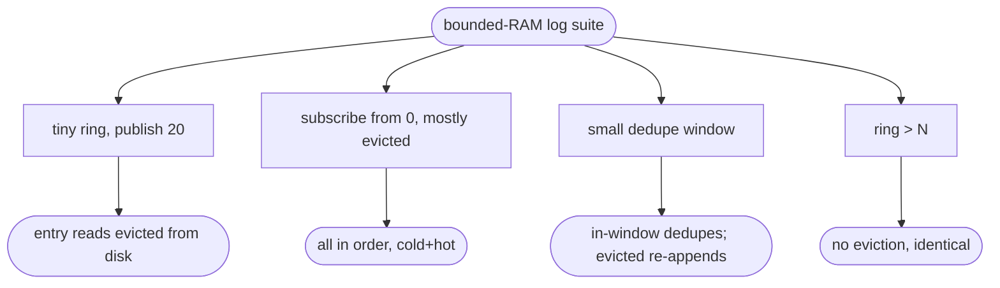

# relay bounded-RAM durable log — entry eviction + offset index + disk-backed reads + dedupe window

## Logic
<!-- type: logic lang: mermaid -->


## Unit Test
<!-- type: unit-test lang: mermaid -->


## Changes
<!-- type: changes lang: yaml -->

```yaml
changes:
  - path: projects/relay/src/log.rs
    action: modify
    section: logic
    impl_mode: hand-written
    reason: "Bound RAM: keep a VecDeque ring of the most recent ram_ring_entries plus a dense Vec<u64> byte-offset index; append records the offset and evicts the oldest ring entry; entry/range read evicted seqs from disk via the offset index (sequential read for the cold prefix of a range). Bound dedupe to window_entries with FIFO eviction. Replay on open rebuilds offsets + ring(last cap) + dedupe(window) + len + write_pos."
  - path: projects/relay/tests/bounded_log.rs
    action: create
    section: unit-test
    impl_mode: hand-written
    reason: "Tests: disk-backed entry() for evicted seqs, broadcast range/replay across the evict boundary, bounded dedupe window (in-window dedupes, evicted re-appends), and no-eviction parity when the ring exceeds N."
```

# Reviews

### Review 1
**Verdict:** approved

- [logic] Sound: a dense offset index + a bounded ring give RAM ~8 bytes/entry instead of a full entry; cold reads seek the offset and read the line; range reads the cold prefix sequentially then the hot tail; dedupe is a FIFO window. Replay rebuilds all of it. Scales beyond RAM without changing the hot path.
- [unit-test] Covers disk-backed reads for evicted seqs, replay across the evict boundary, the bounded dedupe window (in-window dedupes, evicted re-appends), and no-eviction parity.
- [changes] Bounded to log.rs + a new test; reuses existing config knobs.
