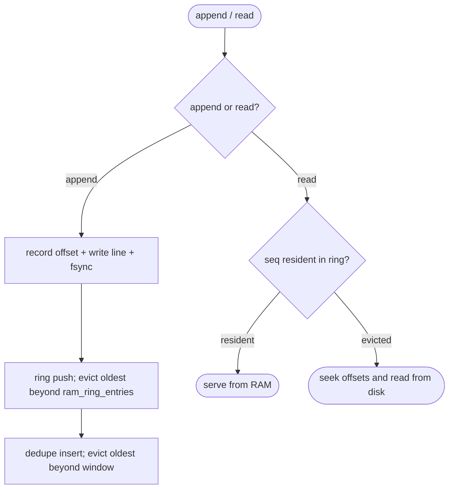

# relay bounded-RAM durable log — entry eviction + offset index + disk-backed reads + dedupe window

## Logic
<!-- type: logic lang: mermaid -->


## Unit Test
<!-- type: unit-test lang: mermaid -->


## Changes
<!-- type: changes lang: yaml -->

```yaml
(fill)
```
