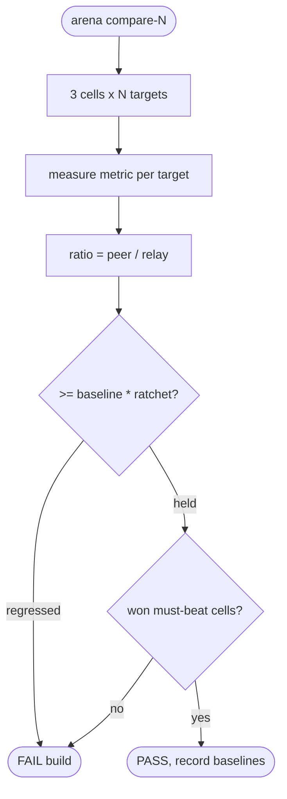
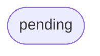

# relay competitor perf-gate — vs NATS / RabbitMQ / Redpanda (arena, ratchet)

## Logic
<!-- type: logic lang: mermaid -->


## Config
<!-- type: config lang: yaml -->

```yaml
(fill)
```

## Unit Test
<!-- type: unit-test lang: mermaid -->



## Changes
<!-- type: changes lang: yaml -->

```yaml
(fill)
```
