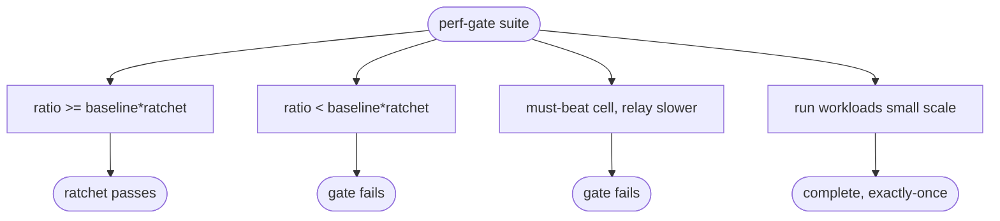

# relay competitor perf-gate — vs NATS / RabbitMQ / Redpanda (arena, ratchet)

## Logic
<!-- type: logic lang: mermaid -->


## Config
<!-- type: config lang: yaml -->

```yaml
# relay perf-gate (arena compare-N + ratchet); mirrors lumen perf_gate_vs_db.
# The live comparison runs via arena against the spec referenced by the relay
# project's ec.benchmark binding in .aw/config.toml. Competitor adapters run in
# CI: NATS / RabbitMQ / Redpanda speak native (non-HTTP) protocols, so they use
# arena's command flavor, while relay is driven over its HTTP/2 service.

base: relay            # ratios divide by relay
ratchet: 0.95          # relay may not drop below 95% of its recorded baseline ratio
primary_bar: nats      # the thing relay replaces; must-beat where claimed

cells:
  broadcast:
    competitors: [nats-core, redis-pubsub]
    metric: fanout_p99_ms      # lower is better
    must_beat: [nats-core]
  work_queue:
    competitors: [rabbitmq-quorum, nats-jetstream, redis-streams]
    metric: lease_ack_qps      # higher is better
    must_beat: [nats-jetstream]
  durable_log:
    competitors: [redpanda, pulsar]
    metric: append_qps         # higher is better
    must_beat: []              # report-only vs Kafka-class for now
```
## Unit Test
<!-- type: unit-test lang: mermaid -->


## Changes
<!-- type: changes lang: yaml -->

```yaml
changes:
  - path: projects/relay/Cargo.toml
    action: modify
    section: config
    impl_mode: hand-written
    reason: "Add criterion dev-dependency and the relay_bench benchmark target."
  - path: projects/relay/src/perf_gate.rs
    action: create
    section: logic
    impl_mode: hand-written
    reason: "The ratchet gate rule: evaluate per-cell ratios against the recorded baseline (no-regression) plus must-beat, returning a pass/fail verdict."
  - path: projects/relay/src/lib.rs
    action: modify
    section: logic
    impl_mode: hand-written
    reason: "Declare and re-export the perf_gate module."
  - path: projects/relay/benches/relay_bench.rs
    action: create
    section: unit-test
    impl_mode: hand-written
    reason: "criterion benchmarks for the three gate cells: append throughput, broadcast fan-out, work-queue lease+ack cycle (the relay-side measurement)."
  - path: projects/relay/tests/perf_gate.rs
    action: create
    section: unit-test
    impl_mode: hand-written
    reason: "Tests for the ratchet rule (holds / regresses / must-beat lost) and a small-scale smoke of the benched workloads."
```

# Reviews

### Review 1
**Verdict:** approved

- [logic] compare-N -> measure -> ratio -> ratchet (no-regression) -> must-beat -> pass/fail. Mirrors lumen's perf gate; primary bar NATS. Applicable.
- [config] base/ratchet/primary_bar + the three cells with competitors, metric direction, and must-beat sets. Applicable.
- [unit-test] Ratchet holds/regresses/must-beat-lost + a small-scale smoke of the benched workloads. Applicable.
- [changes] relay-side: criterion benches + ratchet-rule module + tests; the arena spec and EC binding are repo/cross-project infra added alongside. Applicable.
