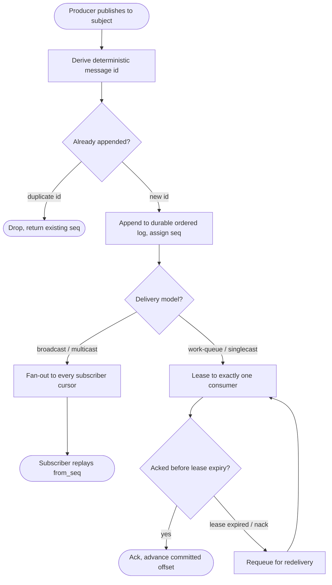
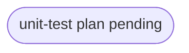

# relay core — durable log + single/multi/broadcast delivery model

## Logic
<!-- type: logic lang: mermaid -->


## Schema
<!-- type: schema lang: yaml -->

```yaml
(fill)
```

## Config
<!-- type: config lang: yaml -->

```yaml
(fill)
```

## Unit Test
<!-- type: unit-test lang: mermaid -->


