# relay core — durable log + single/multi/broadcast delivery model

## Logic
<!-- type: logic lang: mermaid -->


## Schema
<!-- type: schema lang: yaml -->

```yaml
$schema: "https://json-schema.org/draft/2020-12/schema"
$id: relay-core-durable-log#schema
title: Relay Core Durable Log Types
description: >
  Core in-process data model for the relay broker: a durable ordered log per
  (subject, shard) plus the per-model delivery state that reads from it. The
  message payload reuses the cclab-queue message model unchanged; relay owns
  only the log, sequencing, dedupe, subscriber cursors, and work-queue leases.

definitions:
  Subject:
    type: string
    $id: Subject
    description: "Logical channel a producer publishes to and consumers subscribe on."

  ShardId:
    type: integer
    $id: ShardId
    minimum: 0
    description: "Partition of a subject's log; ordering and sequencing are per (subject, shard)."

  Seq:
    type: integer
    $id: Seq
    minimum: 0
    description: "Monotonic, gap-free position assigned on append within one (subject, shard). The replay and ack cursors are expressed in this space."

  MessageId:
    type: string
    $id: MessageId
    description: "Deterministic id derived from producer key + content, used as the idempotency/dedupe key so an at-least-once retry maps to the same log entry."

  DeliveryModel:
    type: string
    $id: DeliveryModel
    x-rust-derive: ["Debug", "Clone", "Copy", "PartialEq", "Eq", "Hash", "Serialize", "Deserialize"]
    enum:
      - singlecast
      - multicast
      - broadcast
      - work_queue
    description: >
      How a subject's appended messages are delivered. `broadcast`/`multicast`
      fan out every message to every (group) subscriber, replayable from a seq.
      `work_queue` leases each message to exactly one competing consumer.
      `singlecast` is the degenerate one-consumer case of work_queue.

  Payload:
    $id: Payload
    x-rust-type: "serde_json::Value"
    description: >
      Opaque message body. Per epic #120 the broker "knows nothing about
      workflows", so the core stores the payload verbatim as JSON and never
      reinterprets it. A producer reusing the cclab-queue message model
      serializes its TaskMessage into this value; relay only needs the
      caller-supplied MessageId for sequencing and dedupe. (The cclab-queue
      retry / revocation *semantics* are still reused by the work-queue lease /
      attempt / redeliver model.)

  LogEntry:
    type: object
    $id: LogEntry
    x-rust-derive: ["Debug", "Clone", "PartialEq", "Serialize", "Deserialize"]
    required: [seq, message_id, subject, shard, payload, appended_at]
    description: "One durable record in the ordered log; the unit of both broadcast replay and work-queue lease."
    properties:
      seq:
        $ref: "#/definitions/Seq"
        description: "Monotonic position within (subject, shard)."
      message_id:
        $ref: "#/definitions/MessageId"
      subject:
        $ref: "#/definitions/Subject"
      shard:
        $ref: "#/definitions/ShardId"
      payload:
        $ref: "#/definitions/Payload"
      headers:
        type: object
        additionalProperties: { type: string }
        description: "Opaque routing/trace headers carried with the entry."
      appended_at:
        type: string
        format: date-time
        description: "Server time the entry was durably appended."

  AppendOutcome:
    type: object
    $id: AppendOutcome
    x-rust-derive: ["Debug", "Clone", "Copy", "PartialEq", "Eq", "Serialize", "Deserialize"]
    required: [seq, deduped]
    description: "Result of a publish/append; idempotent on MessageId."
    properties:
      seq:
        $ref: "#/definitions/Seq"
        description: "Seq of the (new or pre-existing) entry."
      deduped:
        type: boolean
        description: "True when the id was already present and no new entry was written."

  SubscriberCursor:
    type: object
    $id: SubscriberCursor
    x-rust-derive: ["Debug", "Clone", "PartialEq", "Eq", "Serialize", "Deserialize"]
    required: [subscriber_id, subject, shard, from_seq, position]
    description: "Broadcast/fan-out read position; each subscriber advances independently and may replay from any seq."
    properties:
      subscriber_id:
        type: string
        description: "Stable id of a broadcast subscriber (or member of a multicast group)."
      subject:
        $ref: "#/definitions/Subject"
      shard:
        $ref: "#/definitions/ShardId"
      from_seq:
        $ref: "#/definitions/Seq"
        description: "Seq the subscription (re)started replay from."
      position:
        $ref: "#/definitions/Seq"
        description: "Seq of the last entry delivered to this subscriber."

  Lease:
    type: object
    $id: Lease
    x-rust-derive: ["Debug", "Clone", "PartialEq", "Eq", "Serialize", "Deserialize"]
    required: [lease_id, seq, subject, shard, consumer_id, granted_at, expires_at, attempt]
    description: "Work-queue grant of one entry to exactly one consumer until it acks or the lease expires."
    properties:
      lease_id:
        type: string
        description: "Unique id for this grant; required to ack/extend."
      seq:
        $ref: "#/definitions/Seq"
        description: "Leased entry position."
      subject:
        $ref: "#/definitions/Subject"
      shard:
        $ref: "#/definitions/ShardId"
      consumer_id:
        type: string
        description: "Consumer the entry is currently leased to."
      granted_at:
        type: string
        format: date-time
      expires_at:
        type: string
        format: date-time
        description: "On expiry the entry becomes eligible for redelivery to another consumer."
      attempt:
        type: integer
        minimum: 1
        description: "1-based delivery attempt; drives retry / revocation policy."

  CommittedOffset:
    type: object
    $id: CommittedOffset
    x-rust-derive: ["Debug", "Clone", "Copy", "PartialEq", "Eq", "Serialize", "Deserialize"]
    required: [subject, shard, committed_seq]
    description: "Work-queue durable progress: every entry at or below committed_seq has been acked."
    properties:
      subject:
        $ref: "#/definitions/Subject"
      shard:
        $ref: "#/definitions/ShardId"
      committed_seq:
        $ref: "#/definitions/Seq"
```
## Config
<!-- type: config lang: yaml -->

```yaml
# RelayCoreConfig — in-process broker core engine settings.
# All durability/retention is local to this core; transport, sharding fan-out,
# and HA live in the server issues (#115 / #109) and are out of scope here.

# Durable ordered log substrate (RAM ring + disk segments).
data_dir: "./relay-data"        # root directory for durable disk segments
segment_bytes: 134217728        # roll to a new disk segment at 128 MiB
ram_ring_entries: 65536         # hot in-memory entries retained per (subject, shard) for low-latency fan-out / replay
fsync: "interval"               # durability policy: always | interval | os
fsync_interval_ms: 50           # flush cadence when fsync = interval
default_shards: 1               # shards per subject unless the subject overrides it

# Idempotent at-least-once append: how long a MessageId is remembered for dedupe.
dedupe:
  window_entries: 1048576       # MessageIds retained per shard for duplicate detection
  ttl_secs: 3600                # also evict dedupe keys older than this

# Work-queue / competing-consumer delivery (reuses the cclab-queue retry / revocation model).
work_queue:
  lease_ttl_ms: 30000           # lease duration before an unacked entry is redelivery-eligible
  max_attempts: 5               # redelivery attempts before revocation / dead-letter
  redeliver_backoff_ms: 1000    # base backoff between delivery attempts

# Broadcast / fan-out delivery (replayable from any retained seq).
broadcast:
  max_replay_entries: 0         # 0 = replay from any retained seq; >0 caps replay depth

# Retention / pruning of the durable log.
retention:
  max_age_secs: 604800          # prune fully-acked / aged segments after 7 days
  max_bytes_per_shard: 0        # 0 = unbounded; else prune oldest segments past this size
```
## Unit Test

```mermaid
---
id: relay-core-unit-test-plan
entry: suite
nodes:
  suite:
    kind: start
    label: "relay core in-process test suite over one durable (subject, shard) log"
  t_seq:
    kind: process
    label: "append N messages -> AppendOutcome.seq is 0..N-1, monotonic and gap-free"
  a_seq:
    kind: terminal
    label: "assert seqs strictly increasing, entries readable back in order"
  t_dedupe:
    kind: process
    label: "append the same MessageId twice"
  a_dedupe:
    kind: terminal
    label: "assert one LogEntry; second AppendOutcome.deduped=true with the same seq (idempotent at-least-once)"
  t_broadcast_all:
    kind: process
    label: "two broadcast subscribers, publish 3 messages"
  a_broadcast_all:
    kind: terminal
    label: "assert both subscribers receive all 3 in seq order (fan-out, no message dropped)"
  t_replay:
    kind: process
    label: "subscribe broadcast with from_seq=K after M>K entries exist"
  a_replay:
    kind: terminal
    label: "assert delivery starts at K and covers K..M-1 in order (replayable from seq)"
  t_workqueue_one:
    kind: process
    label: "two competing consumers on the same log, publish 3 messages"
  a_workqueue_one:
    kind: terminal
    label: "assert each seq leased to exactly one consumer; union covers all, intersection empty"
  t_lease_expiry:
    kind: process
    label: "consumer leases an entry and does not ack before lease_ttl"
  a_lease_expiry:
    kind: terminal
    label: "assert entry is redelivered to another consumer with attempt incremented (retry/revocation)"
  t_ack_commit:
    kind: process
    label: "consumer acks its leased entry"
  a_ack_commit:
    kind: terminal
    label: "assert CommittedOffset.committed_seq advances and the entry is not redelivered"
  t_both_models:
    kind: process
    label: "ACCEPTANCE: one broadcast subscriber and one work-queue consumer on the same subject/log"
  a_both_models:
    kind: terminal
    label: "assert the broadcast subscriber sees every message AND the work-queue consumer leases each exactly once, over the same durable log"
edges:
  - { from: suite, to: t_seq, label: "case: sequencing" }
  - { from: t_seq, to: a_seq }
  - { from: suite, to: t_dedupe, label: "case: idempotency" }
  - { from: t_dedupe, to: a_dedupe }
  - { from: suite, to: t_broadcast_all, label: "case: fan-out" }
  - { from: t_broadcast_all, to: a_broadcast_all }
  - { from: suite, to: t_replay, label: "case: replay" }
  - { from: t_replay, to: a_replay }
  - { from: suite, to: t_workqueue_one, label: "case: competing" }
  - { from: t_workqueue_one, to: a_workqueue_one }
  - { from: suite, to: t_lease_expiry, label: "case: redelivery" }
  - { from: t_lease_expiry, to: a_lease_expiry }
  - { from: suite, to: t_ack_commit, label: "case: ack/commit" }
  - { from: t_ack_commit, to: a_ack_commit }
  - { from: suite, to: t_both_models, label: "case: acceptance" }
  - { from: t_both_models, to: a_both_models }
---
flowchart TD
    suite([relay core test suite]) --> t_seq[append N -> monotonic seq]
    t_seq --> a_seq([seqs ordered and gap-free])
    suite --> t_dedupe[append same MessageId twice]
    t_dedupe --> a_dedupe([one entry, deduped=true, same seq])
    suite --> t_broadcast_all[2 subscribers, publish 3]
    t_broadcast_all --> a_broadcast_all([both get all 3 in order])
    suite --> t_replay[subscribe from_seq=K]
    t_replay --> a_replay([delivery starts at K, ordered])
    suite --> t_workqueue_one[2 consumers compete, publish 3]
    t_workqueue_one --> a_workqueue_one([each seq leased exactly once])
    suite --> t_lease_expiry[lease, do not ack past ttl]
    t_lease_expiry --> a_lease_expiry([redelivered, attempt++])
    suite --> t_ack_commit[ack leased entry]
    t_ack_commit --> a_ack_commit([committed_seq advances, no redelivery])
    suite --> t_both_models[broadcast + work-queue on same log]
    t_both_models --> a_both_models([subscriber sees all; consumer leases each once])
```

<!-- type: unit-test lang: mermaid -->



## Changes
<!-- type: changes lang: yaml -->

```yaml
changes:
  - path: projects/relay/Cargo.toml
    action: create
    section: config
    impl_mode: hand-written
    reason: "New relay crate manifest; depends on cclab-queue for the reused message / retry / revocation model."
  - path: projects/relay/src/lib.rs
    action: create
    section: logic
    impl_mode: hand-written
    reason: "Crate root: module wiring and public re-exports for the in-process core."
  - path: projects/relay/src/types.rs
    action: create
    section: schema
    impl_mode: hand-written
    reason: "Core data model (LogEntry, Seq, MessageId, DeliveryModel, AppendOutcome, SubscriberCursor, Lease, CommittedOffset) per the Schema contract."
  - path: projects/relay/src/config.rs
    action: create
    section: config
    impl_mode: hand-written
    reason: "RelayCoreConfig per the Config contract."
  - path: projects/relay/src/log.rs
    action: create
    section: logic
    impl_mode: hand-written
    reason: "Durable ordered log substrate: append with deterministic-id dedupe, monotonic seq, RAM ring + disk segment persistence, ordered read/replay."
  - path: projects/relay/src/broadcast.rs
    action: create
    section: logic
    impl_mode: hand-written
    reason: "Broadcast / multicast fan-out and replay-from-seq over the log via per-subscriber cursors."
  - path: projects/relay/src/workqueue.rs
    action: create
    section: logic
    impl_mode: hand-written
    reason: "Work-queue competing-consumer delivery: lease / ack / redeliver and committed offset (reuses cclab-queue retry / revocation)."
  - path: projects/relay/src/engine.rs
    action: create
    section: logic
    impl_mode: hand-written
    reason: "Relay core engine tying publish -> classify -> broadcast / work-queue delivery over one durable log."
  - path: projects/relay/tests/relay_core.rs
    action: create
    section: unit-test
    impl_mode: hand-written
    reason: "Deterministic tests for the unit-test plan, including the #122 acceptance (both delivery models over the same log)."
```

# Reviews

### Review 1
**Verdict:** approved

- [logic] Publish -> deterministic id -> dedupe -> durable append+seq -> classify into broadcast fan-out vs work-queue lease/ack/redeliver. Captures both delivery models over one log and the idempotent at-least-once path. Applicable.
- [schema] LogEntry / Seq / MessageId / DeliveryModel / SubscriberCursor / Lease / CommittedOffset cover the durable-log substrate plus per-model delivery state; payload reuses cclab-queue TaskMessage via x-rust-type. Applicable and codegen-ready.
- [config] RelayCoreConfig scopes durability (segments, ram ring, fsync), dedupe window, work-queue lease/retry, broadcast replay, and retention — all in-process core concerns; transport/HA correctly deferred to #115/#109. Applicable.
- [unit-test] Cases cover sequencing, idempotency, broadcast fan-out + replay-from-seq, work-queue single-delivery, lease-expiry redelivery, ack/commit, and the #122 acceptance (both models over the same log). Applicable.

# Reviews

### Review 1
**Verdict:** approved

- [logic] Flow is internally consistent and satisfies #122: deterministic id -> dedupe -> durable append+seq -> single classify gate into broadcast/multicast fan-out vs work-queue/singlecast lease. Singlecast correctly modeled as the one-consumer case of the lease path; multicast as group fan-out. Redeliver loops back to lease (re-offer), ack advances the committed offset — both delivery models terminate cleanly over one log.
- [schema] Types are codegen-ready and cover the substrate (LogEntry, Seq, MessageId) plus per-model state (SubscriberCursor for broadcast replay, Lease + CommittedOffset for work-queue). Payload reuses cclab_queue::TaskMessage via x-rust-type with no field reinterpretation, honoring "reuse cclab-queue message model". AppendOutcome.deduped expresses the idempotent at-least-once contract. Known bound (accepted, not blocking): dedupe.window_entries / ttl_secs scope idempotency to a finite window — a retry arriving after eviction can double-append; this is the standard at-least-once tradeoff and is configurable.
- [config] RelayCoreConfig scopes only in-process core concerns (durability, dedupe window, lease/retry, broadcast replay, retention); transport, sharding fan-out, and HA are correctly deferred to #115/#109. Defaults are sane (128 MiB segments, 30s lease, 5 attempts).
- [unit-test] Cases map 1:1 to the contract: sequencing, idempotency, fan-out + replay-from-seq, work-queue exactly-once-delivery, lease-expiry redelivery with attempt increment, ack/commit, and the #122 acceptance case asserting both models over the same durable log.
