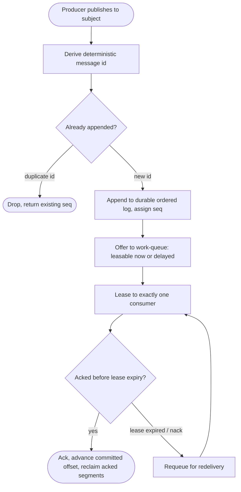

# relay core — durable log + single-cast work-queue delivery model

## Logic
<!-- type: logic lang: mermaid -->


```mermaid
---
id: relay-core-durable-log-delivery-flow
entry: publish
nodes:
  publish:
    kind: start
    label: "Producer publishes a message to a subject (single-cast work-queue delivery)"
  assign_id:
    kind: process
    label: "Derive a deterministic message id (producer key + content) so retries are idempotent"
  dedupe:
    kind: decision
    label: "Has this id already been appended on this subject/shard?"
  dedupe_drop:
    kind: terminal
    label: "Drop the duplicate and return the existing seq (at-least-once, idempotent)"
  append_log:
    kind: process
    label: "Append to the durable ordered log for the subject/shard (RAM ring + disk segment) and assign a monotonic seq"
  offer:
    kind: process
    label: "Offer the new entry to the work-queue: immediately leasable, or held in the delay index until its not_before time"
  lease:
    kind: process
    label: "Lease the next eligible entry to exactly one competing consumer"
  lease_ok:
    kind: decision
    label: "Did the leased consumer ack before the lease expired?"
  commit_ack:
    kind: terminal
    label: "Ack: mark the message delivered, advance the committed offset, and reclaim fully-acked log segments (delete-on-ack)"
  redeliver:
    kind: process
    label: "Lease expiry or nack: re-offer for redelivery to another consumer (reuse retry / revocation model)"
edges:
  - from: publish
    to: assign_id
    label: "accept publish"
  - from: assign_id
    to: dedupe
    label: "id derived"
  - from: dedupe
    to: dedupe_drop
    label: "duplicate id"
  - from: dedupe
    to: append_log
    label: "new id"
  - from: append_log
    to: offer
    label: "seq assigned, durably persisted"
  - from: offer
    to: lease
    label: "eligible for lease"
  - from: lease
    to: lease_ok
    label: "awaiting ack"
  - from: lease_ok
    to: commit_ack
    label: "acked in time"
  - from: lease_ok
    to: redeliver
    label: "lease expired or nacked"
  - from: redeliver
    to: lease
    label: "re-offer to another consumer"
---
flowchart TD
    publish([Producer publishes to subject]) --> assign_id[Derive deterministic message id]
    assign_id --> dedupe{Already appended?}
    dedupe -->|duplicate id| dedupe_drop([Drop, return existing seq])
    dedupe -->|new id| append_log[Append to durable ordered log, assign seq]
    append_log --> offer[Offer to work-queue: leasable now or delayed]
    offer --> lease[Lease to exactly one consumer]
    lease --> lease_ok{Acked before lease expiry?}
    lease_ok -->|yes| commit_ack([Ack, advance committed offset, reclaim acked segments])
    lease_ok -->|lease expired / nack| redeliver[Requeue for redelivery]
    redeliver --> lease
```
## Schema
<!-- type: schema lang: yaml -->

```yaml
$schema: "https://json-schema.org/draft/2020-12/schema"
$id: relay-core-durable-log#schema
title: Relay Core Durable Log Types
description: >
  Core in-process data model for the relay broker: a durable ordered log per
  (subject, shard) plus the work-queue lease state that reads from it. The
  message payload is an opaque body stored unchanged; relay owns only the log,
  sequencing, dedupe, and work-queue leases.

definitions:
  Subject:
    type: string
    $id: Subject
    description: "Logical channel a producer publishes to and a work-queue consumer leases from."

  ShardId:
    type: integer
    $id: ShardId
    minimum: 0
    description: "Partition of a subject's log; ordering and sequencing are per (subject, shard)."

  Seq:
    type: integer
    $id: Seq
    minimum: 0
    description: "Monotonic, gap-free position assigned on append within one (subject, shard). The work-queue ack cursor is expressed in this space."

  MessageId:
    type: string
    $id: MessageId
    description: "Deterministic id derived from producer key + content, used as the idempotency/dedupe key so an at-least-once retry maps to the same log entry."

  Payload:
    $id: Payload
    x-rust-type: "serde_json::Value"
    description: >
      Opaque message body. Per epic #120 the broker "knows nothing about
      workflows", so the core stores the payload verbatim as JSON and never
      reinterprets it. A producer serializes whatever message type it uses into
      this value; relay only needs the caller-supplied MessageId for sequencing
      and dedupe. relay is standalone and depends on no other axiom project.

  LogEntry:
    type: object
    $id: LogEntry
    x-rust-derive: ["Debug", "Clone", "PartialEq", "Serialize", "Deserialize"]
    required: [seq, message_id, subject, shard, payload, appended_at]
    description: "One durable record in the ordered log; the unit of work-queue lease."
    properties:
      seq:
        $ref: "#/definitions/Seq"
        description: "Monotonic position within (subject, shard)."
      message_id:
        $ref: "#/definitions/MessageId"
      subject:
        $ref: "#/definitions/Subject"
      shard:
        $ref: "#/definitions/ShardId"
      payload:
        $ref: "#/definitions/Payload"
      headers:
        type: object
        additionalProperties: { type: string }
        description: "Opaque routing/trace headers carried with the entry."
      appended_at:
        type: string
        format: date-time
        description: "Server time the entry was durably appended."
      not_before:
        type: ["string", "null"]
        format: date-time
        description: "Work-queue visibility gate (delayed / ETA / countdown): durably appended at once but not leasable until this time. Null = leasable immediately."
      priority:
        type: integer
        minimum: 0
        maximum: 255
        default: 10
        description: "Work-queue priority (0 = lowest, 255 = highest; higher leases first)."

  AppendOutcome:
    type: object
    $id: AppendOutcome
    x-rust-derive: ["Debug", "Clone", "Copy", "PartialEq", "Eq", "Serialize", "Deserialize"]
    required: [seq, deduped]
    description: "Result of a publish/append; idempotent on MessageId."
    properties:
      seq:
        $ref: "#/definitions/Seq"
        description: "Seq of the (new or pre-existing) entry."
      deduped:
        type: boolean
        description: "True when the id was already present and no new entry was written."

  Lease:
    type: object
    $id: Lease
    x-rust-derive: ["Debug", "Clone", "PartialEq", "Eq", "Serialize", "Deserialize"]
    required: [lease_id, seq, subject, shard, consumer_id, granted_at, expires_at, attempt]
    description: "Work-queue grant of one entry to exactly one consumer until it acks or the lease expires."
    properties:
      lease_id:
        type: string
        description: "Unique id for this grant; required to ack/extend."
      seq:
        $ref: "#/definitions/Seq"
        description: "Leased entry position."
      subject:
        $ref: "#/definitions/Subject"
      shard:
        $ref: "#/definitions/ShardId"
      consumer_id:
        type: string
        description: "Consumer the entry is currently leased to."
      granted_at:
        type: string
        format: date-time
      expires_at:
        type: string
        format: date-time
        description: "On expiry the entry becomes eligible for redelivery to another consumer."
      attempt:
        type: integer
        minimum: 1
        description: "1-based delivery attempt; drives retry / revocation policy."

  CommittedOffset:
    type: object
    $id: CommittedOffset
    x-rust-derive: ["Debug", "Clone", "Copy", "PartialEq", "Eq", "Serialize", "Deserialize"]
    required: [subject, shard, committed_seq]
    description: "Work-queue durable progress: every entry at or below committed_seq has been acked."
    properties:
      subject:
        $ref: "#/definitions/Subject"
      shard:
        $ref: "#/definitions/ShardId"
      committed_seq:
        $ref: "#/definitions/Seq"
```
## Config
<!-- type: config lang: yaml -->

```yaml
# RelayCoreConfig — in-process broker core engine settings.
# All durability/retention is local to this core; transport, sharding fan-out,
# and HA live in the server issues (#115 / #109) and are out of scope here.

# Durable ordered log substrate (RAM ring + disk segments).
data_dir: "./relay-data"        # root directory for durable disk segments
segment_bytes: 134217728        # roll to a new disk segment at 128 MiB
ram_ring_entries: 65536         # hot in-memory entries retained per (subject, shard) for low-latency lease
fsync: "always"                 # durability policy: always | interval | os
fsync_interval_ms: 50           # flush cadence when fsync = interval
default_shards: 1               # shards per subject unless the subject overrides it

# Idempotent at-least-once append: how long a MessageId is remembered for dedupe.
dedupe:
  window_entries: 1048576       # MessageIds retained per shard for duplicate detection
  ttl_secs: 3600                # also evict dedupe keys older than this

# Work-queue / competing-consumer delivery (standard at-least-once lease / retry semantics).
work_queue:
  lease_ttl_ms: 30000           # lease duration before an unacked entry is redelivery-eligible
  max_attempts: 5               # deliveries before an entry is dead-lettered; 0 = disabled (redeliver forever)
  redeliver_backoff_ms: 1000    # base backoff between delivery attempts
  dlq_suffix: ".dlq"            # exhausted entries route to {subject}{dlq_suffix}; such subjects open with max_attempts=0

# Retention of the durable log — relay is delete-on-ack ONLY: a segment is
# reclaimed once every entry in it is acked (the committed watermark passes
# it), so storage tracks backlog depth, not total throughput. An un-acked
# backlog is never deleted by wall-clock or size — the broker owns task
# durability until ack.
retention:
  max_age_secs: 604800          # reserved for a future hard-cap/backpressure knob; does not prune un-acked entries
  max_bytes_per_shard: 0        # reserved for a future hard-cap/backpressure knob; does not prune un-acked entries
```
## Unit Test
<!-- type: unit-test lang: mermaid -->


```mermaid
---
id: relay-core-unit-test-plan
entry: suite
nodes:
  suite:
    kind: start
    label: "relay core in-process test suite over one durable (subject, shard) log"
  t_seq:
    kind: process
    label: "append N messages -> AppendOutcome.seq is 0..N-1, monotonic and gap-free"
  a_seq:
    kind: terminal
    label: "assert seqs strictly increasing, entries readable back in order"
  t_dedupe:
    kind: process
    label: "append the same MessageId twice"
  a_dedupe:
    kind: terminal
    label: "assert one LogEntry; second AppendOutcome.deduped=true with the same seq (idempotent at-least-once)"
  t_workqueue_one:
    kind: process
    label: "two competing consumers on the same log, publish 3 messages"
  a_workqueue_one:
    kind: terminal
    label: "assert each seq leased to exactly one consumer; union covers all, intersection empty"
  t_lease_expiry:
    kind: process
    label: "consumer leases an entry and does not ack before lease_ttl"
  a_lease_expiry:
    kind: terminal
    label: "assert entry is redelivered to another consumer with attempt incremented (retry/revocation)"
  t_ack_commit:
    kind: process
    label: "consumer acks its leased entry"
  a_ack_commit:
    kind: terminal
    label: "assert CommittedOffset.committed_seq advances and the entry is not redelivered, and fully-acked segments are reclaimed (delete-on-ack)"
edges:
  - { from: suite, to: t_seq, label: "case: sequencing" }
  - { from: t_seq, to: a_seq }
  - { from: suite, to: t_dedupe, label: "case: idempotency" }
  - { from: t_dedupe, to: a_dedupe }
  - { from: suite, to: t_workqueue_one, label: "case: competing" }
  - { from: t_workqueue_one, to: a_workqueue_one }
  - { from: suite, to: t_lease_expiry, label: "case: redelivery" }
  - { from: t_lease_expiry, to: a_lease_expiry }
  - { from: suite, to: t_ack_commit, label: "case: ack/commit" }
  - { from: t_ack_commit, to: a_ack_commit }
---
flowchart TD
    suite([relay core test suite]) --> t_seq[append N -> monotonic seq]
    t_seq --> a_seq([seqs ordered and gap-free])
    suite --> t_dedupe[append same MessageId twice]
    t_dedupe --> a_dedupe([one entry, deduped=true, same seq])
    suite --> t_workqueue_one[2 consumers compete, publish 3]
    t_workqueue_one --> a_workqueue_one([each seq leased exactly once])
    suite --> t_lease_expiry[lease, do not ack past ttl]
    t_lease_expiry --> a_lease_expiry([redelivered, attempt++])
    suite --> t_ack_commit[ack leased entry]
    t_ack_commit --> a_ack_commit([committed_seq advances, no redelivery, segments reclaimed])
```

## Changes
<!-- type: changes lang: yaml -->

```yaml
changes:
  - path: projects/relay/Cargo.toml
    action: create
    section: config
    impl_mode: hand-written
    reason: "New relay crate manifest for the standalone HTTP/2 queue core (no external project deps)."
  - path: projects/relay/src/lib.rs
    action: create
    section: logic
    impl_mode: hand-written
    reason: "Crate root: module wiring and public re-exports for the in-process core (single-cast work-queue only; no broadcast/replication modules)."
  - path: projects/relay/src/types.rs
    action: create
    section: schema
    impl_mode: hand-written
    reason: "Core data model (LogEntry, Seq, MessageId, AppendOutcome, Lease, CommittedOffset) per the Schema contract."
  - path: projects/relay/src/config.rs
    action: create
    section: config
    impl_mode: hand-written
    reason: "RelayCoreConfig per the Config contract; RetentionConfig is delete-on-ack only (max_age_secs/max_bytes_per_shard are reserved future hard-cap knobs, not an alternate pruning mode)."
  - path: projects/relay/src/log.rs
    action: create
    section: logic
    impl_mode: hand-written
    reason: "Durable ordered log substrate: append with deterministic-id dedupe, monotonic seq, RAM ring + disk segment persistence, ordered read, and truncate_below_acked (delete-on-ack GC)."
  - path: projects/relay/src/workqueue.rs
    action: create
    section: logic
    impl_mode: hand-written
    reason: "Work-queue competing-consumer delivery: lease / ack / redeliver, delay index, priority bands, dead-lettering, and committed offset (standard at-least-once lease / retry semantics)."
  - path: projects/relay/src/engine.rs
    action: create
    section: logic
    impl_mode: hand-written
    reason: "Relay core engine tying publish -> durable append -> single-cast work-queue lease/ack/redeliver over one durable log. ack/ack_batch persist the committed watermark then truncate the fully-acked segment prefix (persist-before-truncate ordering, H1)."
  - path: projects/relay/src/consume.rs
    action: modify
    section: logic
    impl_mode: hand-written
    reason: "Streaming consume drive leases/acks/nacks entries from the subject's single work-queue."
  - path: projects/relay/tests/relay_core.rs
    action: create
    section: unit-test
    impl_mode: hand-written
    reason: "Deterministic tests for the unit-test plan: sequencing, idempotency, single-cast competing-consumer delivery, lease-expiry redelivery, and ack/commit with delete-on-ack reclaim."
```

# Reviews

### Review 1
**Verdict:** approved

- [logic] Publish -> deterministic id -> dedupe -> durable append+seq -> offer to the work-queue (immediate or delay-gated) -> lease/ack/redeliver. Single-cast only: one competing-consumer queue per subject/shard, no broadcast/multicast fan-out. Captures the idempotent at-least-once path end to end. Applicable.
- [schema] LogEntry / Seq / MessageId / AppendOutcome / Lease / CommittedOffset cover the durable-log substrate plus work-queue lease state; payload is an opaque JSON body (x-rust-type serde_json::Value). Applicable and codegen-ready.
- [config] RelayCoreConfig scopes durability (segments, ram ring, fsync), dedupe window, work-queue lease/retry, and retention — all in-process core concerns; transport/HA correctly deferred to #115/#109. Retention is delete-on-ack only; `max_age_secs`/`max_bytes_per_shard` are reserved future hard-cap knobs, not an alternate pruning mode. Applicable.
- [unit-test] Cases cover sequencing, idempotency, single-cast competing-consumer delivery, lease-expiry redelivery, and ack/commit with delete-on-ack reclaim. Applicable.
