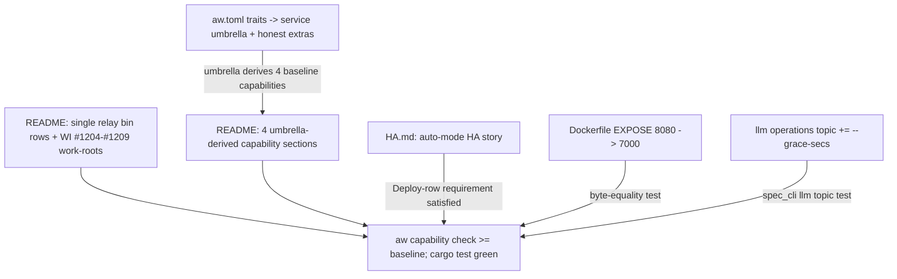

## Logic
<!-- type: logic lang: mermaid -->



## Unit Test
<!-- type: unit-test lang: mermaid -->

```mermaid
---
id: relay-declare-service-umbrella-sync-docs-verification
requirements:
  capability-contract-parses-at-baseline:
    id: R1R2
    text: "With the service-umbrella traits in aw.toml and the synced README capability contract (no relay-server/relay-raft references; four umbrella-derived capability sections added), `aw capability check --project relay` parses the contract and reports no new blockers beyond the pre-existing baseline."
    kind: regression
    risk: medium
    verify: aw capability check --project relay (manual gate, compared against the pre-change baseline output)
  dockerfile-byte-equality:
    id: R4
    text: "After EXPOSE 8080 -> 7000 in the committed Dockerfile, `relay dockerfile render --variant source` reproduces the committed fixture byte-for-byte (render reads the fixture via include_str!)."
    kind: regression
    risk: low
    verify: projects/relay/tests/deploy_cli.rs dockerfile_render_reproduces_committed_fixtures
  ha-doc-matches-shipped-semantics:
    id: R3
    text: "HA.md's claims (auto-mode flip on REPLICAS_PER_SHARD>1, publish-only replication, fsynced applied-index marker, node-local lease/ack at-least-once failover, RELAY_PEERS override, backup/restore merge semantics) match the shipped raft/backup behavior already gated by the raft and backup test suites."
    kind: functional
    risk: low
    verify: projects/relay/tests/raft_cluster.rs, projects/relay/tests/raft_persistence.rs, projects/relay/tests/backup.rs (existing gates; HA.md is descriptive)
  llm-grace-knob-documented:
    id: R5
    text: "The `relay llm` operations topic documents the --grace-secs / RELAY_GRACE_SECS graceful-drain knob alongside the existing serve/auth/peer-TLS/backup/deploy surfaces."
    kind: functional
    risk: low
    verify: projects/relay/tests/spec_cli.rs llm_operations_topic_documents_the_new_surfaces
---
flowchart TD
    r3[R3 ha doc matches shipped semantics] --> projects_relay_tests_raft_cluster_rs_projects_relay_tests_raft_persistence_rs_projects_relay_tests_backup_rs_existing_gates_ha_md_is_descriptive[projects/relay/tests/raft_cluster.rs, projects/relay/tests/raft_persistence.rs, projects/relay/tests/backup.rs (existing gates; HA.md is descriptive)]
    r4[R4 dockerfile byte equality] --> projects_relay_tests_deploy_cli_rs_dockerfile_render_reproduces_committed_fixtures[projects/relay/tests/deploy_cli.rs dockerfile_render_reproduces_committed_fixtures]
    r5[R5 llm grace knob documented] --> projects_relay_tests_spec_cli_rs_llm_operations_topic_documents_the_new_surfaces[projects/relay/tests/spec_cli.rs llm_operations_topic_documents_the_new_surfaces]
    r1r2[R1R2 capability contract parses at baseline] --> aw_capability_check_project_relay_manual_gate_compared_against_the_pre_change_baseline_output[aw capability check --project relay (manual gate, compared against the pre-change baseline output)]
```

## Changes
<!-- type: changes lang: yaml -->

```yaml
changes:
  - path: projects/relay/aw.toml
    action: modify
    section: logic
    impl_mode: hand-written
    description: "[capability.profile].traits -> [\"service\", \"long_running\", \"cli_facing\", \"competitive_replacement\", \"network_exposed\", \"primary_replicas\"] (the umbrella expands to http2_api/kubernetes_native/standard_endpoints/ec_gated/cli_std/chainable_output)."
  - path: projects/relay/README.md
    action: modify
    section: logic
    impl_mode: hand-written
    description: "Capability contract sync: drop every relay-server/relay-raft/src-bin evidence reference for the single relay bin + WI #1204-#1209 work-roots; add the four umbrella-derived capability sections (standard-operational-endpoints, cli-standard-surface, chainable-output-conformance with honest partial maturity, ec-gates-configured); update security-hardening for shipped RELAY_AUTH + peer-TLS surface; keep the field-contract + work-root-table format."
  - path: projects/relay/HA.md
    action: create
    section: logic
    impl_mode: hand-written
    description: "New archetype-required HA doc: auto-mode (REPLICAS_PER_SHARD>1 flips raft), RelayStateMachine (publish replication, snapshot/compaction, fsynced applied-index marker), node-local lease/ack at-least-once failover limitation, RELAY_PEERS override, operator CR as the production HA path, backup/restore semantics, peer-TLS surface + raft-host TLS seam gap."
  - path: projects/relay/Dockerfile
    action: modify
    section: unit-test
    impl_mode: hand-written
    description: "EXPOSE 8080 -> 7000 (the standard serve port; RELAY_BIND default 0.0.0.0:7000). Render reads this fixture via include_str!, so dockerfile_render_reproduces_committed_fixtures stays byte-equal."
  - path: projects/relay/src/llm.rs
    action: modify
    section: unit-test
    impl_mode: hand-written
    description: "Operations topic documents --grace-secs (RELAY_GRACE_SECS, default 10) graceful-drain knob; covered by spec_cli llm_operations_topic_documents_the_new_surfaces."
```
