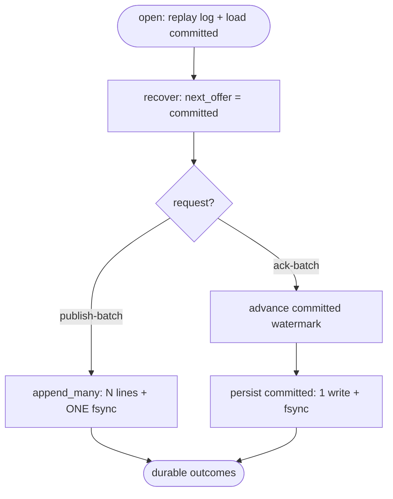

# relay default-durable engine throughput — group-commit fsync + publish-batch + persisted committed offset

## Logic
<!-- type: logic lang: mermaid -->


## Schema
<!-- type: schema lang: yaml -->

```yaml
(fill)
```

## Rest Api
<!-- type: rest-api lang: yaml -->

```yaml
(fill)
```

## Unit Test
<!-- type: unit-test lang: mermaid -->


## Changes
<!-- type: changes lang: yaml -->

```yaml
(fill)
```
