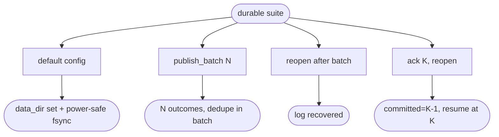

# relay default-durable engine throughput — group-commit fsync + publish-batch + persisted committed offset

## Logic
<!-- type: logic lang: mermaid -->


## Schema
<!-- type: schema lang: yaml -->

```yaml
$schema: "https://json-schema.org/draft/2020-12/schema"
$id: relay-default-durable#schema
title: Relay Publish-Batch Types
description: >
  Batch-publish DTOs for the group-commit produce path. One request carries many
  messages; the server appends them all and issues a single fsync (group commit),
  returning one AppendOutcome per message in order.

definitions:
  PublishBatchItem:
    type: object
    $id: PublishBatchItem
    x-rust-derive: ["Debug", "Clone", "Serialize", "Deserialize"]
    required: [message_id, payload]
    properties:
      message_id: { type: string, description: "Idempotency / dedupe key." }
      payload: { description: "Opaque message body (any JSON value)." }
      headers:
        type: object
        additionalProperties: { type: string }

  PublishBatchRequest:
    type: object
    $id: PublishBatchRequest
    x-rust-derive: ["Debug", "Clone", "Serialize", "Deserialize"]
    required: [messages]
    properties:
      messages:
        type: array
        items: { $ref: "#/definitions/PublishBatchItem" }

  PublishBatchResponse:
    type: object
    $id: PublishBatchResponse
    x-rust-derive: ["Debug", "Clone", "Serialize", "Deserialize"]
    required: [outcomes]
    description: "One AppendOutcome per input message, in order."
    properties:
      outcomes:
        type: array
        items: { x-rust-type: "crate::types::AppendOutcome" }
```
## Rest Api
<!-- type: rest-api lang: yaml -->

```yaml
openapi: 3.1.0
info:
  title: relay publish-batch API
  version: 0.1.0
  description: >
    Group-commit batch produce over HTTP/2. One request carries many messages;
    the server appends them and issues a single fsync (durable, power-safe).
paths:
  /v1/{subject}/publish-batch:
    post:
      operationId: publishBatch
      summary: Append many messages in one durable, group-committed call.
      parameters:
        - { name: subject, in: path, required: true, schema: { type: string } }
      requestBody:
        required: true
        content:
          application/json: { schema: { $ref: "#/components/schemas/PublishBatchRequest" } }
          application/cbor: { schema: { $ref: "#/components/schemas/PublishBatchRequest" } }
      responses:
        "200":
          description: One AppendOutcome per message, in order.
          content:
            application/json: { schema: { $ref: "#/components/schemas/PublishBatchResponse" } }
            application/cbor: { schema: { $ref: "#/components/schemas/PublishBatchResponse" } }
components:
  schemas:
    PublishBatchItem:
      type: object
      required: [message_id, payload]
      properties:
        message_id: { type: string }
        payload: {}
        headers: { type: object, additionalProperties: { type: string } }
    PublishBatchRequest:
      type: object
      required: [messages]
      properties:
        messages: { type: array, items: { $ref: "#/components/schemas/PublishBatchItem" } }
    AppendOutcome:
      type: object
      required: [seq, deduped]
      properties:
        seq: { type: integer, minimum: 0 }
        deduped: { type: boolean }
    PublishBatchResponse:
      type: object
      required: [outcomes]
      properties:
        outcomes: { type: array, items: { $ref: "#/components/schemas/AppendOutcome" } }
```
## Unit Test
<!-- type: unit-test lang: mermaid -->


## Changes
<!-- type: changes lang: yaml -->

```yaml
changes:
  - path: projects/relay/src/log.rs
    action: modify
    section: logic
    impl_mode: hand-written
    reason: "append_many: write a batch of entries then issue ONE sync_all (group commit). Persist/load the committed-offset sidecar (<subject>__shardN.commit), group-committed."
  - path: projects/relay/src/workqueue.rs
    action: modify
    section: logic
    impl_mode: hand-written
    reason: "recover(committed): set next_offer and committed watermark on open so committed entries are never re-offered."
  - path: projects/relay/src/engine.rs
    action: modify
    section: logic
    impl_mode: hand-written
    reason: "publish_batch (group-commit append_many); recover the committed offset when a subject opens; persist the committed offset after ack / ack-batch."
  - path: projects/relay/src/config.rs
    action: modify
    section: config
    impl_mode: hand-written
    reason: "Default to durable, power-safe storage (data_dir set, fsync = Always); group commit makes the batch path cheap."
  - path: projects/relay/src/wire.rs
    action: modify
    section: schema
    impl_mode: hand-written
    reason: "PublishBatchItem / PublishBatchRequest / PublishBatchResponse DTOs."
  - path: projects/relay/src/server.rs
    action: modify
    section: logic
    impl_mode: hand-written
    reason: "POST /v1/{subject}/publish-batch handler (JSON + CBOR)."
  - path: projects/relay/src/openapi.rs
    action: modify
    section: rest-api
    impl_mode: hand-written
    reason: "Add the publish-batch path to the served OpenAPI."
  - path: projects/relay/tests/durable.rs
    action: create
    section: unit-test
    impl_mode: hand-written
    reason: "Tests: default config is durable, publish_batch group commit + dedupe, log recovery on reopen, and committed-offset crash recovery (resume after the committed offset)."
```
