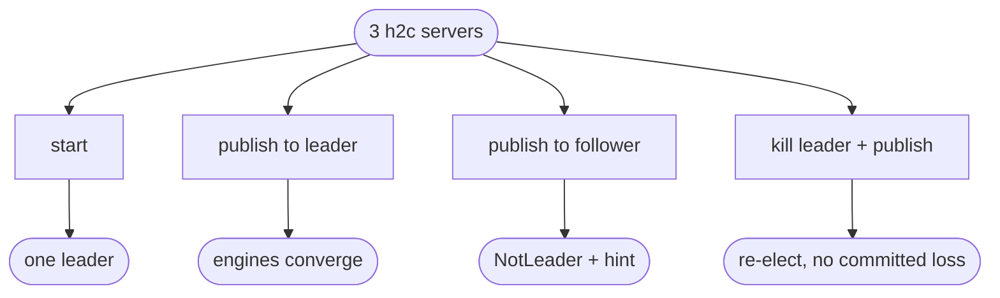

# relay h2c Raft transport + driver + producer redirect-to-leader

## Logic
<!-- type: logic lang: mermaid -->

```mermaid
---
id: relay-raft-driver-flow
entry: source
nodes:
  source:
    kind: start
    label: "input to a RaftDriver (owns RaftNode behind async mutex + RaftStore + peer URLs + h2c client + local Relay)"
  what:
    kind: decision
    label: "tick / inbound RPC / publish?"
  tick:
    kind: process
    label: "tick task: node.tick() on a timer (election + heartbeat)"
  inbound:
    kind: process
    label: "POST /raft/request-vote or /raft/append-entries -> node.handle(from, msg)"
  pub:
    kind: decision
    label: "POST /v1/{subject}/publish: is this node the leader?"
  redirect:
    kind: terminal
    label: "not leader -> reply NotLeader{leader_hint} (producer retries the leader)"
  propose:
    kind: process
    label: "leader -> node.propose(serialize(publish command))"
  persist:
    kind: process
    label: "persist node.persisted() via RaftStore BEFORE anything leaves (no vote/ack/commit before durable)"
  apply:
    kind: process
    label: "drain take_committed() -> apply each command to the local Relay (idempotent publish)"
  flush:
    kind: process
    label: "drain take_outgoing(): RequestVote/AppendEntries POSTed to peers over h2c; the inbound handler returns its VoteResp/AppendResp; responses are fed back via node.handle, then flush again"
  done:
    kind: terminal
    label: "majority commit -> every node's Relay converges; leader failure re-elects and survivors keep committed data"
edges:
  - { from: source, to: what }
  - { from: what, to: tick, label: "tick" }
  - { from: what, to: inbound, label: "rpc" }
  - { from: what, to: pub, label: "publish" }
  - { from: pub, to: redirect, label: "no" }
  - { from: pub, to: propose, label: "yes" }
  - { from: tick, to: persist }
  - { from: inbound, to: persist }
  - { from: propose, to: persist }
  - { from: persist, to: apply }
  - { from: apply, to: flush }
  - { from: flush, to: done }
---
flowchart TD
    source([RaftDriver input]) --> what{tick / rpc / publish?}
    what -->|tick| tick[node.tick on timer]
    what -->|rpc| inbound[/raft/* -> node.handle]
    what -->|publish| pub{leader?}
    pub -->|no| redirect([NotLeader + leader hint])
    pub -->|yes| propose[node.propose publish command]
    tick --> persist[persist BEFORE send]
    inbound --> persist
    propose --> persist
    persist --> apply[take_committed -> Relay publish]
    apply --> flush[take_outgoing -> POST peers; feed responses back]
    flush --> done([engines converge; failover keeps committed])
```
## Unit Test
<!-- type: unit-test lang: mermaid -->



## Changes
<!-- type: changes lang: yaml -->

```yaml
changes:
  - path: projects/relay/src/raft_driver.rs
    action: create
    section: logic
    impl_mode: hand-written
    reason: "RaftDriver: Arc<RaftShared{ async-mutex RaftNode, RaftStore, peers, reqwest h2c client, Arc<Relay>, subject, id }>. spawn() runs a tick task; helpers persist-before-flush, apply committed commands to the Relay, and flush the outbox by POSTing RequestVote/AppendEntries to peers and feeding responses back. handle_request_vote/handle_append_entries return the node's reply. propose(command) on the leader. leader_hint(). A raft_router(driver) exposes POST /raft/request-vote, POST /raft/append-entries, POST /v1/{subject}/publish (redirect-to-leader else propose), GET /raftz, GET /healthz."
  - path: projects/relay/src/lib.rs
    action: modify
    section: logic
    impl_mode: hand-written
    reason: "Declare and re-export raft_driver (RaftDriver, raft_router)."
  - path: projects/relay/tests/raft_cluster.rs
    action: create
    section: unit-test
    impl_mode: hand-written
    reason: "Real-h2c integration: 3 relay-raft servers on ephemeral ports with wired peers. Assert one leader elected, a publish to the leader converges on all three engines, a publish to a follower returns NotLeader+hint, and killing the leader re-elects with no committed loss + accepts new publishes."
```
