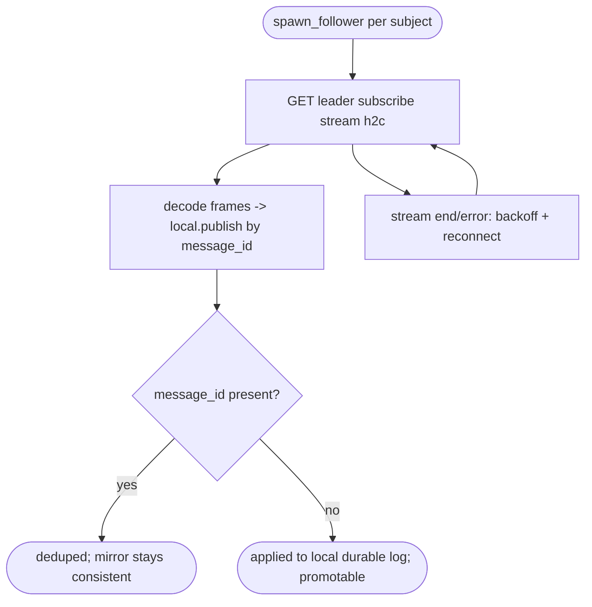
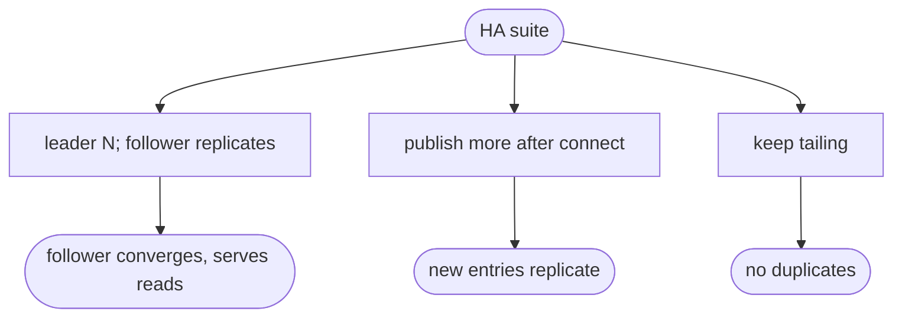

# relay HA via leader/follower log replication (async primary-backup)

## Logic
<!-- type: logic lang: mermaid -->


## Unit Test
<!-- type: unit-test lang: mermaid -->


## Changes
<!-- type: changes lang: yaml -->

```yaml
changes:
  - path: projects/relay/Cargo.toml
    action: modify
    section: logic
    impl_mode: hand-written
    reason: "Move reqwest from dev-dependencies to dependencies (the follower is an HTTP/2 client at runtime)."
  - path: projects/relay/src/replication.rs
    action: create
    section: logic
    impl_mode: hand-written
    reason: "spawn_follower(local, leader_url, subjects) -> FollowerHandle: one tokio task per subject that tails the leader's subscribe stream over h2c, decodes length-prefixed CBOR LogEntry frames, and re-applies each via local.publish (idempotent on message_id); reconnects with backoff on stream end/error. FollowerHandle aborts the tasks on stop/drop."
  - path: projects/relay/src/lib.rs
    action: modify
    section: logic
    impl_mode: hand-written
    reason: "Declare and re-export the replication module (spawn_follower, FollowerHandle)."
  - path: projects/relay/tests/replication.rs
    action: create
    section: unit-test
    impl_mode: hand-written
    reason: "Real-h2c HA test: a follower replicator converges to a leader's N entries, replicates entries published after connect, serves reads, and does not duplicate on continued tailing."
```

# Reviews

### Review 1
**Verdict:** approved

- [logic] Per-subject follower tails the leader subscribe stream and re-applies by message_id (idempotent => mirror + safe reconnect); deterministic routing keeps shard/seq aligned; promotable. Async primary-backup, clearly scoped vs full Raft. Applicable.
- [unit-test] Convergence to N, live replication after connect, serve reads, no-duplicate on retail. Applicable.
- [changes] reqwest -> normal dep, replication.rs follower + handle, lib re-export, a real-h2c test. Applicable.
