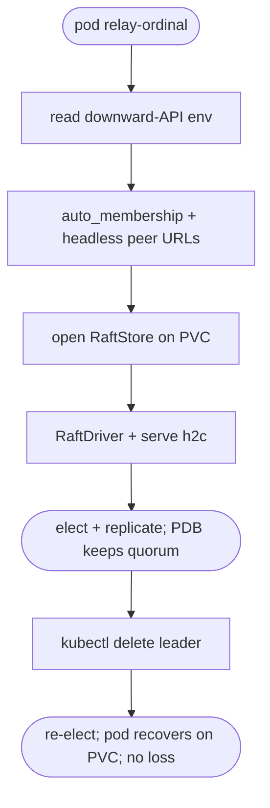

# relay k8s manifests + ordinal-role + kind failover smoke (Raft HA Layer 2)

## Logic
<!-- type: logic lang: mermaid -->


## Unit Test
<!-- type: unit-test lang: mermaid -->

```mermaid
---
id: relay-raft-k8s-test-plan
entry: suite
nodes:
  suite: { kind: start, label: "config derivation tests (pure, fast cargo gate)" }
  t_ord: { kind: process, label: "ordinal_from_hostname(relay-3)" }
  a_ord: { kind: terminal, label: "assert Some(3); non-matching -> None" }
  t_peers: { kind: process, label: "peer_urls(svc, ns, port, N=3, self=1)" }
  a_peers: { kind: terminal, label: "assert relay-0 and relay-2 DNS URLs present, self relay-1 excluded" }
  t_role: { kind: process, label: "membership for N=4 with this ordinal" }
  a_role: { kind: terminal, label: "assert ordinal 3 is a learner, 0..2 voters (auto_membership)" }
  t_smoke: { kind: process, label: "kind failover smoke script exists + is the Layer-2 integration" }
  a_smoke: { kind: terminal, label: "documented manual/CI run (build image, deploy, delete leader, re-elect, no loss)" }
edges:
  - { from: suite, to: t_ord }
  - { from: t_ord, to: a_ord }
  - { from: suite, to: t_peers }
  - { from: t_peers, to: a_peers }
  - { from: suite, to: t_role }
  - { from: t_role, to: a_role }
  - { from: suite, to: t_smoke }
  - { from: t_smoke, to: a_smoke }
---
flowchart TD
    suite([config tests]) --> t_ord[ordinal_from_hostname] --> a_ord([Some(3) / None])
    suite --> t_peers[peer_urls N=3 self=1] --> a_peers([relay-0,relay-2; self excluded])
    suite --> t_role[membership N=4] --> a_role([ordinal 3 learner])
    suite --> t_smoke[kind smoke script] --> a_smoke([manual/CI failover])
```
## Changes
<!-- type: changes lang: yaml -->

```yaml
changes:
  - path: projects/relay/src/raft_config.rs
    action: create
    section: logic
    impl_mode: hand-written
    reason: "Pure cluster-config derivation for k8s: ordinal_from_hostname(\"relay-N\") -> Option<NodeId>; peer_urls(service, namespace, port, n, self_id) -> HashMap<NodeId,String> of headless-Service DNS URLs excluding self; RaftClusterConfig::from_env() assembling node_id/membership/peers/subject/data_dir/port from env vars. No external dependency."
  - path: projects/relay/src/bin/relay_raft.rs
    action: create
    section: logic
    impl_mode: hand-written
    reason: "relay-raft binary: build RaftClusterConfig::from_env(), open a RaftStore on the data dir, RaftDriver::spawn(...), and serve its router over h2c on the configured port."
  - path: projects/relay/src/lib.rs
    action: modify
    section: logic
    impl_mode: hand-written
    reason: "Declare and re-export raft_config (RaftClusterConfig, ordinal_from_hostname, peer_urls)."
  - path: projects/relay/Cargo.toml
    action: modify
    section: logic
    impl_mode: hand-written
    reason: "Register the [[bin]] relay-raft target."
  - path: projects/relay/tests/raft_config.rs
    action: create
    section: unit-test
    impl_mode: hand-written
    reason: "Tests: ordinal_from_hostname parses relay-<n> and rejects others; peer_urls builds the headless-Service DNS URLs for all peers except self; membership marks the trailing even ordinal a learner."
```

# Reviews

### Review 1
**Verdict:** approved

- [logic] relay-raft bin: RaftClusterConfig::from_env (hostname relay-<ordinal> -> node_id; N; subject; data dir; port; svc/ns), auto_membership + headless DNS peer URLs (pure), RaftStore on PVC, RaftDriver + serve h2c. StatefulSet/headless Service/PDB + Dockerfile + kind smoke. Sound, standalone.
- [unit-test] ordinal_from_hostname, peer_urls excludes self + builds DNS, membership learner for trailing even ordinal; kind smoke manual/CI.
- [changes] raft_config.rs + bin/relay_raft.rs + lib re-export + Cargo [[bin]] + test; manifests/Dockerfile/script direct.
