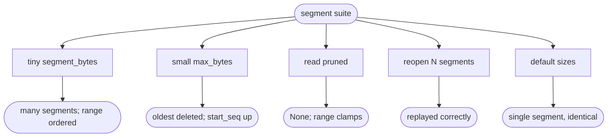

# relay log segment rotation + retention (full log lifecycle)

## Logic
<!-- type: logic lang: mermaid -->


## Unit Test
<!-- type: unit-test lang: mermaid -->


## Changes
<!-- type: changes lang: yaml -->

```yaml
changes:
  - path: projects/relay/src/log.rs
    action: modify
    section: logic
    impl_mode: hand-written
    reason: "Segment the NDJSON store: an ordered Vec<Segment{base_seq,path,bytes,last_ts}>; the active segment rolls at segment_bytes (base_seq = len). offsets[seq] becomes the byte offset within the seq's segment (segment located by base_seq). Retention prunes the oldest whole segments by max_bytes_per_shard / max_age_secs and advances start_seq. entry/range clamp to start_seq and read across segment runs. Recovery replays all surviving segments in order."
  - path: projects/relay/tests/segments.rs
    action: create
    section: unit-test
    impl_mode: hand-written
    reason: "Tests: rotation into multiple segment files + ordered range across them, byte-based pruning advancing start_seq, reads of pruned seqs (None / clamp), multi-segment recovery on reopen, and single-segment parity at default sizes."
```

# Reviews

### Review 1
**Verdict:** approved

- [logic] Active segment rolls at segment_bytes (base_seq=len); per-segment offsets located by base_seq; retention deletes oldest whole segments by bytes/age advancing start_seq; reads clamp to start_seq and walk segment runs. Full log lifecycle. Applicable.
- [unit-test] Rotation + ordered cross-segment range, byte pruning + start_seq, pruned reads, multi-segment recovery, default-size parity. Applicable.
- [changes] log.rs (segments + retention) + a new test; reuses segment_bytes / retention config. Applicable.
