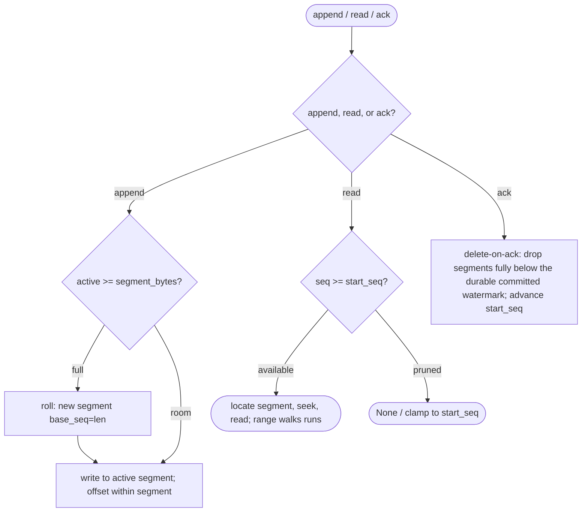
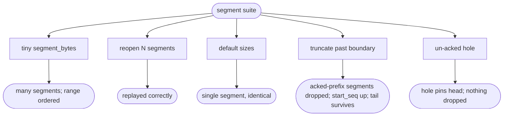

# relay log segment rotation + retention (full log lifecycle)

## Logic
<!-- type: logic lang: mermaid -->


```mermaid
---
id: relay-log-segments-flow
entry: op
nodes:
  op:
    kind: start
    label: "append or read on the (subject, shard) log"
  which:
    kind: decision
    label: "append, read, or ack?"
  rotate:
    kind: decision
    label: "append: active segment bytes >= segment_bytes (and non-empty)?"
  newseg:
    kind: process
    label: "Roll: close the active segment, open a new one with base_seq = len"
  write:
    kind: process
    label: "Write the line to the active segment; offsets[seq] = byte offset WITHIN that segment"
  truncate:
    kind: process
    label: "Delete-on-ack: after the committed watermark is durably persisted, drop every oldest WHOLE segment whose end <= watermark (all seqs < watermark, fully acked), advancing start_seq. A still-un-acked hole pins the head. Never the active segment."
  read:
    kind: decision
    label: "read seq: seq >= start_seq (still available)?"
  locate:
    kind: terminal
    label: "Locate the segment by base_seq (largest base_seq <= seq), seek offsets[seq], read; range walks segment runs in order"
  gone:
    kind: terminal
    label: "seq < start_seq -> truncated; entry None / range clamps from_seq up to start_seq"
edges:
  - { from: op, to: which }
  - { from: which, to: rotate, label: "append" }
  - { from: rotate, to: newseg, label: "full" }
  - { from: rotate, to: write, label: "room" }
  - { from: newseg, to: write }
  - { from: which, to: read, label: "read" }
  - { from: read, to: locate, label: "available" }
  - { from: read, to: gone, label: "pruned" }
  - { from: which, to: truncate, label: "ack" }
---
flowchart TD
    op([append / read / ack]) --> which{append, read, or ack?}
    which -->|append| rotate{active >= segment_bytes?}
    rotate -->|full| newseg[roll: new segment base_seq=len]
    rotate -->|room| write[write to active segment; offset within segment]
    newseg --> write
    which -->|read| read{seq >= start_seq?}
    read -->|available| locate([locate segment, seek, read; range walks runs])
    read -->|pruned| gone([None / clamp to start_seq])
    which -->|ack| truncate[delete-on-ack: drop segments fully below the durable committed watermark; advance start_seq]
```
## Unit Test
<!-- type: unit-test lang: mermaid -->


```mermaid
---
id: relay-log-segments-test-plan
entry: suite
nodes:
  suite: { kind: start, label: "segment rotation + retention tests" }
  t_roll: { kind: process, label: "tiny segment_bytes; append many" }
  a_roll: { kind: terminal, label: "assert multiple segment files exist; range(0) reads all in order across segments" }
  t_recover: { kind: process, label: "roll into N segments, drop, reopen" }
  a_recover: { kind: terminal, label: "assert all surviving segments replayed; len + reads correct" }
  t_unchanged: { kind: process, label: "default segment_bytes (huge): append N" }
  a_unchanged: { kind: terminal, label: "assert single segment, no truncation, behavior identical (benchmark unaffected)" }
  t_ack_trunc: { kind: process, label: "roll into segments; truncate_below_acked(watermark) past a segment boundary" }
  a_ack_trunc: { kind: terminal, label: "assert fully-acked-prefix segment files deleted, start_seq advances <= watermark, watermark entry + tail survive; engine ack path reclaims and recovers consistently" }
  t_ack_hole: { kind: process, label: "low watermark (un-acked hole at head)" }
  a_ack_hole: { kind: terminal, label: "assert nothing dropped; the un-acked head pins all segments" }
edges:
  - { from: suite, to: t_roll }
  - { from: t_roll, to: a_roll }
  - { from: suite, to: t_recover }
  - { from: t_recover, to: a_recover }
  - { from: suite, to: t_unchanged }
  - { from: t_unchanged, to: a_unchanged }
  - { from: suite, to: t_ack_trunc }
  - { from: t_ack_trunc, to: a_ack_trunc }
  - { from: suite, to: t_ack_hole }
  - { from: t_ack_hole, to: a_ack_hole }
---
flowchart TD
    suite([segment suite]) --> t_roll[tiny segment_bytes]
    t_roll --> a_roll([many segments; range ordered])
    suite --> t_recover[reopen N segments]
    t_recover --> a_recover([replayed correctly])
    suite --> t_unchanged[default sizes]
    t_unchanged --> a_unchanged([single segment, identical])
    suite --> t_ack_trunc[truncate past boundary]
    t_ack_trunc --> a_ack_trunc([acked-prefix segments dropped; start_seq up; tail survives])
    suite --> t_ack_hole[un-acked hole]
    t_ack_hole --> a_ack_hole([hole pins head; nothing dropped])
```
## Changes
<!-- type: changes lang: yaml -->

```yaml
changes:
  - path: projects/relay/src/log.rs
    action: modify
    section: logic
    impl_mode: hand-written
    reason: "Segment the NDJSON store: an ordered Vec<Segment{base_seq,path,bytes,last_ts}>; the active segment rolls at segment_bytes (base_seq = len). offsets[seq] becomes the byte offset within the seq's segment (segment located by base_seq). entry/range clamp to start_seq and read across segment runs. Recovery replays all surviving segments in order. Retention is delete-on-ack only: truncate_below_acked(watermark) drops the oldest whole segments whose end <= the durable committed watermark, advancing start_seq, with an un-acked hole pinning the head; there is no wall-clock/size prune."
  - path: projects/relay/tests/segments.rs
    action: create
    section: unit-test
    impl_mode: hand-written
    reason: "Tests: rotation into multiple segment files + ordered range across them, reads of truncated seqs (None / clamp), multi-segment recovery on reopen, single-segment parity at default sizes, and delete-on-ack — truncate_below_acked drops the fully-acked prefix and an un-acked hole pins the head. Engine-level ack-path truncation + crash-recovery consistency live in tests/durable.rs."
```

# Reviews

### Review 1
**Verdict:** approved

- [logic] Segment list ordered by base_seq with a rolling active segment; per-segment offsets located by binary search; delete-on-ack truncation drops oldest whole segments (never the active one) fully below the durable committed watermark, advancing start_seq; reads clamp to start_seq and walk per-segment runs; recovery replays survivors. Coherent full lifecycle with a single retention mechanism.
- [unit-test] Rotation + cross-segment ordered range, truncated reads, multi-segment recovery, default parity, delete-on-ack truncation past a boundary, and an un-acked hole pinning the head.
- [changes] log.rs only; reuses existing segment_bytes config, no retention-mode config surface.
