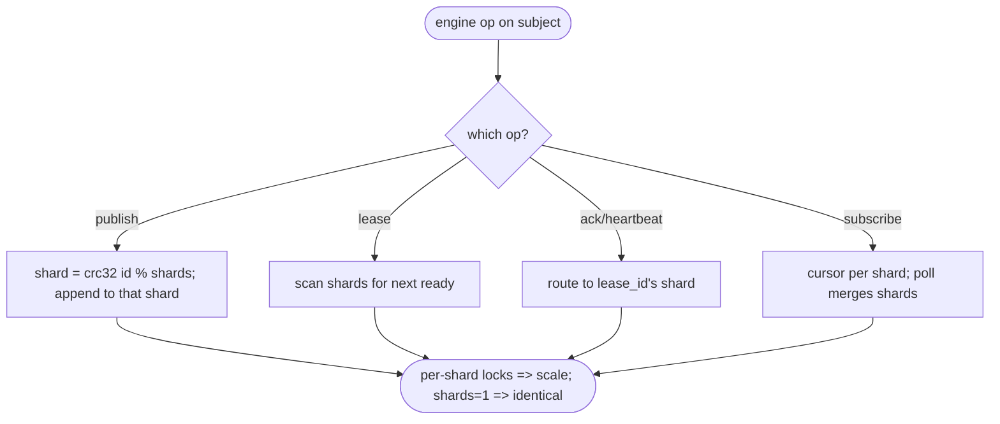
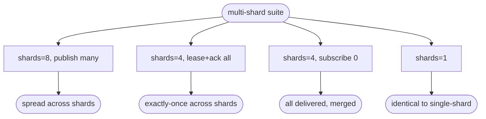

# relay multi-shard per subject (server-side sharding, horizontal scale)

## Logic
<!-- type: logic lang: mermaid -->


## Unit Test
<!-- type: unit-test lang: mermaid -->


## Changes
<!-- type: changes lang: yaml -->

```yaml
changes:
  - path: projects/relay/src/engine.rs
    action: modify
    section: logic
    impl_mode: hand-written
    reason: "Key subjects by (subject, shard); store shards = config.default_shards. publish/publish_batch route by crc32(message_id) % shards (reuse shard::shard_for); lease/lease_batch scan shards from a rotating start; ack/ack_batch/heartbeat route to the shard parsed from the lease_id (scan fallback); subscribe registers a cursor per shard and poll merges all shards; reconcile sweeps every (subject,shard). committed_offset/log_len aggregate over the subject's shards. default_shards=1 => shard 0 only => identical behavior."
  - path: projects/relay/tests/multi_shard.rs
    action: create
    section: unit-test
    impl_mode: hand-written
    reason: "Tests: publish spread across shards, whole-subject exactly-once drain across shards, broadcast merge across shards, and default_shards=1 parity with single-shard semantics."
```
