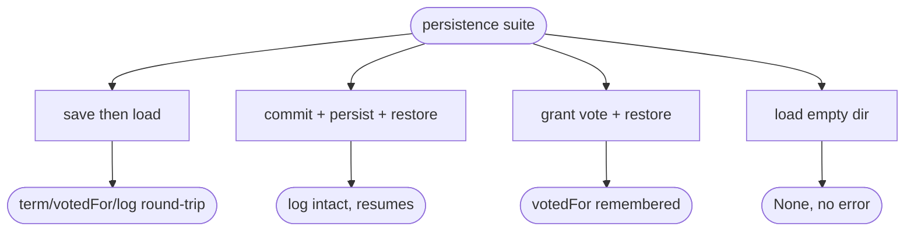

# relay Raft hard-state persistence + FsyncPolicy (crash-safe single voter)

## Logic
<!-- type: logic lang: mermaid -->

```mermaid
---
id: relay-raft-persistence-flow
entry: mutate
nodes:
  mutate:
    kind: start
    label: "RaftNode mutates hard state (term/votedFor change, log append/truncate, commit)"
  snap:
    kind: process
    label: "driver takes node.persisted() = PersistedState{term, voted_for, log}"
  save:
    kind: process
    label: "RaftStore.save(state): write under data_dir, fsync per FsyncPolicy (hard state is tiny + safety-critical -> always durable)"
  flush:
    kind: decision
    label: "persisted before sending?"
  send:
    kind: terminal
    label: "only now flush the outbox -> no vote/ack leaves before it is durable"
  hold:
    kind: terminal
    label: "save failed -> surface error, do NOT send (stay safe)"
  restart:
    kind: process
    label: "on restart: RaftStore.load() -> RaftNode::from_persisted(id, membership, state)"
  resume:
    kind: terminal
    label: "node resumes as Follower with log intact + remembers votedFor (re-elects without losing committed data)"
edges:
  - { from: mutate, to: snap }
  - { from: snap, to: save }
  - { from: save, to: flush }
  - { from: flush, to: send, label: "ok" }
  - { from: flush, to: hold, label: "io error" }
  - { from: restart, to: resume }
---
flowchart TD
    mutate([hard-state mutation]) --> snap[node.persisted()]
    snap --> save[RaftStore.save + fsync per policy]
    save --> flush{persisted before send?}
    flush -->|ok| send([flush outbox; nothing sent before durable])
    flush -->|io error| hold([surface error, do not send])
    restart[restart: RaftStore.load] --> resume([from_persisted: log intact, votedFor remembered])
```
## Unit Test
<!-- type: unit-test lang: mermaid -->


## Changes
<!-- type: changes lang: yaml -->

```yaml
changes:
  - path: projects/relay/src/raft.rs
    action: modify
    section: logic
    impl_mode: hand-written
    reason: "Derive serde Serialize/Deserialize on RaftEntry; add a serializable PersistedState{term, voted_for, log}; add RaftNode::persisted() -> PersistedState and RaftNode::from_persisted(id, membership, state) so the node's durable state can be snapshotted and restored without changing the pure step-driven core."
  - path: projects/relay/src/raft_store.rs
    action: create
    section: logic
    impl_mode: hand-written
    reason: "File-backed RaftStore: open(dir, node_id, FsyncPolicy), save(&PersistedState) writing term/votedFor + the log under data_dir and fsyncing per policy (hard state always durable), and load() -> Option<PersistedState> (None for an empty dir). No external dependency."
  - path: projects/relay/src/lib.rs
    action: modify
    section: logic
    impl_mode: hand-written
    reason: "Declare and re-export raft_store (RaftStore) and the new PersistedState type."
  - path: projects/relay/tests/raft_persistence.rs
    action: create
    section: unit-test
    impl_mode: hand-written
    reason: "Tests: PersistedState save/load round-trip; a sole-voter node persisted then restored via from_persisted keeps its committed log; votedFor is remembered across restore (no double-vote); loading an empty dir returns None."
```

# Reviews

### Review 1
**Verdict:** approved

- [logic] PersistedState{term,voted_for,log} via persisted()/from_persisted (pure core untouched); file-backed RaftStore.save fsyncs per FsyncPolicy and is called before the driver flushes the outbox => safety (no vote/ack before durable); load()->Option for empty dir. Sound.
- [unit-test] round-trip, sole-voter restore keeps committed log, votedFor remembered (no double-vote), empty-dir None.
- [changes] raft.rs serde+PersistedState, raft_store.rs, lib re-export, test. No external dep.
