# relay reconciler — lease reclaim / redeliver / liveness

## Logic
<!-- type: logic lang: mermaid -->


## Config
<!-- type: config lang: yaml -->

```yaml
# Reconciler — relay-side work-queue liveness. Extends RelayServerConfig (#115).
reconcile_interval_ms: 1000   # how often the background sweep reclaims expired leases per shard
```
## Unit Test

```mermaid
---
id: relay-reconciler-test-plan
entry: suite
nodes:
  suite:
    kind: start
    label: "reconciler tests"
  t_dead:
    kind: process
    label: "ACCEPTANCE: lease to c1, c1 dies (no ack), advance past ttl, reconcile()"
  a_dead:
    kind: terminal
    label: "assert the seq is reclaimed; c2 leases it (epoch bumped), acks, committed advances"
  t_fence:
    kind: process
    label: "after redeliver, c1 (dead) sends a late ack with its old lease_id/epoch"
  a_fence:
    kind: terminal
    label: "assert the late ack is a no-op (epoch-fenced); no double-completion"
  t_live:
    kind: process
    label: "lease to c1, heartbeat before ttl, then reconcile() before the extended expiry"
  a_live:
    kind: terminal
    label: "assert nothing is reclaimed (live worker kept)"
  t_frontier:
    kind: process
    label: "ack a seq, then reconcile()"
  a_frontier:
    kind: terminal
    label: "assert reconcile touches only in-flight leases — acked entries are not re-offered"
  t_bg:
    kind: process
    label: "spawn the background reconciler with a short interval + short ttl; lease, don't ack, wait"
  a_bg:
    kind: terminal
    label: "assert the entry becomes re-leasable without any manual reclaim call"
edges:
  - { from: suite, to: t_dead, label: "case: dead worker redeliver" }
  - { from: t_dead, to: a_dead }
  - { from: suite, to: t_fence, label: "case: late-ack fenced" }
  - { from: t_fence, to: a_fence }
  - { from: suite, to: t_live, label: "case: live worker kept" }
  - { from: t_live, to: a_live }
  - { from: suite, to: t_frontier, label: "case: frontier-only" }
  - { from: t_frontier, to: a_frontier }
  - { from: suite, to: t_bg, label: "case: background task" }
  - { from: t_bg, to: a_bg }
---
flowchart TD
    suite([reconciler suite]) --> t_dead[c1 dies, advance ttl, reconcile]
    t_dead --> a_dead([reclaimed; c2 completes])
    suite --> t_fence[c1 late ack]
    t_fence --> a_fence([no-op, fenced])
    suite --> t_live[heartbeat then reconcile]
    t_live --> a_live([kept])
    suite --> t_frontier[ack then reconcile]
    t_frontier --> a_frontier([only in-flight swept])
    suite --> t_bg[spawn reconciler, wait]
    t_bg --> a_bg([auto re-leasable])
```

<!-- type: unit-test lang: mermaid -->


## Changes
<!-- type: changes lang: yaml -->

```yaml
changes:
  - path: projects/relay/src/engine.rs
    action: modify
    section: logic
    impl_mode: hand-written
    reason: "Add Relay::reconcile(now): sweep every subject/shard's expired leases (frontier-only) and return the count reclaimed."
  - path: projects/relay/src/reconciler.rs
    action: create
    section: logic
    impl_mode: hand-written
    reason: "Background reconciler: spawn_reconciler(relay, interval) ticks and calls reconcile; ReconcilerHandle to stop it."
  - path: projects/relay/src/server.rs
    action: modify
    section: logic
    impl_mode: hand-written
    reason: "Expose AppState::relay_handle() so the server can hand the shared core to the reconciler."
  - path: projects/relay/src/server_config.rs
    action: modify
    section: config
    impl_mode: hand-written
    reason: "Add reconcile_interval_ms."
  - path: projects/relay/src/lib.rs
    action: modify
    section: logic
    impl_mode: hand-written
    reason: "Declare and re-export the reconciler module."
  - path: projects/relay/src/bin/relay_server.rs
    action: modify
    section: logic
    impl_mode: hand-written
    reason: "Start the background reconciler before serving."
  - path: projects/relay/tests/reconciler.rs
    action: create
    section: unit-test
    impl_mode: hand-written
    reason: "Tests: dead-worker redeliver + complete, late-ack fenced, live-worker kept, frontier-only, background-task auto-reclaim."
```

# Reviews

### Review 1
**Verdict:** approved

- [logic] Periodic per-shard sweep of in-flight leases only (frontier, never a full log scan); expired -> reclaim -> redeliver-with-bumped-epoch -> old worker fenced. Matches #109 acceptance. Applicable.
- [config] reconcile_interval_ms on the server config; sane default. Applicable.
- [unit-test] Dead-worker redeliver+complete, late-ack fenced, live-worker kept, frontier-only, and a background-task auto-reclaim case. Applicable.
- [changes] Bounded: Relay::reconcile + a reconciler module + server/bin wiring + config + a test file. Applicable.
