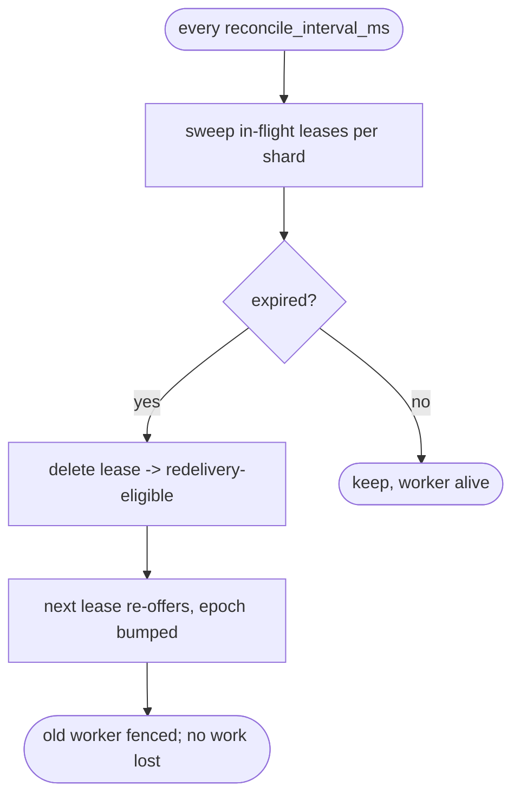
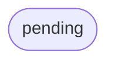

# relay reconciler — lease reclaim / redeliver / liveness

## Logic
<!-- type: logic lang: mermaid -->


## Config
<!-- type: config lang: yaml -->

```yaml
# Reconciler — relay-side work-queue liveness. Extends RelayServerConfig (#115).
reconcile_interval_ms: 1000   # how often the background sweep reclaims expired leases per shard
```
## Unit Test
<!-- type: unit-test lang: mermaid -->



## Changes
<!-- type: changes lang: yaml -->

```yaml
(fill)
```
