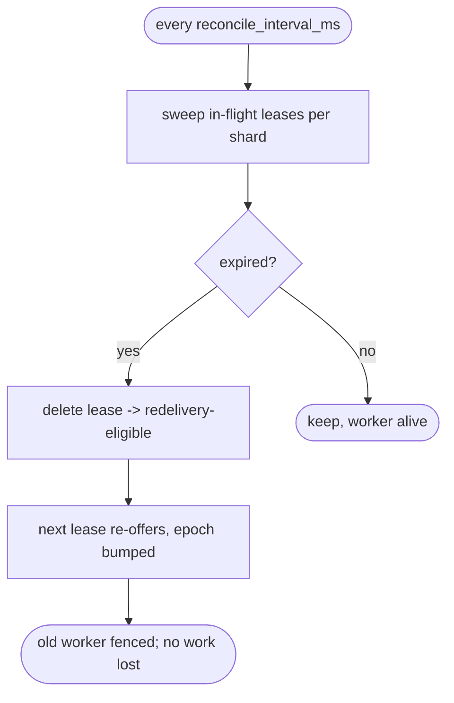

# relay reconciler — lease reclaim / redeliver / liveness

## Logic
<!-- type: logic lang: mermaid -->


```mermaid
---
id: relay-reconciler-flow
entry: tick
nodes:
  tick:
    kind: start
    label: "Reconciler wakes every reconcile_interval_ms"
  per_subject:
    kind: process
    label: "For each (subject, shard): sweep ONLY the in-flight leases (the frontier), never a full log scan; also promote_due — release delayed/ETA/backoff entries whose not_before <= now onto the redeliver heap, waking the subject"
  expired:
    kind: decision
    label: "Lease expires_at <= now?"
  reclaim:
    kind: process
    label: "Delete the expired lease -> the entry becomes redelivery-eligible after an exponential backoff (redeliver_backoff_ms * 2^(attempt-1), via the delay index); an exhausted entry (>= max_attempts) re-offers at once so the next lease dead-letters it. Explicit Nack (release) is always immediate."
  keep:
    kind: terminal
    label: "Still within lease -> leave it (worker alive / heartbeating)"
  redeliver:
    kind: process
    label: "On the next lease(), the entry is re-offered with a bumped epoch (prefers redeliver)"
  fence:
    kind: terminal
    label: "Old worker's late ack/heartbeat (old lease_id / epoch) is a no-op — fenced; no work lost"
edges:
  - { from: tick, to: per_subject }
  - { from: per_subject, to: expired }
  - { from: expired, to: reclaim, label: "yes" }
  - { from: expired, to: keep, label: "no" }
  - { from: reclaim, to: redeliver }
  - { from: redeliver, to: fence }
---
flowchart TD
    tick([every reconcile_interval_ms]) --> per_subject[sweep in-flight leases per shard]
    per_subject --> expired{expired?}
    expired -->|yes| reclaim[delete lease -> redelivery-eligible]
    expired -->|no| keep([keep, worker alive])
    reclaim --> redeliver[next lease re-offers, epoch bumped]
    redeliver --> fence([old worker fenced; no work lost])
```
## Config
<!-- type: config lang: yaml -->

```yaml
# Reconciler — relay-side work-queue liveness. Extends RelayServerConfig (#115).
reconcile_interval_ms: 1000   # how often the background sweep reclaims expired leases per shard
```
## Unit Test
<!-- type: unit-test lang: mermaid -->


```mermaid
---
id: relay-reconciler-test-plan
entry: suite
nodes:
  suite:
    kind: start
    label: "reconciler tests"
  t_dead:
    kind: process
    label: "ACCEPTANCE: lease to c1, c1 dies (no ack), advance past ttl, reconcile()"
  a_dead:
    kind: terminal
    label: "assert the seq is reclaimed; c2 leases it (epoch bumped), acks, committed advances"
  t_fence:
    kind: process
    label: "after redeliver, c1 (dead) sends a late ack with its old lease_id/epoch"
  a_fence:
    kind: terminal
    label: "assert the late ack is a no-op (epoch-fenced); no double-completion"
  t_live:
    kind: process
    label: "lease to c1, heartbeat before ttl, then reconcile() before the extended expiry"
  a_live:
    kind: terminal
    label: "assert nothing is reclaimed (live worker kept)"
  t_frontier:
    kind: process
    label: "ack a seq, then reconcile()"
  a_frontier:
    kind: terminal
    label: "assert reconcile touches only in-flight leases — acked entries are not re-offered"
  t_bg:
    kind: process
    label: "spawn the background reconciler with a short interval + short ttl; lease, don't ack, wait"
  a_bg:
    kind: terminal
    label: "assert the entry becomes re-leasable without any manual reclaim call"
  t_delay:
    kind: process
    label: "publish with not_before in the future (+ an immediate sibling), then lease before / after due; restart between"
  a_delay:
    kind: terminal
    label: "assert the delayed entry is withheld until due (immediate sibling leases at once), promote_due / next lease releases it, and the delay survives a restart"
  t_backoff:
    kind: process
    label: "redeliver_backoff_ms > 0: lease, expire + reconcile across two attempts"
  a_backoff:
    kind: terminal
    label: "assert a reclaimed lease is withheld for the backoff window and re-leases only after it, and the backoff doubles per attempt"
edges:
  - { from: suite, to: t_dead, label: "case: dead worker redeliver" }
  - { from: t_dead, to: a_dead }
  - { from: suite, to: t_fence, label: "case: late-ack fenced" }
  - { from: t_fence, to: a_fence }
  - { from: suite, to: t_live, label: "case: live worker kept" }
  - { from: t_live, to: a_live }
  - { from: suite, to: t_frontier, label: "case: frontier-only" }
  - { from: t_frontier, to: a_frontier }
  - { from: suite, to: t_bg, label: "case: background task" }
  - { from: t_bg, to: a_bg }
  - { from: suite, to: t_delay, label: "case: delayed / ETA delivery" }
  - { from: t_delay, to: a_delay }
  - { from: suite, to: t_backoff, label: "case: exponential redelivery backoff" }
  - { from: t_backoff, to: a_backoff }
---
flowchart TD
    suite([reconciler suite]) --> t_dead[c1 dies, advance ttl, reconcile]
    t_dead --> a_dead([reclaimed; c2 completes])
    suite --> t_fence[c1 late ack]
    t_fence --> a_fence([no-op, fenced])
    suite --> t_live[heartbeat then reconcile]
    t_live --> a_live([kept])
    suite --> t_frontier[ack then reconcile]
    t_frontier --> a_frontier([only in-flight swept])
    suite --> t_bg[spawn reconciler, wait]
    t_bg --> a_bg([auto re-leasable])
    suite --> t_delay[publish not_before future, restart]
    t_delay --> a_delay([withheld until due; survives restart])
    suite --> t_backoff[expire across attempts]
    t_backoff --> a_backoff([backoff window; doubles per attempt])
```
## Changes
<!-- type: changes lang: yaml -->

```yaml
changes:
  - path: projects/relay/src/engine.rs
    action: modify
    section: logic
    impl_mode: hand-written
    reason: "Add Relay::reconcile(now): sweep every subject/shard's expired leases (frontier-only) and return the count reclaimed; also promote_due per shard (release delayed/ETA entries that came due) and wake those subjects. Add publish_at(.., not_before, ..) that durably appends then register_delayed for a future-dated entry; publish delegates with None. Recovery (shard_state) rebuilds the in-memory delay index by scanning the un-acked tail for not_before."
  - path: projects/relay/src/workqueue.rs
    action: modify
    section: logic
    impl_mode: hand-written
    reason: "Delay index: delayed min-heap (by visible-at millis) + delayed_set; register_delayed(seq, visible_at) holds an entry back; promote_due(now) releases due entries onto the redeliver heap (returns count); pick skips delayed seqs; lease/lease_or_dead call promote_due(now) first. reclaim_expired re-offers via register_delayed with exponential backoff (redeliver_backoff_ms * 2^(attempt-1), capped) unless backoff=0 or the entry is exhausted (then immediate); WorkQueue::new gains redeliver_backoff_ms."
  - path: projects/relay/src/types.rs
    action: modify
    section: schema
    impl_mode: hand-written
    reason: "LogEntry gains optional not_before (work-queue visibility gate; serde default = back-compatible with existing segments)."
  - path: projects/relay/src/wire.rs
    action: modify
    section: schema
    impl_mode: hand-written
    reason: "PublishRequest gains optional not_before + delay_ms (countdown)."
  - path: projects/relay/tests/delayed_delivery.rs
    action: create
    section: unit-test
    impl_mode: hand-written
    reason: "Tests: delayed entry withheld until due (immediate sibling leases at once), reconcile promotes a due entry, and the delay survives a restart."
  - path: projects/relay/tests/reconciler.rs
    action: modify
    section: unit-test
    impl_mode: hand-written
    reason: "Add redelivery_backoff_is_exponential: a reclaimed lease is withheld for the backoff window and re-leases only after it, doubling per attempt. Existing redeliver tests pin redeliver_backoff_ms=0."
  - path: projects/relay/src/reconciler.rs
    action: create
    section: logic
    impl_mode: hand-written
    reason: "Background reconciler: spawn_reconciler(relay, interval) ticks and calls reconcile; ReconcilerHandle to stop it."
  - path: projects/relay/src/server.rs
    action: modify
    section: logic
    impl_mode: hand-written
    reason: "Expose AppState::relay_handle() so the server can hand the shared core to the reconciler."
  - path: projects/relay/src/server_config.rs
    action: modify
    section: config
    impl_mode: hand-written
    reason: "Add reconcile_interval_ms."
  - path: projects/relay/src/lib.rs
    action: modify
    section: logic
    impl_mode: hand-written
    reason: "Declare and re-export the reconciler module."
  - path: projects/relay/src/bin/relay_server.rs
    action: modify
    section: logic
    impl_mode: hand-written
    reason: "Start the background reconciler before serving."
  - path: projects/relay/tests/reconciler.rs
    action: create
    section: unit-test
    impl_mode: hand-written
    reason: "Tests: dead-worker redeliver + complete, late-ack fenced, live-worker kept, frontier-only, background-task auto-reclaim."
```

# Reviews

### Review 1
**Verdict:** approved

- [logic] reconcile sweeps each shard's in-flight leases, reclaims the expired ones; redelivery + epoch bump happen on the next lease (prefer-redeliver from #113). Frontier-only — no full log scan. Sound and matches the acceptance.
- [config] reconcile_interval_ms is the only knob; defaulted.
- [unit-test] Covers dead-worker redeliver+complete, epoch-fenced late ack, live-worker kept via heartbeat, frontier-only, and a real background-task auto-reclaim.
- [changes] Bounded to Relay::reconcile + reconciler module + server/bin/config wiring + tests; no new external-project dependency (only tokio, already present).
