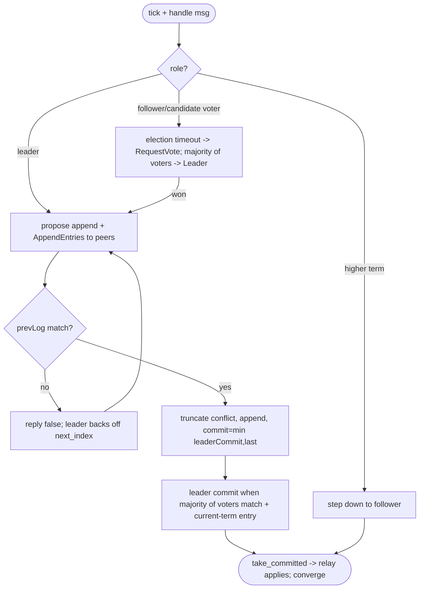

# relay single-shard Raft consensus core (self-contained, RSM, auto voter/learner)

## Logic
<!-- type: logic lang: mermaid -->


## Unit Test

```mermaid
---
id: relay-raft-core-test-plan
entry: suite
nodes:
  suite: { kind: start, label: "in-process deterministic Raft simulation (a message bus pumps outboxes to handlers)" }
  t_elect: { kind: process, label: "3 voters; tick until a leader emerges" }
  a_elect: { kind: terminal, label: "assert exactly one Leader, two Followers, same term" }
  t_repl: { kind: process, label: "leader proposes commands; pump" }
  a_repl: { kind: terminal, label: "assert all nodes commit them in order and take_committed yields the same sequence" }
  t_kill: { kind: process, label: "commit entries, then drop the leader from the bus; tick survivors" }
  a_kill: { kind: terminal, label: "assert a new leader is elected and every committed entry still present (no committed loss); new entries commit again" }
  t_learner: { kind: process, label: "N=4 -> voters {0,1,2}, learner {3}; elect + propose" }
  a_learner: { kind: terminal, label: "assert learner replicates + applies committed entries but never becomes candidate nor counts toward majority (majority stays 2 of 3)" }
  t_stale: { kind: process, label: "deliver a stale higher-term message to a leader" }
  a_stale: { kind: terminal, label: "assert it steps down to follower of the higher term" }
  t_relay: { kind: process, label: "wire command=publish, apply=relay engine; publish via leader, pump, kill leader, publish more" }
  a_relay: { kind: terminal, label: "assert every surviving node's relay engine holds the same committed messages" }
edges:
  - { from: suite, to: t_elect }
  - { from: t_elect, to: a_elect }
  - { from: suite, to: t_repl }
  - { from: t_repl, to: a_repl }
  - { from: suite, to: t_kill }
  - { from: t_kill, to: a_kill }
  - { from: suite, to: t_learner }
  - { from: t_learner, to: a_learner }
  - { from: suite, to: t_stale }
  - { from: t_stale, to: a_stale }
  - { from: suite, to: t_relay }
  - { from: t_relay, to: a_relay }
---
flowchart TD
    suite([deterministic sim bus]) --> t_elect[3 voters tick] --> a_elect([one leader, same term])
    suite --> t_repl[propose] --> a_repl([all commit in order])
    suite --> t_kill[drop leader] --> a_kill([re-elect, no committed loss])
    suite --> t_learner[N=4] --> a_learner([learner applies, never votes/counts])
    suite --> t_stale[higher-term msg] --> a_stale([leader steps down])
    suite --> t_relay[command=publish] --> a_relay([engines converge across failover])
```

<!-- type: unit-test lang: mermaid -->


## Changes
<!-- type: changes lang: yaml -->

```yaml
changes:
  - path: projects/relay/src/raft.rs
    action: create
    section: logic
    impl_mode: hand-written
    reason: "Self-contained step-driven Raft: RaftNode (roles, current_term, voted_for, in-memory log of RaftEntry{term,index,command}, commit_index/last_applied, per-peer next/match_index), tick() + handle(from, RaftMsg) doing election/replication/commit/step-down, propose(command), take_outgoing(), take_committed(); auto_membership(n) -> voters=largest-odd<=N + trailing learner; majority counts voters only; learners replicate+apply but never vote/start elections. RaftTransport trait + an in-process bus impl for tests. No external dependency."
  - path: projects/relay/src/lib.rs
    action: modify
    section: logic
    impl_mode: hand-written
    reason: "Declare and re-export the raft module (RaftNode, RaftEntry, RaftMsg, Membership, auto_membership, RaftTransport)."
  - path: projects/relay/tests/raft_core.rs
    action: create
    section: unit-test
    impl_mode: hand-written
    reason: "Deterministic in-process simulation: a message bus pumps node outboxes to handlers. Tests leader election, replicate+commit ordering, kill-leader -> re-elect with no committed loss, learner replicates/applies but never votes nor counts toward majority, stale higher-term step-down, and a relay-integration scenario (command=publish, apply=relay engine) that converges across a leader failover."
```

# Reviews

### Review 1
**Verdict:** approved

- [logic] Step-driven RaftNode (tick + handle): election (term bump, self-vote, RequestVote, majority of VOTERS), replication (AppendEntries with prevLog matching + truncate conflicting suffix), commit-by-majority restricted to current-term entries over voters only, step-down on higher term, take_committed apply. auto_membership(N) = largest-odd voters + trailing learner; learners replicate/apply but never vote/start elections/count. RaftTransport trait + in-process bus. RSM model leaves relay's append-only log untouched. Self-contained, sound.
- [unit-test] Deterministic sim: elect, replicate+commit order, kill-leader no-committed-loss + re-elect, learner non-voting, stale step-down, relay-integration failover convergence.
- [changes] raft.rs + lib re-export + raft_core.rs. No external dep.
